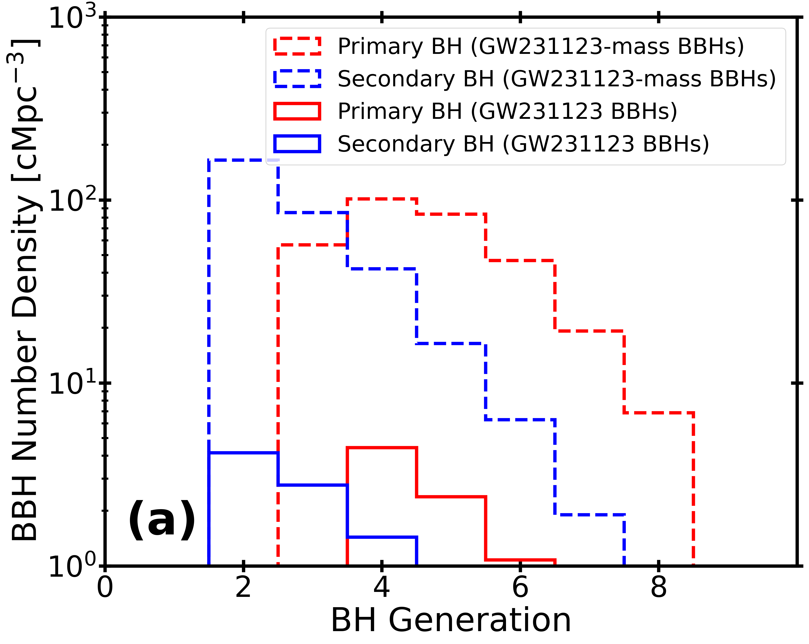
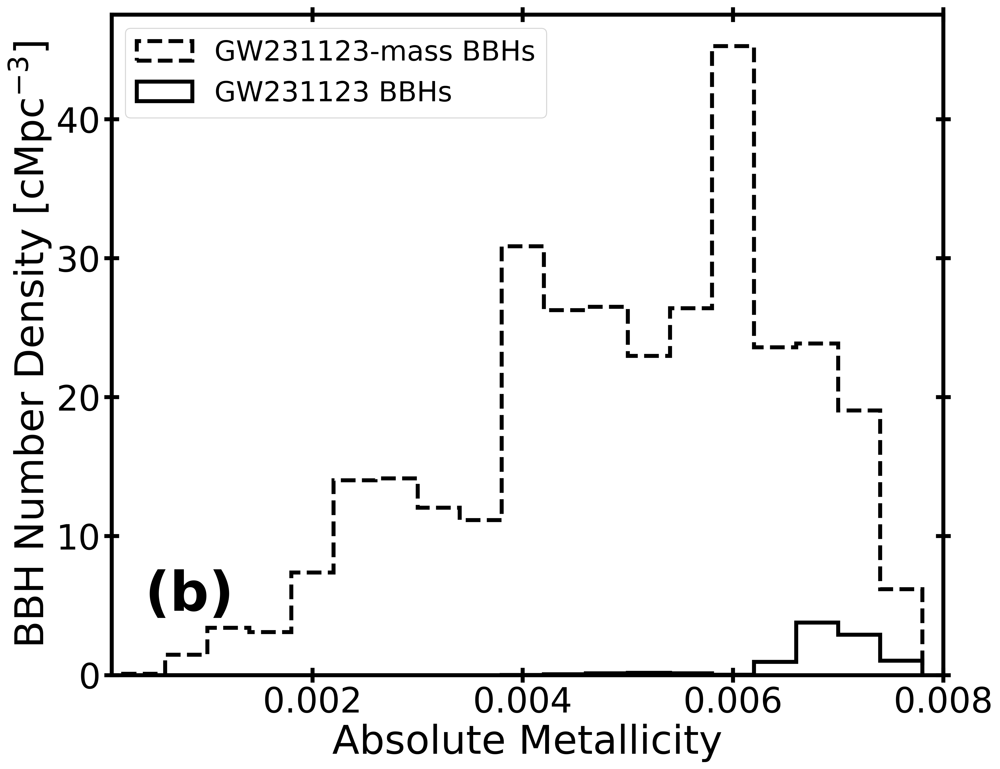
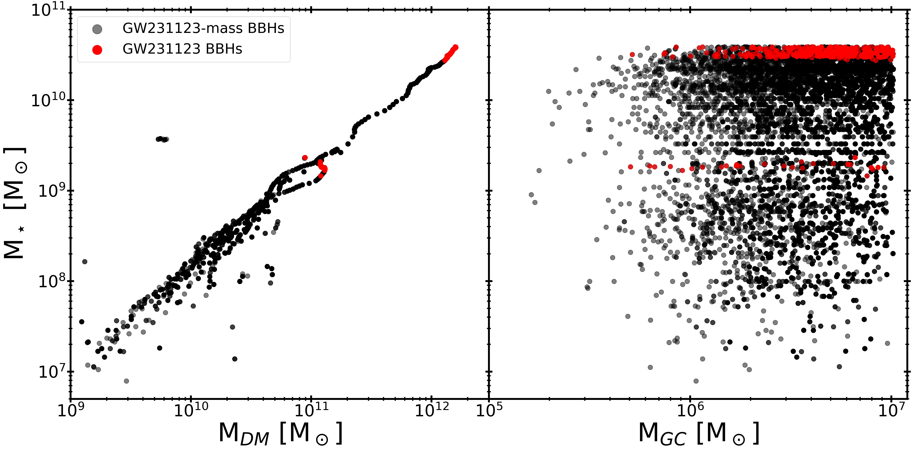
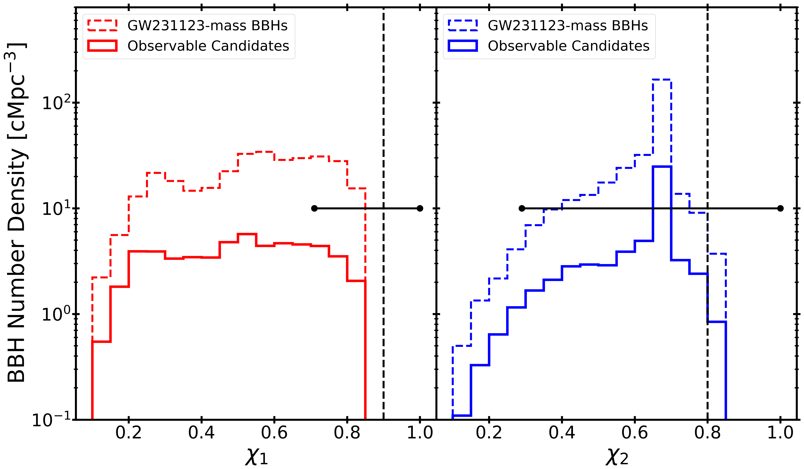

$\newcommand{\ensuremath}{}$
$\newcommand{\xspace}{}$
$\newcommand{\object}[1]{\texttt{#1}}$
$\newcommand{\farcs}{{.}''}$
$\newcommand{\farcm}{{.}'}$
$\newcommand{\arcsec}{''}$
$\newcommand{\arcmin}{'}$
$\newcommand{\ion}[2]{#1#2}$
$\newcommand{\textsc}[1]{\textrm{#1}}$
$\newcommand{\hl}[1]{\textrm{#1}}$
$\newcommand{\footnote}[1]{}$
$\newcommand{\msun}{{\rm M}_\odot}$
$\newcommand{\fastcluster}{\textsc{fastcluster} }$
$\newcommand{\orcidicon}[1]{\href{https://orcid.org/#1}{\includegraphics[width=11pt]{plots/ORCIDiD_icon128x128.png}}}$
$\newcommand{\orcid}[1]{\href{https://orcid.org/#1}{\protect\orcidicon{#1}}}$
$\newcommand\bseemp{\texttt{BSEEMP}}$
$\newcommand\sevn{\texttt{SEVN}}$
$\newcommand{\RV}[1]{{\color{cyan}{#1}}}$
$\newcommand{\micmap}[1]{{\color{orange}{#1}}}$

# Investigating the formation channel of GW231123: Population III stars or hierarchical mergers?

<mark>Appeared on: 2026-04-22</mark> -  _4+2 pages, 4 figures; submitted to A&A_

F. Angeloni, et al. -- incl., <mark>S. Torniamenti</mark>

**Abstract:** The gravitational wave event GW231123, with component black hole masses lying within or above the pair-instability mass gap, poses a significant challenge to current stellar evolution models. In this Letter, we investigate its origin by coupling the galaxy formation model \texttt{GAMESH} with the cluster population synthesis code \texttt{RAPSTER} , and with two distinct binary population synthesis codes ( \texttt{SEVN} and \texttt{BSEEMP} ). This framework allows us, for the first time, to reconstruct the life cycle of GW231123-like candidates within the same cosmological simulation, enabling a self-consistent comparison between different formation channels. \ We find that, although both population synthesis codes can in principle produce black holes compatible with GW231123, isolated binary evolution fails to reproduce the inferred merger redshift. In \texttt{SEVN} , massive black hole binaries form with semi-major axes $>10^3  \rm R_\odot$ , preventing coalescences within a Hubble time. In \texttt{BSEEMP} , candidates arise only at extremely low metallicities ( $ \rm Z \approx 10^{-10}$ ), which contribute negligibly to the star formation rate density in our overdense simulated volume. \ Our results instead strongly support a dynamical, hierarchical origin. The observed black hole masses are naturally reproduced through successive mergers in dense globular clusters. The high dimensionless spins reported by the LIGO-Virgo-KAGRA Collaboration are consistent with this hierarchical population. We find a local merger rate density of $0.78   \rm Gpc^{-3} yr^{-1}$ , with a  peak at _z_ $= 4-6$ , tracing the maximum formation rate of globular clusters in metal-poor environments ( $\rm Z\approx0.006$ ). Overall, GW231123 may represent a benchmark event for a robust population of hierarchical black holes formed in the early Universe.

**Figure 2. -** (a) BBH number density as a function of hierarchical merger generation for the primary (red) and secondary (blue) components of GW231123 candidates in our simulated volume. Dashed lines show systems selected only by the LVK mass priors (GW231123-mass BBHs), while solid lines indicate the fully consistent subset satisfying the LVK mass, merger-redshift, and spin constraints (GW231123 BBHs). (b) Metallicity distribution of GW231123-mass BBHs (dashed) and GW231123 BBHs (solid) formation environments. (*fig:BH_Gen&Metallicity*)

**Figure 3. -** Stellar-halo mass relation for galaxies hosting GW231123-like BBHs (left panel) and  mass distribution of GC progenitors for GW231123-like BBHs (right panel). Black points identify systems hosting GW231123-mass BBHs, selected to match the LVK constraints on the primary and secondary masses, while red points highlight the subset of GW231123 BBHs satisfying the full LVK constraints on mass, spin, and merger redshift. (*fig:HostGalaxy&Cluster*)

**Figure 4. -** Distribution of the dimensionless spins of the primary ($\chi_1$, left) and secondary ($\chi_2$, right) BHs. Dashed histograms show GW231123-mass BBHs, selected to match the LVK mass priors, while solid histograms represent the subset of these systems which additionally satisfy the merger-redshift constraint. Black vertical lines and horizontal bars mark the LVK median values and 90\% credible intervals for GW231123. (*fig:BH_Spin*)

