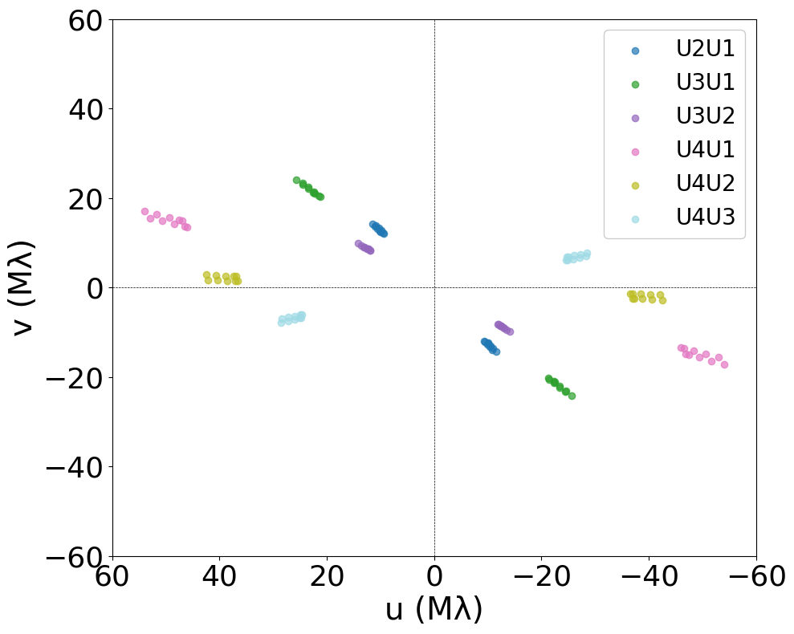
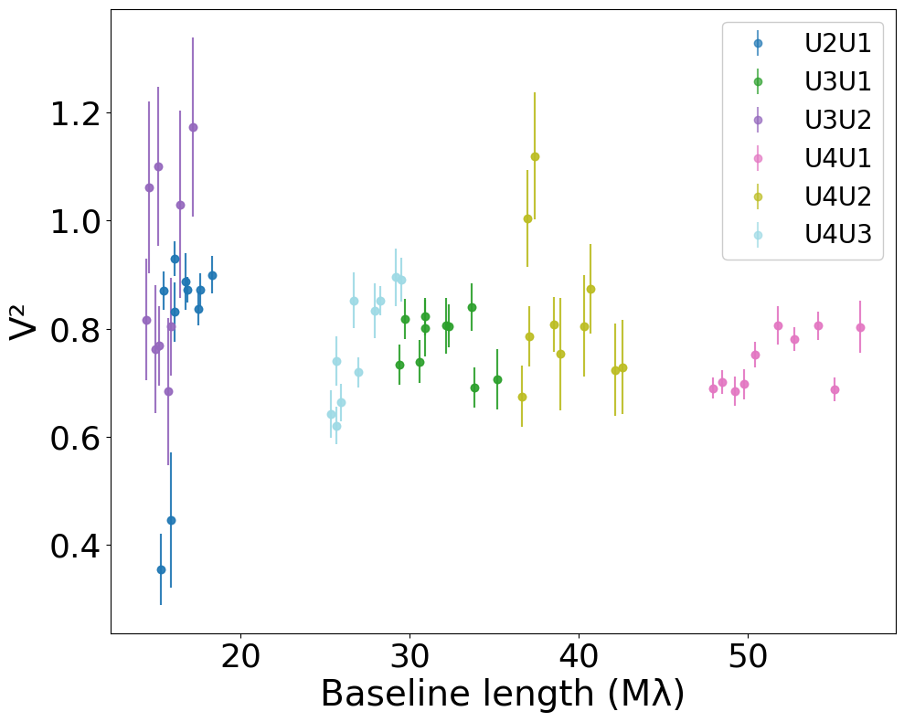
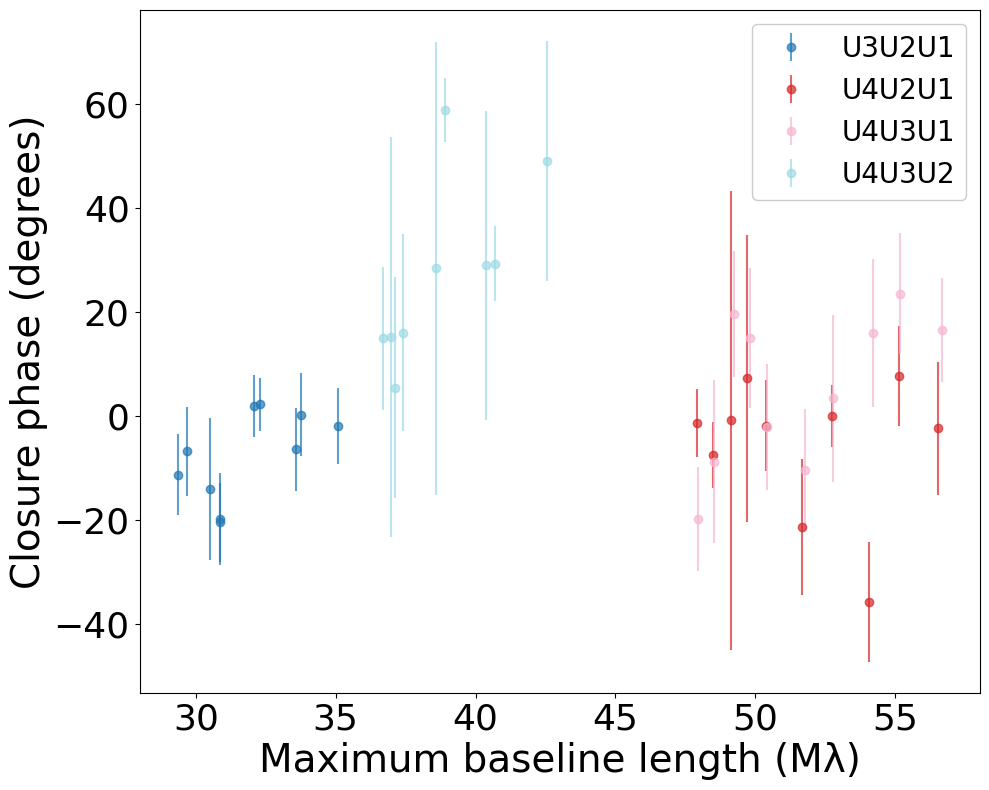
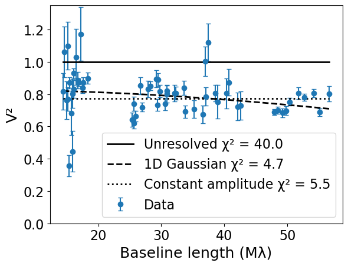
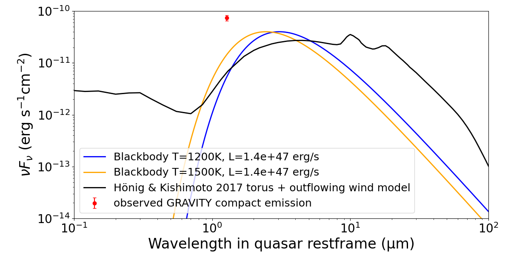

$\newcommand{\ensuremath}{}$
$\newcommand{\xspace}{}$
$\newcommand{\object}[1]{\texttt{#1}}$
$\newcommand{\farcs}{{.}''}$
$\newcommand{\farcm}{{.}'}$
$\newcommand{\arcsec}{''}$
$\newcommand{\arcmin}{'}$
$\newcommand{\ion}[2]{#1#2}$
$\newcommand{\textsc}[1]{\textrm{#1}}$
$\newcommand{\hl}[1]{\textrm{#1}}$
$\newcommand{\footnote}[1]{}$

# VLTI-GRAVITY observations of blazars

<mark>Appeared on: 2026-04-22</mark> -  _Accepted for publication in A&A. 6 pages of main text with 4 figures_

T. Hovatta, et al. -- incl., <mark>H. Korhonen</mark>

**Abstract:**            Parsec-scale jets of blazars have so far been spatially resolved only in mm- and submm wavelengths, where very long baseline interferometry can be used to obtain milliarcsecond-scale images of the jets. We have attempted to spatially resolve the near-infrared emission in jet-dominated blazars for the first time. We used the VLTI-GRAVITY instrument to obtain milliarcsecond-scale near-infrared interferometric observations of a flaring blazar Ton 599. Additionally, we observed four non-flaring blazars using the GRAVITY-wide mode, where a nearby bright star is used as a fringe tracker. We modeled the squared visibilities of Ton 599, and find that they are incompatible with a single unresolved point source unless there is a significant amount of additional unknown coherence loss in the instrument. With the present data, we cannot distinguish between a model with an unresolved point source and extended emission or coherence loss and a model with a single Gaussian component. This suggests that we are seeing the unresolved or only partially resolved jet-base in near-infrared wavelengths. The wide-field mode of GRAVITY was challenging for the additional relatively faint targets resulting in either non detections or poor quality data that could not be modeled. Our observations demonstrate that it is possible to detect the compact jet emission in blazars with near-infrared interferometry, suggesting that with the improved GRAVITY+ instrument it will be possible to spatially resolve and image the near-infrared emission of blazar jets.         

**Figure 3. -** Left: UV-coverage of the data of Ton 599. Middle: Squared visibilities as a function of baseline length. Right: Closure phase as a function of maximum baseline of the telescope triangle. In all plots, the colors indicate different telescope pairs or triangles as shown in the legends.
               (*fig:data*)

**Figure 2. -** Visibility squared of Ton 599 as a function of baseline length along with the fitted models described in the text.
               (*fig:models*)

**Figure 1. -** Spectral energy distribution of a single blackbody component with a  luminosity corresponding to the disk luminosity of Ton 599 and temperatures of 1200 K (blue) and 1500 K (orange) along with a model for a torus including an outflowing wind from [H\"onig and Kishimoto (2017)](https://ui.adsabs.harvard.edu/abs/2017ApJ...838L..20H)(black). The observed value for the compact emission in our GRAVITY data is shown by the red symbol. (*fig:torus*)

