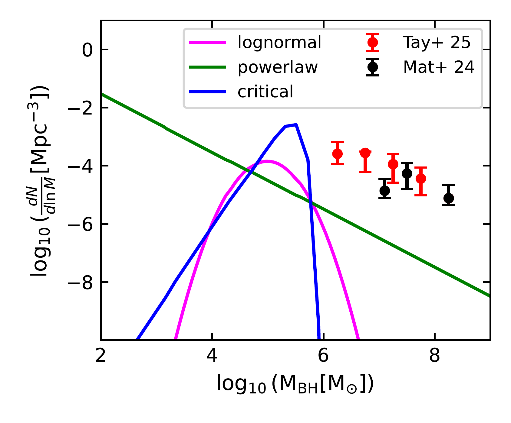
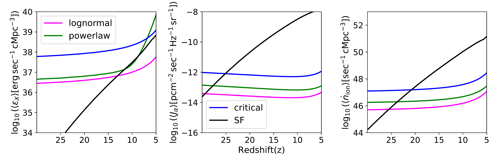
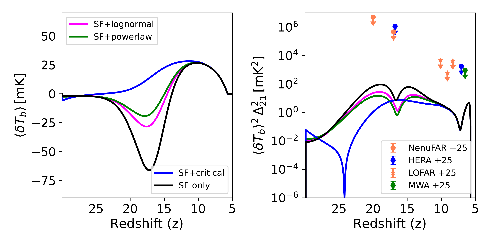

$\newcommand{\ensuremath}{}$
$\newcommand{\xspace}{}$
$\newcommand{\object}[1]{\texttt{#1}}$
$\newcommand{\farcs}{{.}''}$
$\newcommand{\farcm}{{.}'}$
$\newcommand{\arcsec}{''}$
$\newcommand{\arcmin}{'}$
$\newcommand{\ion}[2]{#1#2}$
$\newcommand{\textsc}[1]{\textrm{#1}}$
$\newcommand{\hl}[1]{\textrm{#1}}$
$\newcommand{\footnote}[1]{}$
$\newcommand{\pdc}[1]{\textcolor{teal}{[pdimp: #1\;]}}$
$\newcommand{\jb}[1]{\textcolor{blue}{[jb: #1\;]}}$
$\newcommand\code[1]{\textsc{\MakeLowercase{#1}}}$
$\newcommand{\quotes}[1]{"#1"}$
$\newcommand{\quotesing}[1]{`#1'}$
$\newcommand{\Ctwentysix}{C26}$
$\newcommand{\footnoteref}[1]{\textsuperscript{\ref{#1}}}$
$\newcommand{\AC}[1]{\textcolor{blue}{[\textbf{AC:} #1]}}$
$\newcommand{\BM}[1]{\textcolor{magenta}{[\textbf{BM:} #1]}}$
$\newcommand{\Kay}[1]{\textcolor{cyan}{[\textbf{Kay:} #1]}}$
$\newcommand{\be}{\begin{equation}}$
$\newcommand{\ee}{\end{equation}}$
$\newcommand\dd{\mathrm{d}}$
$\newcommand{\erfc}{\rm{erfc}}$
$\newcommand{\bbf}{\bf}$
$\newcommand{\mpc}{ {\rm{Mpc}}}$
$\newcommand{\mpch}{ h^{-1}{\rm{Mpc}}}$
$\newcommand{\kms}{ {\rm{km  s^{-1}}}}$
$\newcommand{\vcir}{{V_c}}$
$\newcommand{\dt}{{\Delta t}}$
$\newcommand{\Gyr}{{ \rm Gyr}}$
$\newcommand{\etal}{{\it et al.~}}$
$\newcommand{\Hm}{{\rm{H^-}}  }$
$\newcommand{\HH}{{\rm{H_2}}  }$
$\newcommand{\HHp}{{\rm{H_2^+}}  }$
$\newcommand{\sngg}{SN_{\gamma\gamma}~}$
$\newcommand{\fgg}{f_{\gamma\gamma}}$
$\newcommand{\sr}{{\rm sr}} \newcommand\hz{{\rm Hz}} \newcommand\cm{{\rm cm}}$
$\newcommand{\nhi}{{N_{\rm HI}}} \newcommand\sec{{\rm s}}$
$\newcommand{\sigmaba}{\sigma_8/usr/local/lib/tex/inputs/latex/styles}$
$\newcommand{\gsim}{\lower.5ex\hbox{\gtsima}}$
$\newcommand{\lsim}{\lower.5ex\hbox{\ltsima}}$
$\newcommand{\ltsima}{\; \buildrel < \over \sim \;}$
$\newcommand{\gsim}{\lower.5ex\hbox{\gtsima}}$
$\newcommand{\lsim}{\lower.5ex\hbox{\ltsima}}$
$\newcommand{\simgt}{\lower.5ex\hbox{\gtsima}}$
$\newcommand{\simlt}{\lower.5ex\hbox{\ltsima}}$
$\newcommand{\simpr}{\lower.5ex\hbox{\prosima}} \newcommand\la{\lsim} \newcommand\ga{\gsim}$
$\newcommand{\ie}{{\frenchspacing\it i.e. }} \newcommand\eg{{\frenchspacing\it e.g. }}$
$\newcommand{\gtsima}{\; \buildrel > \over \sim \;}$
$\newcommand{\ltsima}{\; \buildrel < \over \sim \;}$
$\newcommand{\gsim}{\lower.5ex\hbox{\gtsima}}$
$\newcommand{\lsim}{\lower.5ex\hbox{\ltsima}}$
$\newcommand{\simgt}{\lower.5ex\hbox{\gtsima}}$
$\newcommand{\simlt}{\lower.5ex\hbox{\ltsima}}$
$\newcommand{\simpr}{\lower.5ex\hbox{\prosima}}$
$\newcommand{\la}{\lsim}$
$\newcommand{\ga}{\gsim}$
$\newcommand{\zcr}{Z_{\rm cr}}$
$\newcommand{\ekin}{\mbox{\cal E}_{\rm kin}}$
$\newcommand{\ekin}{{\cal E}_{\rm kin}}$
$\newcommand{\gg}{\gamma\gamma}$
$\newcommand{\fgg}{f_{\gamma\gamma}}$
$\newcommand{\Lya}{Ly\alpha~}$
$\newcommand{\sngg}{SN-e^{\pm}~}$
$\newcommand{\snggo}{SN-e^{\pm}}$
$\newcommand{\msun}{ {\rm \Msun}}$
$\newcommand{\ie}{{\frenchspacing\it i.e., }}$
$\newcommand{\eg}{{\frenchspacing\it e.g., }}$
$\newcommand{\E3}{{\cal E}_{\rm g}^{III}}$
$\newcommand{\Eunit}{\times10^{51} {\rm erg}   \Msun^{-1}}$
$\newcommand{\sEunit}{10^{51} {\rm erg}   \Msun^{-1}}$
$\newcommand{\ozs}{\Omega_Z^{sfh}}$
$\newcommand{\ozo}{\Omega_Z^{obs}}$
$\newcommand{\Onot}{\Omega_0}$
$\newcommand{\Msun}{\rm M_\odot}$
$\newcommand{\lsun}{\rm L_\odot}$
$\newcommand{\Zsun}{\rm Z_\odot}$
$\newcommand{\cmpc}{\rm cMpc}$
$\newcommand{\kpc}{\rm Kpc}$
$\newcommand{\Msun}{\rm M_\odot}$
$\newcommand{\myr}{\rm Myr}$
$\newcommand{\gyr}{\rm Gyr }$
$\newcommand{\zsun}{\rm Z_\odot}$
$\newcommand\M*{M_*}$
$\newcommand{\mbh}{M_{bh}}$
$\newcommand\Z*{Z_*}$
$\newcommand\L*{L_*}$
$\newcommand{\muv}{\rm M_{UV}}$
$\newcommand{\EBV}{E(B-V)}$
$\newcommand{\fws}{f_*^w}$
$\newcommand{\luvs}{L_*^{UV}}$
$\newcommand{\luvtot}{L_{tot}^{UV}}$
$\newcommand{\fwb}{f_{bh}^w }$
$\newcommand{\luvb}{L_{bh}^{UV}}$
$\newcommand{\fs}{f_*}$
$\newcommand{\fej}{f_*^{\rm{ej}}}$
$\newcommand{\feff}{f_*^{\rm{eff}}}$
$\newcommand{\highz}{high-z }$
$\newcommand\fesc{f_{\rm esc}}$
$\newcommand\fescum{f_{\mathrm{esc}}^{\mathrm{cum}}}$
$\newcommand\avfesc{\langle f_{\mathrm{esc}}\rangle}$
$\newcommand{\der}{{\rm d}}$
$\newcommand{\f}{\frac}$
$\newcommand{\kev}{\rm keV}$
$\newcommand{\mx}{ m_x}$
$\newcommand{\K}{\rm K}$
$\newcommand\mges{M_*^{ge}}$
$\newcommand\mgfs{M_*^{gf}}$
$\newcommand\mgeb{M_{bh}^{ge}}$
$\newcommand\mgfb{M_{bh}^{gf}}$
$\newcommand{\faccb}{f_{bh}^{ac}}$
$\newcommand{\maccb}{M_{bh}^{ac}}$
$\newcommand{\med}{M_{ed}}$
$\newcommand{\fed}{f_{ed}}$
$\newcommand{\mcritb}{M_{bh}^{crit}}$
$\newcommand{\mdmsa}{M_{dm}^{sa}}$
$\newcommand{\mgsa}{M_{g}^{sa}}$
$\newcommand{\nho}{n_{\mathrm{H}}^{0}}$
$\newcommand{\effesc}{\fesc^{\rm eff}}$
$\newcommand{\pdc}[1]{\textcolor{teal}{[pdimp: #1\;]}}$
$\newcommand{\jb}[1]{\textcolor{blue}{[jb: #1\;]}}$
$\newcommand\code[1]{\textsc{\MakeLowercase{#1}}}$
$\newcommand{\quotes}[1]{"#1"}$
$\newcommand{\quotesing}[1]{`#1'}$
$\newcommand{\Ctwentysix}{C26}$
$\newcommand{\ie}{{\frenchspacing\it i.e., }}$
$\newcommand{\eg}{{\frenchspacing\it e.g., }}$
$\newcommand{\footnoteref}[1]{\textsuperscript{\ref{#1}}}$
$\newcommand\sixteenth{16^{\rm{th}}  }$
$\newcommand\eightyfourth{84^{\rm{th}}  }$
$\newcommand\fescuv{f_{\rm{esc}}^{\rm{UV}}}$
$\newcommandcitealias{Chatterjee_2026}{C26}$
$\newcommand{\AC}[1]{\textcolor{blue}{[\textbf{AC:} #1]}}$
$\newcommand{\BM}[1]{\textcolor{magenta}{[\textbf{BM:} #1]}}$
$\newcommand{\Kay}[1]{\textcolor{cyan}{[\textbf{Kay:} #1]}}$
$\makeatletter$
$\@ifunnewcommandined{linenumbers}{$
$  \let\linenumbers\relax$
$  \let\nolinenumbers\relax$
$}$
$\makeatother$
$\title{Impact of Primordial Black Hole population on 21 cm observables at high redshift}$
$\titlerunning{PBH in SCRIPT}$
$\author{$
$Atrideb Chatterjee,\inst{1}\thanks{Corresponding Author.}$
$Barun Maity, \inst{2}\thanks{A. Chatterjee and B. Maity contributed equally to this work.}\and$
$Koushiki\inst{3}}$
$\institute{$
$Kapteyn Astronomical Institute, University of Groningen, PO Box 800, 9700 AV Groningen, The Netherlands \ \email{a.chatterjee@rug.nl}$
$\and$
$Max-Planck-Institut für Astronomie, Königstuhl 17, 69117 Heidelberg, Germany \ \email{maity@mpia.de}$
$\and$
$International Centre for Space and Cosmology, School of Arts and Sciences, Ahmedabad University, Ahmedabad, GUJ 380009, India \ \email{koushiki.malda@gmail.com}$
$}$
$\abstract{The 21-cm signal, one of the most promising probes of the high-redshift Universe, has traditionally been modelled without accounting for the effects of active galactic nuclei (AGN) in the pre-JWST era, primarily due to the lack of observational evidence for AGNs at z > 6. However, following the discovery of several AGNs at redshifts as high as$
$z \sim 10 by JWST, it has become imperative to incorporate the impact of these early AGNs when predicting the 21-cm signal. Supposing that these AGNs are seeded by primordial black holes (PBHs), we study their impact with a semi-numerical model setup. Specifically, we extended the explicitly photon-conserving reionization framework, \texttt{SCRIPT}, including essential cosmic dawn physics and PBH contributions. This enables us to compute both the global signal and the power spectrum of the 21-cm line over the redshift range$
$z \sim 30-5 within a self-consistent framework. Building on this setup, we then investigate the impact of different PBH mass functions (obeying current observational constraints) on the resulting signal. The X-ray heating from PBHs can substantially make the depth of the global 21-cm signal shallower and suppress the expected power amplitude during cosmic dawn. We also find that the choice of mass function plays a crucial role in shaping the 21-cm signal, and can, in fact, lead to significantly different predictions.}$
$\keywords{galaxies: high-redshift / quasars: general / cosmology: theory / dark ages / reionization / first stars}$
$\maketitle$
$\n\end{equation}\end{document}}$
$\newcommand{\ee}{\end{equation}}$
$\newcommand\dd{\mathrm{d}}$
$\newcommand{\erfc}{\rm{erfc}}$
$\newcommand{\bbf}{\bf}$
$\newcommand{\mpc}{ {\rm{Mpc}}}$
$\newcommand{\mpch}{ h^{-1}{\rm{Mpc}}}$
$\newcommand{\kms}{ {\rm{km  s^{-1}}}}$
$\newcommand{\vcir}{{V_c}}$
$\newcommand{\dt}{{\Delta t}}$
$\newcommand{\Gyr}{{ \rm Gyr}}$
$\newcommand{\etal}{{\it et al.~}}$
$\newcommand{\Hm}{{\rm{H^-}}  }$
$\newcommand{\HH}{{\rm{H_2}}  }$
$\newcommand{\HHp}{{\rm{H_2^+}}  }$
$\newcommand{\sngg}{SN_{\gamma\gamma}~}$
$\newcommand{\fgg}{f_{\gamma\gamma}}$
$\newcommand{\sr}{{\rm sr}}$
$\newcommand\hz{{\rm Hz}}$
$\newcommand\cm{{\rm cm}}$
$\newcommand{\nhi}{{N_{\rm HI}}}$
$\newcommand\sec{{\rm s}}$
$\newcommand{\sigmaba}{\sigma_8/usr/local/lib/tex/inputs/latex/styles}$
$\newcommand{\gsim}{\lower.5ex\hbox{\gtsima}}$
$\newcommand{\lsim}{\lower.5ex\hbox{\ltsima}}$
$\newcommand{\ltsima}{\; \buildrel < \over \sim \;}$
$\newcommand{\gsim}{\lower.5ex\hbox{\gtsima}}$
$\newcommand{\lsim}{\lower.5ex\hbox{\ltsima}}$
$\newcommand{\simgt}{\lower.5ex\hbox{\gtsima}}$
$\newcommand{\simlt}{\lower.5ex\hbox{\ltsima}}$
$\newcommand{\simpr}{\lower.5ex\hbox{\prosima}}$
$\newcommand\la{\lsim}$
$\newcommand\ga{\gsim}$
$\newcommand{\ie}{{\frenchspacing\it i.e. }}$
$\newcommand\eg{{\frenchspacing\it e.g. }}$
$\newcommand{\gtsima}{\; \buildrel > \over \sim \;}$
$\newcommand{\ltsima}{\; \buildrel < \over \sim \;}$
$\newcommand{\gsim}{\lower.5ex\hbox{\gtsima}}$
$\newcommand{\lsim}{\lower.5ex\hbox{\ltsima}}$
$\newcommand{\simgt}{\lower.5ex\hbox{\gtsima}}$
$\newcommand{\simlt}{\lower.5ex\hbox{\ltsima}}$
$\newcommand{\simpr}{\lower.5ex\hbox{\prosima}}$
$\newcommand{\la}{\lsim}$
$\newcommand{\ga}{\gsim}$
$\newcommand{\zcr}{Z_{\rm cr}}$
$\newcommand{\ekin}{\mbox{\cal E}_{\rm kin}}$
$\newcommand{\ekin}{{\cal E}_{\rm kin}}$
$\newcommand{\gg}{\gamma\gamma}$
$\newcommand{\fgg}{f_{\gamma\gamma}}$
$\newcommand{\Lya}{Ly\alpha~}$
$\newcommand{\sngg}{SN-e^{\pm}~}$
$\newcommand{\snggo}{SN-e^{\pm}}$
$\newcommand{\msun}{ {\rm \Msun}}$
$\newcommand{\ie}{{\frenchspacing\it i.e., }}$
$\newcommand{\eg}{{\frenchspacing\it e.g., }}$
$\newcommand{\E3}{{\cal E}_{\rm g}^{III}}$
$\newcommand{\Eunit}{\times10^{51} {\rm erg}   \Msun^{-1}}$
$\newcommand{\sEunit}{10^{51} {\rm erg}   \Msun^{-1}}$
$\newcommand{\ozs}{\Omega_Z^{sfh}}$
$\newcommand{\ozo}{\Omega_Z^{obs}}$
$\newcommand{\Onot}{\Omega_0}$
$\newcommand{\Msun}{\rm M_\odot}$
$\newcommand{\lsun}{\rm L_\odot}$
$\newcommand{\Zsun}{\rm Z_\odot}$
$\newcommand{\cmpc}{\rm cMpc}$
$\newcommand{\kpc}{\rm Kpc}$
$\newcommand{\Msun}{\rm M_\odot}$
$\newcommand{\myr}{\rm Myr}$
$\newcommand{\gyr}{\rm Gyr }$
$\newcommand{\zsun}{\rm Z_\odot}$
$\newcommand\M*{M_*}$
$\newcommand{\mbh}{M_{bh}}$
$\newcommand\Z*{Z_*}$
$\newcommand\L*{L_*}$
$\newcommand{\muv}{\rm M_{UV}}$
$\newcommand{\EBV}{E(B-V)}$
$\newcommand{\fws}{f_*^w}$
$\newcommand{\luvs}{L_*^{UV}}$
$\newcommand{\luvtot}{L_{tot}^{UV}}$
$\newcommand{\fwb}{f_{bh}^w }$
$\newcommand{\luvb}{L_{bh}^{UV}}$
$\newcommand{\fs}{f_*}$
$\newcommand{\fej}{f_*^{\rm{ej}}}$
$\newcommand{\feff}{f_*^{\rm{eff}}}$
$\newcommand{\highz}{high-z }$
$\newcommand\fesc{f_{\rm esc}}$
$\newcommand\fescum{f_{\mathrm{esc}}^{\mathrm{cum}}}$
$\newcommand\avfesc{\langle f_{\mathrm{esc}}\rangle}$
$\newcommand{\der}{{\rm d}}$
$\newcommand{\f}{\frac}$
$\newcommand{\kev}{\rm keV}$
$\newcommand{\mx}{ m_x}$
$\newcommand{\K}{\rm K}$
$\newcommand\mges{M_*^{ge}}$
$\newcommand\mgfs{M_*^{gf}}$
$\newcommand\mgeb{M_{bh}^{ge}}$
$\newcommand\mgfb{M_{bh}^{gf}}$
$\newcommand{\faccb}{f_{bh}^{ac}}$
$\newcommand{\maccb}{M_{bh}^{ac}}$
$\newcommand{\med}{M_{ed}}$
$\newcommand{\fed}{f_{ed}}$
$\newcommand{\mcritb}{M_{bh}^{crit}}$
$\newcommand{\mdmsa}{M_{dm}^{sa}}$
$\newcommand{\mgsa}{M_{g}^{sa}}$
$\newcommand{\nho}{n_{\mathrm{H}}^{0}}$
$\newcommand{\effesc}{\fesc^{\rm eff}}$
$\newcommand{\ie}{{\frenchspacing\it i.e., }}$
$\newcommand{\eg}{{\frenchspacing\it e.g., }}$
$\newcommand\sixteenth{16^{\rm{th}}  }$
$\newcommand\eightyfourth{84^{\rm{th}}  }$
$\newcommand\fescuv{f_{\rm{esc}}^{\rm{UV}}}$

# Impact of Primordial Black Hole population on 21 cm observables at high redshift

<mark>Appeared on: 2026-04-24</mark> -  _Submitted to A&A_

A. Chatterjee, <mark>B. Maity</mark>, Koushiki

**Abstract:** The 21-cm signal, one of the most promising probes of the high-redshift Universe, has traditionally been modelled without accounting for the effects of active galactic nuclei (AGN) in the pre-JWST era, primarily due to the lack of observational evidence for AGNs at $z > 6$ . However, following the discovery of several AGNs at redshifts as high as $z \sim 10$ by JWST, it has become imperative to incorporate the impact of these early AGNs when predicting the 21-cm signal. Supposing that these AGNs are seeded by primordial black holes (PBHs), we study their impact with a semi-numerical model setup. Specifically, we extended the explicitly photon-conserving reionization framework, \texttt{SCRIPT} , including essential cosmic dawn physics and PBH contributions. This enables us to compute both the global signal and the power spectrum of the 21-cm line over the redshift range $z \sim 30-5$ within a self-consistent framework. Building on this setup, we then investigate the impact of different PBH mass functions (obeying current observational constraints) on the resulting signal. The X-ray heating from PBHs can substantially make the depth of the global 21-cm signal shallower and suppress the expected power amplitude during cosmic dawn. We also find that the choice of mass function plays a crucial role in shaping the 21-cm signal, and can, in fact, lead to significantly different predictions.

**Figure 1. -** Mass functions obtained for Different PBH models at $z \sim 5$ along with the recent JWST estimates \citep{matthee2024, taylor2025}. The magenta, green, and blue lines correspond to power-law, log-normal, and critical mass functions, respectively. Further, the black points with error bars are from \cite{matthee2024}, whereas the red ones are taken from \cite{taylor2025}. Since we do not add the contribution from astrophysically produced AGNs, all the PBH models produce mass functions that are 2-3 orders of magnitude lower than the observed values. (*fig:BH_massfunction*)

**Figure 3. -** Redshift evolution of the global X-ray emissivity, Ly-\(\alpha\) background flux and Ionizing photon production rate for different PBH models along with the SF galaxies. The black, magenta, green, and blue lines respectively denote SF, lognormal, powerlaw and critical PBH seeded systems as mentioned in the legends. (*fig:all_key_quantities*)

**Figure 4. -** The redshift evolution of the 21-cm global signal and the power spectrum (computed at $k \sim 0.1  h \rm cMpc^{-1})$ corresponding to different models studied in this paper. The legends in the left panel show the colour scheme for various models, whereas the legends in the right panel show the upper limits obtained from different observations. (*fig:global_PS*)

