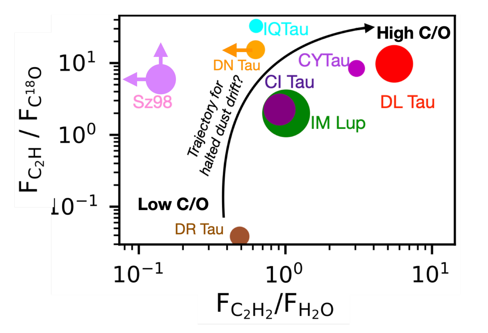
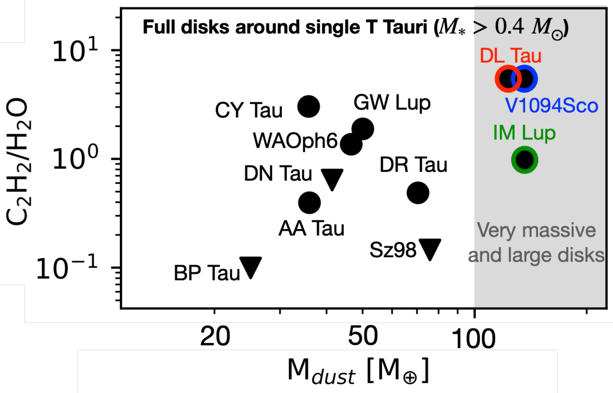
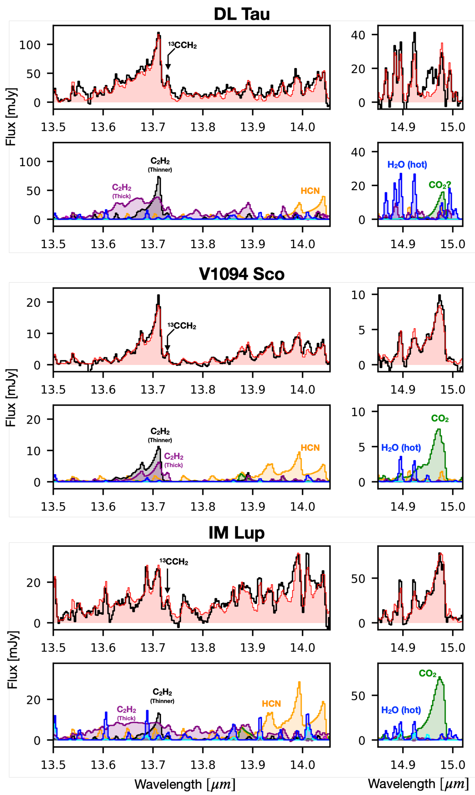

$\newcommand{\ensuremath}{}$
$\newcommand{\xspace}{}$
$\newcommand{\object}[1]{\texttt{#1}}$
$\newcommand{\farcs}{{.}''}$
$\newcommand{\farcm}{{.}'}$
$\newcommand{\arcsec}{''}$
$\newcommand{\arcmin}{'}$
$\newcommand{\ion}[2]{#1#2}$
$\newcommand{\textsc}[1]{\textrm{#1}}$
$\newcommand{\hl}[1]{\textrm{#1}}$
$\newcommand{\footnote}[1]{}$
$\newcommand{\NOH}{N(OH)}$
$\newcommand{\NHO}{N(H_2O)}$
$\newcommand{\TIR}{T_{\rm{IR}}}$
$\newcommand{\TK}{T_{\rm{K}}}$
$\newcommand{\nH}{n_{\rm{H}}}$
$\newcommand{\cms}{cm^{-2} s^{-1}}$
$\newcommand{\ergscm}{erg^{-1}~s^{-1}~cm^{-2}}$
$\newcommand{\cm}{cm^{-2}}$
$\newcommand{\cmsq}{cm^{-3}}$
$\newcommand{\mum}{\mum~}$
$\newcommand{\water}{H_2O~}$
$\newcommand{\acetylene}{C_2H_2~}$
$\newcommand{\BT}[1]{\textcolor{red}{#1}}$
$\newcommand{\BTb}[1]{\textcolor{black}{#1}}$
$\newcommand{\revbis}[1]{\textcolor{black}{#1}}$
$\newcommand{\LE}[1]{\textcolor{black}{#1}}$
$\newcommand{\rev}[1]{\textcolor{black}{#1}}$

# MINDS: Intertwined evolution of dust and gas in large planet-forming disks: A diversity driven by halted pebble drift?

<mark>Appeared on: 2026-04-24</mark> -  _Accepted for publication in Astronomy & Astrophysics_

B. Tabone, et al. -- incl., <mark>T. Henning</mark>, <mark>D. Gasman</mark>, <mark>D. Semenov</mark>, <mark>G. Perotti</mark>

**Abstract:** JWST gives unique access to the chemical and physical conditions in inner disks ( $< 10 $ au) where the majority of detected exoplanets are thought to form. Our goal is to investigate the diversity of inner disks with a specific focus on large and massive disks around Sun-like stars. These are thought to be the progenitors of planetary systems with wide-orbit planets and potential instances of disks with quenched pebble drift. We analyze the MIRI-MRS spectra of three disks among the MINDS program orbiting young Sun-like stars ( $\simeq 0.8 M_{\odot}$ ): V1094 Sco, DL Tau, and IM Lup, which are put in context with the MINDS sample and millimeter observations. The JWST spectra reveal a striking diversity, in line with previous observations. V1094 Sco and DL Tau exhibit the highest $C_2$ $H_2$ /$H_2$ O flux ratio of the MINDS sample of full T Tauri disks ( $M_* > 0.4 M_{\odot}$ ). In V1094 Sco, even cold $C_4$ $H_2$ is seen. In contrast, the IM Lup spectrum is dominated by O-bearing species. No one-to-one correspondence is found between the gas in the outer disk, as traced by the $C_2$ H (3-2)/C $^{18}$ O (2-1) flux ratio, and that of the inner disk as traced by the $C_2$ $H_2$ /$H_2$ O flux ratios. To account for these observational results, we propose a scenario based on a toy model of halted pebble drift relevant to the pebble-rich disks. We show that a volatile C/O ratio close to unity and low elemental C and O abundance can be achieved in inner disks only if: (1) about 95 $\%$ of the icy grains are blocked in the outer disk, (2) the outer disk is chemically evolved to reach elevated gas-phase C/O and low (C+O)/H abundance ratio, and (3) the gas in the outer disk had time to be advected to the inner disk. In this scenario, DL Tau and perhaps V1094 Sco would be the rare examples for which all these conditions are met. Therefore, a high $C_2$ $H_2$ /$H_2$ O flux ratio in pebble-rich disks would have a different origin than proposed for very-low mass stars, for which fast drift of oxygen-rich pebbles would eventually leave a carbon-rich inner disk. Destruction of carbonaceous grains appears to be a less compelling scenario to account for the high $C_2$ $H_2$ /$H_2$ O flux ratio in DL Tau and V1094 Sco because existing models require strong pebble drift and low accretion rates to enrich the inner disk in volatile carbon.Alternatively, the mid-IR molecular features could be related to low-optical depth of the dust, which would reveal a normally hidden reservoir of $C_2$ $H_2$ deeper down to the midplane.Finally, we show for the first time that the disks with $\rev{high $C_2$$H_2$/$H_2$O flux ratio}$ exhibit a prominent silica dust component, a result found in four disks published so far (V1094 Sco, DL Tau, CY Tau, DoAr 33). We propose that the reformation of dust at the sublimation front of silicates in a gas with super-solar (but below unity) C/O ratio leads to a silica stoichiometry ($SiO_2$ ). In turn, silica constitutes a promising diagnostic of the C/O ratio in the inner disks. The diversity of inner disks as revealed by mid-IR spectroscopy could be driven by the joint evolution of the outer versus inner disk via chemical evolution of the cold outer disk and radial redistribution of gas and ice-coated dust. Studies gathering large samples and forward modelling are required to confirm this proposal and obtain a global picture of disk evolution.

**Figure 6. -** Comparison between the composition of the inner versus outer disks focusing on disks with a significant amount of pebbles in their outer disk ($M_{\text{Pebble}}\gtrsim 25 M_{\oplus}$). The size of the dots represents the size of the disk as measured in $^{12}$CO(2-1) emission. $\rev${The millimeter line fluxes are described in \ref{table:appendix-C2H} and the mid-IR are from \citet{2025arXiv250804692G,2025A&A...694A.147G}.} (*fig:inner-vs-outer*)

**Figure 2. -** $C_2$$H_2$/$H_2$O flux ratio versus dust mass of the MINDS sample of full disks orbiting single T Tauri stars \citep{2025arXiv250804692G}.
Our study is focused on three giant disks that contain $\rev${the largest amounts of dust in their outer regions among the MINDS sample}. DL Tau and V1094 Sco are the brightest disks in $C_2$$H_2$ with respect to $H_2$O within the sample.
 (*fig:context*)

**Figure 3. -** Analysis of the 13.3-15 $\mu$m spectral range containing $C_2$$H_2$, HCN and $C_2$O features. Each panel shows the MIRI-MRS spectrum (black) and the total best fit model (red), and the contribution of each species. The best-fit slab model parameters are reported in Table \ref{table:best_fit_slab} and \ref{table:best_fit_slab2}. $CO_2$ is not securely detected in DL Tau and the slab model corresponds to the maximum emission of $CO_2$. (*fig:C2H2_HCN_fit*)

