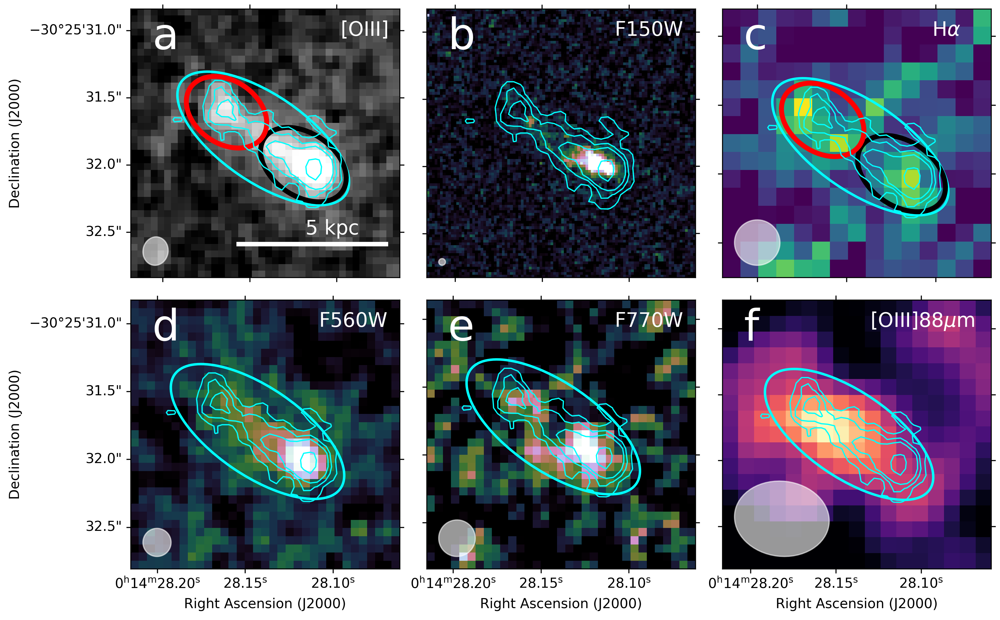
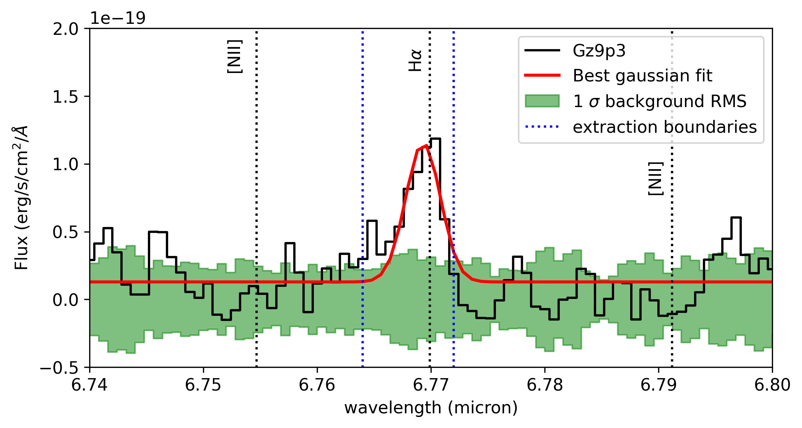

$\newcommand{\ensuremath}{}$
$\newcommand{\xspace}{}$
$\newcommand{\object}[1]{\texttt{#1}}$
$\newcommand{\farcs}{{.}''}$
$\newcommand{\farcm}{{.}'}$
$\newcommand{\arcsec}{''}$
$\newcommand{\arcmin}{'}$
$\newcommand{\ion}[2]{#1#2}$
$\newcommand{\textsc}[1]{\textrm{#1}}$
$\newcommand{\hl}[1]{\textrm{#1}}$
$\newcommand{\footnote}[1]{}$
$\newcommand{\vdag}{(v)^\dagger}$
$\newcommand\aastex{AAS\TeX}$
$\newcommand\latex{La\TeX}$
$\newcommand{\Ks}{K_{\rm{s}}}$
$\newcommand{\msun}{M_{\sun}}$
$\newcommand{\lsun}{L_{\sun}}$
$\newcommand{\HII}{\ion{H}{ii}}$
$\newcommand{\hei}{He{\sc i}}$
$\newcommand{\paa}{Pa\alpha}$
$\newcommand{\htwo}{H_{2}}$
$\newcommand{\brg}{Br\gamma}$
$\newcommand{\kms}{km~s^{-1}}$
$\newcommand{\ha}{H\alpha}$
$\newcommand{\hb}{H\beta}$
$\newcommand{\micron}{\mum}$

# Spatially resolved metallicity and ionization in the merging system Gz9p3 at z=9.3

<mark>Appeared on: 2026-04-27</mark> -  _Submitted to A&A, 17 pages, 11 figures_

A. Bik, et al. -- incl., <mark>F. Walter</mark>, <mark>T. Henning</mark>

**Abstract:** Studying the interstellar medium (ISM) in merging high‑redshift galaxies is crucial for understanding early galaxy assembly, star formation, and black hole growth, predicted by hierarchical $\Lambda$ CDM models. Deep imaging and spatially resolved spectroscopy with JWST enable unprecedented insight into these processes, even for galaxies in the Epoch of Reionization. We present NIRSpec and MIRI integral field spectroscopy and MIRI imaging of the merging galaxy Gz9p3 at z=9.3 observing the UV and optical rest-frame emission showing a clumpy morphology in the continuum as well as line emission covering the entire galaxy over a range of 5 kpc from the central clump to the tail region. We analyze the integrated spectrum as well as different apertures in the galaxy allowing a spatially resolved characterization of the ionized ISM of this merging galaxy. We compare our measurements with archival NIRCam imaging as well as ALMA data. We measure a total star formation rate of 13.4 $\pm$ 1.8 M $_{\odot}$ yr $^{-1}$ , a metallicity of 12+log(O/H)= 7.84 $\pm$ 0.05 and a $\xi_{ion}$ = 25.4 $\pm 0.1$ erg $^{-1}$ Hz and a burstiness parameter of 0.9 $\pm$ 0.1 for the integrated spectrum. We find large spatial differences in these parameters between the central clump and the tail region. While the optical [ OIII ] emission peaks in the main galaxy, the far-infrared [ OIII ] emission peaks towards the tidal tail, indicating different physical conditions in the ISM of the tail and main galaxy. This study presents the spatially resolved ISM analyses of a galaxy at z>9, revealing nebular line emission and strong spatial variations in star formation, metallicity, physical conditions, and ionizing efficiency. The results indicate a recent, metal‑poor starburst in a tail alongside a more evolved, enriched central clump with evidence for extreme excitation. This demonstrates the power of spatially resolved JWST spectroscopy of galaxies in the Epoch of Reionization.

**Figure 6. -** Overview of the JWST data of Gz9p3. ** a**: NIRSpec IFU continuum subtracted [OIII] emission line map; ** b**: NIRCam F150W image  ([Boyett, et. al 2024](https://doi.org/10.1038/s41550-024-02218-7))  tracing the UV continuum at 1500 Å, ** c**: MIRI MRS $\ha$ line map (the continuum is not detected).  ** d**: F560W and ** e**: F770W MIRI images of Gz9p3. ** f**: ALMA [OIII] 88$\micron$ emission from [Algera, et. al (2025)](https://doi.org/10.48550/arxiv.2512.14486). Overplotted on the images are the contours 3, 5, 7 and 15 $\sigma$ of the [OIII] 5008Å emission, the extraction aperture for the integrated galaxy spectrum in cyan, and the two apertures centered on the central clump (black) and the tail (red). The distance marker in panel a is corrected by the lensing magnification. In the bottom-left corner of each image the FWHM of the PSF is shown as a white circle or ellipse. (*fig:OIIImap*)

**Figure 1. -** MIRI/MRS H$\alpha$ spectrum of Gz9p3 integrated over the elliptic aperture shown in Fig. \ref{fig:OIIImap} with overlayed the best single gaussian fit (see text).  (*fig:MRS_integrated*)

**Figure 10. -** R3 vs R2 and O32 vs R23 line ratio diagrams adapted from [Álvarez-Márquez, et. al (2025)](https://doi.org/10.1051/0004-6361/202451731). The integrated line ratio (Tab. \ref{tab:linefluxes}) of Gz9p3 are shown as black square, the central clump and tail region shown as black and  diamond and triangle. The spatially resolved line ratios of the 5 extracted clumps (Tab. \ref{tab:resolved_fluxes}) as colored squares. Plotted are the location of individual galaxies above $z$ = 8: GN-z8-LAE  ([Navarro-Carrera, et. al 2024](https://doi.org/10.48550/arxiv.2407.14201))  at z=8.73, CEERS-1019  ([Marques-Chaves, et. al 2024](https://doi.org/10.1051/0004-6361/202347411))  at z=8.7, MACS1149-JD1  ([Stiavelli, et. al 2023](https://doi.org/10.3847/2041-8213/ad0159))  at z = 9.1;  GN-z9p4  ([Schaerer, et. al 2024](https://doi.org/10.1051/0004-6361/202450721))   at z = 9.4, RXJ2129-z95  ([Williams, et. al 2023](https://doi.org/10.1126/science.adf5307))  at z = 9.5, MACS0647-JD  ([Abdurro’uf, et. al 2024](https://doi.org/10.3847/1538-4357/ad6001))  at z = 10.2, GNz11  ([Álvarez-Márquez, et. al 2025](https://doi.org/10.1051/0004-6361/202451731))  at z=10.6 and  GHz2  ([Calabrò, et. al 2024](https://doi.org/10.3847/1538-4357/ad7602))  at  z = 12.3. We also included the location of Virgil  ([Rinaldi, et. al 2025](https://doi.org/10.3847/1538-4357/ae089c)) , a obscured AGN hidden in a star forming galaxy at z = 6.6.
The blue markers represent high-z star forming galaxies above $z$ = 3 from JADES \citep[both individual and stacked subsamples at z$\sim$ 6 and 8,][]{Bunker23,Cameron23}, CEERS  ([Sanders, et. al 2024](https://doi.org/10.3847/1538-4357/ad15fc)) , GLASS  ([Mascia, et. al 2023](https://doi.org/10.1051/0004-6361/202345866)) , FRESCO  ([Meyer, et. al 2024](https://doi.org/10.1093/mnras/stae2353))  as well as sources from  ([Nakajima, et. al 2023](https://doi.org/10.3847/1538-4365/acd556)) . The red markers represent the location of a sample of $z$$>$ 5 type 1 AGNs  ([Bunker, et. al 2023](https://doi.org/10.1051/0004-6361/202346159), [Curti, et. al 2022](https://doi.org/10.1093/mnras/stac2737), [Kokorev, et. al 2023](https://doi.org/10.3847/2041-8213/ad037a), [Nakajima, et. al 2023](https://doi.org/10.3847/1538-4365/acd556), [Furtak, et. al 2024](https://doi.org/10.1038/s41586-024-07184-8), [Juodžbalis, et. al 2024](https://doi.org/10.1038/s41586-024-08210-5), [Übler, et. al 2024](https://doi.org/10.1093/mnras/stae943)) . The black symbols are a sample of low-redshift metal-poor (12 + log(O/H) $<$ 8) star forming galaxies  ([Izotov, et. al 2006](http://adsabs.harvard.edu/cgi-bin/nph-data_query?bibcode=2006A%26A...448..955I&link_type=EJOURNAL), [Izotov and Thuan 2011](http://stacks.iop.org/0004-637X/734/i=2/a=82?key=crossref.f8edf01aa50c370b089603759b653d40), [Izotov, et. al 2016](https://doi.org/10.1093/mnras/stw1205), [Izotov, Thuan and Guseva 2024](https://doi.org/10.1093/mnras/stad3421)) . We overlay photoionization models from [Vale-Asari, et. al (2016)](https://doi.org/10.1093/mnras/stw971) for the metallicities 12+log(O/H) = 7.6 (blue), 7.8 (green) and 8.0 (red) in solid lines. The tracks are plotted for a starburst age of 4 Myr and a range of ionization parameters, log(U) = -1  to -4, shown by the size of the circle. The dashed lines are AGN tracks from [Calabrò, et. al (2023)](https://doi.org/10.1051/0004-6361/202347190) for the metallicities 12+log(O/H) = 7.67 (blue), 7.84 (green), 7.97 (red).
 (*fig:R2R3*)

