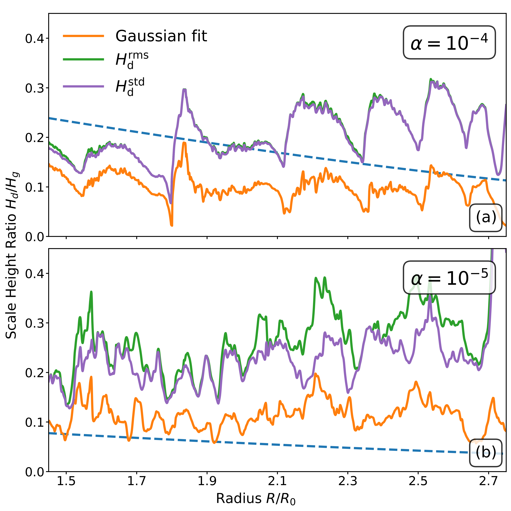
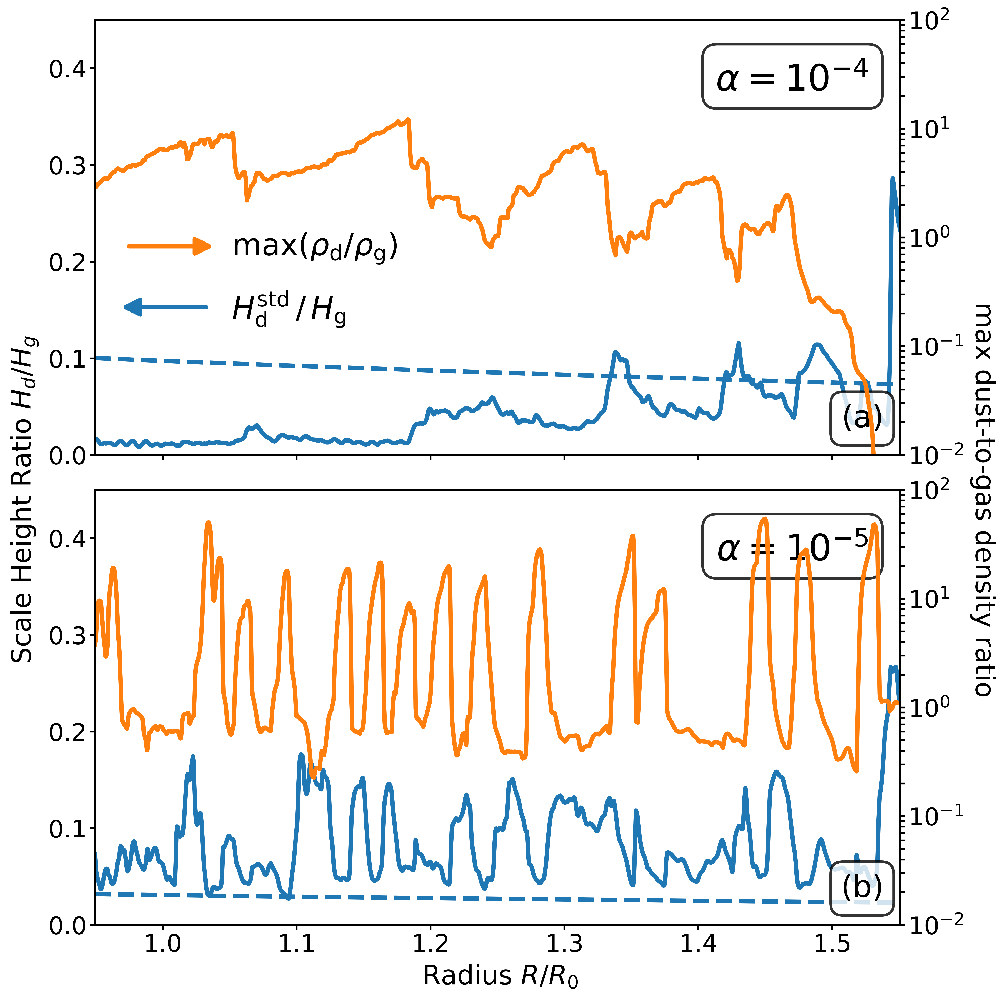

$\newcommand{\ensuremath}{}$
$\newcommand{\xspace}{}$
$\newcommand{\object}[1]{\texttt{#1}}$
$\newcommand{\farcs}{{.}''}$
$\newcommand{\farcm}{{.}'}$
$\newcommand{\arcsec}{''}$
$\newcommand{\arcmin}{'}$
$\newcommand{\ion}[2]{#1#2}$
$\newcommand{\textsc}[1]{\textrm{#1}}$
$\newcommand{\hl}[1]{\textrm{#1}}$
$\newcommand{\footnote}[1]{}$
$\newcommand{\plus}{\raisebox{.15\height}{\scalebox{.75}{+}}}$
$\newcommand{\info}{\fnmsep\thanks{Corresponding author; \texttt{bi@mpia.de}}}$

# Substructures induced by dust drag in protoplanetary disks

<mark>Appeared on: 2026-04-28</mark> -  _12+5 pages, 9+5 figures, accepted to A&A_

<mark>J. Bi</mark>, et al. -- incl., <mark>M. Flock</mark>, <mark>D. Ostertag</mark>

**Abstract:** Dust substructures observed in protoplanetary disks are commonly attributed to embedded planets; however, intrinsic gas--dust interactions can also generate complex morphologies. We performed two-dimensional, axisymmetric simulations of gas and dust that include dust back-reaction and parameterized turbulence to investigate how the streaming instability (SI) and vertical shear instability (VSI) shape dust distributions. With moderate viscosity and sufficiently high metallicity, we identify a characteristic shuttlecock-shaped dust substructure composed of a dense, vertically settled "head" and a vertically extended "tail." This morphology arises from nonlinear SI driven by marginally coupled grains and the associated modification of gas flows. The dust scale height in the tail exceeds predictions based on the the simple diffusion--settling balance, indicating strong self-generated turbulence. With lower viscosity, VSI becomes more vigorous, disrupts midplane structures, and increases vertical stirring; nevertheless, for dust grains with Stokes numbers around 0.01, SI can still attain dust-to-gas ratios of up to 20--50, potentially approaching the Hill density for gravitational binding. Our results demonstrate that intrinsic gas--dust interactions can generate prominent dust substructures even in disks with finite viscosity and, under favorable conditions, concentrate dust to levels relevant for planetesimal formation.

**Figure 8. -** Dust-to-gas density ratio at $t = 400 T_0$ from the model with $\alpha = 10^{-4}$ and ${\rm St}_0 = 10^{-3}$. Dashed curves in the upper panel denote contours for 25\% of the gas scale height, and the arrow below denotes the Stokes number of dust grains in the midplane. Gas streamlines are overplotted in the lower panel, with the line color denoting the vertical gas velocity.
 (*fig:stream_lines_1e-4a*)

**Figure 1. -** Radial profiles of the dust-to-gas scale height ratio at $t = 400 T_0$ from models with $\alpha = 10^{-4}$(panel $a$) and $\alpha = 10^{-5}$(panel $b$), both with ${\rm St}_0 = 10^{-3}$. The dust scale heights are measured using the root mean square ($H_{\rm d}^{\rm rms}$, Eq. \ref{eq:hd_rms}), the standard deviation ($H_{\rm d}^{\rm std}$, Eq. \ref{eq:hd_std}), or by fitting a Gaussian profile. The dashed curve indicates a reference-only expected ratio assuming explicit dust diffusion, as given by Eq. \ref{eq:hd_alpha}. The radial extent is the same as in Figs. \ref{fig:stream_lines_1e-4a} and \ref{fig:stream_lines_1e-5a}.
 (*fig:scale_height_1e-3s*)

**Figure 5. -** Radial profiles of the dust-to-gas scale height ratio (left $y$-axis, blue curves) and the maximum dust-to-gas density ratio (right $y$-axis, orange curves) at $t = 400 T_0$ from models with $\alpha = 10^{-4}$(panel $a$) and $\alpha = 10^{-5}$(panel $b$), both with ${\rm St}_0 = 10^{-2}$. The dust scale heights are measured using the standard deviation ($H_{\rm d}^{\rm std}$, Eq. \ref{eq:hd_std}), and the dashed curve indicates a reference-only expected ratio assuming explicit dust diffusion, as given by Eq. \ref{eq:hd_alpha}. The radial extent is the same as in Figs. \ref{fig:stream_lines_1e-4a} and \ref{fig:stream_lines_1e-5a}.
 (*fig:scale_height_1e-2s*)

