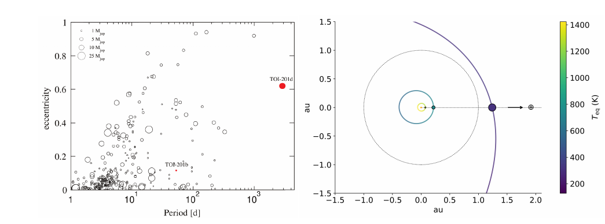
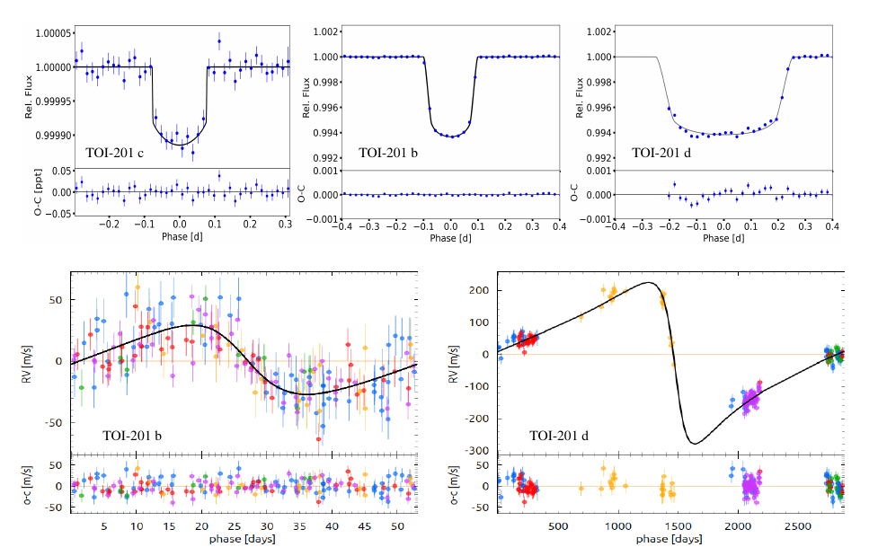
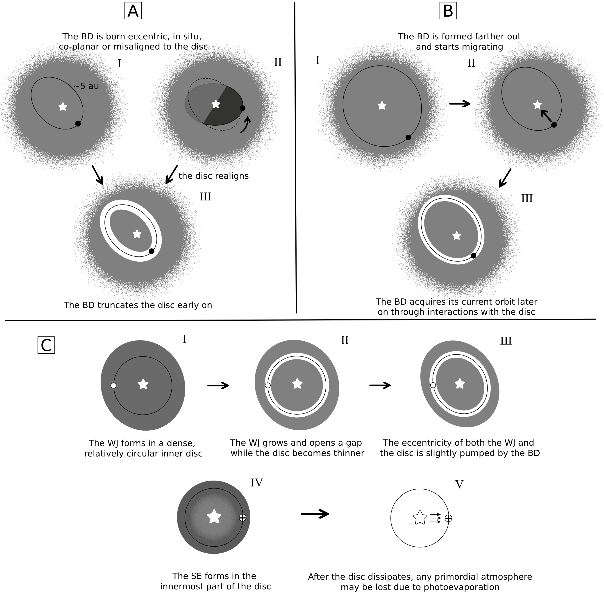

$\newcommand{\ensuremath}{}$
$\newcommand{\xspace}{}$
$\newcommand{\object}[1]{\texttt{#1}}$
$\newcommand{\farcs}{{.}''}$
$\newcommand{\farcm}{{.}'}$
$\newcommand{\arcsec}{''}$
$\newcommand{\arcmin}{'}$
$\newcommand{\ion}[2]{#1#2}$
$\newcommand{\textsc}[1]{\textrm{#1}}$
$\newcommand{\hl}[1]{\textrm{#1}}$
$\newcommand{\footnote}[1]{}$
$\newcommand{\bibinfo}[2]{#2}$
$\newcommand{\eprint}[2][]{\url{#2}}$
$\newcommand{\aj}{The Astronomical Journal}$
$\newcommand{\apj}{The Astrophysical Journal}$
$\newcommand{\pasp}{Publications of the Astronomical Society of the Pacific}$
$\newcommand{\aap}{Astronomy \& Astrophysics}$
$\newcommand{\mnras}{Monthly Notices of the Royal Astronomical Society}$
$\newcommand{\apjs}{The Astrophysical Journal Supplement Series}$
$\newcommand{\apjl}{The Astrophysical Journal Letters}$
$\newcommand{\icarus}{Icarus}$
$\newcommand{\planss}{Planetary and Space Science}$
$\newcommand{\teff}{\mbox{T_{\rm eff}}}$
$\newcommand{\logg}{\mbox{\log g}}$
$\newcommand{\vsini}{\mbox{v \sin i_{\ast}}}$
$\newcommand{\mictrb}{\mbox{\xi_{\rm t}}}$
$\newcommand{\mactrb}{\mbox{v_{\rm mac}}}$
$\newcommand{\ftot}{\mbox{f_{\oplus}}}$
$\newcommand{\halpha}{\mbox{H_\alpha}}$
$\newcommand{\hbeta}{\mbox{H_\beta}}$
$\newcommand{\hgamma}{\mbox{H_\gamma}}$
$\newcommand\T{\rule{0pt}{2.2ex}}$
$\newcommand\B{\rule[-1.2ex]{0pt}{0pt}}$
$\newcommand{\NaI}{\ion{Na}{i}}$
$\newcommand{\kpvsys}{K_p-V_{\rm sys}\xspace}$
$\newcommand{\numpm}[3]{#1^{#2}_{#3}}$
$\newcommand{\vorb}{\num{137.8(2.2)}\xspace}$
$\newcommand{\vsys}{\num{-20.283(0.006)}\xspace}$
$\newcommand{\msun}{M_\odot}$
$\newcommand{\rsun}{R_\odot}$
$\newcommand{\ceres}{\texttt{CERES }}$
$\newcommand{\parsec}{\texttt{PARSEC}}$
$\newcommand{\tess}{TESS }$
$\newcommand{\celerite}{\texttt{celerite}}$
$\newcommand{\mesa}{\texttt{MESA} }$
$\newcommand{\juliet}{\texttt{juliet} }$
$\newcommand{\mstar}{M_\star }$
$\newcommand{\rstar}{R_\star }$
$\newcommand{\lstar}{L_\star }$
$\newcommand{\ms}{m s^{-1} }$
$\newcommand{\mjup}{M\rm_J }$
$\newcommand{\rjup}{R\rm_J }$
$\newcommand{\mearth}{M_\oplus}$
$\newcommand{\rearth}{R_\oplus}$
$\newcommand{\planetb}{TOI-201 b }$
$\newcommand{\planetc}{TOI-201 c }$
$\newcommand{\planetd}{TOI-201 d }$
$\newcommand{\figinteriormodels}{Extended Data Fig. 1}$
$\newcommand{\figstate}{Extended Data Fig. 2}$
$\newcommand{\abstractname}\newcommand$
$\newcommand\Affilfont{\fontsize{7}{10.8}\itshape}$
$\newcommand\url{#1}$
$\newcommand{\urlprefix}{URL }$
$\newcommand{\doiprefix}{DOI }$

# A very eccentric brown dwarf coplanar to a warm Jupiter and a hot super Earth

<mark>Appeared on: 2026-04-28</mark> -  _Pre- referees review version. Paper submitted to Nature on June 18, 2025 and accepted for publication on April 22, 2026. This version includes only the main text. Please refer to the published version for the methods and for the final system parameters_

M. I. Jones, et al. -- incl., <mark>Y. Reinarz</mark>, <mark>T. Henning</mark>

**Abstract:**            In transiting planetary systems, where planetary sizes are accurately determined from transit observations, the presence of transit timing variations (TTVs), especially when combined with radial velocity (RV) data, provides powerful constraints on masses and orbital eccentricities. Together, these measurements offer crucial insights into system architecture, formation mechanisms, and dynamical evolution. We present long-term RV and transit/TTV monitoring of the active and young star (age $\sim$1 Gyr) TOI-201, revealing an exceptional multi-planet system composed of a hot super-Earth (SE) transiting every 5.8 days, a warm Jupiter (WJ) on a 53-day orbit, and an eccentric (e = 0.622) low-mass brown dwarf (BD) on an approximately 8-year orbit, with an estimated mass of M$_{\rm BD}$ $\sim$ 16 Jupiter masses. The BD is the longest-period transiting object ever characterized via RVs, and the only one known to be coplanar with inner planets. The architecture of this system suggests that the SE was formed isolated and in the innermost region of the gaseous disc. On the other hand, the orbital configuration of the outer companions suggests a nearly in-situ formation of both objects, with the WJ forming in a dense inner disc. Alternatively, the BD might have formed farther out and migrated inward, while inflating its eccentricity due to interactions with the disc.         

**Figure 2. -** _ Left panel:_ Eccentricity vs. orbital period for known transiting giants (0.3 $<$$M_{\rm p}$/$\mjup$$<$ 30) with eccentricity and mass precision better than 20\%, including $\planetb$ and $\planetd$(red circles).  For visual clarity, the symbol sizes scale with the square root of the planet mass. Data retrieved from the \href{https://exoplanetarchive.ipac.caltech.edu/}{NASA Exoplanet Archive}(as of May 2025), and complemented with the low-mass BD compilation in ref.\cite{Carmichael2023}_ Right panel_: Orbital configuration of the TOI-201 system. The solid lines represent the orbit of the three planets, with the color scale corresponding to different equilibrium temperature. For comparison a circular orbit at 1 AU (Earth) is also shown (dotted line).
 (*fig:per_ecc*)

**Figure 1. -** Upper row: Phase folded transits of TOI-201 c, as obtained with 34 different sectors (left panel),
TOI-201 b , including 16 transits (middle panel), and the mono-transit event of TOI-201 d , in Sector 64 (right panel).
The blue dots correspond to 20-minute phase-bins, and the black solid line to the best transit model. Lower row:
Phase folded RV curve of TOI-201, as induced by planets b and d (left and right panels, respectively). The blue, red,
green, orange, and magenta dots correspond to FEROS, HARPS, CORALIE, CHIRON and PLATOSPEC data,
respectively. The solid line corresponds to the best-fitting model. (*fig:trasit_RV_phase*)

**Figure 3. -** Diagram of the possible formation scenarios discussed in the main text. Panel C focuses on the inner region where TOI-201 b and TOI-201 c form, with the enlarged star symbol denoting a smaller spatial scale. (*fig:formation_scenarios*)

