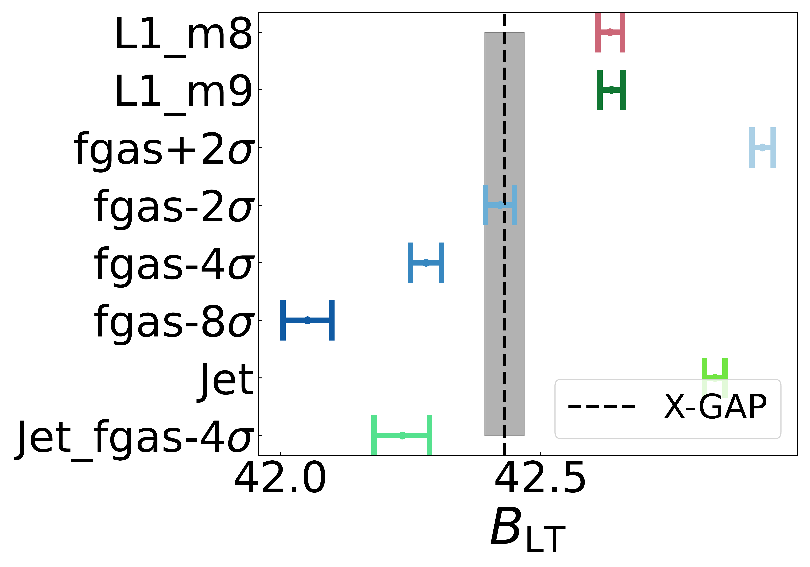
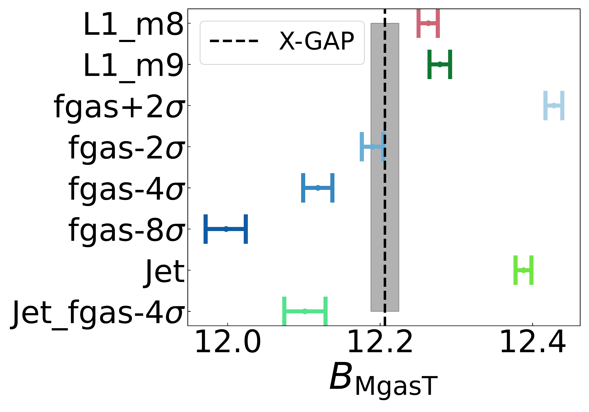
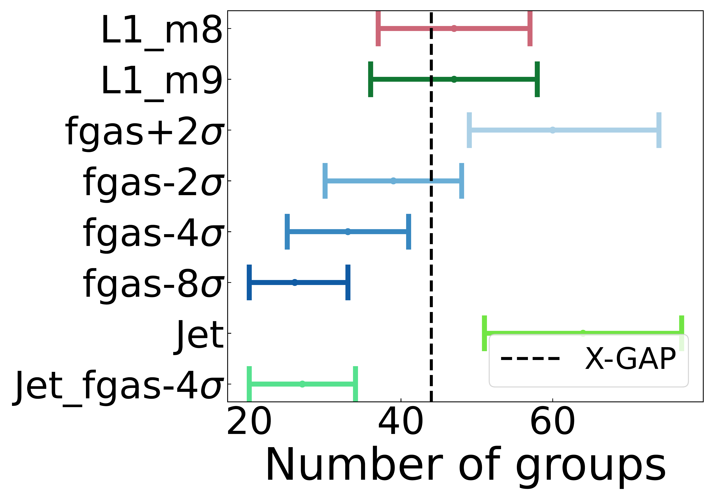
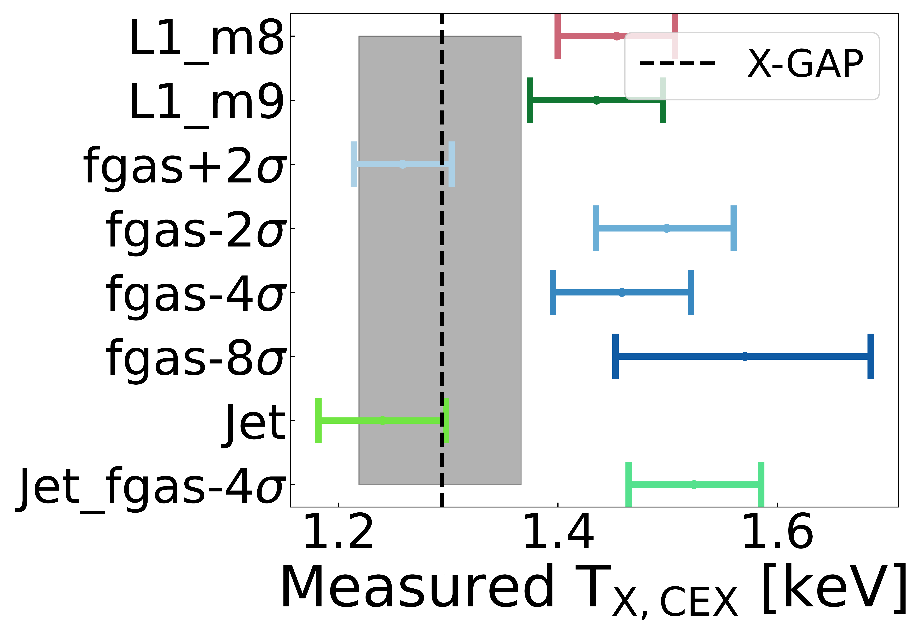
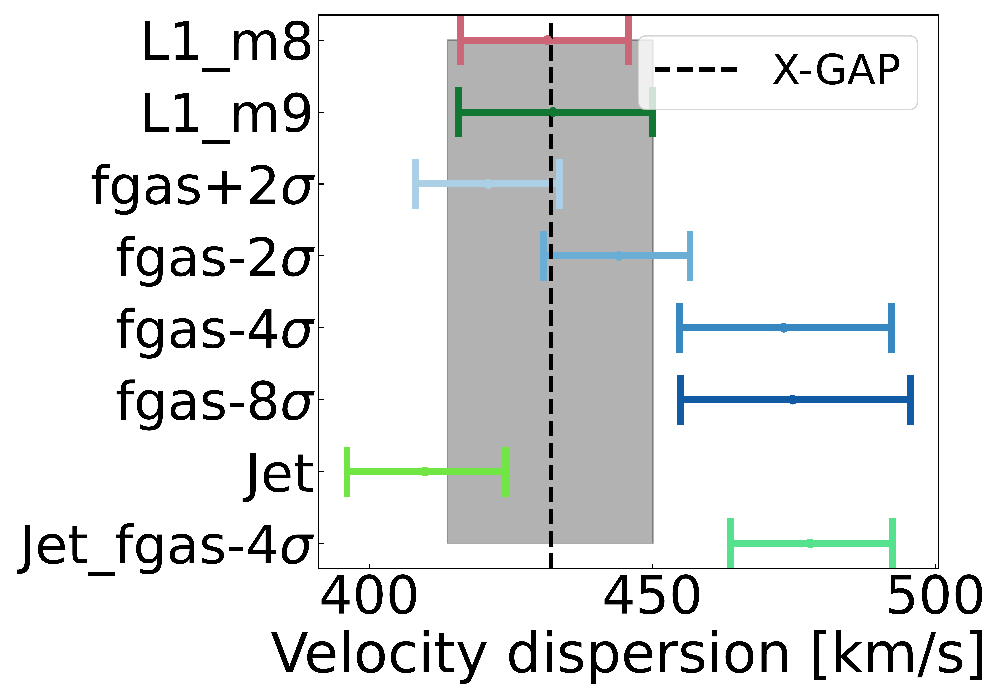
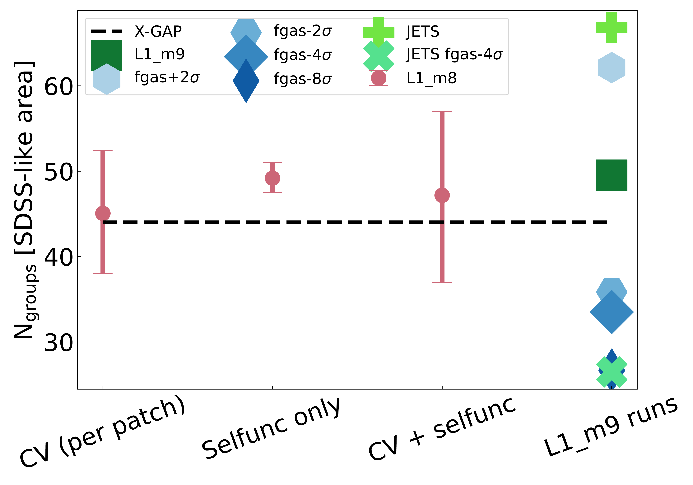
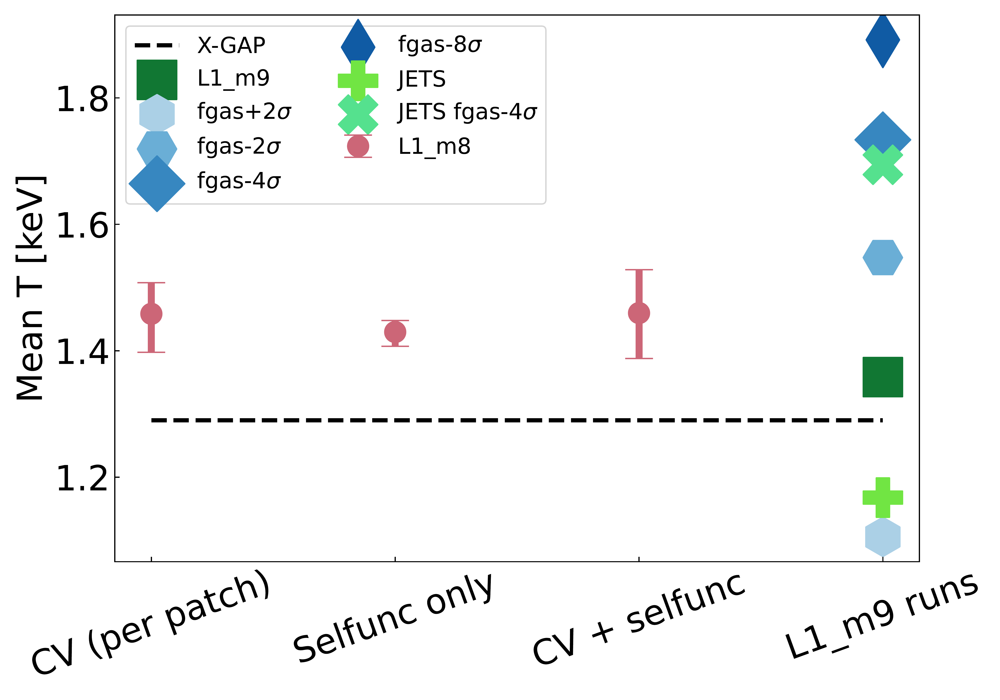
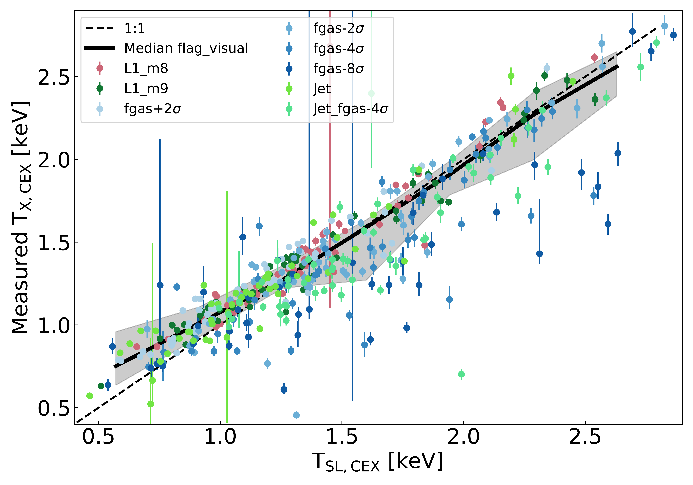

$\newcommand{\ensuremath}{}$
$\newcommand{\xspace}{}$
$\newcommand{\object}[1]{\texttt{#1}}$
$\newcommand{\farcs}{{.}''}$
$\newcommand{\farcm}{{.}'}$
$\newcommand{\arcsec}{''}$
$\newcommand{\arcmin}{'}$
$\newcommand{\ion}[2]{#1#2}$
$\newcommand{\textsc}[1]{\textrm{#1}}$
$\newcommand{\hl}[1]{\textrm{#1}}$
$\newcommand{\footnote}[1]{}$
$\newcommand{\rs}[1]{\textcolor{magenta}{RS: #1}}$

# Bound or blown: the fate of hot gas in galaxy groups

<mark>Appeared on: 2026-04-29</mark> -  _Accepted for publication on A&A_

R. Seppi, et al. -- incl., <mark>J. Braspenning</mark>

**Abstract:** The impact of AGN feedback on the hot gas content of galaxy groups remains a key uncertainty in galaxy formation and its connection to the large scale structure of the Universe.We aim to compare the XMM-Newton Group AGN Project (X-GAP) sample to the hydrodynamical FLAMINGO simulations, which span a wide range of AGN feedback prescriptions.We construct X-GAP analogues by forward-modelling the full selection function, including detection and observational systematics, and generate end-to-end XMM-Newton mock observations analysed consistently with the data. We study multiple observables, including the $L$ -- $T$ and $M_{\rm gas}$ -- $T$ relations, number of groups, mean temperature, and velocity dispersion, accounting for their covariance.The forward model accurately recovers input luminosities, gas masses, and core-excised temperatures for regular systems, enabling direct comparison in observable space.The normalisation of the scaling relations is the best discriminator between feedback models, while cosmic variance introduces $>20\%$ fluctuations in the number of detected systems, making counts alone a weak discriminator. Models with intermediate feedback strength provide the best agreement with X-GAP, with the $\mathrm{f_{gas}}-2\sigma$ model yielding the lowest tension of only $0.8\sigma$ , while the most extreme feedback scenario ( $\mathrm{f_{gas}}-8\sigma$ ) is ruled out at $>4\sigma$ .Our results indicate that the thermodynamic properties of galaxy groups favour feedback stronger than the fiducial FLAMINGO calibration, but disfavour the most ejective models. This highlights the importance of combining forward modelling and multi-observable constraints to probe the fate of hot baryons in low-mass haloes.

**Figure 17. -** Observables used for the comparison between X-GAP and various FLAMINGO models: the normalisation of the scaling relation between X-ray luminosity and temperature (both core-excised), between gas mass within 400 kpc and core-excised temperature, the total number of groups, the mean temperature and galaxy member velocity dispersion. X-GAP shows the best agreement with the $f_{\rm gas}-2\sigma$ model. (*fig:observables_for_comparison*)

**Figure 1. -** Expected properties of an X-GAP-like sample selected from different FLAMINGO models. The L1\_m8 includes tests for cosmic variance (CV) and uncertainties on the selection function. The top panel shows the number of groups within an SDSS-like area of 7430 deg$^2$, the bottom one shows the median temperature of the selected sample. The latter is a promising discriminator between FLAMINGO models. (*fig:Number_of_groups*)

**Figure 9. -** Comparison between the input spectroscopic-like temperature and the output temperature measured and modelled with \texttt{hydromass}. Both quantities are core-excised, using the estimated R$_{\rm 500c}$ as a reference. (*fig:Tin_Tout*)

