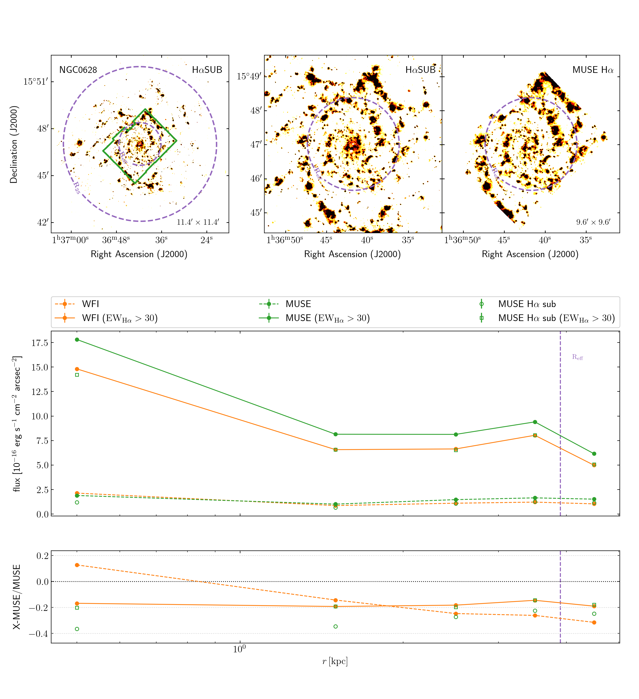
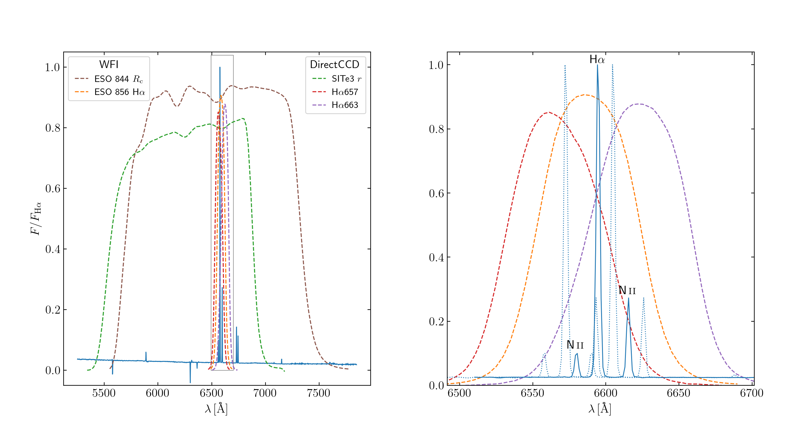
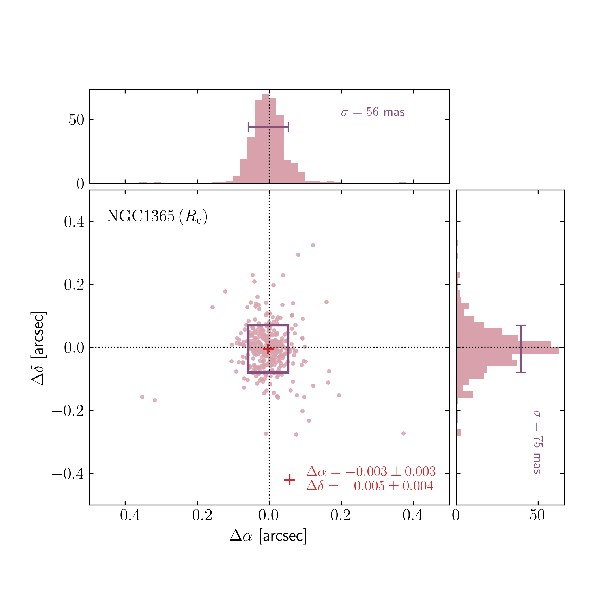
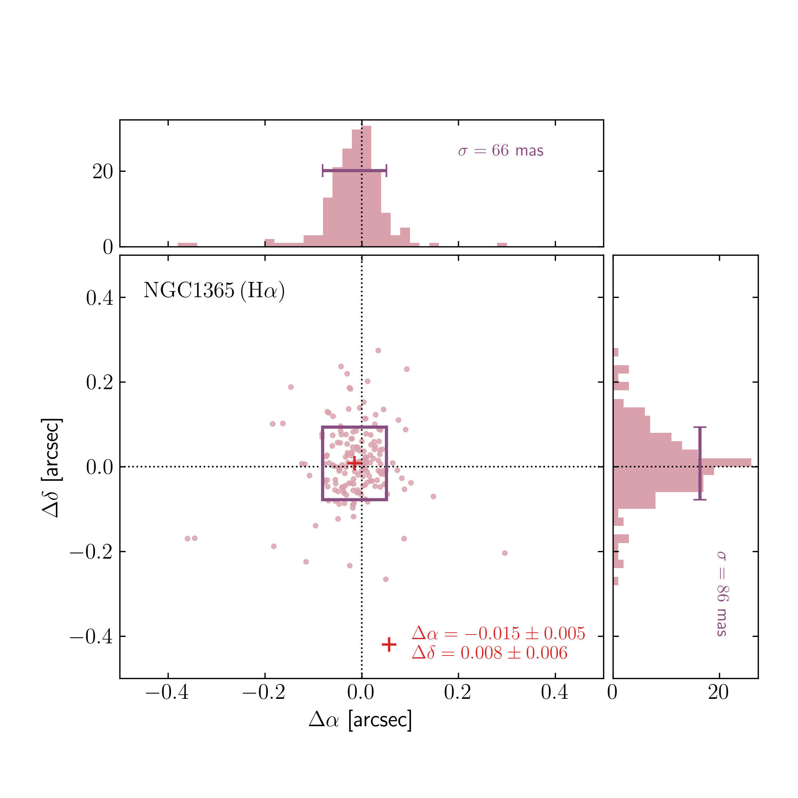

$\newcommand{\ensuremath}{}$
$\newcommand{\xspace}{}$
$\newcommand{\object}[1]{\texttt{#1}}$
$\newcommand{\farcs}{{.}''}$
$\newcommand{\farcm}{{.}'}$
$\newcommand{\arcsec}{''}$
$\newcommand{\arcmin}{'}$
$\newcommand{\ion}[2]{#1#2}$
$\newcommand{\textsc}[1]{\textrm{#1}}$
$\newcommand{\hl}[1]{\textrm{#1}}$
$\newcommand{\footnote}[1]{}$
$\newcommand{\MPG}{MPG~2.2m}$
$\newcommand{\dP}{du~Pont}$
$\newcommand{\Ha}{H\alpha}$
$\newcommand{\pha}{PHANGS-H\alpha}$
$\newcommand{\Rc}{R_\mathrm{c}}$
$\newcommand{\Hii}{\ion{H}{ii}}$
$\newcommand{\Nii}{[\ion{N}{ii}]}$
$\newcommand{\fNii}{\mathcal{F}_{[\mathrm{N} \mathrm{II}]}}$
$\newcommand{\niiha}{[\ion{N}{ii}]\lambda 6583/\mathrm{H}\alpha}$
$\newcommand{\lognii}{\log_{10}([\ion{N}{ii}]\lambda 6583/\mathrm{H}\alpha)}$
$\newcommand{\logmass}{\log_{10}(\mathrm{M_*}/\mathrm{M}_{\odot})}$
$\newcommand{\gbp}{G_\mathrm{BP}}$
$\newcommand{\grp}{G_\mathrm{RP}}$
$\newcommand{\gcol}{G_\mathrm{BP}-G_\mathrm{RP}}$
$\newcommand{\sex}{\texttt{SExtractor}}$
$\newcommand{\scamp}{\texttt{SCAMP}}$
$\newcommand{\swarp}{\texttt{SWarp}}$
$\newcommand{\dra}{\Delta\alpha}$
$\newcommand{\ddec}{\Delta\delta}$
$\newcommand{\ew}{EW_{\mathrm{H}\alpha}}$
$\newcommand{\ewhan}{EW_{\mathrm{H}\alpha + [\mathrm{N} \mathrm{II}]}}$
$\newcommand{\ewph}{EW_{\mathrm{ph}}}$
$\newcommand{\GEMINI}{\label{GEMINI}Gemini Observatory/NSF’s NOIRLab, 950 N. Cherry Avenue, Tucson, AZ, 85719, USA$
$}$
$\newcommand{\ASCL}{\label{ASCL}Astrophysics Source Code Librar$
$y, Michigan Technological University, 1400 Townsend Drive, Houghton, MI 49931}$
$\newcommand{\OSU}{\label{OSU}Department of Astronomy, The Ohio State University, 140 West 18th Avenue, Columbus, Ohio 43210, USA}$
$\newcommand{\Alberta}{\label{Alberta}Department of Physics, University of Alberta, Edmonton, AB T6G 2E1, Canada}$
$\newcommand{\ANU}{\label{ANU}Research School of Astronomy and Astrophysics, Australian National University, Canberra, ACT 2611, Australia}$
$\newcommand{\IPARCOS}{\label{IPARCOS}Instituto de Física de Partículas y del Cosmos, Universidad Complutense de Madrid, E-28040 Madrid, Spain}$
$\newcommand{\IPAC}{\label{IPAC}Caltech-IPAC, 1200 E. California Blvd. Pasadena, CA 91125, USA}$
$\newcommand{\Carnegie}{\label{Carnegie}Observatories of the Carnegie Institution for Science, 813 Santa Barbara Street, Pasadena, CA 91101, USA}$
$\newcommand{ÇAPP}{\label{CCAPP}Center for Cosmology and Astroparticle Physics, 191 West Woodruff Avenue, Columbus, OH 43210, USA}$
$\newcommand{\CfA}{\label{CfA}Harvard-Smithsonian Center for Astrophysics, 60 Garden Street, Cambridge, MA 02138, USA}$
$\newcommand{\CITEVA}{\label{CITEVA}Centro de Astronomía (CITEVA), Universidad de Antofagasta, Avenida Angamos 601, Antofagasta, Chile}$
$\newcommand{\CNRS}{\label{CNRS}CNRS, IRAP, 9 Av. du Colonel Roche, BP 44346, F-31028 Toulouse cedex 4, France}$
$\newcommand{\ESO}{\label{ESO}European Southern Observatory, Karl-Schwarzschild Stra{\ss}e 2, D-85748 Garching bei München, Germany}$
$\newcommand{\ESOChile}{\label{ESOChile}European Southern Observatory, Alonso de Córdova 3107, Casilla 19, Santiago, Chile}$
$\newcommand{\Heidelberg}{\label{Heidelberg}Astronomisches Rechen-Institut, Zentrum für Astronomie der Universität Heidelberg, Mönchhofstra\ss e 12-14, D-69120 Heidelberg, Germany}$
$\newcommand{\ICRAR}{\label{ICRAR}International Centre for Radio Astronomy Research, University of Western Australia, 35 Stirling Highway, Crawley, WA 6009, Australia}$
$\newcommand{\IRAM}{\label{IRAM}Institut de Radioastronomie Millimétrique (IRAM), 300 Rue de la Piscine, F-38406 Saint Martin d'Hères, France}$
$\newcommand{\IRAP}{\label{IRAP}CNRS, IRAP, 9 Av. du Colonel Roche, BP 44346, F-31028 Toulouse cedex 4, France}$
$\newcommand{\UPS}{\label{UPS}Université de Toulouse, UPS-OMP, IRAP, F-31028 Toulouse cedex 4, France}$
$\newcommand{\ITA}{\label{ITA}Universität Heidelberg, Zentrum für Astronomie, Institut für Theoretische Astrophysik, Albert-Ueberle-Str 2, D-69120 Heidelberg, Germany}$
$\newcommand{\IWR}{\label{IWR}Universität Heidelberg, Interdisziplinäres Zentrum für Wissenschaftliches Rechnen, Im Neuenheimer Feld 205, D-69120 Heidelberg, Germany}$
$\newcommand{\JHU}{\label{JHU}Department of Physics and Astronomy, The Johns Hopkins University, Baltimore, MD 21218, USA}$
$\newcommand{\Leiden}{\label{Leiden}Leiden Observatory, Leiden University, P.O. Box 9513, 2300 RA Leiden, The Netherlands}$
$\newcommand{\Maryland}{\label{Maryland}Department of Astronomy, University of Maryland, College Park, MD 20742, USA}$
$\newcommand{\MPE}{\label{MPE}Max-Planck-Institut für extraterrestrische Physik, Giessenbachstra{\ss}e 1, D-85748 Garching, Germany}$
$\newcommand{\MPIA}{\label{MPIA}Max-Planck-Institut für Astronomie, Königstuhl 17, D-69117, Heidelberg, Germany}$
$\newcommand{\Nagoya}{\label{Nagoya}Department of Physics, Nagoya University, Furo-cho, Chikusa-ku, Nagoya, Aichi 464-8602, Japan}$
$\newcommand{\NRAO}{\label{NRAO}National Radio Astronomy Observatory, 520 Edgemont Road, Charlottesville, VA 22903-2475, USA}$
$\newcommand{\OAN}{\label{OAN}Observatorio Astronómico Nacional (IGN), C/Alfonso XII, 3, E-28014 Madrid, Spain}$
$\newcommand{\ObsParis}{\label{ObsParis}Sorbonne Université, Observatoire de Paris, Université PSL, CNRS, LERMA, F-75014, Paris, France}$
$\newcommand{\Ox}{\label{Ox}Sub-department of Astrophysics, Department of Physics, University of Oxford, Keble Road, Oxford OX1 3RH, UK}$
$\newcommand{\JBCA}{\label{JBCA}UK ALMA Regional Centre Node, Jodrell Bank Centre for Astrophysics, Department of Physics and Astronomy, The University of Manchester, Oxford Road, Manchester M13 9PL, UK}$
$\newcommand{\Princeton}{\label{Princeton}Department of Astrophysical Sciences, Princeton University, Princeton, NJ 08544 USA}$
$\newcommand{\UToledo}{\label{UToledo}Ritter Astrophysical Research Center, University of Toledo, Toledo, OH, 43606}$
$\newcommand{\Toulouse}{\label{Toulouse}Université de Toulouse, UPS-OMP, IRAP, F-31028 Toulouse cedex 4, France}$
$\newcommand{\UBonn}{\label{UBonn}Argelander-Institut für Astronomie, Universität Bonn, Auf dem Hügel 71, 53121 Bonn, Germany}$
$\newcommand{\UChile}{\label{UChile}Departamento de Astronomía, Universidad de Chile, Camino del Observatorio 1515, Las Condes, Santiago, Chile}$
$\newcommand{\UCM}{\label{UCM}Departamento de Física de la Tierra y Astrofísica, Universidad Complutense de Madrid, E-28040 Madrid, Spain}$
$\newcommand{\UCSD}{\label{UCSD}Center for Astrophysics and Space Sciences, Department of Physics,  University of California,\ San Diego, 9500 Gilman Drive, La Jolla, CA 92093, USA}$
$\newcommand{\ULyon}{\label{ULyon}Univ Lyon, Univ Lyon 1, ENS de Lyon, CNRS, Centre de Recherche Astrophysique de Lyon UMR5574,\ F-69230 Saint-Genis-Laval, France}$
$\newcommand{\UMass}{\label{UMass}University of Massachusetts—Amherst, 710 N. Pleasant Street, Amherst, MA 01003, USA}$
$\newcommand{\UniCA}{\label{UniCA}Université Côte d'Azur, Observatoire de la Côte d'Azur, CNRS, Laboratoire Lagrange, 06000, Nice, France}$
$\newcommand{\UWyoming}{\label{UWyoming}Department of Physics and Astronomy, University of Wyoming, Laramie, WY 82071, USA}$
$\newcommand{\LAM}{\label{LAM}$
$Aix Marseille Univ, CNRS, CNES, LAM (Laboratoire d’Astrophysique de Marseille),  F-13388 Marseille,$
$France}$
$\newcommand{\UHawaii}{\label{UHawaii}Institute for Astronomy, University of Hawaii, 2680 Woodlawn Drive, Honolulu, HI 96822, USA}$
$\newcommand{\UGent}{\label{UGent}Sterrenkundig Observatorium, Universiteit Gent, Krijgslaan 281 S9, B-9000 Gent, Belgium}$
$\newcommand{\IPARC}{\label{IPARC}Instituto de Física de Partículas y del Cosmos IPARCOS, Facultad de Ciencias Físicas, Universidad Complutense de Madrid, E-28040, Spain}$
$\newcommand{\STScI}{\label{STScI}Space Telescope Science Institute, 3700 San Martin Drive, Baltimore, MD 21218, USA}$
$\newcommand{\McMaster}{\label{McMaster}Department of Physics and Astronomy, McMaster University, Hamilton, ON L8S 4M1, Canada}$
$\newcommand{\INAF}{\label{INAF}INAF -- Osservatorio Astrofisico di Arcetri, Largo E. Fermi 5, I-50157, Firenze, Italy}$
$\newcommand{\UniSQ}{\label{UniSQ}Centre for Astrophysics, University of Southern Queensland, Toowoomba, QLD 4350, Australia}$
$\newcommand{\UA}{\label{UA}Centro de Astronomía (CITEVA), Universidad de Antofagasta, Avenida Angamos 601, Antofagasta, Chile}$
$\newcommand{\LERMA}{\label{LERMA}Observatoire de Paris, PSL Research University, CNRS, Sorbonne Universités, 75014 Paris}$
$\newcommand{\SAIMSU}{\label{SAIMSU}Sternberg Astronomical Institute, Lomonosov Moscow State University, Universitetsky pr. 13, 119234 Moscow, Russia}$
$\newcommand{\Rad}{\label{Rad}Elizabeth S. and Richard M. Cashin Fellow at the Radcliffe Institute for Advanced Studies at Harvard University, 10 Garden Street, Cambridge, MA 02138, U.S.A.}$
$\newcommand{\unam}{\label{unam}Instituto de Astronomía, Universidad Nacional Autónoma de México, Ap. 70-264, 04510 CDMX, Mexico}$
$\newcommand{\COOL}{\label{COOL}Cosmic Origins Of Life (COOL) Research DAO, \href{https://coolresearch.io}{https://coolresearch.io}}$
$\newcommand{\TKU}{\label{TKU}Department of Physics, Tamkang University, No.151, Yingzhuan Road, Tamsui District, New Taipei City 251301, Taiwan}$
$\newcommand{\UCT}{\label{UCT}Department of Astronomy, University of Cape Town, Rondebosch 7701, Cape Town, South Africa}$
$\newcommand{\AIP}{\label{AIP}Leibniz-Institut for Astrophysik Potsdam (AIP), An der Sternwarte 16, 14482 Potsdam, Germany}$
$\newcommand{\Zagreb}{\label{Zagreb}Department of Physics, Faculty of Science, University of Zagreb, Bijeni\v{c}ka 32, 10 000 Zagreb, Croatia}$
$\newcommand{\ARK}{\label{ARK}Department of Physics, University of Arkansas, 226 Physics Building, 825 West Dickson Street, Fayetteville, AR 72701, USA}$
$\newcommand{\UConn}{\label{UConn}University of Connecticut, Department of Physics, 196A  Auditorium Road, Unit 3046, Storrs, CT, 06269}$

# The $\pha$ survey: Ground-based narrow-band imaging of nearby star-forming galaxies

<mark>Appeared on: 2026-04-29</mark> -  _34 pages, 16 figures, 4 tables. Accepted for publication in A&A_

A. Razza, et al. -- incl., <mark>J. Neumann</mark>, <mark>K. Kreckel</mark>, <mark>E. Schinnerer</mark>, <mark>J. Li</mark>

**Abstract:** We present $\pha$ , a narrow-band imaging survey that maps H $\alpha$ emission over a sample of 65 nearby massive star-forming galaxies. The data were obtained using the MPG-ESO 2.2-meter telescope at La Silla and the du Pont 2.5-meter telescope at Las Campanas Observatory, in the framework of the multi-wavelength cloud-scale (50--100 pc) resolution mapping of molecular gas and star formation conducted by the Physics at High Angular resolution in Nearby GalaxieS (PHANGS) collaboration. $\pha$ complements the already published PHANGS-ALMA, PHANGS-MUSE, PHANGS-HST, and PHANGS-JWST surveys, providing an anchor point for the photometric and astrometric calibration of these datasets, as well as samples of $\Hii$ regions, and star formation rate maps for the bulk of the PHANGS sample. We present observations, data processing, and calibration of the $\pha$ dataset, as well as the procedures used to derive emission-line fluxes from narrow-band imaging. A subset of galaxies with available spectroscopic Ha mapping from the PHANGS-MUSE survey allows for a detailed comparison with the narrow-band photometry presented here. This informs a series of best practices for the processing of narrow-band H $\alpha$ imaging that we apply to the full dataset.

**Figure 12. -** Top-left: cutout of $\Ha$ SUB image up to a radius larger than the $B$-band 25th isophotal (dashed line). In green is shown the MUSE footprint. Top-right: a zoom of $\Ha$ SUB and MUSE $\Ha$ for a better view of the inner structures, within the effective radius of the galaxy (dashed line). Two surface brightness profile comparisons are shown in the central main plot. The dashed orange and green lines represent the profiles computed by using all the unmasked pixels within each annulus, respectively for WFI $\Ha$ SUB and MUSE $\Ha$ . On the other hand, the continuous lines show the profiles computed for pixels in each annulus with EW higher than 30 Å , where the same colour code as for the dashed lines is used. In the bottom, the residual WFI-MUSE profiles, normalized by MUSE data, are shown with the continuous line and dashed line for the computations with all pixels and high-EW pixels, respectively. As sanity check, green open circle and open squares represent the profiles for the images computed with the same recipes adopted for $\Ha$ SUB but employing MUSE BB and MUSE NB instead of BB and NB images, respectively for the profiles computed for all the pixels and high-EW pixels within the annuli. (*fig:Ha_profile*)

**Figure 5. -** _Left_: Set of WFI and DirectCCD broad- and narrow-band filter transmission curves overlaid on an NGC0628 $\Hii$ region spectrum from PHANGS-MUSE data. The *ESO $R_\mathrm{c*$ 844}(brown dashed line) and the SITe3 $r$(green dashed lines) broad-band filter curves are clearly seen. _Right_: Inset of the left-hand side plot in the wavelength range of the $\Ha$ emission line and the $\Nii$ doublet. The ESO narrow-band filter for WFI (orange dashed line) and the two $\Ha$ 657 (red dashed line) and $\Ha$ 663 (magenta dashed line) filters employed in the DirectCCD observations are shown. The solid blue line represents the spectrum shifted at the recessional velocity of 1460 km s$^{-1}$. Below this threshold, galaxies were observed with the DirectCCD filter $\Ha$ 657, whereas the filter $\Ha$ 663 was used for galaxies with higher receding velocities. The dotted blue lines show the closest and the most distant galaxy within the $\dP$ sample. (*fig:Filters*)

**Figure 6. -** In the central scatter plots, RA and DEC offsets ($\dra$ and $\ddec$ , respectively) between stars centre positions computed from $\pha$ final combined images for NGC 1365 and their positions from matched stars in Gaia DR2 catalogue are shown for (*left*) WFI $\Rc$ filter and (*right*) WFI $\Ha$ filter images. The red crosses in the plot centres show the mean, whereas the rectangle sides (violet) the 2$\sigma$ of $\dra$ and $\ddec$ distributions. Mean and standard deviation values are reported in red in the bottom-right corner of the central plot. The plots above and to the right of each central scatter plot are the 1D histograms of $\dra$ and $\ddec$ distributions, respectively. A violet bar representing the 2$\sigma$ of the distribution is shown in each histogram. This plots do not reflect the final astrometric solution that comes from applying a simple translation of the WCS coordinates in the opposite direction of the found mean offsets. (*fig:astro_ngc1365*)

