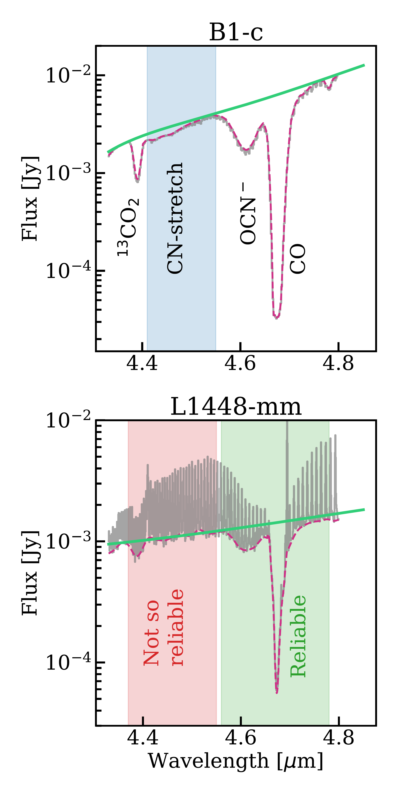
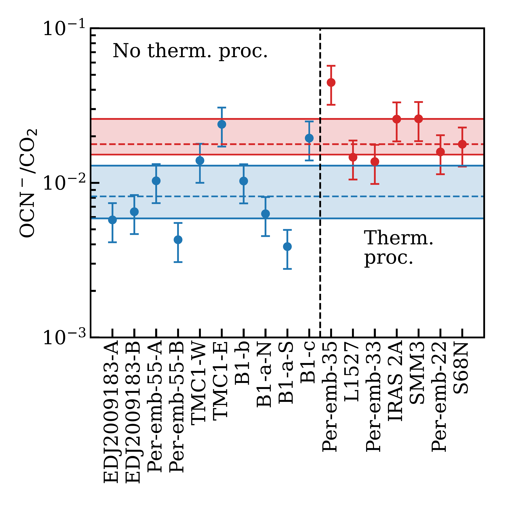
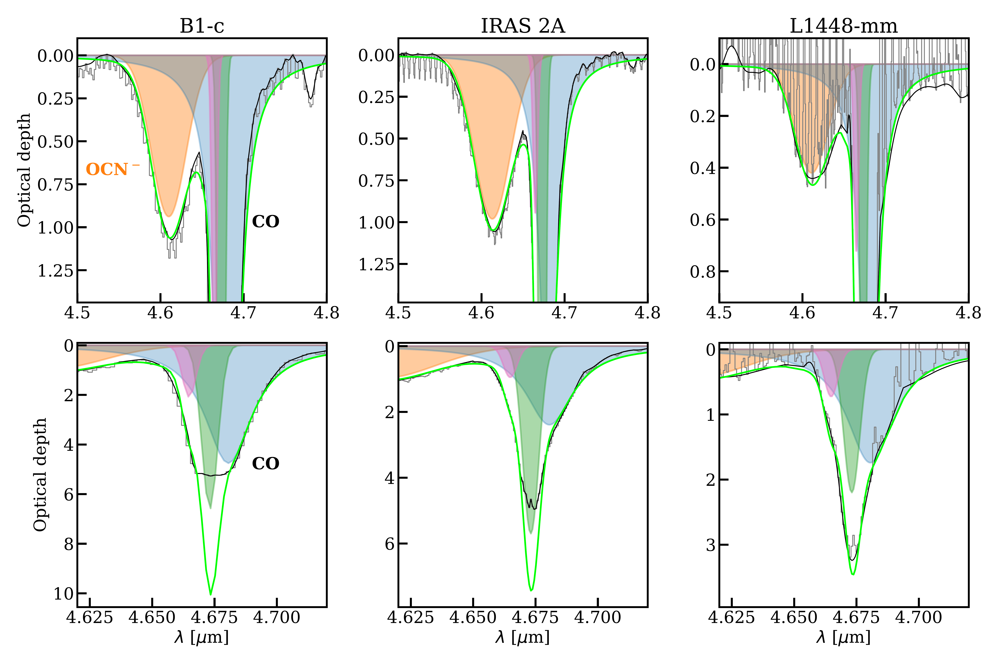

$\newcommand{\ensuremath}{}$
$\newcommand{\xspace}{}$
$\newcommand{\object}[1]{\texttt{#1}}$
$\newcommand{\farcs}{{.}''}$
$\newcommand{\farcm}{{.}'}$
$\newcommand{\arcsec}{''}$
$\newcommand{\arcmin}{'}$
$\newcommand{\ion}[2]{#1#2}$
$\newcommand{\textsc}[1]{\textrm{#1}}$
$\newcommand{\hl}[1]{\textrm{#1}}$
$\newcommand{\footnote}[1]{}$
$\newcommand{\arraystretch}{1}$
$\newcommand{\arraystretch}{1.3}$
$\newcommand{\arraystretch}{1.3}$
$\newcommand{\arraystretch}{1.3}$
$\newcommand{\arraystretch}{1.3}$

# JOYS+: Analyses of OCN$^-$, $N_2$O, NO, and complex cyanides in ices: Thermal processing results in modest enhancement of OCN$^-$ ice

<mark>Appeared on: 2026-04-29</mark> -  _Accepted for publication in A&A, 19 pages, 14 figures_

P. Nazari, et al. -- incl., <mark>C. Gieser</mark>

**Abstract:** Nitrogen-bearing molecules are generally more difficult to observe than oxygen-bearing ones in both gas and ice, mainly due to the lower abundance of nitrogen in the interstellar medium. Therefore, the formation pathways of many of these species is still under debate. Studies prior to the launch of the _James Webb Space Telescope_ (JWST) did not have the sensitivity to observe ices toward the youngest and most deeply embedded Class 0 objects. The time is now ripe to study nitrogen-bearing molecules toward ice-rich Class 0 and Class I objects with the JWST. Here we will focus on OCN $^-$ , $CH_3$ CN, $C_2$ $H_5$ CN, NO, and $N_2$ O in ices to better understand their formation. We use the data from JWST Observations of Young protoStars (JOYS+) program. Particularly, we study the objects that have the JWST NIRSpec-IFU observations (8 Class 0 and 11 Class I) to measure the ice column densities of the targeted molecules. We firmly detect OCN $^-$ in ices for all these objects, tentatively detect $CH_3$ CN, $C_2$ $H_5$ CN, and $N_2$ O toward three sources, and find upper limits on the NO abundance in ices. The OCN $^-$ /$CO_2$ ratios are found to be larger by a factor of ${\sim}2-3$ for the objects that have a visible $CO_2$ (15.2 $\mu$ m) double peak (a sign of ice thermal processing) pointing to the moderate effect of temperature on OCN $^-$ production. Considering $H_2$ O, $CO_2$ , and OCN $^-$ relations with $A_{\rm V}$ , we tentatively find that OCN $^-$ forms at a later stage compared to $H_2$ O and $CO_2$ . We find that the ratios of $CH_3$ CN, $C_2$ $H_5$ CN, and $N_2$ O with respect to OCN $^-$ are relatively constant within one order of magnitude across our objects, likely suggesting that they have similar ice environments. The upper limit abundances of NO are around one order of magnitude lower than what was previously predicted in ices of a mature protoplanetary disk to explain the gas-phase detection of this molecule in the disk. This indicates that gas-phase NO may be a product of another molecule such as $N_2$ O in the ices. We conclude that after OCN $^-$ forms, it can get enhanced at higher temperatures by only a factor of ${\sim}2-3$ and thus OCN $^-$ detection alone does not imply ice heating. Large-sample studies of OCN $^-$ toward pre-stellar cores will be useful to further confirm the formation timeline of this molecule.

**Figure 1. -** Example of spline fitting for two of our objects. Gray shows the data and dashed magenta line shows the fitted spline to the bottom of the gas-phase emission or top of the gas-phase absorption lines. Most of our objects were too line rich for a reliable measurement of column densities of the weak features at 4.45 $\mu$m (shaded red area), but the spline fitting was reliable for the stronger features such as OCN$^-$ and CO (shaded green area) even for these sources. An extreme case in gas-phase emission lines is L1448-mm, which is presented in the bottom panel. Both weaker and stronger features of B1-c (top panel) after spline fitting, despite presence of some gas-phase lines, are reliable for further analysis. Green solid line shows the fitted local continuum. (*fig:spline_text*)

**Figure 3. -** Effect of heating on OCN$^-$/$CO_2$ ratio. The objects are divided into two groups based on the shape of the $CO_2$ band. Those with double-peaked $CO_2$ are shown in red (thermally processed ices) while those with a single-peaked $CO_2$ are shown in blue (no thermal processing). The dashed lines show the median of each group and the shaded areas show the range where the data falls in between the upper and lower quartiles. Ice heating can enhance OCN$^-$ formation by only a factor of ${\sim}2-3$. (*fig:thermal*)

**Figure 6. -** Our fits to the OCN$^-$ and CO absorption features toward three of the studied objects. As explained in the text, OCN$^-$ is fitted simultaneously with CO ice. The orange shaded area shows the fit to the OCN$^-$ feature. Shaded blue, green, and pink areas show the Lorentzian and Gaussian components fitted to the CO feature. The total fit is presented with solid lime green line. The black solid line shows the spline that is fitted to the bottom of the gas-phase emission or top of the gas-phase absorption lines where the data are overplotted in gray. Note that the top and bottom rows have different scales; the top row highlights the OCN$^-$ fits and the bottom row shows the CO fits. For some objects such as B1-c and IRAS 2A, where the CO feature gets saturated close to the noise level, the bottom of the CO feature is ignored when fitting the data and only the wings of the CO band, which are well above the noise level, are fitted. The fits for the other objects considered in this work are given in Figs. \ref{fig:OCN_fits_app} and \ref{fig:CO_fits_app}. (*fig:OCN_fits*)

