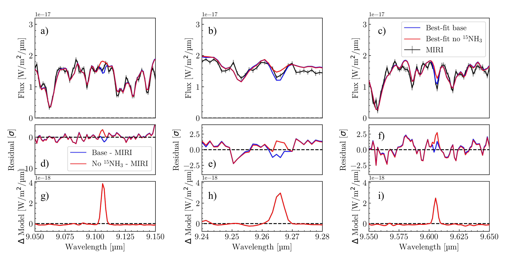
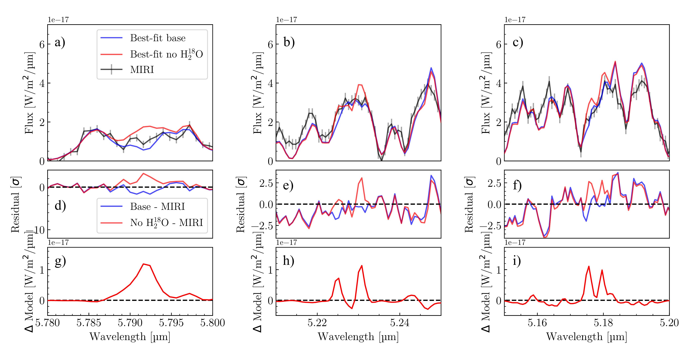
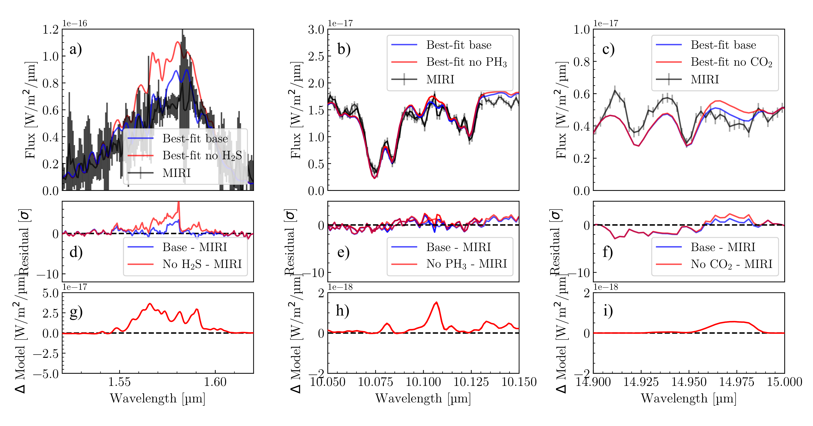

$\newcommand{\ensuremath}{}$
$\newcommand{\xspace}{}$
$\newcommand{\object}[1]{\texttt{#1}}$
$\newcommand{\farcs}{{.}''}$
$\newcommand{\farcm}{{.}'}$
$\newcommand{\arcsec}{''}$
$\newcommand{\arcmin}{'}$
$\newcommand{\ion}[2]{#1#2}$
$\newcommand{\textsc}[1]{\textrm{#1}}$
$\newcommand{\hl}[1]{\textrm{#1}}$
$\newcommand{\footnote}[1]{}$
$\newcommand{\todo}[1]{\textbf{\color{orange}#1}}$
$\newcommand{\RJ}{R_\mathrm{J}}$
$\newcommand{\MJ}{M_\mathrm{J}}$

# Oxygen and nitrogen isotopologues on cold COCONUTS-2b observed with MIRI/MRS

<mark>Appeared on: 2026-04-30</mark> -  _Accepted for publication in A&A_

H. Kühnle, et al. -- incl., <mark>P. Mollière</mark>, <mark>D. Gasman</mark>, <mark>M. Ravet</mark>, <mark>G. Chauvin</mark>

**Abstract:** Linking the composition of gas giant planets to their formation paths has long been a goal in exoplanet science. Especially, cold gas giants with temperatures below $\sim$ 500K have been out of reach for detailed atmospheric characterization. With JWST, however, we can reach high signal-to-noise (S/N) spectra for such cool worlds and can can measure not only their main trace gas abundances, but even their isotopic content unlocking new possibilities in linking them to their formation paths. In this study, we present the spectrum of one of the coldest planetary-mass companions COCONUTS-2b ( $\mathrm{T_{eff}}\approx$ 480K, separation of $\sim$ 6400 au from its M dwarf host star) obtained with the Mid-InfraRed Instrument Medium Resolution Spectrometer (MIRI/MRS). We receive a high S/N spectrum of up to 40 at $\sim$ 11.8 µm. Combining the MIRI and archival Gemini/FLAMINGOS-2 data sets, we aim to characterize the chemical composition and physical structure of its frigid atmosphere, setting the stage to uncover insights on the formation of COCONUTS-2b.   For the first time on a MIRI/MRS data set, we use the full spectral resolution of MIRI/MRS and perform atmospheric retrievals to unlock the search for faint absorption features by rare molecules and isotopologues. The latter are identified using a leave-one-out analysis and Bayes factor comparison.   We robustly detect three isotopologues, namely $^{15}$ $NH_3$ , $H_2^{18}$ O and $H_2^{17}$ O in the atmosphere of COCONUTS-2b. We find the first clear evidence of oxygen isotopes in water in a cold companion, complementing previous CO isotope detections. We constrain the $^{16}$ O/ $^{18}$ O and $^{16}$ O/ $^{17}$ O isotope ratios to be significantly enriched compared to the solar and ISM values, however the value for $^{18}$ O/ $^{17}$ O is consistent with the ISM value. We find a nitrogen ratio $^{14}$ N/ $^{15}$ N compatible with the value of the ISM and with previous observations of Y brown dwarfs. The derived effective temperatures as well as subsolar C/O and sub- to solar metallicity are in line with previous results.   This data set demonstrates the capability of MIRI/MRS to characterize such cold planetary-mass companion's atmospheres with respect to their compositional and isotopic content. In the future, the constrained elemental and isotope ratios provide a unique avenue in comparing with the host star's abundances and eventually in tracing formation scenarios.

**Figure 9. -** Best-fit retrievals on full MIRI/MRS resolution data with and without including $^{15}$$NH_3$ in blue and red, respectively, compared to the data in black with the same panel structure as in \ref{fig:isotop_h218o}. Here, we present the wavelength ranges with the largest, second and third largest differences in the models and more wavelength areas in the appendix in Fig. \ref{fig:isotop_15nh3_all}. (*fig:isotop_15nh3*)

**Figure 7. -** Best-fit retrievals on full MIRI/MRS resolution data with and without including $H_2^{18}$O in blue and red, respectively, compared to the data in black In panel a)-c) we see the three different parts in the spectrum where the difference in the best-fits is visible. The residuals between the data and the corresponding best fits are shown in panels d)-f) and the differences in the fits in plots g)-i). Here, we present the wavelength ranges with fourth, fifth and sixth largest differences in the models as for the first three, the models do not explain the data overall as well. They are presented in the appendix in Fig. \ref{fig:isotop_h218o_all}. (*fig:isotop_h218o*)

**Figure 16. -** Best-fit retrievals on full MIRI/MRS resolution with and without including $H_2$S, $PH_3$ and $CO_2$ in blue and red respectively compared to the data in black with the same panel structure as in Fig. \ref{fig:isotop_15nh3}. Here we show the part of the spectrum with the normalized largest difference between the best-fits. (*fig:isotop_h2s*)

