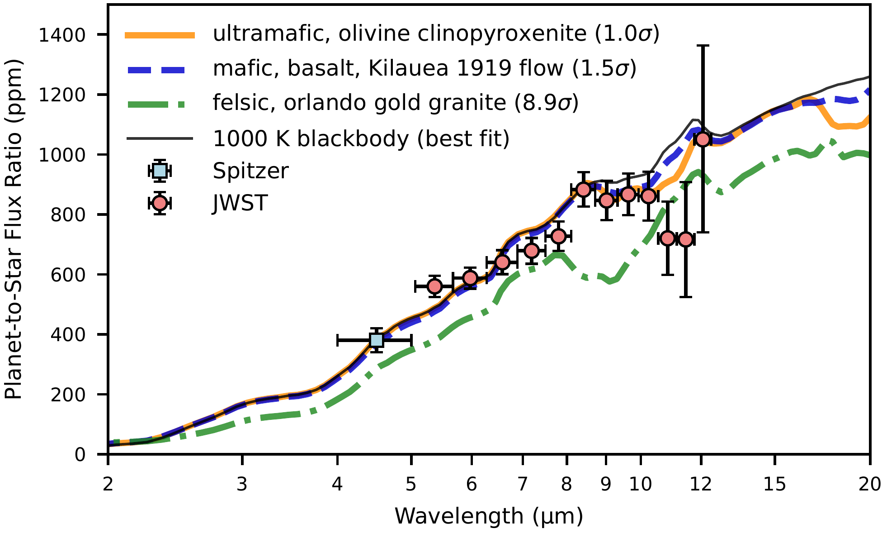
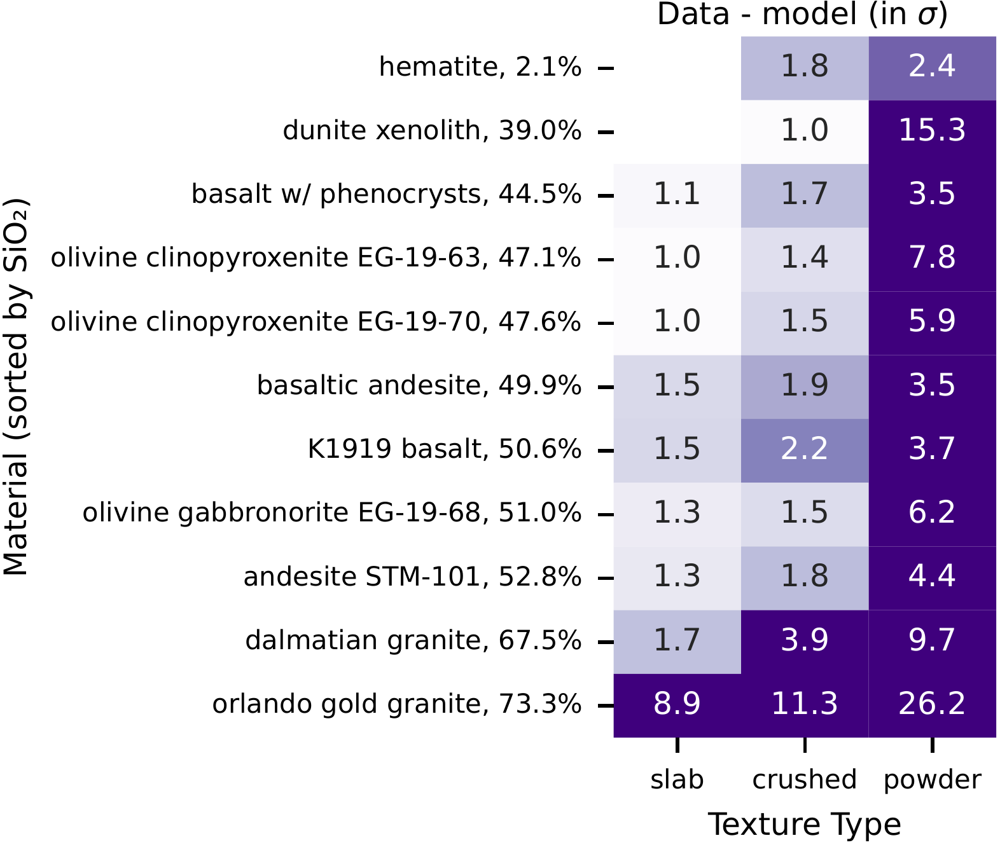

$\newcommand{\ensuremath}{}$
$\newcommand{\xspace}{}$
$\newcommand{\object}[1]{\texttt{#1}}$
$\newcommand{\farcs}{{.}''}$
$\newcommand{\farcm}{{.}'}$
$\newcommand{\arcsec}{''}$
$\newcommand{\arcmin}{'}$
$\newcommand{\ion}[2]{#1#2}$
$\newcommand{\textsc}[1]{\textrm{#1}}$
$\newcommand{\hl}[1]{\textrm{#1}}$
$\newcommand{\footnote}[1]{}$
$\newcommand{\arraystretch}{1.25}$
$\newcommand{\arraystretch}{1.25}$
$\newcommand{\arraystretch}{1.25}$
$\newcommand{\arraystretch}{1.4}$
$\newcommand{\arraystretch}{1.4}$
$\newcommand{\arraystretch}{1.4}$
$\newcommand{\arraystretch}{1.25}$
$\newcommand{\arraystretch}{1.25}$
$\newcommand{\arraystretch}{1.25}$
$\newcommand{\arraystretch}{1.25}$
$\newcommand{\arraystretch}{1.4}$
$\newcommand{\arraystretch}{1.4}$
$\newcommand{\arraystretch}{1.4}$
$\newcommand{\arraystretch}{1.25}$

# The dark and featureless surface of rocky exoplanet LHS 3844 b from JWST mid-infrared spectroscopy

<mark>Appeared on: 2026-05-04</mark> -  _Accepted for publication in Nature Astronomy on April 8, 2026. 49 pages, 18 figures, 7 tables. The arXiv version corresponds to the original submitted manuscript and will be updated with a post-acceptance version at a later time_

S. Zieba, et al. -- incl., <mark>L. Kreidberg</mark>

**Abstract:**            JWST has opened a new era in the study of rocky exoplanets, enabling direct characterization of their surfaces with mid-infrared spectroscopy. Different types of rock have distinct spectral features that are diagnostic of the chemical composition and other physical properties like surface texture. Measurements of these features can provide valuable clues about a planet's geologic history and interior processes. Here we report a JWST 5-12 micron thermal emission spectrum for the rocky exoplanet LHS 3844 b. It is best matched by a dark, low-silica surface, such as basalt or other olivine-rich materials. The spectrum rules out fresh powder surfaces; however, space weathering can darken the powders and make them more consistent with the data. The data also disfavor trace concentrations of $CO_2$ or $SO_2$ gas (with 5-sigma and 3-sigma upper limits of 100 mbar and 10 microbar, respectively). Taken together, these results are well fit by an old, space-weathered surface with no evidence of accumulated volcanic gases.         

**Figure 2. -** **The measured planet-to-star flux ratio as a function of wavelength compared to a range of solid slab surfaces.** The observations were taken using Spitzer (blue square-shaped marker) and JWST (red circle-shaped markers). The error bars on the data are 1$\sigma$. A selection of models, taken from Ref. Paragas2025, represent solid slab surfaces with varying compositions. Solid orange line: an ultramafic, olivine clinopyroxenite EG-19-63 sample ($\sim$ 47 wt\% $SiO_2$) recovered from Emigrant Gap, California, USA, which shows good agreement with the observations. Dashed blue line: a mafic, basaltic sample from the 1919 Kilauea eruption in Hawaii, USA ($\sim51$ wt\% $SiO_2$) that is also consistent with the data. Dashed, dotted green line: a felsic sample representing the highest $SiO_2$ content model ($\sim73$ wt\% $SiO_2$) published in Ref. Paragas2025. The legend lists the rejection significances of these models. With a solid black line, we also show a 1000 K black body curve for the planet, which is the best fit value using the combined Spitzer and JWST dataset. (*fig:surface*)

**Figure 20. -** **The measured planet-to-star flux ratio as a function of wavelength compared to a range of solid slab surfaces.** The observations were taken using Spitzer (blue square-shaped marker) and JWST (red circle-shaped markers). The error bars on the data are 1$\sigma$. A selection of models, taken from Ref. Paragas2025, represent solid slab surfaces with varying compositions. Solid orange line: an ultramafic, olivine clinopyroxenite EG-19-63 sample ($\sim$ 47 wt\% $SiO_2$) recovered from Emigrant Gap, California, USA, which shows good agreement with the observations. Dashed blue line: a mafic, basaltic sample from the 1919 Kilauea eruption in Hawaii, USA ($\sim51$ wt\% $SiO_2$) that is also consistent with the data. Dashed, dotted green line: a felsic sample representing the highest $SiO_2$ content model ($\sim73$ wt\% $SiO_2$) published in Ref. Paragas2025. The legend lists the rejection significances of these models. With a solid black line, we also show a 1000 K black body curve for the planet, which is the best fit value using the combined Spitzer and JWST dataset. (*fig:surface*)

**Figure 3. -** **Comparison between the measured emission spectrum and a wide range of surface compositions and textures**. The models in this figure were published in Ref. Paragas2025. The materials are ordered from top to bottom by increasing $SiO_2$ content. Each column represents a different surface texture: solid slabs (left), coarsely crushed (middle), and powdered (right). The number in each grid cell indicates the difference between the measured spectrum (Spitzer and JWST) and the model prediction for a given material and texture, expressed in terms of $\sigma$. Therefore, a higher number corresponds to a greater disagreement between the model and observation. There were no slab samples available for hematite and dunite xenolith in Ref. Paragas2025. (*fig:textures_vs_sio2*)

