

$\newcommand{\ensuremath}{}$
$\newcommand{\xspace}{}$
$\newcommand{\object}[1]{\texttt{#1}}$
$\newcommand{\farcs}{{.}''}$
$\newcommand{\farcm}{{.}'}$
$\newcommand{\arcsec}{''}$
$\newcommand{\arcmin}{'}$
$\newcommand{\ion}[2]{#1#2}$
$\newcommand{\textsc}[1]{\textrm{#1}}$
$\newcommand{\hl}[1]{\textrm{#1}}$
$\newcommand{\footnote}[1]{}$
$\newcommand{\hi}{H~\textsc{i}\xspace}$
$\newcommand{\hei}{He~\textsc{i}\xspace}$
$\newcommand{\ha}{\ensuremath{\mathrm{H}\alpha}\xspace}$
$\newcommand{\hb}{\ensuremath{\mathrm{H}\beta}\xspace}$
$\newcommand{\mdot}{\ensuremath{\dot{M}_{\mathrm{acc}}}\xspace}$
$\newcommand{\lline}{\ensuremath{L_{\mathrm{line}}}\xspace}$
$\newcommand{\lacc}{\ensuremath{L_{\mathrm{acc}}}\xspace}$
$\newcommand{\msun}{\ensuremath{M_{\odot}}\xspace}$
$\newcommand{\mj}{\ensuremath{M_{\mathrm{Jup}}}\xspace}$
$\newcommand{\me}{\ensuremath{M_{\oplus}}\xspace}$
$\newcommand{\mjyr}{\ensuremath{\mj~\mathrm{yr}^{-1}}\xspace}$
$\newcommand{\msyr}{\ensuremath{\msun~\mathrm{yr}^{-1}}\xspace}$
$\newcommand{\kms}{\ensuremath{\mathrm{km s^{-1}}}\xspace}$
$\newcommand{\lsun}{\ensuremath{L_{\odot}\xspace}}$
$\newcommand{\cgs}{erg~s^{-1}~cm^{-2}\xspace}$
$\newcommand{\gv}{\textcolor{red}}$
$\newcommand{\arraystretch}{1.2}$
$\newcommand{\arraystretch}{1.2}$
$\newcommand{\arraystretch}{1.2}$
$\newcommand{\arraystretch}{1.2}$
$\newcommand{\lmbdrestvac}{\ensuremath{\lambda_{\textrm{rest}, \textrm{vac}}}\xspace}$
$\newcommand{\lmbdobsvac}{\ensuremath{\lambda_{\textrm{obs}, \textrm{vac}}}\xspace}$

# ExoplaNeT accRetion mOnitoring sPectroscopic surveY\\(ENTROPY): III. Optical He i line profiles of the accreting super Jupiter Delorme 1 (AB)b

<mark>Appeared on: 2026-05-04</mark> -  _19 pages, 14 figures, 6 tables; To be published in A&A (accepted on 9 March 2026)_

G. Viswanath, et al. -- incl., <mark>G. Chauvin</mark>

**Abstract:** Observations of helium emission lines from classical T Tauri stars at high resolution ( $R_{\lambda}>10,000$ ) offer great potential, showing distinct profile characteristics that help probe regions within the accretion geometry untapped by hydrogen lines. Parallel studies in the planetary-mass regime have not been explored. We investigate helium line emission from the nearby (47 pc), wide orbit ( $\sim84$ au), $\sim13$  $\mj$ , accreting circumbinary companion Delorme 1 (AB)b and analyse the resolved profile characteristics to infer clues to line origin. We obtained high signal-to-noise spectra of the target over 33 exposures with VLT/UVES over near-ultraviolet to optical wavelengths at high resolution ( $R_{\lambda}\sim50,000$ ). We studied the helium line profiles in the spectra and compared them to helium emission recorded from both accreting and non-accreting young stellar objects. We detected seven neutral helium ( $\hei$ ) lines $\lambda\lambda3890,4027,4473,4923,5017,5877,6680$ at high confidence ( $>5\sigma$ ), with notable flux variation between epochs. The line profiles of $\hei$ $\lambda\lambda5877,4923,4473,4027$ show clear asymmetry, with a narrow component at $\sim0$  $\kms$ and a broad component redshifted by $\sim15$  $\kms$ . The accretion luminosity ( $1.3^{+1.6}_{-0.7}\times10^{-5}$  $\lsun$ ) and mass accretion rate ( $0.7^{+0.9}_{-0.4}\times10^{-8}$  $\mjyr$ ) obtained from median $\hei$ line luminosities using empirical scaling relations from stars are comparable but slightly higher than from the target's ultraviolet excess emission. The protoplanet Delorme 1 (AB)b exhibits asymmetric $\hei$ lines similar to classical T Tauri stars, but with much smaller widths for the narrow and broad components. The triplet--singlet line ratio, a strong correlation with ultraviolet excess and the near-zero, redshifted velocities obtained for the narrow component suggest that it originates within the post-shock region, close to the planet surface. The persistent redshift of the broad component, its line width, and velocity correlation with the narrow component imply an origin within the shock structure, closer to the shock front. Emission seems to be dominated by accretion based on the obtained accretion luminosities, but a contribution from chromospheric activity may be present.

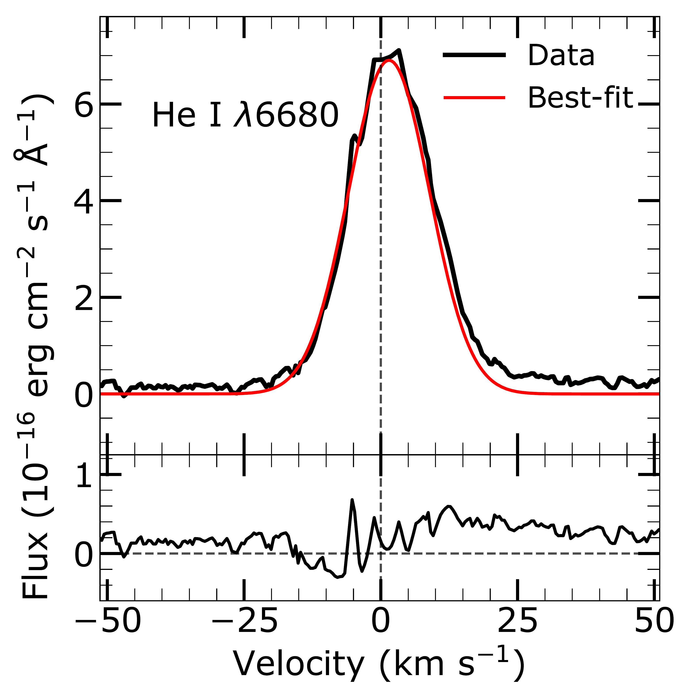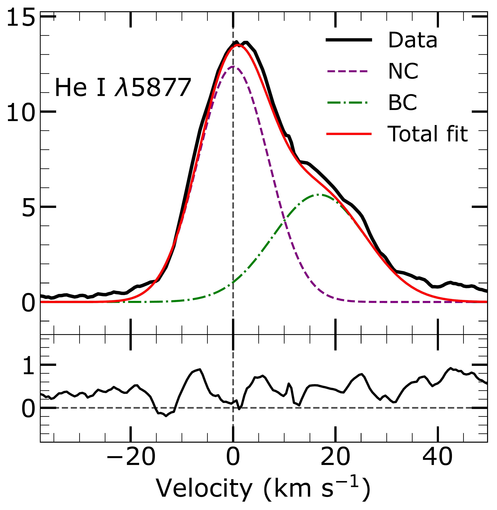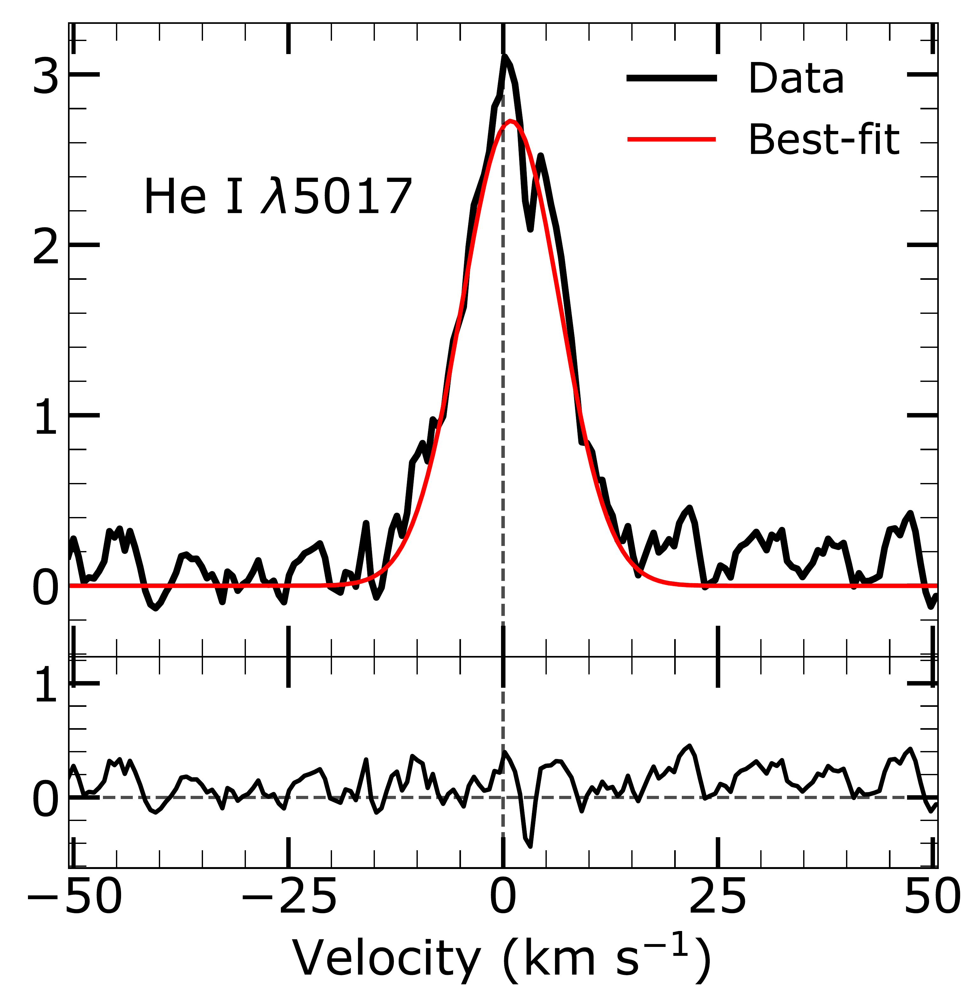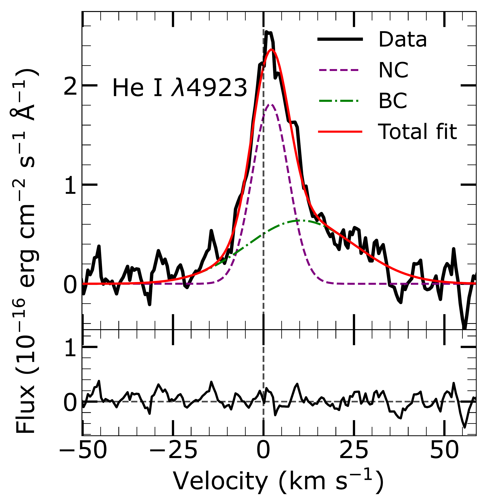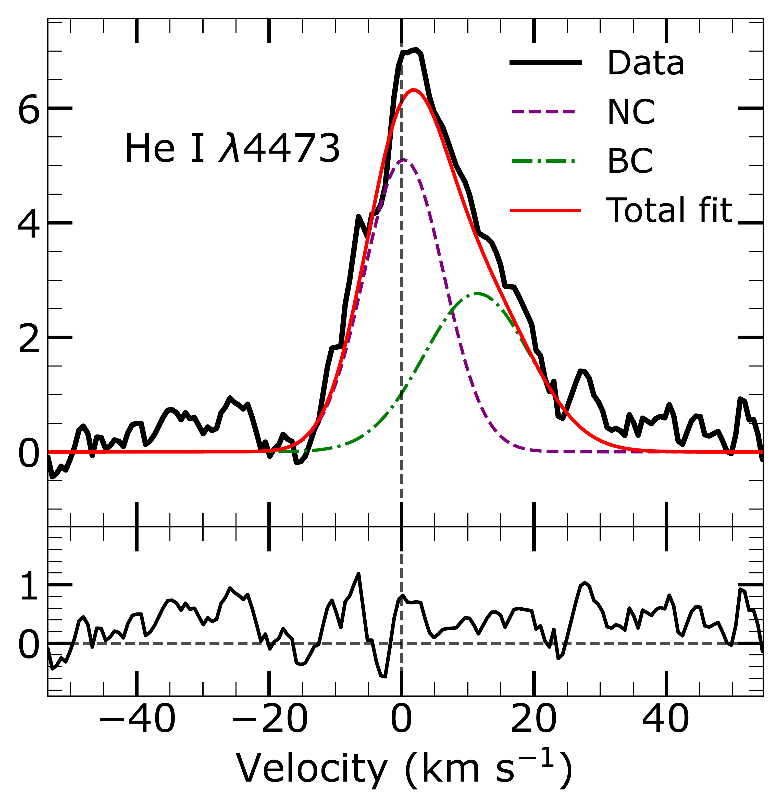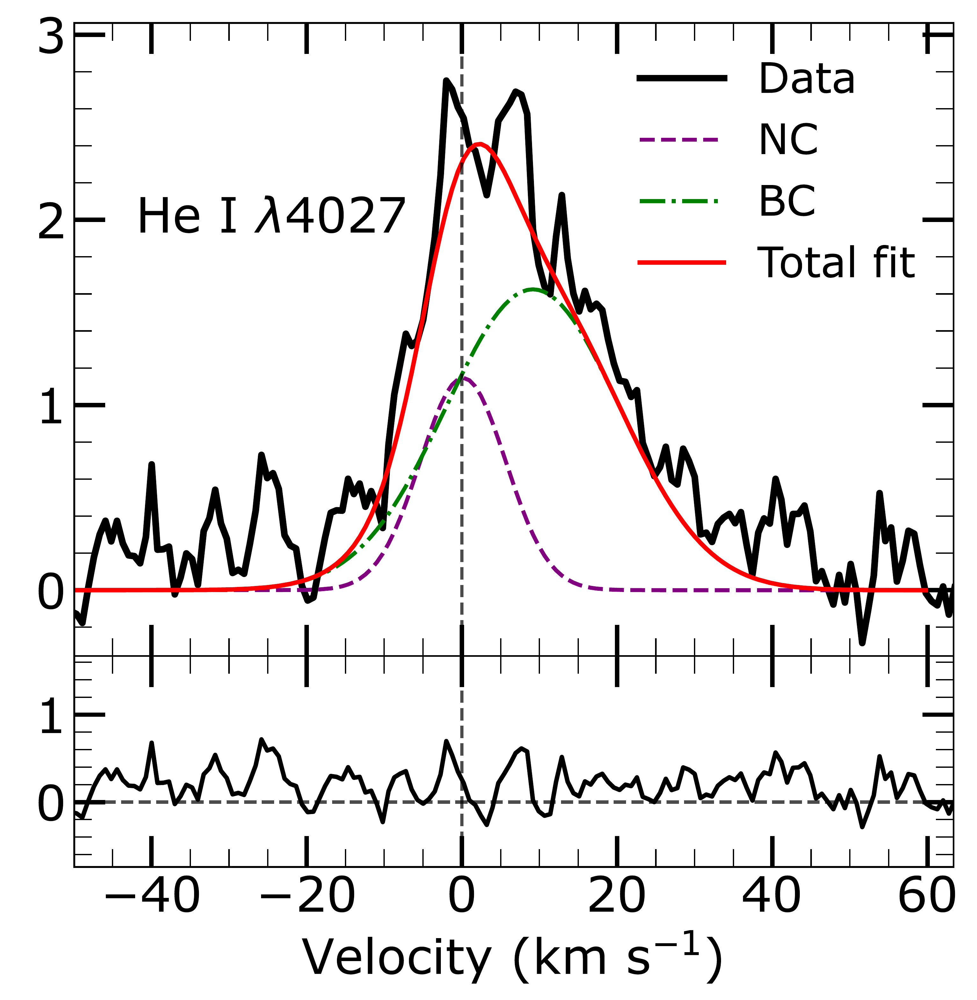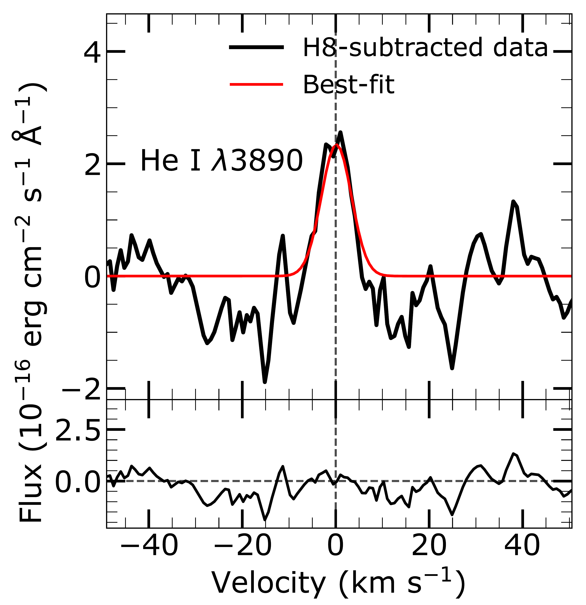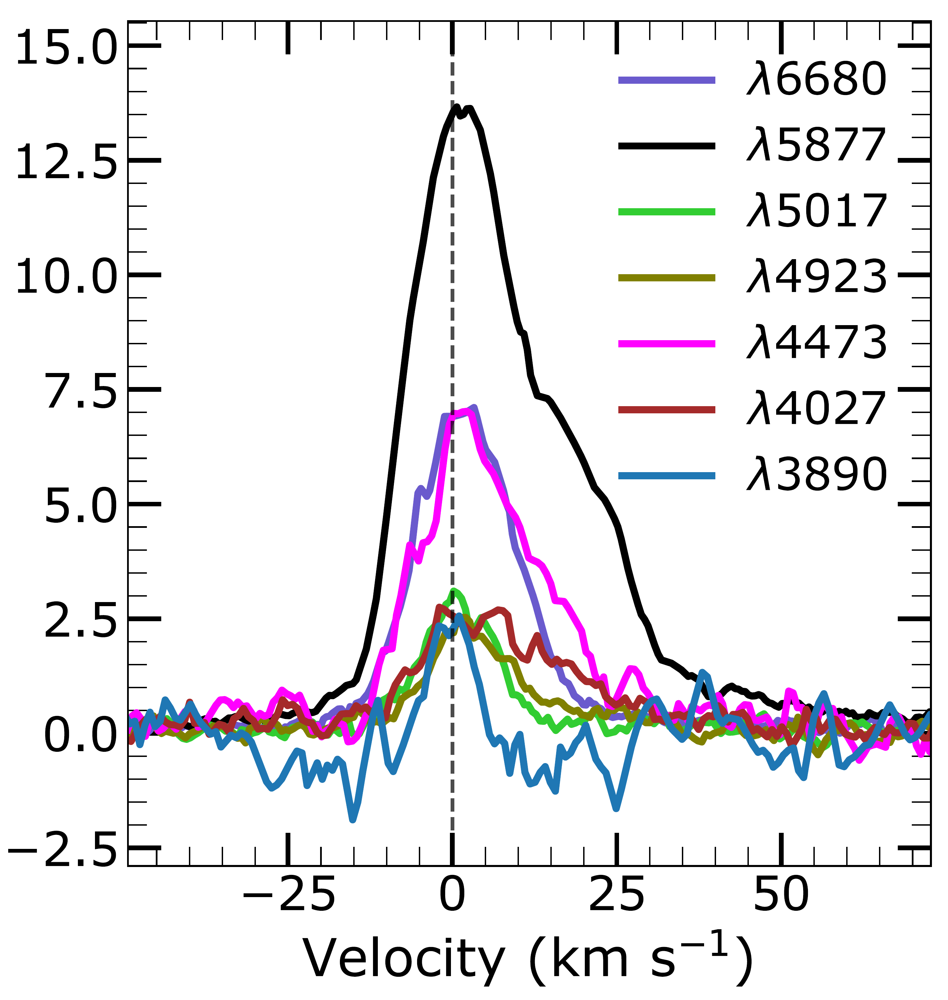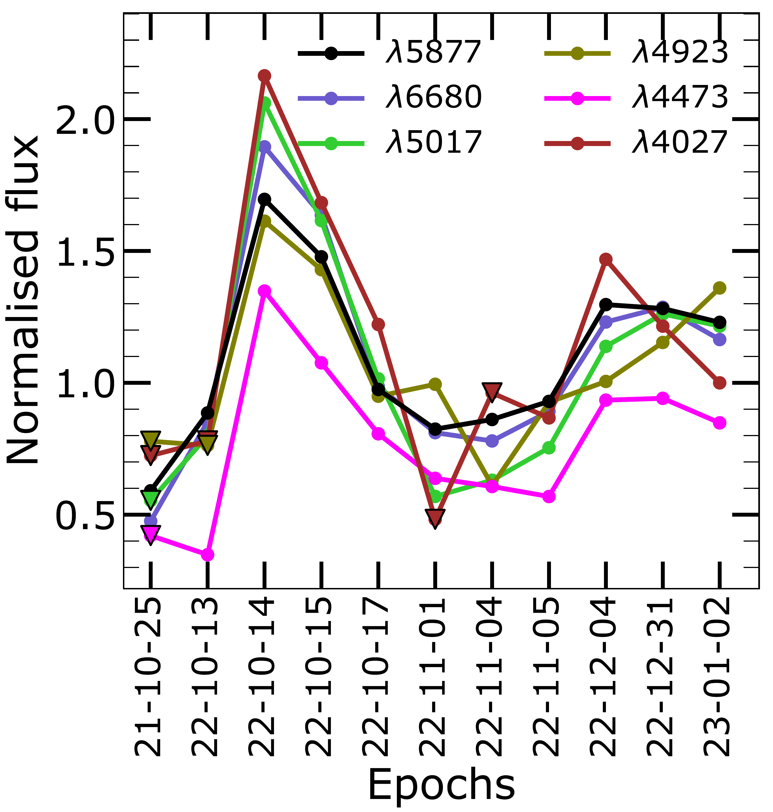

**Figure 5. -** Resolved profiles of $\hei$ emission lines (black) from Delorme 1 (AB)b detected from its grand median spectrum in this work. The red curve shows the least-$\chi^2$ fit to the line profile, composed of either pure NC or with the addition of a BC. In case of the latter, the red curve represents the total profile fit. Residual from the fit is shown in the bottom sub-panel of each line plot. The line profile for $\lambda$3890 (bottom left) is obtained after the Balmer line H8 was modelled and subtracted from the data (see Appendix \ref{app-d}). The bottom middle panel shows all the $\hei$ lines plotted against respective velocity scales, demonstrating relative strength and asymmetry. The bottom right panel illustrates the variability of their integrated line flux in time, normalised with respect to the corresponding grand median values. Downward triangles represent tentative detections with confidence between $1-3\sigma$. The y-axis for all panels except the bottom right shows the flux in units of $10^{-16}$ erg cm$^{-2}$ s$^{-1}$ Å$^{-1}$. (*fig1*)

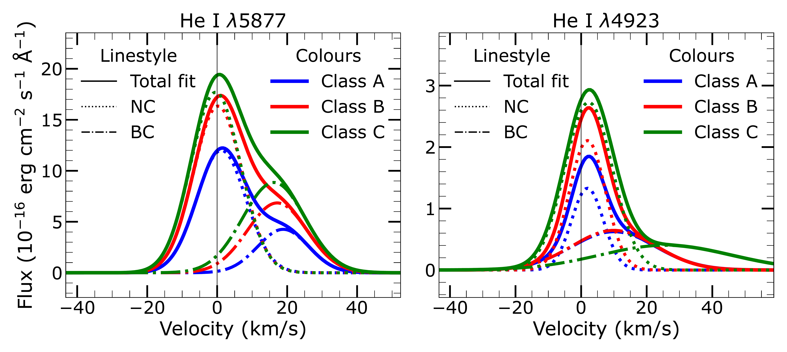

**Figure 11. -** Decomposition into NC and BC for the median profiles of the $\hei$ lines $\lambda5877$ and $\lambda4923$ from class A, class B, and class C epochs of Delorme 1 (AB)b. The line-styles represent the NC (dotted), BC (dashed) and total fits (solid) to the profiles, while the colours represent the median class A (blue), class B (red) and class C (green) epochs. (*figE*)

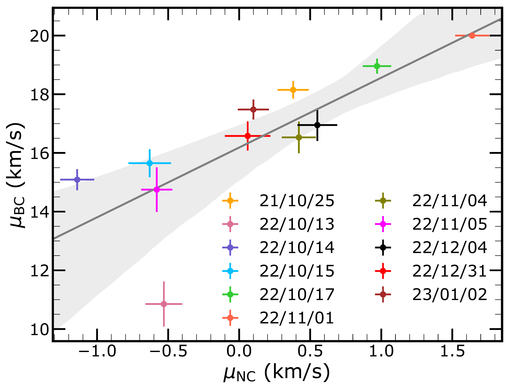

**Figure 1. -** Variation in the centroid velocity, $\mu$, of NC and BC in $\hei$ D3 through the epochs. The grey line denotes the linear fit between NC and BC velocities, which are strongly correlated. (*vel-variation*)

