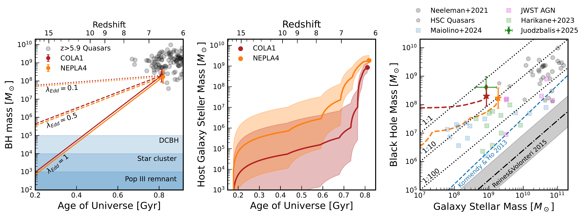
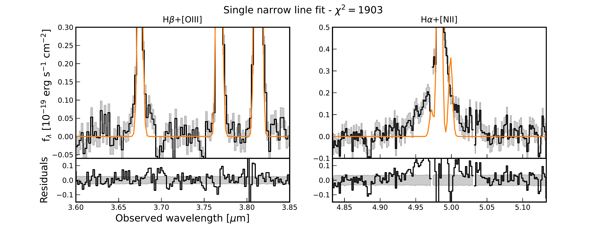
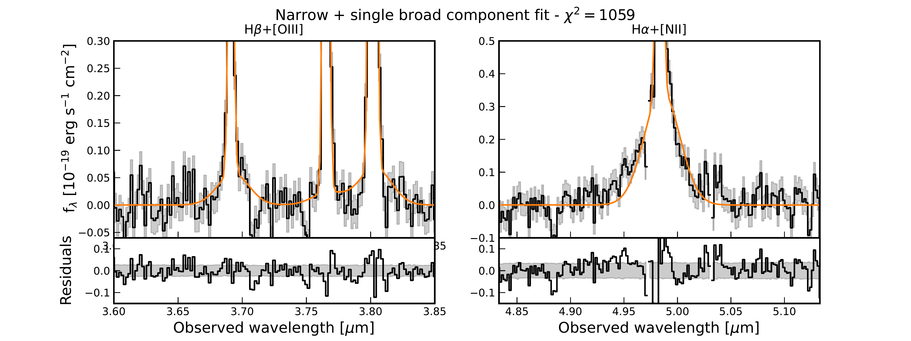
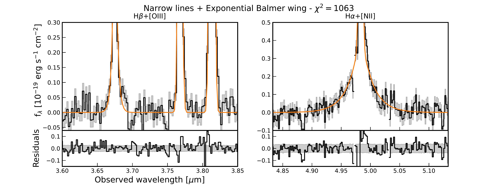
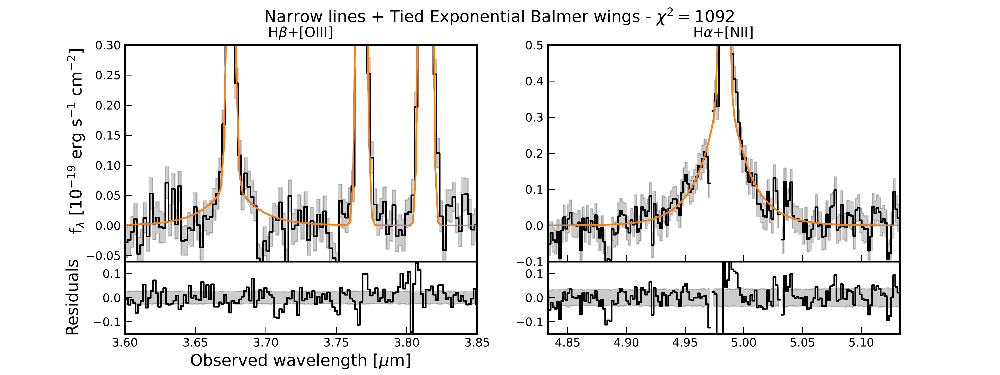
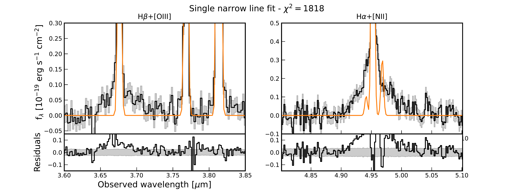
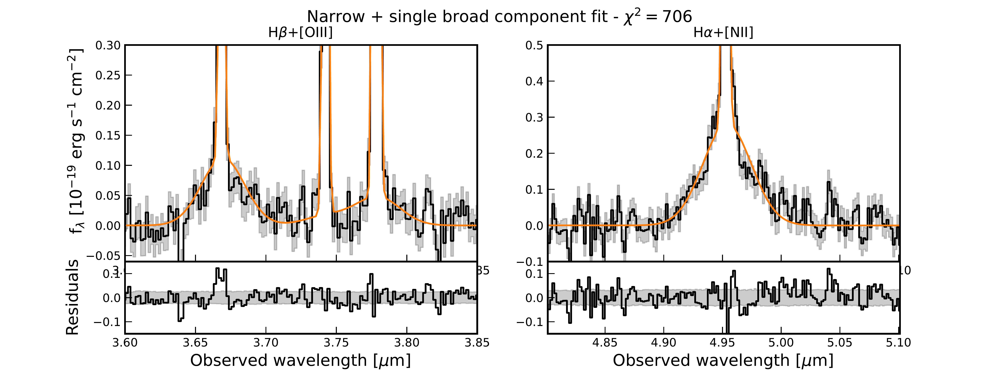
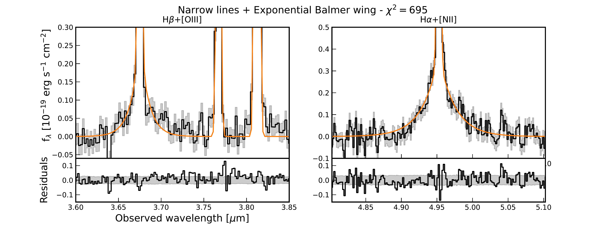
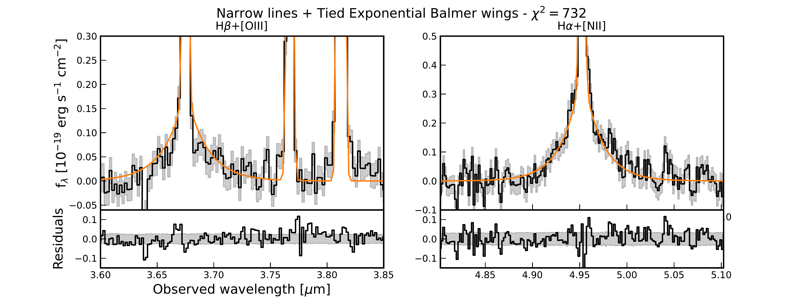

$\newcommand{\ensuremath}{}$
$\newcommand{\xspace}{}$
$\newcommand{\object}[1]{\texttt{#1}}$
$\newcommand{\farcs}{{.}''}$
$\newcommand{\farcm}{{.}'}$
$\newcommand{\arcsec}{''}$
$\newcommand{\arcmin}{'}$
$\newcommand{\ion}[2]{#1#2}$
$\newcommand{\textsc}[1]{\textrm{#1}}$
$\newcommand{\hl}[1]{\textrm{#1}}$
$\newcommand{\footnote}[1]{}$
$\newcommand\aap{A\&A}$
$\newcommand\aapr{A\&ARv}$
$\newcommand\aaps{A\&AS}$
$\newcommand\araa{ARA\&A}$
$\newcommand\mnras{MNRAS}$
$\newcommand\nat{Nature}$
$\newcommand\pasa{Publ. Astron. Soc. Australia}$
$\newcommand\pasp{PASP}$
$\newcommand\pasj{PASJ}$
$\newcommand\apj{ApJ}$
$\newcommand\aj{AJ}$
$\newcommand\jcap{JCAP}$
$\newcommand\apjl{ApJL}$
$\newcommand\apjs{ApJS}$
$\newcommand\ion[2]{#1\;{$
$\ifx\@currsize\normalsize\small \else$
$\ifx\@currsize\small\footnotesize \else$
$\ifx\@currsize\footnotesize\scriptsize \else$
$\ifx\@currsize\scriptsize\tiny \else$
$\ifx\@currsize\large\normalsize \else$
$\ifx\@currsize\Large\large$
$\fi\fi\fi\fi\fi\fi}\rmfamily{#2}\relax}$

# Life After the Quasar:Overmassive Black Holes and Remnant Ionised Bubbles in and Around Two z$\sim$6.6 Galaxies

<mark>Appeared on: 2026-05-04</mark> -  _Submitted. Comments welcome_

R. A. Meyer, et al. -- incl., <mark>F. Davies</mark>, <mark>F. Walter</mark>

**Abstract:** Supermassive black holes (SMBH, $M_{\rm{BH}} > 10^8 M_\odot$ ) powering luminous quasars already exist one billion years after the Big Bang, yet their connection to their star-forming host galaxies, their relation to the general galaxy population and their contribution to Reionisation remains deeply enigmatic \cite{Fan2023,Volonteri2021} . JWST is finding numerous Active Galactic Nuclei (AGN) in high-redshift galaxies with black hole masses that appear to be over-massive compared to their host's stellar mass \cite{Harikane2023, Maiolino2024_AGNsample, Juodzbalis2026} , but rarely as massive as those found in luminous quasars. Here we report JWST/NIRSpec observations revealing overmassive SMBH in two ultra-luminous Lyman- $\alpha$ emitters at $z\sim6.6$ that exhibit rare double-peaked Lyman-alpha profiles \cite{Songaila2018, Matthee2018} . The broad Balmer lines indicate black hole masses $M_{\rm{BH}}\simeq 2\times10^8 M_\odot$ , matching that found in faint $z\sim 6-7$ quasars, and very high BH-to-stellar-mass ratio ( $\sim 0.1-0.2$ ) that exceed the local relation by a factor $\sim$ 400-800. Stellar population modelling favours young ages ( $<50$ Myr), inconsistent with the sustained average Eddington-rate accretion required to reach the observed BH masses by $z=6.6$ . The double-peak Lyman- $\alpha$ profiles require a large ionised bubble and high photoionisation rate that is consistent with the ionising output of quasars powered by black holes of similar mass, thus constraining the cessation of the last quasar episode to $<1$ Myr. We interpret both systems as post-quasar galaxies in which AGN feedback has delayed stellar mass assembly, and propose that episodic quasar activity partially explains the unexpected prevalence of large ionised bubbles deep into the Epoch of Reionisation.

**Figure 7. -** **Left:** Black hole mass growth history in COLA1/NEPLA assuming various Eddington ratios. The BH masses are derived using standard single-epoch virial estimators of the H$\alpha$ line, and include a fiducial systematic error of $0.358$ dex (see Methods). High-redshift quasars are indicated with black circles. **Middle:** Stellar mass growth history inferred from the best-fit \texttt{BAGPIPES} star-formation history. **Right:** Black hole to stellar mass ratio for NEPLA4 and COLA1, JWST AGN (coloured points \cite{Harikane2023,Maiolino2024_AGNsample,Juodzbalis2026}) and high-redshift quasars (black points, \cite{Izumi2019,Pensabene2020,Neeleman2021}). The inferred $M_{\rm{BH}}$-to-$M_*$ trajectory assuming an Eddington ratio of $1$ is shown with dashed lines.  (*fig:bh_stellar_growth*)

**Figure 2. -** Rejected best-fit models for the Balmer complexes in COLA1  using a variety of narrow lines, single broad component and exponential wing for the Balmer components (with and tied and FWHM). All models perform worse than our fiducial model with a narrow component, outflowing component and an additional broad Balmer component. (*fig:COLA1_fits*)

**Figure 3. -** Rejected best-fit models for the Balmer complexes in COLA1  using a variety of narrow lines, single broad component and exponential wing for the Balmer components (with and tied and FWHM). All models perform worse than our fiducial model with a narrow component, outflowing component and an additional broad Balmer component. (*fig:NEPLA4_fits*)

