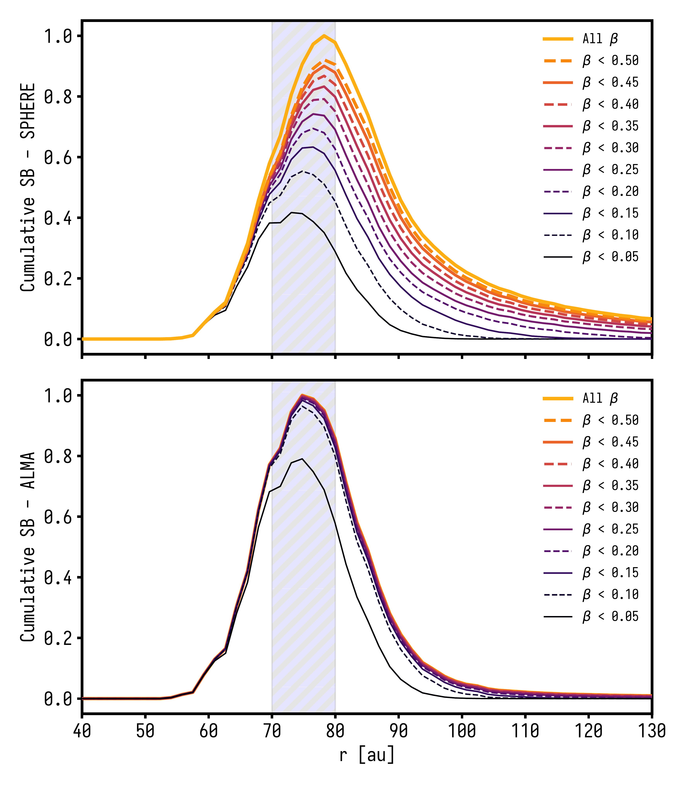
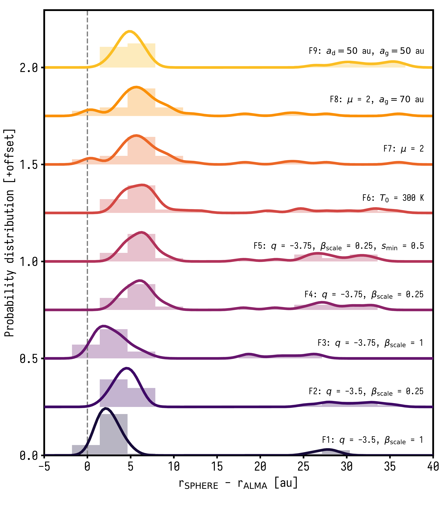
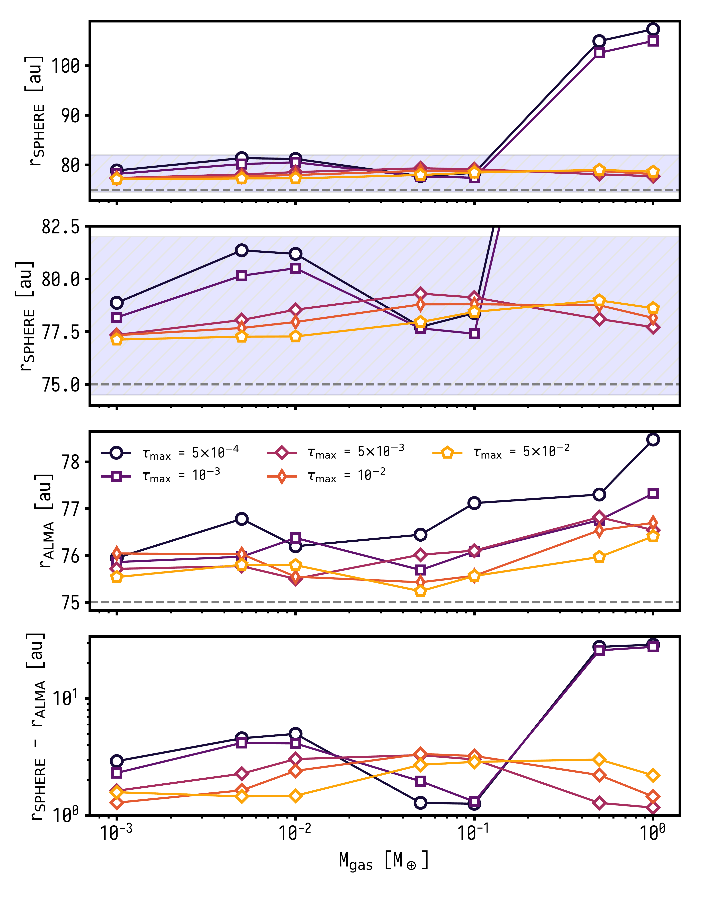

$\newcommand{\ensuremath}{}$
$\newcommand{\xspace}{}$
$\newcommand{\object}[1]{\texttt{#1}}$
$\newcommand{\farcs}{{.}''}$
$\newcommand{\farcm}{{.}'}$
$\newcommand{\arcsec}{''}$
$\newcommand{\arcmin}{'}$
$\newcommand{\ion}[2]{#1#2}$
$\newcommand{\textsc}[1]{\textrm{#1}}$
$\newcommand{\hl}[1]{\textrm{#1}}$
$\newcommand{\footnote}[1]{}$

# The ALMA survey to Resolve exoKuiper belt Substructures (ARKS): XI: Gas-dust interactions and radial offsets between micron and millimetre-sized grains

<mark>Appeared on: 2026-05-06</mark> -  _14 pages, accepted in A&A_

<mark>J. Olofsson</mark>, et al. -- incl., <mark>T. Henning</mark>

**Abstract:** The dust observed in debris disks is the result of a collisional cascade initiated from $\sim$ km-sized parent bodies. Using near-infrared to sub-millimeter observations, we can probe particle sizes spanning $2-3$ orders of magnitude, and with sufficient angular resolution we can follow the dynamics of these dust particles. Observations taken as part of the ALMA survey to Resolve exoKuiper belt Substructures (ARKS) program allowed for a detailed comparison with near-infrared scattered light observations, at unprecedented resolution. The comparison between the two wavelength regimes reveals that for most gas-bearing debris disks, the distribution of small dust grains peaks outward of the distribution of large dust grains. In this paper we investigate whether gas-dust interactions can explain such radial offsets. We perform numerical simulations accounting for the effects of radiation pressure, gas drag, and collisions, and compute surface brightness profiles at several wavelengths to assess which parameters drive these radial offsets. We explore several families of models, varying the gas mass, disk optical depth, dust size distribution, and radiation pressure strength. We find that while larger gas masses lead to more efficient outward radial drift, the resulting radial offset strongly depends on the optical depth of the disk, as the drift efficiency directly competes with the particles' collisional lifetime. We also find that increasing the relative number of $\mu$ m-sized dust grains usually yields a larger radial offset between scattered light and millimeter observations. Finally, we show that mid-infrared observations can complement near-infrared and sub-millimeter images, and we discuss the formation of secondary rings at near-infrared wavelengths. The angular resolution achieved by the ARKS program has opened a new avenue to study the dynamics of dust particles in debris disks, revealing unexpected differences between the appearance of the disks scattered light and thermal emission. We showed that gas-dust interactions can explain the observed radial offsets and provide pointers as to which parameters have the most significant impact.

**Figure 3. -** Cumulative contributions to the surface brightness radial profiles as a function of $\beta$ for SPHERE (_top_) and ALMA (_bottom_), for the fiducial model, with $M_\mathrm{gas} = 10^{-2}$$M_\oplus$. The hatched area corresponds to $a_\mathrm{d} \pm \sigma_\mathrm{d}$.
   (*fig:cumulative*)

**Figure 5. -** Kernel density estimation and histograms of the offsets for all families of models (F1 to F9). The vertical dashed line is centered at $0$. The fact that some of the curves display negative offsets is due to the fixed kernel's width of $1$ au.
   (*fig:kde_size*)

**Figure 4. -** Peak positions for the radial profiles for SPHERE (first and second from the _top_) and ALMA (third from the _top_) and difference between the two (_bottom_, in log-scale), as a function of the total gas mass and for different values of the peak optical depth (legend in the middle panel), for family F1. The second panel from the top shows a zoomed in version of the topmost panel. For the top three panels the horizontal dashed lines show $a_\mathrm{d} = 75$ au.
   (*fig:offset_mgas_tau*)

