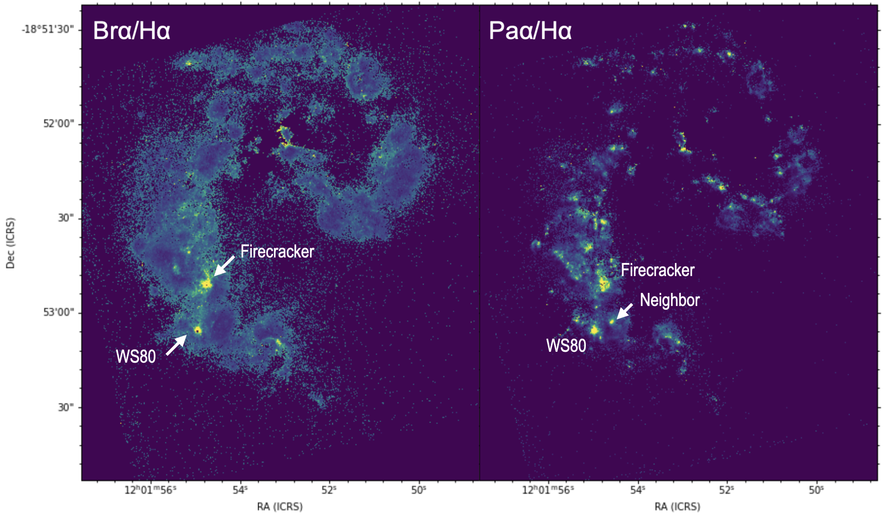
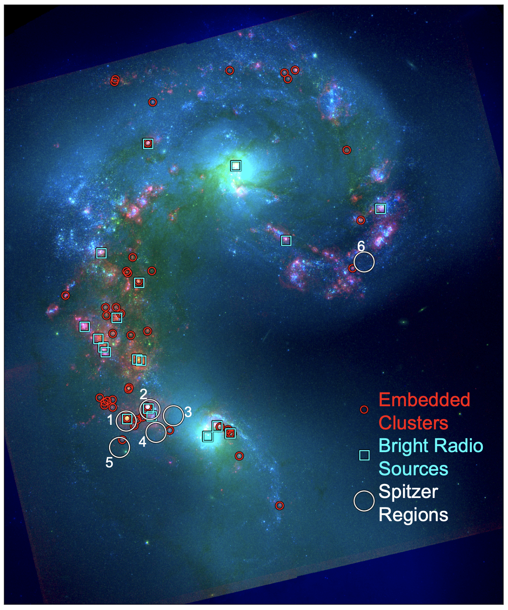
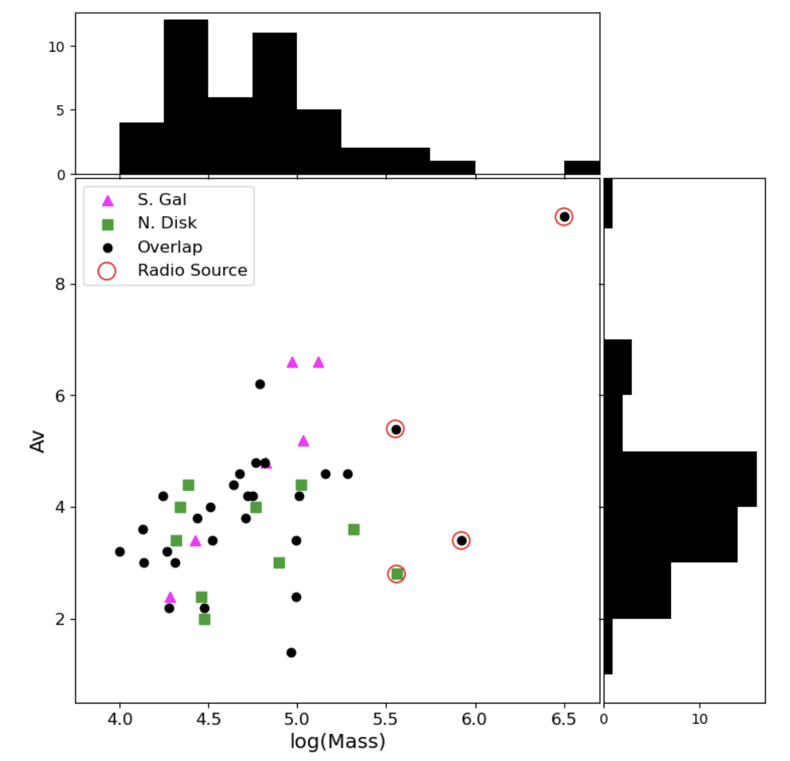

$\newcommand{\ensuremath}{}$
$\newcommand{\xspace}{}$
$\newcommand{\object}[1]{\texttt{#1}}$
$\newcommand{\farcs}{{.}''}$
$\newcommand{\farcm}{{.}'}$
$\newcommand{\arcsec}{''}$
$\newcommand{\arcmin}{'}$
$\newcommand{\ion}[2]{#1#2}$
$\newcommand{\textsc}[1]{\textrm{#1}}$
$\newcommand{\hl}[1]{\textrm{#1}}$
$\newcommand{\footnote}[1]{}$
$\newcommand\aastex{AAS\TeX}$
$\newcommand\latex{La\TeX}$
$\newcommand{\lea}{\mathrel{<\kern-1.0em\lower0.9ex\hbox{\sim}}}$
$\newcommand{\gea}{\mathrel{>\kern-1.0em\lower0.9ex\hbox{\sim}}}$
$\newcommand\pg{#1}$
$\newcommand\rc{#1}$

# Nowhere Left to Hide: Uncovering All of the Massive Young Embedded Star Clusters in the Antennae with JWST$\footnote{This work is based on observations made with the NASA/ESA/CSA James Webb Space Telescope. The data were obtained from the Mikulski Archive for Space Telescopes at the Space Telescope Science Institute, which is operated by the Association of Universities for Research in Astronomy, Inc., under NASA contract NAS 5-03127 for JWST. These observations are associated with program \#2581.}$

<mark>Appeared on: 2026-05-06</mark> -  _Accepted for publication in ApJ_

R. Chandar, et al. -- incl., <mark>E. Schinnerer</mark>, <mark>F. Walter</mark>

**Abstract:** The Antennae galaxies merger produces the brightest infrared emission of any galaxy within $\approx20$ Mpc, mostly from intense star formation taking place in supergiant molecular cloud complexes in the overlap region.Here, we present new, high-resolution NIRCam and MIRI images of the Antennae galaxies taken with the F150W, F187N, F335M, F360M, F410M, and F770W filters on JWST to search for the predicted but as-yet-undiscovered population of deeply embedded, optically obscured star clusters.We identify a population of 45 sources,40 previously unknown,with high Br $\alpha/\mbox{H}\alpha$ and Pa $\alpha/\mbox{H}\alpha$ flux ratios which are likely very young clusters still embedded or just emerging from their natal cocoons, and estimate their age, extinction ($A_V$ ), and mass.We find that all are extremely young ( $\lea 2.5$ Myr), have $A_V$ between 2 and 10 mag, and masses between $\approx 10^4$ and several $\times10^6 M_{\odot}$ .We believe we have now uncovered all clusters with $M\gea3\times10^4 M_{\odot}$ and $A_V \gea2$ mag in the Antennae.While our sample represents a small fraction( $\approx15$ \% ) of clusters younger than 3 Myr by number, it dominates the ionizing photon luminosity across the galaxy pair ( $\approx60$ \% ).We find elevated $H_2/$ PAH ratios of the ISM surrounding the most massive pair of embedded clusters,supporting the idea that merger-induced shock-heated gas play an important role in the formation of extremely massive clusters.

**Figure 4. -** Br$\alpha / \mbox{H}\alpha$(left) and Pa$\alpha / \mbox{H}\alpha$ flux ratio maps used to identify embedded clusters from their high extinction.  WS80 is the brightest source in both images, while its neighbor, which is known to have lower extinction is only bright in Pa$\alpha$/H$\alpha$. The Firecracker is bright in both ratio maps but star formation has yet to take place in this region (it may in the near future). (*fig:detection*)

**Figure 6. -** Locations of the embedded clusters identified in this work are identified by the red circles. All 19 `bright' radio sources (6 cm flux $\gea 200$ mJy; see Appendix) are shown as cyan squares, and the six apertures (circles with a $2.55$\arcsec$$ radius) used to extract Spitzer/IRS spectra are shown as the white circles. The background color image is a combination of V-F150W-Pa$\alpha$ filters.   (*fig:radiolocation*)

**Figure 8. -** Best fit mass and extinction $A_V$ for the embedded cluster sample. Clusters in the southern galaxy are plotted in purple, overlap region in black, and northern disk in green. All clusters have estimated ages of 2.5 Myr or younger.  The $A_V$ values range from $\approx2$ mag up to $\approx10$ mag with half the sample (22 of 45) having a best fit $A_V$ of 4 mag or higher. The red circles show that clusters also detected at radio wavelengths are the most massive in our sample (see \S5.4). (*fig:massAv*)

