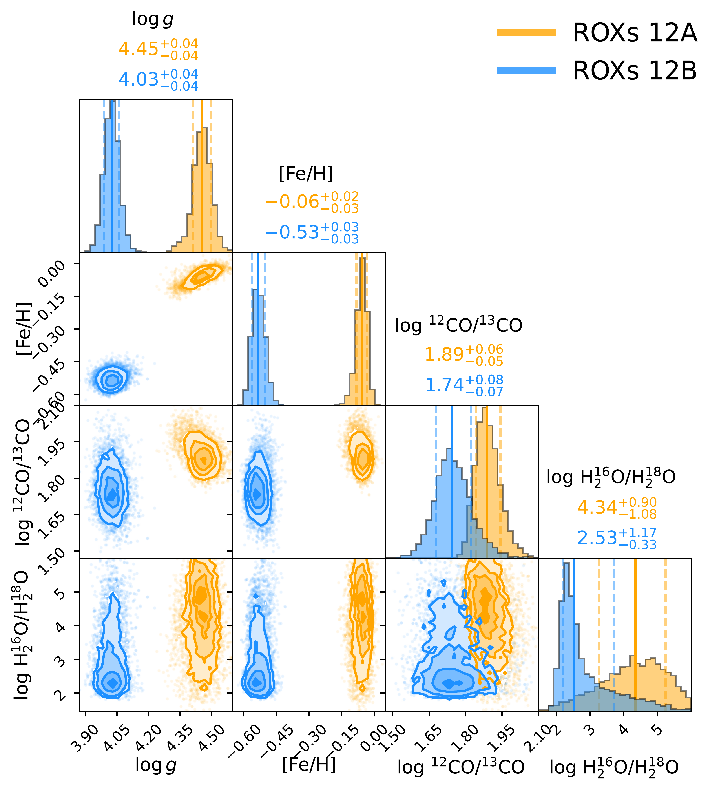
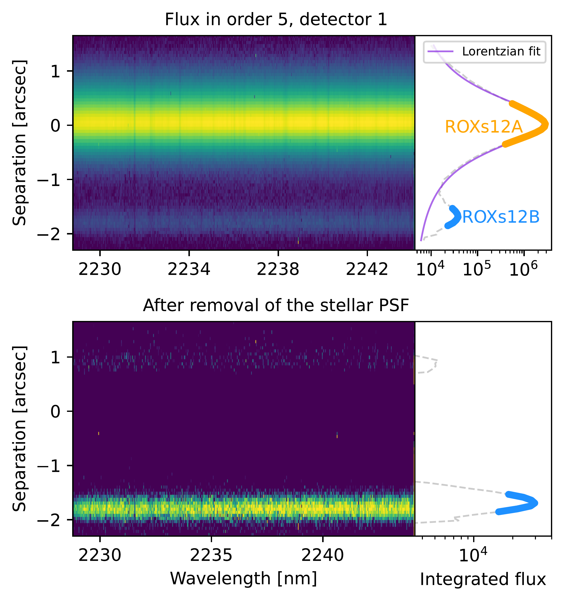

$\newcommand{\ensuremath}{}$
$\newcommand{\xspace}{}$
$\newcommand{\object}[1]{\texttt{#1}}$
$\newcommand{\farcs}{{.}''}$
$\newcommand{\farcm}{{.}'}$
$\newcommand{\arcsec}{''}$
$\newcommand{\arcmin}{'}$
$\newcommand{\ion}[2]{#1#2}$
$\newcommand{\textsc}[1]{\textrm{#1}}$
$\newcommand{\hl}[1]{\textrm{#1}}$
$\newcommand{\footnote}[1]{}$
$\newcommand{\arraystretch}{1.3}$

# The ESO SupJup Survey: X. A carbon isotope contrast in the young ROXs 12 system

<mark>Appeared on: 2026-05-06</mark> -  _Accepted to A&A_

N. Grasser, et al. -- incl., <mark>P. Mollière</mark>

**Abstract:** Emerging research suggests that elemental and isotopic ratios of exoplanet and brown dwarf atmospheres may serve as potential tracers of their formation pathways. The ESO SupJup Survey aims to shed light on this hypothesis, with a focus on the $^{12}$ CO/ $^{13}$ CO ratio, by investigating the atmospheric composition of substellar companions and isolated brown dwarfs. In this work, we aim to characterize the atmospheres and determine the ratios of $^{12}$ CO/ $^{13}$ CO of the Rho Ophiuchus X-ray source (ROXs) 12 system ( $\sim$ 6 Myrs), consisting of an M0 host with an L0 companion, as part of the ESO SupJup survey. This system provides a great opportunity to directly compare the atmospheric compositions of the host star and its companion. Using high-resolution CRIRES+ K band spectra of these objects, we perform atmospheric retrieval analyses to derive their atmospheric properties, including the $^{12}$ CO/ $^{13}$ CO ratio. Our retrieval framework is built on the radiative transfer code \texttt{petitRADTRANS} , with which we generate model spectra based on equilibrium chemistry tables computed with \texttt{FastChem} , coupled with the nested sampling algorithm \texttt{PyMultiNest} . We report the presence of $H_2$ O, $^{12}$ CO, $^{13}$ CO, and HF in both the star and companion, with a tentative detection of $H_2^{18}$ O in ROXs 12B. The $^{12}$ CO/ $^{13}$ CO ratios of the two objects show a measurable, though not strongly significant, difference, namely $77 \substack{+10 \ -7}$ and $55 \substack{+10 \ -7}$ for ROXs 12A and B. Both are consistent with the local present interstellar medium. We measure a C/O ratio of 0.54 $\pm$ 0.01 and obtain a lower limit of $H_2^{16}$ O/$H_2^{18}$ O $\gtrapprox$ 300 for ROXs 12B, while the C/O ratio of the star is not reliably constrained due to the absence of atomic oxygen lines in the K band. The companion also appears to exhibit a more isothermal temperature structure than expected from models. Furthermore, we retrieve moderate veiling in the host star of $r_k$ = $0.17 \substack{+0.02 \ -0.03}$ . Systems such as ROXs 12, in which both star and planet can be chemically and isotopically characterized, are crucial for constraining potential formation mechanisms of massive, wide-orbit super-Jupiters. The differing $^{12}$ CO/ $^{13}$ CO ratios in the ROXs 12 system highlight the need for a broader sample to assess the frequency of isotopic variations and whether they may be linked to formation history.

**Figure 2. -** Posterior distributions of log $g$, [Fe/H], $^{12}$CO/$^{13}$CO, and $H_2^{16}$O/$H_2^{18}$O ratio for ROXs 12A (yellow) and B (blue). (*fig:cornerplot*)

**Figure 11. -** Summary of the retrieval results of the injected test spectrum. We show the Sonora Bobcat model $P$--$T$ profile that was used as an input for generating the spectrum. The red lines in the cornerplot represent the input values. (*fig:summary_inj*)

**Figure 1. -** Calibrated observational data of order 5, detector 1, nodding position A. The x-axis on the left panels shows the wavelength in nanometers, while the separation from the star in arcseconds is shown on the y-axis. The bright signal in the center is the star ROXs 12A. Its companion ROXs 12B is seen as the faint source at -1.7 arcsec. The integrated flux as a function of the separation is shown in the right panels, where the extraction range of the star and companion are highlighted. The Lorentzian fit to the stellar PSF is shown in purple, which is used to remove the starlight, as shown in the bottom panel.
     (*fig:observation*)

