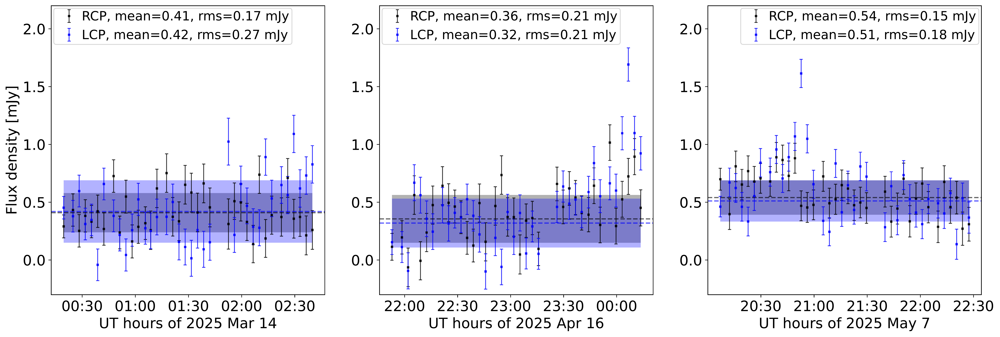
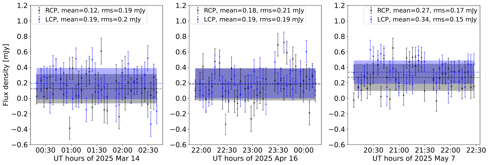
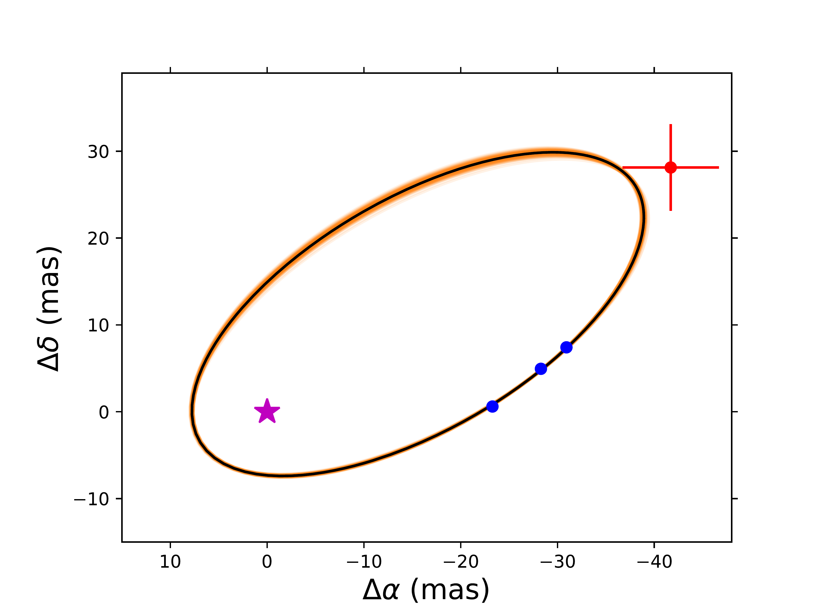
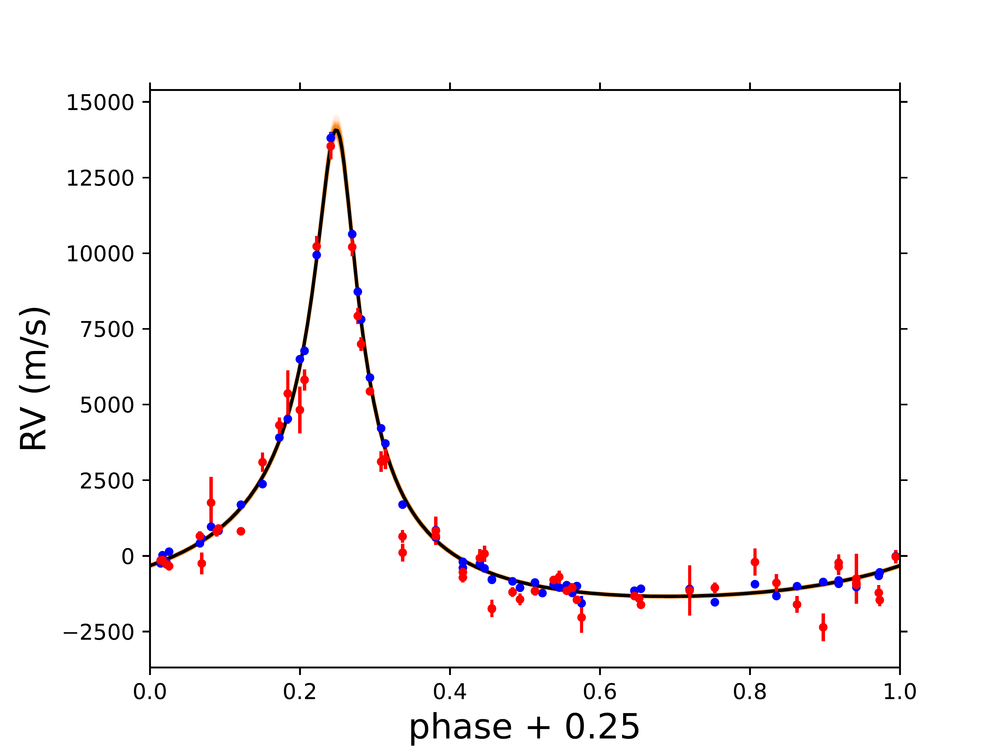
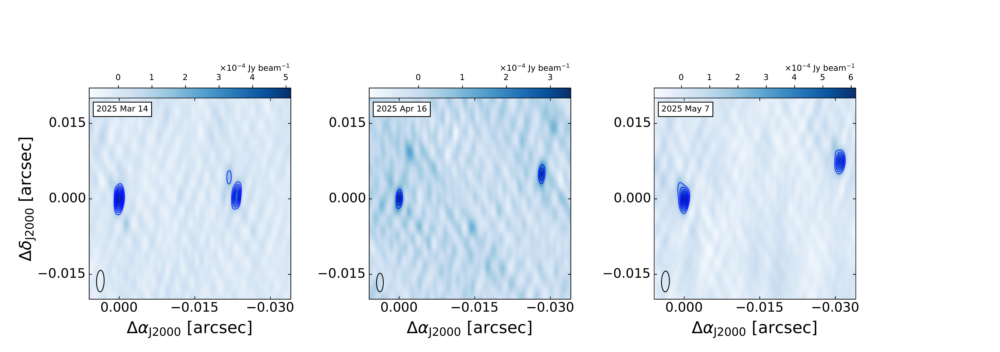
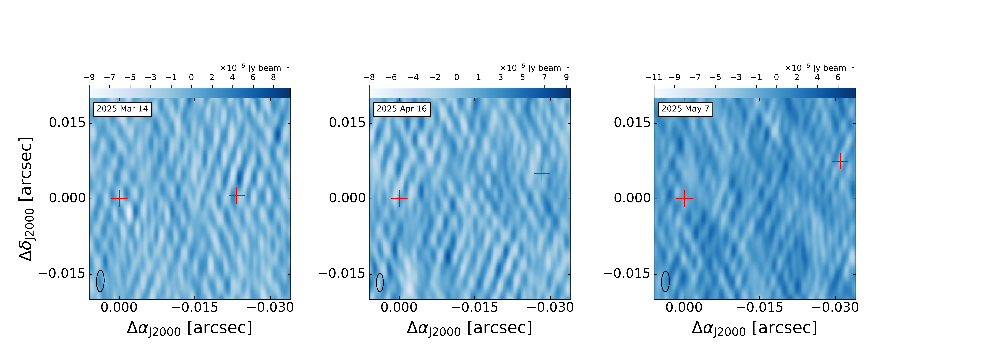

$\newcommand{\ensuremath}{}$
$\newcommand{\xspace}{}$
$\newcommand{\object}[1]{\texttt{#1}}$
$\newcommand{\farcs}{{.}''}$
$\newcommand{\farcm}{{.}'}$
$\newcommand{\arcsec}{''}$
$\newcommand{\arcmin}{'}$
$\newcommand{\ion}[2]{#1#2}$
$\newcommand{\textsc}[1]{\textrm{#1}}$
$\newcommand{\hl}[1]{\textrm{#1}}$
$\newcommand{\footnote}[1]{}$
$\newcommand{\mum}{~\mum\xspace}$
$\newcommand{\msun}{~M_{\odot}\xspace}$
$\newcommand{\mjup}{~M_{\em Jupiter}\xspace}$
$\newcommand{\kms}{~km~s^{-1}\xspace}$
$\newcommand{\lsun}{~L_{\odot}\xspace}$
$\newcommand{\jpb}{~\rm Jy~beam^{-1}\xspace}$
$\newcommand{\mjpb}{~\muJy~beam^{-1}\xspace}$
$\newcommand{\mjy}{~mJy~beam^{-1}\xspace}$

# Orbital motion and dynamical mass of the complex periodic variable binary system 2MASS J05082729$-$2101444

<mark>Appeared on: 2026-05-07</mark> -  _Accepted in A&A. 12 pages, 8 figures, 2 tables_

S. Curiel, et al. -- incl., <mark>T. Henning</mark>

**Abstract:**            We uses very long baseline interferometry to constrain the orbit of the binary system 2MASS J05082729-2101444. We observed the system with the VLBA in three epochs at a frequency of 4.85 GHz, which provides an angular resolution of about 3 mas. We combined the three radio astrometric observations, 119 RVs (60 VIS and 59 NIR) obtained with the CARMENES high-resolution spectrograph over a period of 8.1 years, and a relative astrometric measurement of an archival H-band Keck NIRC adaptive optics image to fit the orbital motion of the binary system. The VLBA observations resolved the binary system and show emission from both stellar components, with similar flux density levels (0.34-0.67 mJy) and showing slight temporal flux variations. The emission appears quiescent, with no significant circular polarization, and with no flare events. We obtained a fit of the orbital motion of this binary system, which has an eccentric orbit (e = 0.71) with an orbital period of 2.19 yr and a semimajor axis of 26.964 mas (1.3 au). The VLBA observations made it possible to resolve the binary system and identify both stars as radio-loud sources. The combined fit shows that 2M0508-21 is an M-dwarf binary with a total dynamical mass of $0.459\pm0.007$ M$_{\odot}$, assuming Gaia parallax. This mass is slightly larger than those estimated from the luminosity and theoretical evolutionary models. The upper limit of the circular polarization at 4.85 GHz ($\lesssim$10\%), the persistence of the quiescent emission, and the relatively low brightness temperatures are consistent with a gyro-synchrotron or synchrotron origin for the radio emission. Further VLBA observations are needed to obtain the individual masses of the stars, as well as to verify Gaia's parallax of the system. A complete characterization of the system will help improve evolutionary models for young objects at the substellar boundary.         

**Figure 5. -** Upper panels: Radio light curves of left circularly polarized (LCP) and right circularly polarized (RCP) emission, computed as the real part from the visibility plane with the phase center at the position of 2M0508--21A. Bottom panels: Same as the upper panels but with the phase center at the position of 2M0508--21B. The three VLBA epochs are shown from left to right. For each epoch and polarization, the horizontal lines indicate the mean flux densities and the shadow color bands show the $\pm$1$\sigma$ noise level for both polarizations. (*fig:vlba_light_curve*)

**Figure 1. -** Combined fitted solution. The top panel shows the fitted solution for the relative astrometry of 2M0508--21B around 2M0508--21A (marked with a magenta star). VLBA epochs are shown in blue color and the Keck NIRC epoch is shown with a red cross. The error bars of the VLBA data are smaller than the size of the blue symbol. The binary system rotates anti-clockwise. The bottom panel shows the fitted solution for the single-line RV data. The optical RV data are shown in blue color and the NIR RV data in red color. The solid black line shows the best fitted solution for both relative astrometry and RV. A total of 100 random solutions obtained with the {\tt MCMC} code are shown in orange. (*fig:combined_fit*)

**Figure 4. -** Intensity and Stokes V maps of 2M0508--21AB. In each image, 2M0508--21A is on the left and 2M0508--21B on the right. Upper panels: Stokes I maps. In each image, the first contour is at 7$\sigma$ and then at steps of 3$\sigma$, where $\sigma$ is the rms of the images (Table \ref{table:vlba_data}). Offsets are relative to the position of the 2M0508--21A. Lower panel: Stokes V maps. The rms of the three images are 15, 16 and 15 $\mu$Jy/beam; no emission is observed. The red crosses indicate the position of both stars according to the Stokes I maps. The ellipses at the bottom-left corners indicate the sizes of the VLBA synthesized beams. The date of observation is indicated in the upper left legends. (*fig:vlba_maps*)

