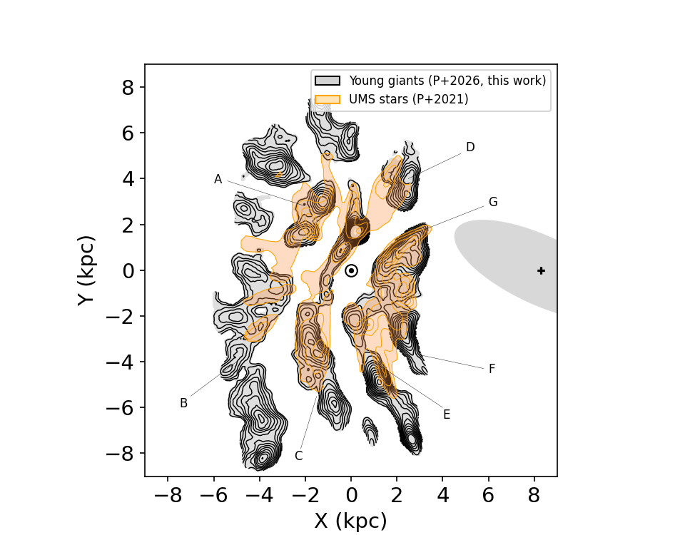
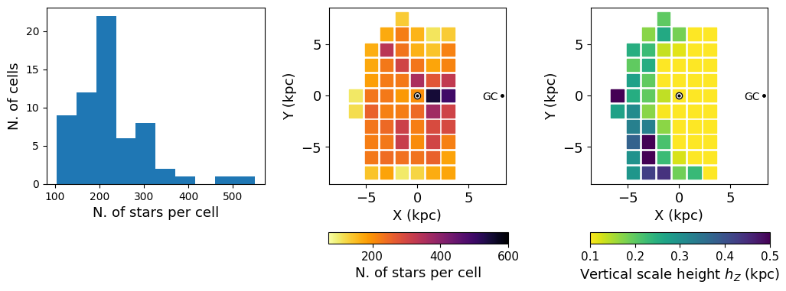

$\newcommand{\ensuremath}{}$
$\newcommand{\xspace}{}$
$\newcommand{\object}[1]{\texttt{#1}}$
$\newcommand{\farcs}{{.}''}$
$\newcommand{\farcm}{{.}'}$
$\newcommand{\arcsec}{''}$
$\newcommand{\arcmin}{'}$
$\newcommand{\ion}[2]{#1#2}$
$\newcommand{\textsc}[1]{\textrm{#1}}$
$\newcommand{\hl}[1]{\textrm{#1}}$
$\newcommand{\footnote}[1]{}$
$\newcommand{\gaia}{\textit{Gaia}}$
$\newcommand{\gdr}[1]{\textit{Gaia}~DR{#1}}$
$\newcommand{\gedr}[1]{\textit{Gaia}~eDR{#1}}$
$\newcommand{\vdag}{(v)^\dagger}$
$\newcommand\aastex{AAS\TeX}$
$\newcommand\latex{La\TeX}$
$\newcommand{\T}{T_{\rm eff}}$
$\newcommand{\g}{log(g)}$
$\newcommand{\gunlim}{\textit{GaiaUnlimited}}$
$\newcommand{\agama}{{\sl AGAMA}}$
$\newcommand{\vlos}{{\sl V_{\rm los}}}$
$\newcommand{\vrad}{{\sl V_{\rm R}}}$
$\newcommand{\vz}{{\sl V_{\rm Z}}}$
$\newcommand{\vphi}{{\sl V_{\phi}}}$

# The flare and spiral structure of the Milky Way's disc as traced by young giant stars

<mark>Appeared on: 2026-05-14</mark> -  _Submitted to ApJ. 21 pages, 15 figures. We welcome comments, questions, suggestions for missing references, etc. The contours of the spiral structure shown in Fig. 7 (right panel) and Fig. 8 will be made available_

E. Poggio, et al. -- incl., <mark>R. Andrae</mark>

**Abstract:** We explore the three-dimensional structure of a sample of $\sim$ 16000 young giant stars in the Galactic disc out to $\sim$ 8 kpc in heliocentric distance. This population traces a thin disc with a local vertical scale height of $h_{Z \odot} = 77 \pm 4$ pc, that progressively thickens toward the outer Galaxy with a prominent Galactic flare, rising exponentially with a radial scale length of $h_{fl} =  3.5 \pm 0.3   \rm{kpc}$ . Our analysis incorporates both the survey selection function and the vertical displacements caused by the Galactic warp and corrugations, which, if neglected, would lead to significant biases in the derived disc scale height. In the Galactic plane, the young giants trace coherent spiral arm segments, extending previous maps based on upper main sequence (UMS) and OB stars by 2-4 kpc depending on the considered direction. The obtained map supports a pitch angle of roughly 20 degrees for the Perseus Arm, and shows that the Local/Orion arm stretches at least 10 kpc in length. Unlike earlier and more local maps based on UMS and OB stars, where the relatively small sampled portion of the Perseus Arm appeared as a short, nearly straight feature, our map reveals it as an extended structure with a gentle curvature, as expected for spiral arms on large scales. In the inner Galaxy, we also identify a new segment likely associated with the Scutum Arm, clearly detached from the Sagittarius–Carina Arm in the fourth Galactic quadrant.

**Figure 9. -** *Left panel*: The distribution of the young giant sample in the XY plane. Each black point corresponds to a star. The Sun's position is shown by the $\odot$ symbol. The Galactic Center (GC) is to the right, at (X,Y)=($R_{\odot}$, 0 kpc), with $R_{\odot}=8.277$ kpc \citep{Gravity:2022}. Galactic rotation is clockwise. *Right panel*: Same as left panel, but now showing the regions of positive ($>$0) overdensities in the Galactic disc based on the young giant sample (see details in the text). (*fig:spiral_structure*)

**Figure 10. -** Same as the right panel of Figure \ref{fig:spiral_structure}, but now using transparent grey-shaded contours and black lines, overplotted on the overdensity contours obtained with Upper Main Sequence (UMS) stars from \citet{Poggio:2021}, for comparison. The Solar System is located in $(X,Y)=( 0   \rm{kpc}, 0   \rm{kpc})$. The black cross shows the position of the Galactic center, while the grey-schaded ellipse shows the relative orientation of the central bar of the Milky Way, as described in the text. (*fig:spiral_structure_YG_UMS*)

**Figure 8. -** *Left panel*: histogram of the number of stars per cell. *Middle panel*: distribution of the cells in the XY-plane, color coded by the number of stars per cell. The Sun's position is in (X,Y)=(0, 0), and the Galactic center is to the right, in (X,Y)=($R_{\odot}$,0), with $R_{\odot}=8.277$ kpc \citep{Gravity:2022}. *Right panel*: same as the middle panel, but now color-coded by the inferred $h_Z$ in each cell.
 (*fig:xy_map_hz_results_fits_cells*)

