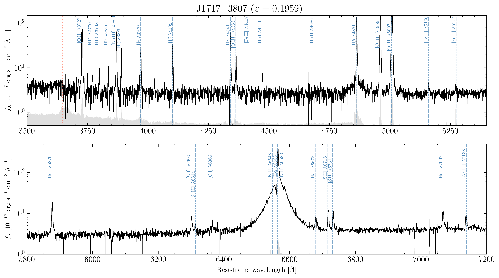
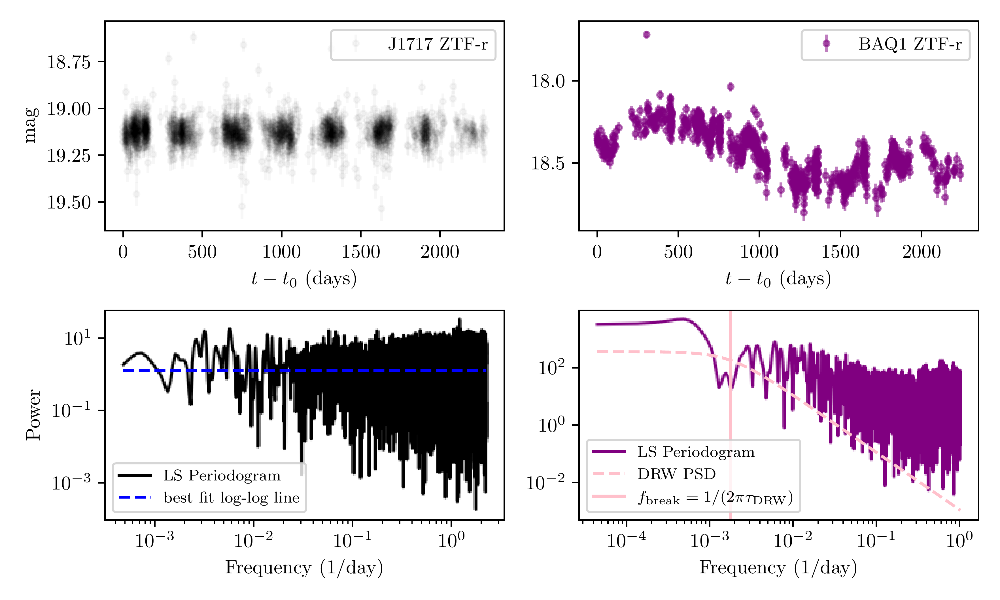
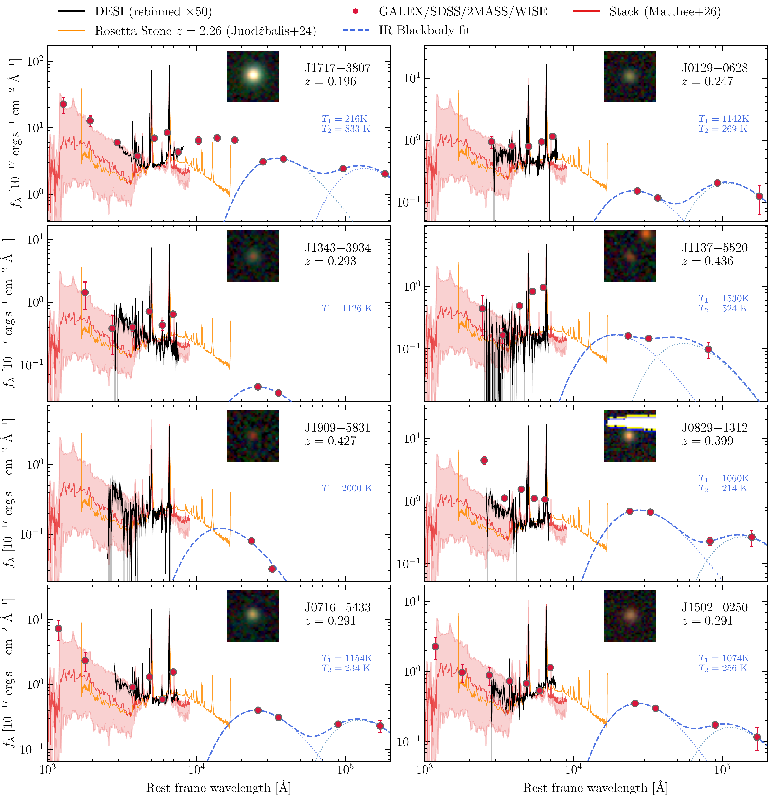

$\newcommand{\ensuremath}{}$
$\newcommand{\xspace}{}$
$\newcommand{\object}[1]{\texttt{#1}}$
$\newcommand{\farcs}{{.}''}$
$\newcommand{\farcm}{{.}'}$
$\newcommand{\arcsec}{''}$
$\newcommand{\arcmin}{'}$
$\newcommand{\ion}[2]{#1#2}$
$\newcommand{\textsc}[1]{\textrm{#1}}$
$\newcommand{\hl}[1]{\textrm{#1}}$
$\newcommand{\footnote}[1]{}$
$\newcommand{\lya}{{\text{Ly}\ensuremath{\alpha}}}$
$\newcommand{\Halpha}{{\text{H}\ensuremath{\alpha}}}$
$\newcommand{\Hbeta}{{\text{H}\ensuremath{\beta}}}$
$\newcommand{\Hgamma}{{\text{H}\ensuremath{\gamma}}}$
$\newcommand{\oiii}{{\text{[\ion{O}{iii}]}}}$
$\newcommand{\niv}{{\text{\ion{N}{iv}]}}}$
$\newcommand{\feii}{{\text{\ion{Fe}{ii}}}}$
$\newcommand{\fesclya}{\ensuremath{f_{\rm esc}(\lya )}}$
$\newcommand{\fesclyc}{\ensuremath{f_{\rm esc}(\rm LyC)}}$
$\newcommand{\fcov}{\ensuremath{f_{\rm cov}}}$
$\newcommand{\jwst}{{JWST}}$
$\newcommand{\nircam}{NIRCam}$
$\newcommand{\muse}{MUSE}$
$\newcommand{\flambdaunits}{\ensuremath{\rm erg s^{-1} cm^{-2} {Å }^{-1}}}$
$\newcommand{\contblue}{{\it cont. blue}}$
$\newcommand{\contred}{{\it cont. red}}$
$\newcommand{\Hden}{\ensuremath{n_{\rm H}}}$
$\newcommand{\NH}{\ensuremath{N_{\rm H}}}$
$\newcommand{\NHI}{\ensuremath{N_{\rm \ion{H}{i}}}}$
$\newcommand{\eden}{\ensuremath{n_{\rm e}}}$
$\newcommand{\Ne}{\ensuremath{N_{\rm e}}}$
$\newcommand{\Te}{\ensuremath{T_{\rm e}}}$
$\newcommand{\logten}{\ensuremath{\log_{10}}}$
$\newcommand{\vturb}{\ensuremath{v_{\rm turb}}}$
$\newcommand{\logU}{\ensuremath{\logten U}}$

# A new sample of Little Red Dots at $z<0.45$ in DESI DR1: Broad Balmer lines, low ionization spectrum and no variability

<mark>Appeared on: 2026-05-15</mark> -  _21 pages, 17 figures, submitted to Astronomy & Astrophysics_

K. Park, et al. -- incl., <mark>A. d. Graaff</mark>

**Abstract:** JWST has unveiled an abundant population of compact broad-line emitters largely at $z\gtrsim4$ , the Little Red Dots (LRDs), which might represent a previously unprobed supermassive black hole evolution channel predominant at high redshift. However, the LRDs have remained mostly elusive at lower redshift ( $z\lesssim2$ ) where detailed studies are possible from ground-based observatories. We searched for low-redshift LRDs in the Dark Energy Spectroscopic Instrument (DESI) survey. Our search is primarily based on emission line properties, as opposed to earlier approaches that searched for compact sources with specific photometric spectral energy distributions. We report the discovery of eight LRDs at $z=0.2-0.45$ , which show spectral features akin to the high-redshift LRDs in the rest-frame optical. The sources are characterized by broad Balmer lines, steep Balmer decrements, compact morphologies, Balmer absorption features and/or strong He i emission, but weak or absent He ii , [ Ne v ] or other high excitation lines typical of Type I AGN. For 7 out of 8 sources, we retrieve dense-cadence light curves from time-domain surveys and for most sources we find weak to no intrinsic variability ( $0.0-0.1$ mag) over 4--17 years in the rest-frame. We also highlight the identification of a quasar with  similar Balmer line profiles as LRDs, but that shows differences in Balmer decrement, significant variability, and high-ionisation lines. Given the effective volume $4.9 \; {\rm Gpc^3}$ covered by DESI DR1 at $z<0.45$ , our sample corresponds to a number density of $1.6\times10^{-9}$ Mpc $^{-3}$ , indicating a number density $\sim$ 10,000 times lower than in the first billion years of cosmic time. We find a dearth of luminous and red LRDs at $z<1$ compared to higher-redshift, which could suggest lower gas feeding rates of LRD activity due to higher metallicities at later cosmic epochs.

**Figure 6. -** The DESI rest-frame spectrum of J1717+3807 (black), showing the rest-frame wavelength ranges 3500--5400 Å  (top) and 5800--7200 Å  (bottom). We mark the wavelengths of relevant spectral lines with blue dashed lines. As required by our search, the source shows weak [$\ion${S}{ii}] and [$\ion${N}{ii}], weak [$\ion${Ne}{v}], strong $\ion${He}{i} 5876, 7067, and a sharp absorption feature in the H$\alpha$ line. Intruigingly, we identify a Balmer jump (see red-dashed line) indicating nebular emission. (*fig:J1717_spectrum*)

**Figure 10. -** ZTF r-band rest-frame light curves of J1717+3801 and BAQ1 (top panels) along with their LS Periodograms (bottom panels) to estimate their PSDs. The data points of J1717+3801 are shown with high transparency to emphasize where they are concentrated the most. The PSD of J1717 is flat ($\propto f^0$), indicative of uncorrelated white noise, whereas the PSD of BAQ1 is bent ($\propto f^{-2}$), indicative of correlated red noise, with a flattening occuring roughly at the theoretical value of $f_{\rm break}=1/(2\pi \tau_{\rm DRW}).$ We find that the light curve of J1717+3801 shows signs of weak variability ($\sim 0.04$ mag) and uncorrelated white noise, whereas BAQ1 shows typical quasar variability of $\sigma_{\rm DRW}\sim 0.15$ mag. (*fig:lc_analysis*)

**Figure 8. -** Spectral energy distributions of our sample. We show the DESI spectrum with a black line, resampled to a $\times50$ coarser binning for visual clarity. We also show archival photometry from GALEX, SDSS, 2MASS and WISE with red dots. We also compare with the stack of the full JWST sample in [Matthee, et. al (2026)](https://ui.adsabs.harvard.edu/abs/2026arXiv260317667M)(red line and shaded region) and the JWST prism spectrum of the _Rosetta Stone_ at $z=2.26$ ([Juod\vzbalis, et. al 2024](https://ui.adsabs.harvard.edu/abs/2024MNRAS.535..853J))  that covers the rest-frame NIR. We also show our best-fit blackbodies to the mid-IR photometric points (rest wavelength $>2$ \unit{\mu m}; see Sect. \ref{sec:multiwavelength_phot}). We also show inset RGB (DESI legacy $g$, $r$, and $z$ bands) $7.86$\arcsec$\times7.86$\arcsec$$ stamps of each object, showcasing their compact morphology. (*fig:seds8*)

