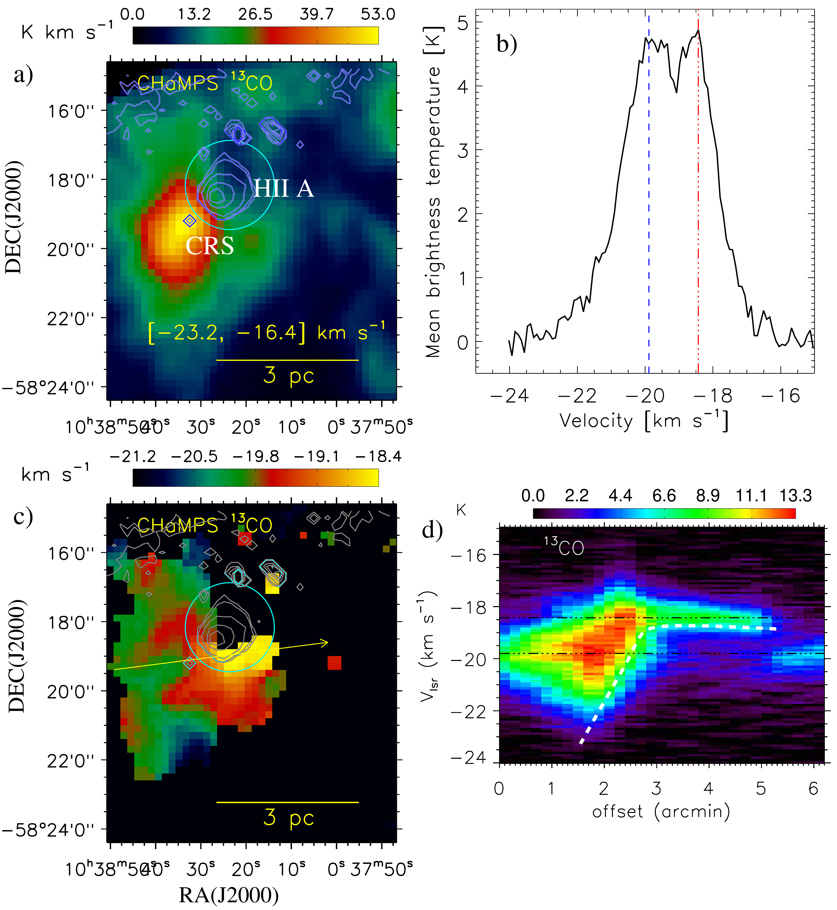

$\newcommand{\ensuremath}{}$
$\newcommand{\xspace}{}$
$\newcommand{\object}[1]{\texttt{#1}}$
$\newcommand{\farcs}{{.}''}$
$\newcommand{\farcm}{{.}'}$
$\newcommand{\arcsec}{''}$
$\newcommand{\arcmin}{'}$
$\newcommand{\ion}[2]{#1#2}$
$\newcommand{\textsc}[1]{\textrm{#1}}$
$\newcommand{\hl}[1]{\textrm{#1}}$
$\newcommand{\footnote}[1]{}$
$\newcommand{\red}[1]{\textcolor{red}{\textbf{#1}}}$
$\newcommand{\blue}[1]{\textcolor{blue}{\textbf{#1}}}$
$\newcommand\cts{counts~s^{-1}}$
$\newcommand\ergs{erg~s^{-1}}$
$\newcommand{\vdag}{(v)^\dagger}$
$\newcommand\aastex{AAS\TeX}$
$\newcommand\latex{La\TeX}$

# Discovery of a Compact Hub-Filament System in G286.21+0.17 with JWST and ALMA: Insights into Protocluster Formation and Competitive Accretion

<mark>Appeared on: 2026-05-15</mark> - 

L. Dewangan, et al. -- incl., <mark>F. Xu</mark>

**Abstract:** We present a multi-wavelength study of the massive protocluster G286.21+0.17 (G286) using $*JWST*$ near-infrared imaging and ALMA H $^{13}$ CO $^{+}$ (1--0) observations. The $*JWST*$ images uncover a compact ( $\sim$ 0.5 pc) hub-filament system (HFS), comprising a dense central hub connected by at least four converging filaments seen in absorption,  along with multiple $H_2$ protostellar jets/outflows. The hub hosts dense core G286c1. The H $^{13}$ CO $^{+}$ emission confirms this HFS over [ $-$ 19.2, $-$ 16.4 ] km s $^{-1}$ . The $*JWST*$ images further trace prominent photodissociation regions around the H ${\sc ii}$ region A, powered by a B-type star. The radial distribution of ALMAGAL 1.38 mm core properties reveals steep power-law slopes toward the hub center. Within the inner hub ( $r<8\arcsec$ , $\sim0.1$ pc), the core number density follows $\rho [\rm pc^{-2}] \propto r^{-2.4\pm0.5}$ , the surface density scales as $\Sigma [\rm g cm^{-2}] \propto r^{-1.0\pm0.2}$ , and the enclosed core mass varies as $M_{\rm core} [M_{\odot}] \propto r^{-1.2\pm0.2}$ , while core diameters remain approximately constant ( $D_{\rm core} [\rm AU] \propto r^{-0.1\pm0.1}$ ). These trends, along with filament mass accretion rates of $7\times10^{-6}$ -- $1.8\times10^{-4}$  $M_\odot$ yr $^{-1}$ , support a competitive accretion scenario in which gravitational focusing enhances core growth toward the hub center. Filament linewidths increase fromtail/outer-region to head/hub-region, consistent with gravity-driven turbulence. However, the absence of a preferred alignment between velocity gradients and gravitational force directions may indicate a dynamically evolved system. The HFS likely formed through large-scale gas layer interactions and compression by the adjacent H ${\sc ii}$ region. Overall, star formation in G286 appears regulated by filamentary accretion, competitive core growth in the hub, and stellar feedback.

**Figure 4. -** a) _ Spitzer_ three-color composite map (8 $\mu$m in red, 4.5 $\mu$m in green, and 3.6 $\mu$m in blue) of the area hosting G286-clump and H {\sc ii} region A, overlaid with SMGPS 1.3 GHz continuum contours (yellow). The contour levels are 0.075, 0.15, 0.55, 2, 3, and 3.6 mJy beam$^{-1}$ and the scale bar is produced at a distance of 2.5 kpc. The bottom-right inset presents a zoomed-in view of G286-clump (see dotted box in Figure \ref{fig1}a), using the same composite scheme and overlaid with identical SMGPS contours. b) ATOMS 3 mm continuum emission map (see the solid box in Figure \ref{fig1}a). The cyan dotted contour represents the 3 mm continuum emission at 0.23 mJy beam$^{-1}$, while the SMGPS 1.3 GHz continuum emission is shown as a magenta contour at 0.1 mJy beam$^{-1}$. Following [Zhou, Liu and Li (2021)](), sub-clumps A and B are marked with large circles, and arrows indicate the cores G286c1, G286c2, and G286c3 in the G286-clump. The NE-SW and NW-SE filaments are also labeled. In each panel, the radio sources CRS and H {\sc ii} region A are indicated. (*fig1*)

**Figure 9. -** a) SMGPS 1.3 GHz continuum contours (blue) overlaid on the
ChaMPS $^{13}$CO moment-0 map integrated over [$-$23.2, $-$16.4] km s$^{-1}$.
b) Mean $^{13}$CO spectrum extracted from the circular region indicated in Figure \ref{fig:apx1}a.
c) SMGPS 1.3 GHz continuum contours (cyan) overlaid on the $^{13}$CO moment-1 map.
d) Position-velocity diagram along the arrow shown in Figure \ref{fig:apx1}c, with a
dashed white curve tracing an arc-like structure.
In panels "a" and "c", contours are at 0.075, 0.15, 0.55, 2, 3, and 3.6 mJy beam$^{-1}$;
the scale bar corresponds to 2.5 kpc.
In panels "b" and "d", dot-dashed lines indicate velocities of $-$18.4 and $-$19.89 km s$^{-1}$. (*fig:apx1*)

**Figure 1. -** a) Three-color composite map (8 $\mu$m (red)+ f470N (green) + f356W (blue)) made using _ Spitzer_ and *JWST* NIR images (see the dot-dashed box in Figure \ref{fig1}a).
Most of the H$_{2}$ outflows seen within the encircled area in Figure \ref{fg2}a are
presented in Figure \ref{fg2}b. b) *JWST* f470N/f410M ratio map tracing multiple $H_2$ protostellar jets/outflows toward G286-clump. c) Three-color composite map generated using the f405N/f410M (Br$\alpha$; red), f470N/f410M (H$_{2}$; green), and *JWST* f356W (blue) images (see the dashed box in Figure \ref{fg2}a). In panels "a" and "c", the solid yellow lines highlight the NE-SW and NW-SE filaments, as indicated in Figure \ref{fig1}b. In each panel, the scale bar is derived at a distance of 2.5 kpc. (*fg2*)

