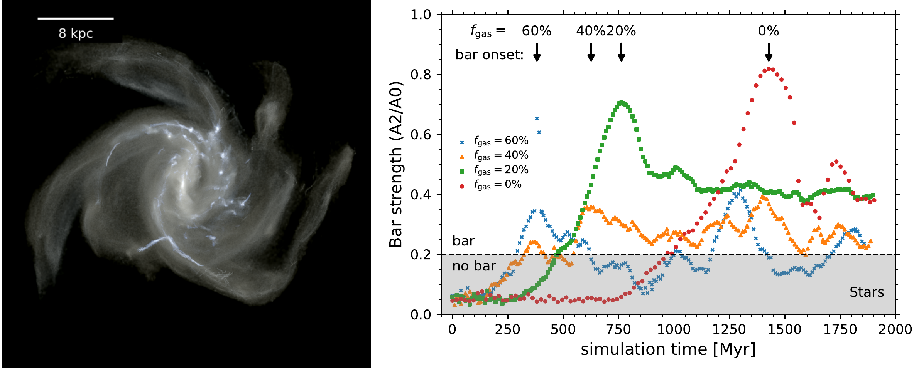
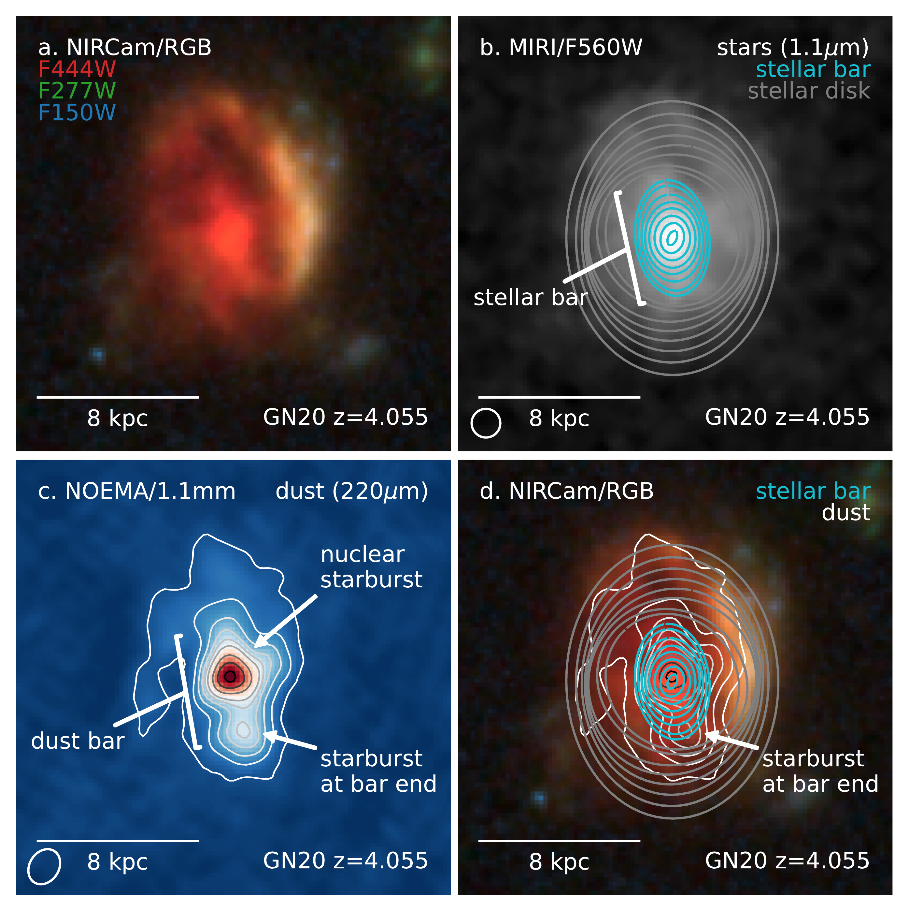
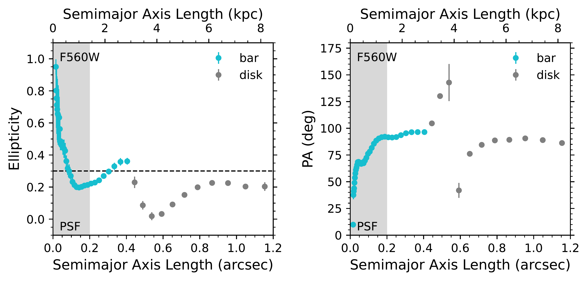

$\newcommand{\ensuremath}{}$
$\newcommand{\xspace}{}$
$\newcommand{\object}[1]{\texttt{#1}}$
$\newcommand{\farcs}{{.}''}$
$\newcommand{\farcm}{{.}'}$
$\newcommand{\arcsec}{''}$
$\newcommand{\arcmin}{'}$
$\newcommand{\ion}[2]{#1#2}$
$\newcommand{\textsc}[1]{\textrm{#1}}$
$\newcommand{\hl}[1]{\textrm{#1}}$
$\newcommand{\footnote}[1]{}$
$\newcommand{\vdag}{(v)^\dagger}$
$\newcommand\aastex{AAS\TeX}$
$\newcommand\latex{La\TeX}$
$\newcommand{\tbd}[1]{{\color{red} #1}}$
$\newcommand{\comment}[1]{{\color{blue} #1}}$
$\newcommand{\luca}[1]{{\color{blue}{\bf LC: #1}}}$
$\newcommand{\lab}[1]{{\color{blue}{\bf LAB: #1}}}$
$\newcommand{\sectionautorefname}{\S}$
$\newcommand{\subsectionautorefname}{\S}$
$\newcommand{\subsubsectionautorefname}{\S}$
$\newcommand{\figureautorefname}{Fig.}$
$\newcommand{\equationautorefname}{Eq.}$

# A stellar bar hidden in an extreme gas-rich disk galaxy at $z=4.055$

<mark>Appeared on: 2026-05-18</mark> -  _17 pages, 8 figures, 1 table. Submitted to ApJL_

L. A. Boogaard, et al. -- incl., <mark>F. Walter</mark>

**Abstract:** The classical picture for the formation of stellar bars---key dynamical drivers of the evolution of galaxies---is through secular evolution of instability in gas poor, stellar-dominated disks. The detection with the James Webb Space Telescope (JWST) of stellar bars and spiral arms in galaxies at early cosmic times has thus challenged $\Lambda$ CDM-based expectations, which recent studies reconcile by suggesting that these galaxies are baryon-dominated and have already consumed most of their gas. Yet, a paradox arises, as early galaxies are expected to be increasingly rich in gas, which is generally considered to prevent or slow down stellar bar formation. Here, we show the detection of a stellar bar in GN20, a gas-rich star-forming disk galaxy at a redshift of $z$ =4.055, only 1.5 billion years after the Big Bang.  Simultaneous observations of the stars, gas, and dust reveal that GN20 is indeed baryon-dominated (over dark matter; 70 $\pm$ 30 \% ), but the baryonic mass is largely in the form of gas (75 $\pm$ 25 \% ).  This discovery demonstrates that gas-rich disks do support rapid stellar bar formation in the early Universe, motivating a new theoretical perspective on bar formation in gas-rich systems, and providing a potential new mechanism for very early galaxy assembly and quenching.

**Figure 4. -** Predicted timescales of stellar bar formation. Theoretical simulations of bar formation in the context of
    large gas fractions from \citep{Bland-Hawthorn2024,
      Bland-Hawthorn2025, Tepper-Garcia2024} produce galaxies with a
    striking resemblance to GN20, featuring a bars and asymmetric
    spiral arm structure, driven by baryon sloshing \citep[][snapshot
    at $f_{\rm gas} = 40$\% shown]{Bland-Hawthorn2025}.  For
    baryon-dominated disks, the simulations predict increased gas
    fractions drive earlier onset of bars, with bar formation in
    massive disks occurring within a few hundred Myrs
    ($f_{\rm baryon} = 0.7$, $M_{\rm halo} = 10^{11}$ M$_{\odot}$; see \autoref{sec:theory} for more details).
     (*fig:theory*)

**Figure 2. -** Structure of GN20.  **(a)** JWST/NIRCam false-color image of the gas-rich
    starburst galaxy GN20 at redshift $z$=4.055. North is up and east
    is left. **(b)** The 7 kpc stellar bar in the disk at
    rest-frame 1.1 $\mu$m light traced by JWST/MIRI, indicated by ellipses of constant brightness. **(c)** High-resolution sub-mm  observations from the NOrthern Extended Millimeter Array (NOEMA) at rest-frame 220 $\mu$m reveal the dust extends over the full stellar disk of GN20 \citep{Boogaard2026}, tracing regions of
    strong (obscured) star formation. **(d)** There is strong
    alignment between the stellar and dust bar.  Clumps of intense
    star formation are visible in the nucleus, fueled by the bar
    funneling material to the galaxy's center, and at the bar-disk
    interface to the south.
     (*fig:rgb*)

**Figure 3. -** Stellar bar identification. The ellipticity and position angle of the stellar light
    isophotes at rest-frame $1.1$$\mu$m show a clear signature of a
    stellar bar of approximately $2.8\pm0.1$ kpc in projected semi-major axis length ($3.5\pm0.1$ kpc deprojected), corresponding to $7.0\pm0.2$ kpc full deprojected length, that is independently confirmed by Fourier analysis; see \autoref{sec:morph}).  The
    ellipticity ($\epsilon$) and position angle (PA) of the bar match
    all four criteria used in literature \citep{Jogee2004,
      Marinova2007, Costantin2023, Guo2023}: 1.  bar
    $\epsilon \approx 0.4 > 0.3$(dotted line), 2.
    $\Delta{\rm PA} \approx 5^{\circ} < 15^{\circ}$--20$^{\circ}$ along the
    bar, 3. $|\epsilon| \approx 0.2 > 0.1$ break at the bar end, 4.
    $|\rm PA| \approx 10^{\circ} \geq 10^{\circ}$ between the bar and
    disk (see \autoref{sec:morph} for more details).
     (*fig:ellipse_f560w*)

