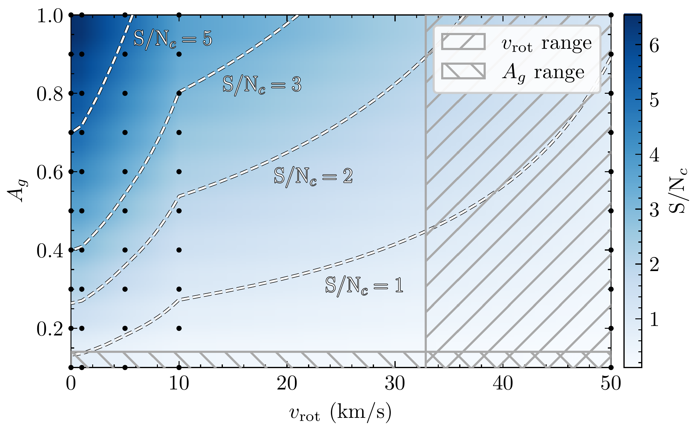

$\newcommand{\ensuremath}{}$
$\newcommand{\xspace}{}$
$\newcommand{\object}[1]{\texttt{#1}}$
$\newcommand{\farcs}{{.}''}$
$\newcommand{\farcm}{{.}'}$
$\newcommand{\arcsec}{''}$
$\newcommand{\arcmin}{'}$
$\newcommand{\ion}[2]{#1#2}$
$\newcommand{\textsc}[1]{\textrm{#1}}$
$\newcommand{\hl}[1]{\textrm{#1}}$
$\newcommand{\footnote}[1]{}$
$\newcommand{\arraystretch}{1.25}$
$\newcommand{\arraystretch}{1}$

# Spinning out of focus: The challenge of rotational line broadening in exoplanet reflection spectroscopy

<mark>Appeared on: 2026-05-19</mark> -  _Accepted for publication in Astronomy and Astrophysics_

T. O. Winterhalder, et al. -- incl., <mark>T. Henning</mark>

**Abstract:** Detecting light reflected off the dayside of an exoplanet in high-resolution spectroscopic data has proved to be a notoriously difficult endeavour. Despite several attempts, the faint signal has yet to be detected. We present a new effort at finding reflection signatures and show how a strong rotational broadening of the reflected spectrum can complicate this objective. We introduce a new figure of merit that quantifies the favourability of different systems for a reflection study, the reflection spectroscopy metric.   Applying this metric, we identify the KELT-9 system, which features a highly misaligned, rapidly rotating host star, as the target for a case study based on a spectroscopic time series obtained by CARMENES. We also perform an injection-recovery test to determine the detectability of the signal in our data and demonstrate its sensitivity to rotational line broadening. The search for a genuine reflection signal in our data resulted in a non-detection. The injection-recovery test puts this finding into context by revealing the critical importance of taking rotational broadening into account when dealing with systems featuring rapidly rotating stars and large spin-orbit misalignments. The case study presented here underscores the need to incorporate stellar rotation and spin-orbit misalignment into assessments of a given planet's favourability to reflection studies.

**Figure 3. -** 
    S/N map produced by cross-correlating the spectral residuals with the reflection templates as a function of the planetary radial velocity semi-amplitude, $K_\mathrm{p}$, and the radial velocity deviation, $\Delta v$. The top and bottom maps present the results when using the PHOENIX-based and binary reflection template, respectively. The dashed black lines indicate where a genuine reflection signal would be expected to manifest. (*figure_reflection_kp_vs_deltav_plot*)

**Figure 6. -** Injection-recovery tests of KELT-9 b for different geometric albedo, $A_g$, and net rotational velocity, $\varv_\mathrm{rot}$, values. The panels show S/N maps resulting from the cross-correlation of the reflection template with the CARMENES dataset, into which the respective artificial reflection signals were injected beforehand. The rotational velocity used to broaden the injected signal as well as the template increases towards the right. The geometric albedo with which the artificial signal and the template were scaled drops off towards the bottom. The positions at which the artificial signal was injected are indicated by the dashed black lines. The S/N value encountered at this position is shown in the white box in the top-left corner of each respective panel. Note that this value corresponds to the corrected S/N (hence the $c$ subscript), that is, the signal strength normalised by the encountered signal strength at the same position in the absence of an injected signal. (*figure_injection_mosaic*)

**Figure 4. -** Sensitivity region of a reflection study applied to the CARMENES dataset. The blue colour map shows the corrected S/N as a function of the planet's geometric albedo as well as the velocity used for the rotational line broadening of the artificial signal. The dashed white lines indicate different corrected $\mathrm{S/N}$ contours, with the $\mathrm{S/N}_c$ = 5 contour delineating the region where a robust detection based on the CARMENES data at hand could be realised.
    The black dots mark grid points at which injection-recovery tests were performed.
    The hatched regions show where the reflection signal is expected to manifest and are defined by the upper limit on the planet's geometric albedo ($A_g < \SI{0.14} $;  ([Hooton, et. al 2018]()) ) as well as the stellar rotational velocity as perceived by the planet during the CARMENES exposures (note that this $\varv_\mathrm{rot}$ region extends to higher values than shown here, but the corresponding S/N achievable using the CARMENES dataset vanishes completely).
    The genuine reflection signal of the planet can be assumed to be located where the two hatched regions overlap.
     (*figure_injection_colourmap*)

