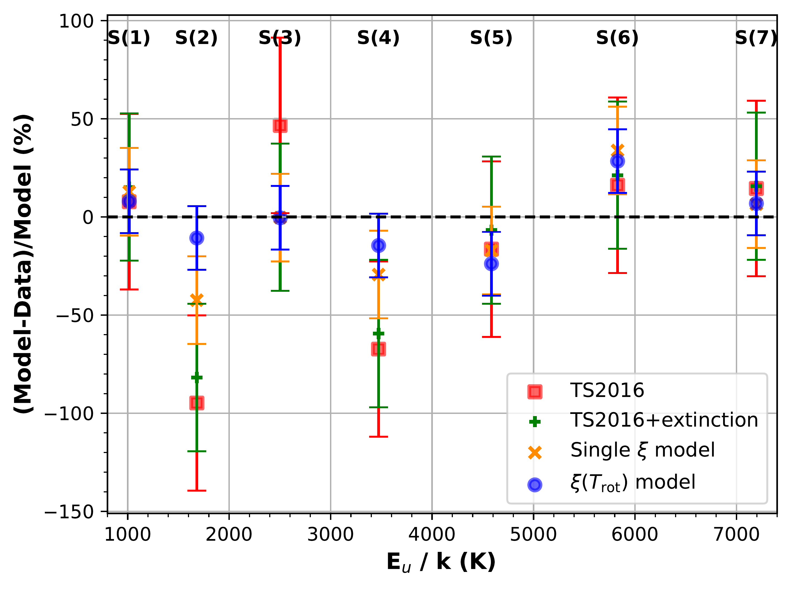
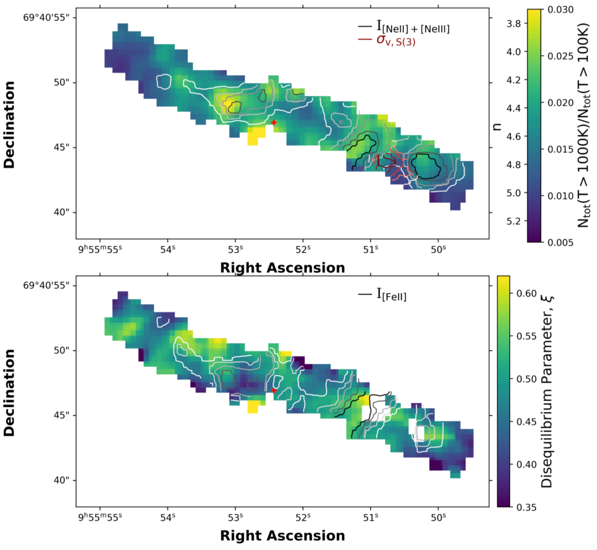
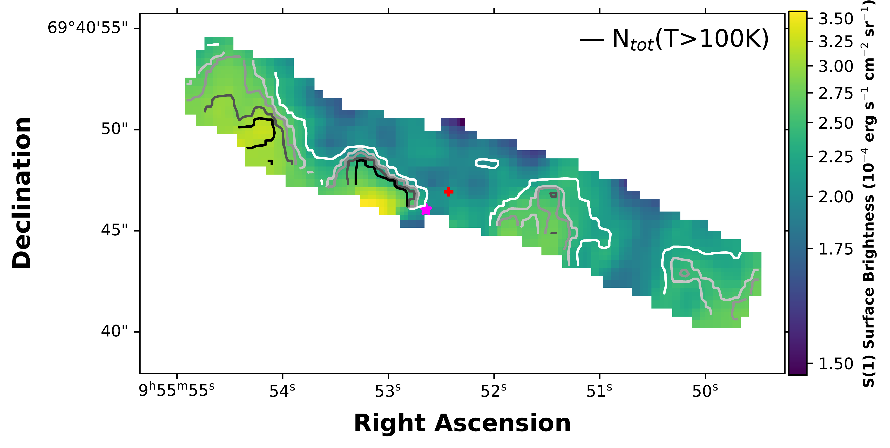

$\newcommand{\ensuremath}{}$
$\newcommand{\xspace}{}$
$\newcommand{\object}[1]{\texttt{#1}}$
$\newcommand{\farcs}{{.}''}$
$\newcommand{\farcm}{{.}'}$
$\newcommand{\arcsec}{''}$
$\newcommand{\arcmin}{'}$
$\newcommand{\ion}[2]{#1#2}$
$\newcommand{\textsc}[1]{\textrm{#1}}$
$\newcommand{\hl}[1]{\textrm{#1}}$
$\newcommand{\footnote}[1]{}$
$\newcommand{\vdag}{(v)^\dagger}$
$\newcommand\aastex{AAS\TeX}$
$\newcommand\latex{La\TeX}$
$\newcommand{\mjysr}{MJy sr^{-1}}$
$\newcommand{\kms}{km s^{-1}}$
$\newcommand{\hh}{\ensuremath{\mathrm{H}_2}}$
$\newcommand{\ts}{\mathrm{\tau_{Si}}}$
$\newcommand{\xitr}{\ensuremath{\xi(T_{\mathrm{rot}})}}$

# JWST Observations of Starbursts: Molecular Hydrogen Excitation and Disequilibrium in M82

<mark>Appeared on: 2026-05-20</mark> -  _20 pages, 13 figures. Accepted by ApJ_

S. E. Duval, et al. -- incl., <mark>F. Walter</mark>

**Abstract:** Emission from the pure rotational transitions of $\hh$ traces warm molecular gas, providing insight into its temperature distribution and local heating conditions.We have extended previous power-law $\hh$ temperature models to account for differential extinction by dust as well as non-equilibrium ortho-to-para- $\hh$ ratios (OPR).The turbulent environment of the M82 starburst offers a unique opportunity to study $\hh$ out of equilibrium conditions, using $\sim$ 15 pc spatially resolved measurements from MIRI/MRS on JWST.With extensive detections of $\hh$ S(1)--S(7), we use our model to assess spatial variations in local heating conditions of molecular gas across a $\sim $ 500 pc region of the M82 central starburst.The average slope of the recovered $\hh$ power law temperature distribution is consistent with prior studies, and the slope strongly anti-correlates with relative [ $\ion{Fe}{2}$ ] / $\hh$ S(1)--S(2) strength, pointing to the importance of shock-heating.Our models indicate that the OPR is, on average, about half of its equilibrium value. This suppression is attributed to cloud mixing timescales which are short compared to timescales for spin conversion, with molecular gas remembering its "cooler past".By accounting for OPR disequilibrium, we can identify instances of recent and rapid heating to better understand the flow of energy through the interstellar medium and track its thermal history.

**Figure 4. -** Median residuals between modeled and observed column densities for 331 regions across M82 which contained detections of the S(1)--S(7) pure rotational transitions of $H_2$. The inner three quintiles of the fits are shown by the associated bars for the four models tested. The red squares show the \citetalias{TS2016} simple power-law model, which is expanded to account for extinction by dust, shown with the green crosses. The disequilibrium ($\xi$) model (see \S\ref{sec:diseq_param}) is shown with orange $\times$'s for a single value of $\xi$, and blue circles for the temperature-dependent $\xi$ model. See \S\ref{sec:modelval} for more details on the models. Models that do not account for disequilibrium heating tend to underestimate the column density of S(2) and S(4) most dramatically, reaching values $>$ 100\% of the observed value in several regions. Generally, residuals tend closer to zero as more physically-motivated processes are accounted for in the model. (*fig:model_residuals*)

**Figure 12. -** Maps of derived parameters across the M82 center with North facing up. The galaxy center is marked with the red plus sign. Top: Fraction of the column density of hot ($T>$ 1000 K) to warm ($T>$ 100 K) molecular gas showing the excitation as a proxy for the power-law index of the temperature distribution, $n$. Darker regions contain more cool gas (steeper power-law index) and lighter regions contain more warm gas (shallower power law index). Black, gray, and white contours show the surface brightness of the star formation tracer, 12.81 µm [$\ion${Ne}{2}] + 15.56 µm [$\ion${Ne}{3}] ([Ho and Keto 2007](https://ui.adsabs.harvard.edu/abs/2007ApJ...658..314H)) , which range from 0.025 (white) -- 0.05 (black) erg s$^{-1}$ cm$^{-2}$ sr$^{-1}$. The velocity dispersion of the S(3) transition, $\sigma_\mathrm{v,S(3)}$, is shown by the red contours with dispersions ranging from 55.7 $\kms$(salmon) -- 65.0 $\kms$(dark red).  Bottom: Spatial variations in the disequilibrium parameter, $\xi$. We require model fit parameters to have a fractional error $<$40\%. Darker regions ($\xi$$<<$ 1) are retaining effects of disequilibrium heating, which are less dramatic in the lighter regions with increased $\xi$. Black, gray, and white contours trace the surface brightness of the shock tracer, 5.34 µm [$\ion${Fe}{2}] emission, ranging from 0.0008 (white) -- 0.001 (black) erg s$^{-1}$ cm$^{-2}$ sr$^{-1}$. (*fig:allmaps*)

**Figure 11. -** Total surface brightness of the pure rotational transition, S(1), at 17.04 µm across the M82 nuclear starburst for the 493 extracted spectra. The galaxy center is marked with the red plus sign. Black, gray, and white contours trace the total modeled column density across transitions S(1)--S(7) (6.1$\times$10$^{19}$(white) -- 7.7$\times$10$^{19}$ cm$^{-2}$(black)) for gas temperatures above 100 K. Regions of increased surface brightness in S(1) generally trace the total column density. The magenta star denotes the location of the spectral extraction for which the $\hh$ pure rotational emission line fits are shown in Figure \ref{fig:linefits}. (*fig:S1SB*)

