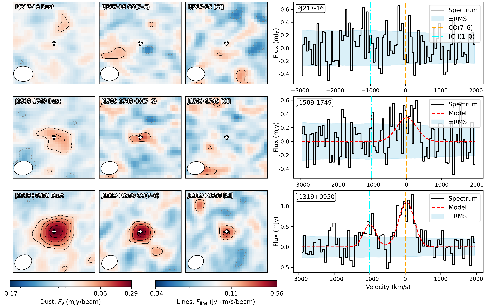
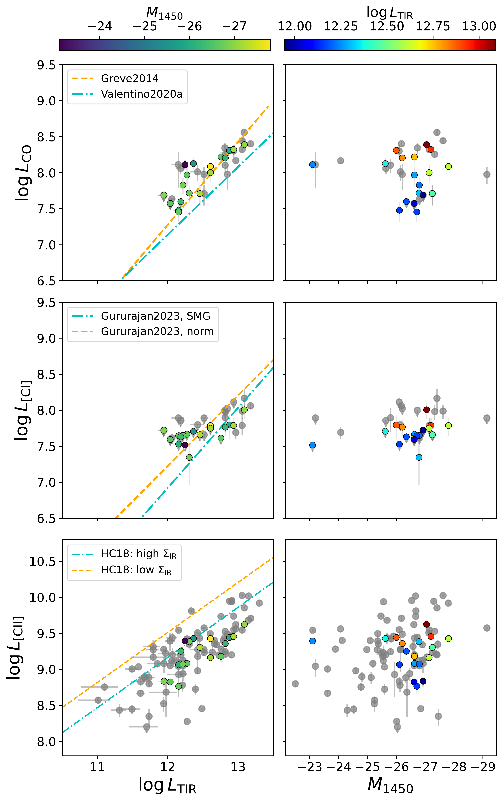
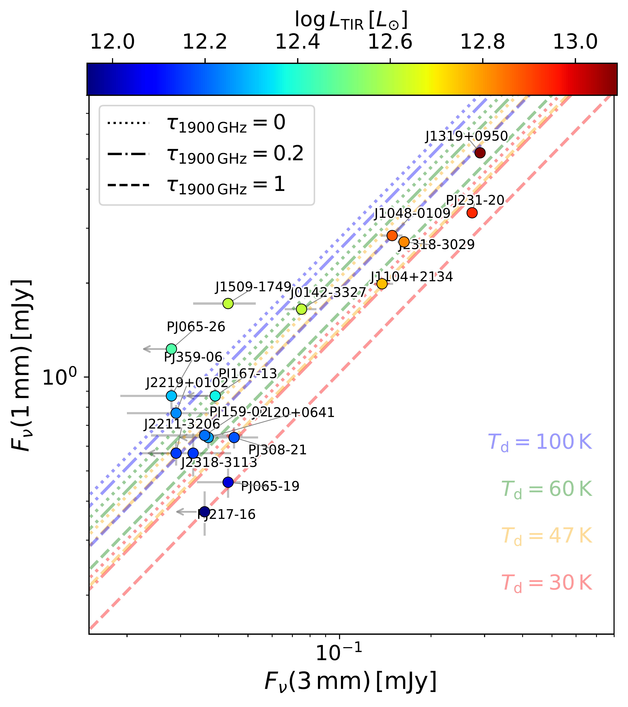

$\newcommand{\ensuremath}{}$
$\newcommand{\xspace}{}$
$\newcommand{\object}[1]{\texttt{#1}}$
$\newcommand{\farcs}{{.}''}$
$\newcommand{\farcm}{{.}'}$
$\newcommand{\arcsec}{''}$
$\newcommand{\arcmin}{'}$
$\newcommand{\ion}[2]{#1#2}$
$\newcommand{\textsc}[1]{\textrm{#1}}$
$\newcommand{\hl}[1]{\textrm{#1}}$
$\newcommand{\footnote}[1]{}$
$\newcommand{\cii}{\rm [CII]_{158 \mu m} }$
$\newcommand{\ci}{\rm [CI]_{369 \mu m} }$
$\newcommand{\oio}{\rm [OI]_{63 \mu m} }$
$\newcommand{\oi}{\rm [OI]_{145 \mu m} }$
$\newcommand{\fir}{L_{\rm FIR} }$
$\newcommand{\tir}{L_{\rm TIR} }$
$\newcommand{\nH}{{\rm log}  (n_{\rm H}/\rm cm^{-3})}$
$\newcommand{\G}{{\rm log}  G_0}$
$\newcommand{\Fx}{{\rm log}  (F_{\rm X}/\rm erg  s^{-1}  cm^{-2})}$

# CO(7-6) and [C i](2-1) survey in $z>6$ quasars

<mark>Appeared on: 2026-05-21</mark> -  _21 pages, 18 figures, accepted for publication in A&A_

<mark>F. Xu</mark>, et al. -- incl., <mark>E. Bañados</mark>, <mark>F. Walter</mark>, <mark>J. Li</mark>

**Abstract:** High-redshift ( $z\gtrsim6$ ) quasars are signposts of the earliest supermassive black holes and intense star formation, offering key laboratories for black hole--galaxy evolution at cosmic dawn. While far-infrared  studies have revealed large dust reservoirs and strong [ C ii ] emission, the physical condition and molecular gas content of their interstellar medium (ISM) remain uncertain. We present sensitive Atacama Large Millimeter/submillimeter Array Band 3 observations of the redshifted CO(7--6) and [ C i ] (2--1) emission lines and the underlying dust continuum in a sample of 18 quasars at $z \sim 6$ . We detected CO(7--6) in 15/18, [ C i ] (2--1) in 6/18, and continuum in 13/18 sources. Line luminosities and continuum fluxes were used to estimate molecular gas masses from CO, [ C i ] , and dust, and a hierarchical Bayesian cross-calibration of all four tracers yielded consistent per-source $M_{\rm H_2}$ estimates and global conversion factors. Comparison with photodissociation region (PDR) and X-ray dominated region model grids using the $L_{\rm[CII]}/L_{\rm[CI]}$ and $L_{\rm CO(7\text{--}6)}/L_{\rm TIR}$ ratios suggests gas densities of $n > 10^4$ cm $^{-3}$ and radiation fields of $G_0 \sim 10^3$ – $10^4$ for the subset of sources consistent with PDR solutions, while many quasars fall outside the model parameter space. Additional diagnostics based on the $L'_{\rm CO(7-6)}/L'_{\rm[CI](2-1)}$ ratio indicate that a large fraction of the molecular gas resides in a warm and highly excited phase. Together these results suggest that classical PDR heating alone cannot explain the observed line ratios and that additional volumetric processes such as X-ray irradiation, turbulence and shocks, or enhanced cosmic-ray heating likely influence the excitation of the cold ISM. These results demonstrate the power of multi-line diagnostics in revealing the excitation and structure of the cold ISM in early quasar host galaxies and highlight the need for a joint analysis of CO, [ C i ] , [ C ii ] , and dust emission to fully characterize star formation and heating driven by active galactic nuclei at cosmic dawn.

**Figure 12. -** ** Left:** Velocity-integrated line and continuum maps for three quasars: PJ217--16, J1509--1749, and J1319+0950. Each row corresponds to one source, with panels (from left to right) showing the rest-frame FIR dust continuum, CO(7--6), and [C i](2--1) emission. Contours are shown at $[\pm 2, \pm 4, \pm 8, \pm 16] \sigma$, and the synthesized beam is shown in the lower-left corner. The cross marks the optical/NIR centroid.
    ** Right:** Corresponding CO(7--6) spectra extracted at the source positions. The red dashed line shows single-Gaussian fits to each detected line, and the shaded region indicates the 1$\sigma$ noise level.
     (*fig:group1*)

**Figure 3. -** 
    Comparison between FIR and UV luminosities with molecular and atomic line luminosities for the quasar sample.
    Each row corresponds to a different emission line: from top to bottom, CO(7–6), [C i], and [C ii].
    The left column shows the correlation with total infrared luminosity ($\log L_{\rm TIR}$), while the right column shows the correlation with rest-frame UV magnitude ($M_{1450}$).
    Data points are color coded by the complementary variable (i.e., colored by $M_{1450}$ in the left column, and by $\log L_{\rm TIR}$ in the right column).
    Error bars are shown where available, and upper limits are indicated with gray arrows. Gray circles denote all currently published measurements at $z>5.7$ compiled from the literature. For CO(7–6), we compare with the best-fit relation from the local (U)LIRG sample of $\ci$tet{Greve2014}(orange dashed line) and from the main-sequence galaxies and starbursts at $z \sim 1.3$ of $\ci$tet{Valentino2020a}, which also includes mapped nearby objects from $\ci$tet{Liu2015}(cyan dash-dotted line). For [C i], we compare with the fits from all SMGs at $z=2$–4 of $\ci$tet{Gururajan2023}(cyan dash-dotted line) and the fit for main-sequence galaxies at $z \sim 1$(orange dashed line). For [C ii], we compare with the two average values of the [C ii]/IR luminosity ratio for low–$\Sigma_{\rm IR}$(orange dashed line) and high–$\Sigma_{\rm IR}$ galaxies (cyan dash-dotted line) from $\ci$tet{Herrera-Camus2018}.
     (*fig:luminosity_comparison*)

**Figure 2. -** Observed continuum flux densities at 3 mm and 1 mm for the $z\!\sim\!6$ quasar sample. Points are color mapped by $\log L_{\rm TIR}$; error bars are shown when available, and gray arrows denote limits. Overplotted are modified blackbody tracks that span dust temperatures $T_{\rm d}=\{30,47,60,100\} $K (colors) and an opacity index $\tau_{1900 {\rm GHz}}=\{0.2,1,5\}$(linestyles); the CMB at $z=6$ is included. The locus of the data is broadly consistent with $T_{\rm d}\approx47$--$60$ K and $\tau_{1900 {\rm GHz}}\approx0.2$--1. In the following, we adopt the $T_{\rm d}=47$ K, $\tau_{1900 {\rm GHz}}=0.2$ template when deriving IR luminosities and dust masses. (*fig:mm-cont*)

