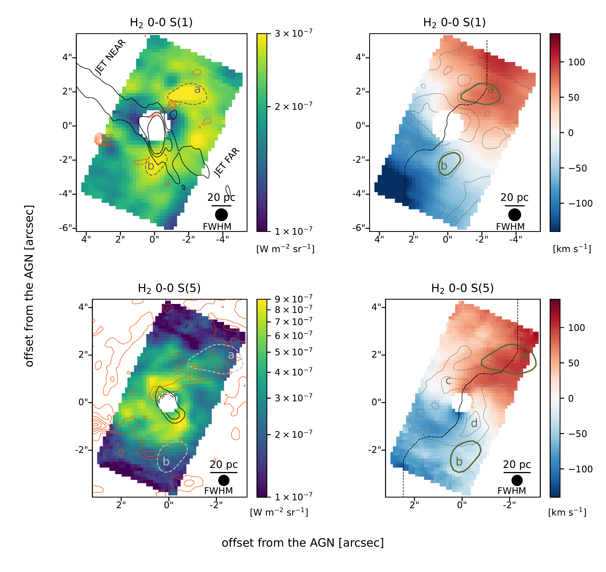
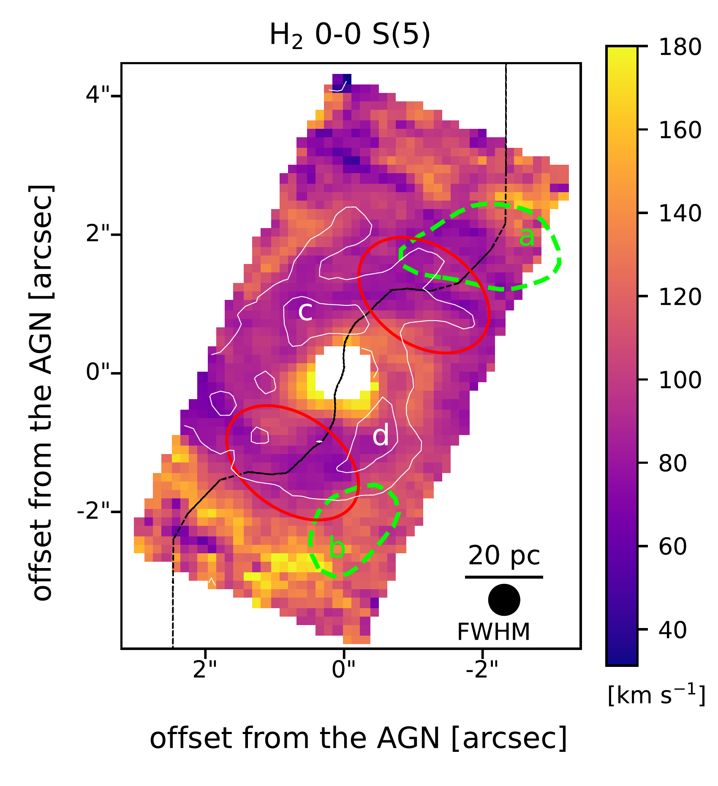
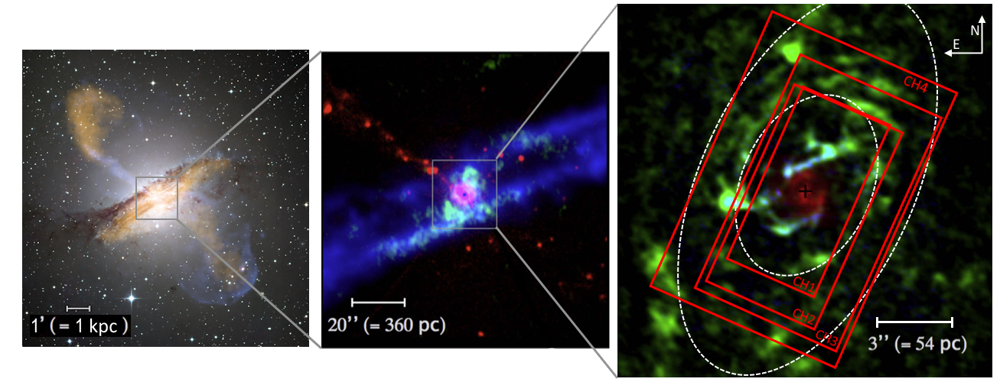

$\newcommand{\ensuremath}{}$
$\newcommand{\xspace}{}$
$\newcommand{\object}[1]{\texttt{#1}}$
$\newcommand{\farcs}{{.}''}$
$\newcommand{\farcm}{{.}'}$
$\newcommand{\arcsec}{''}$
$\newcommand{\arcmin}{'}$
$\newcommand{\ion}[2]{#1#2}$
$\newcommand{\textsc}[1]{\textrm{#1}}$
$\newcommand{\hl}[1]{\textrm{#1}}$
$\newcommand{\footnote}[1]{}$
$\newcommand{\Hi}{\ion{H}{1} }$
$\newcommand{\Hii}{\ion{H}{2} }$
$\newcommand{\Hmol}{\mbox{H_{\rm 2}}}$
$\newcommand{\Ht}{{\rm H_{2}} }$
$\newcommand{\cii}{[\ion{C}{2}] }$
$\newcommand{\oi}{[\ion{O}{1}] }$
$\newcommand{\kms}{km~s^{-1}}$
$\newcommand{\Msun}{M_{\odot}}$
$\newcommand{\Lsun}{L_{\odot}}$
$\newcommand{\pyr}{yr^{-1}}$
$\newcommand{\mum}{\mum}$
$\newcommand{\nH}{n_{\rm H}}$
$\newcommand{\mH}{m_{\rm H}}$
$\newcommand{ç}{\mbox{cm^{-3}}}$
$\newcommand{\vs}{\rm v_s}$

# MICONIC: The multiphase circumnuclear region of Centaurus A as seen with JWST/MIRI MRS observations: I. Spectral inventory and properties of the warm molecular disk

<mark>Appeared on: 2026-05-22</mark> - 

L. Evangelista, et al. -- incl., <mark>F. Walter</mark>

**Abstract:** **Context.** Supermassive black holes power Active Galactic Nuclei (AGN), injecting energy that may regulate accretion and shapes host galaxies. High–resolution observations of circumnuclear gas and dust are essential to understand these processes. **Aims.** We investigate the morphology, excitation, and kinematics of warm molecular hydrogen ($H_2$ ) in the inner circumnuclear disk of Centaurus A, the nearest radio galaxy. **Methods.** We present JWST/MIRI MRS integral-field spectroscopy of the central $170 \times 100$ pc $^2$ at 0.3"–0.7" (5–12 pc) resolution, focusing on pure rotational $H_2$ lines. The spectra exhibit strong nuclear continuum, and bright $H_2$ lines from S(1) to S(8), including the first S(8) detection in Centaurus A. The lines are optically thin in the nucleus, enabling maps of temperature, column density, and ortho-to-para ratio from spaxel-level excitation diagram fitting. **Results.** Warm $H_2$ shows a complex morphology, dominating the central region where CO emission is weak or undetected. Low-excitation $\Hmol$ lines trace an inhomogeneous ring with a 20-pc radius cavity aligned with the jet's near side, suggesting that the jet is affecting the morphology of the molecular disk. Higher-excitation lines form a filamentary structure around the AGN. Kinematics are primarily rotational with an S-shaped distortion, indicating non-circular motions or a warped disk. A coherent, low-dispersion ( $\sim$ 70 km s $^{-1}$ ) streamer spirals inward. A power-law temperature distribution yields a warm (100–2000 K) $H_2$ mass of $(5.6 \pm 1.4)\times10^5$ M $_\odot$ and a dynamical mass of $5\times10^8$ M $_\odot$ within 100 pc. Shock excitation is supported by enhanced $H_2$ /continuum and $H_2$ /PAH ratios, elevated [ NeIII ] / [ NeII ] , and sub-equilibrium ortho-to-para ratios (1.6–2.4). **Conclusions.** Turbulent dissipation can balance the observed $H_2$ cooling and likely dominates heating beyond 30 pc. In the inner 100 pc of Centaurus A, AGN feeding and feedback are linked: shocks excite $H_2$ , regulate the gas temperature, and prevent cooling below 100 K, explaining the weak CO emission and lack of a massive outflow. These shocks may drive angular momentum loss and help fuel the nucleus.

**Figure 8. -** Surface brightness maps (left) and velocity maps (right) of the $\Hmol$ lines 0--0 S(1) at 17 $\mum$  and S(5) at 6.9 $\mum$  with central spaxels masked due to spectral fringing (see Sect. \ref{sect:analysis_cubes}). The FWHM of the MRS PSF of the respective channel is shown in the lower right corner. The black contours on the top left map are 8.5 GHz radio VLA contours  (0.22, 3.3, 16 mJy beam$^{-1}$) from [Hardcastle, et. al (2003)](https://iopscience.iop.org/article/10.1086/376519/meta), tracing the jet that aligns with a central cavity seen on the S(1) (note that the VLA beam has a strong North-South elongation). The orange contours on the top left map are 434 $\mum$ ALMA CO(6--5) contours (0.01, 0.07, 0.12, 0.18, 0.24, 0.30 Jy km s$^{-1}$ beam$^{-1}$), while those on the bottom left panel are 870 $\mum$  ALMA CO(3--2) contours (-0.10, 1.17, 2.45, 3.72, 5.00, 6.28 Jy km s$^{-1}$ beam$^{-1}$) from [Espada, et. al (2017)](https://ui.adsabs.harvard.edu/abs/2017ApJ...843..136E). CO(6-5) is scarce, and most of CO(3--2) shows large cavities filled by warm $\Hmol$ emission. The black contours on the bottom left map are JWST infrared contours tracing [Ne{\sc  vi}] at 10.51 $\mum$, which features an alignment with the $\Hmol$ 0--0 S(5) hot patches and with the jet. The gray dashed contours on the left maps highlight the two bright hotspots (a) and (b) visible on the S(1) map. The hotspots align with the filaments on the S(5) map and the northern filament visible in CO(3--2) and CO(6--5). The same contours are superimposed in green on the right-side maps, along with the gray contours tracing the relative surface brightness maps, and the dashed black line tracing the line of the nodes of the warped-disk model from [Neumayer, et. al (2007)](https://doi.org/10.1086/523039). The contours of the hot S(5) patches aligned with the jet <20pc from the AGN are labeled (c) and (d) on the bottom right panel. (*fig:moment 0 maps*)

**Figure 3. -** Velocity dispersion map of the $\Hmol$ 0--0 S(5) line. Green contours trace the (a) and (b) hotspots identified in the S(1) map. The white contours represent the surface brightness of the line, with the (c) and (d) hot patches labeled. The black line indicates the line of the nodes of the warped disk model from [Neumayer, et. al (2007)](https://doi.org/10.1086/523039). The low-dispersion (70-90 $\kms$) spiral streamer overlays the S(5) filaments (white contours) and is consistent with a coherent bulk gas flow. The red ellipses trace the regions where 1D-Gaussian fits of the S(1) and the S(5) reveal residuals $>3\sigma_\mathrm{STD}$(see Fig. \ref{fig:disp_profiles}).  (*fig:s5m2*)

**Figure 6. -** Zoom into the inner region of Centaurus A adapted from [Espada, et. al (2017)](https://ui.adsabs.harvard.edu/abs/2017ApJ...843..136E). _Left:_ Color composite image of Centaurus A. Credit: ESO/WFI - Optical; MPIfR/ESO/APEX/[Weiß, et. al (2008)](http://dx.doi.org/10.1051/0004-6361:200809909) - Submillimeter; NASA/CXC/CfA/[Kraft, et. al (2003)](https://ui.adsabs.harvard.edu/abs/2003NewAR..47..625K) - X-ray. _Center:_ integrated CO(2-1) emission map from SMA (green)  ([Espada, et. al 2009](https://ui.adsabs.harvard.edu/abs/2009ApJ...695..116E)) ; dust emission at 8 $\mum$ from Spitzer/IRAC (blue)  ([Quillen, et. al 2006](https://ui.adsabs.harvard.edu/abs/2006ApJ...645.1092Q)) ; the jet in X-ray from Chandra (red)  ([Kraft, et. al 2003](https://ui.adsabs.harvard.edu/abs/2003NewAR..47..625K)) . _Right:_ integrated CO(3-2) and CO(6-5) maps from ALMA (respectively green and blue); $\Hmol$ 1--0 S(1) map at 2.122 $\mum$ from VLT/SINFONI (red). The red rectangles in the right panel are the mosaic footprints of the four MRS channels. The dashed white ellipses outline the CND as defined by [Espada, et. al (2017)](https://ui.adsabs.harvard.edu/abs/2017ApJ...843..136E).   (*fig:MRSfootprints*)

