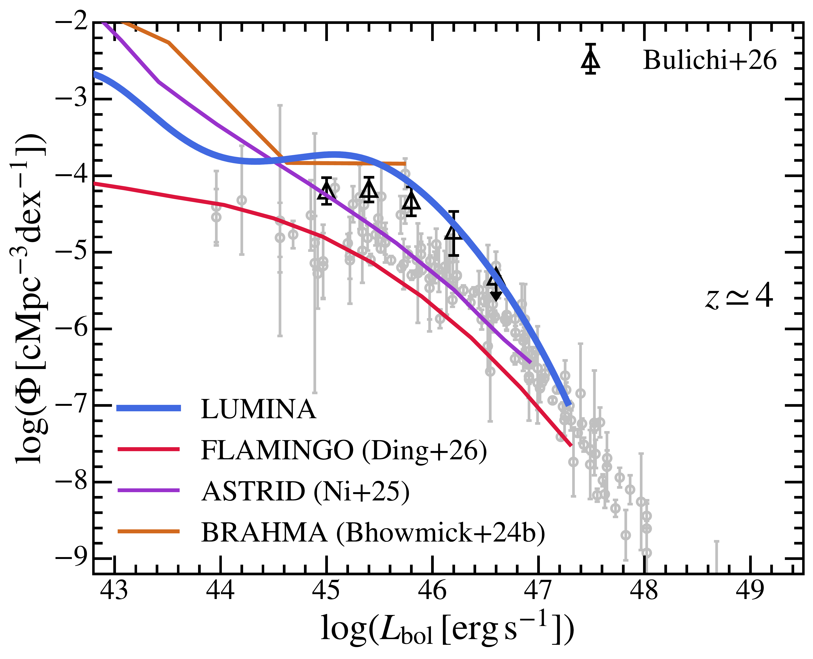
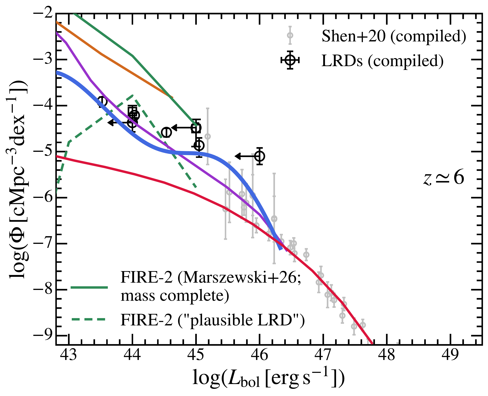
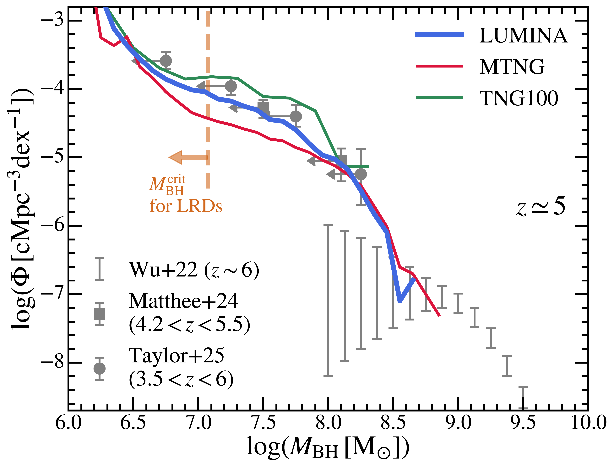
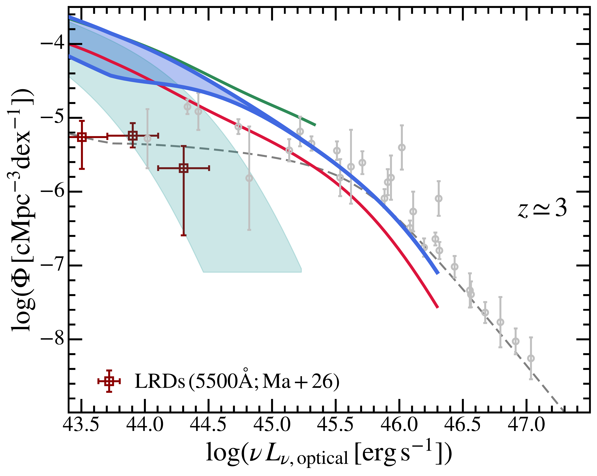
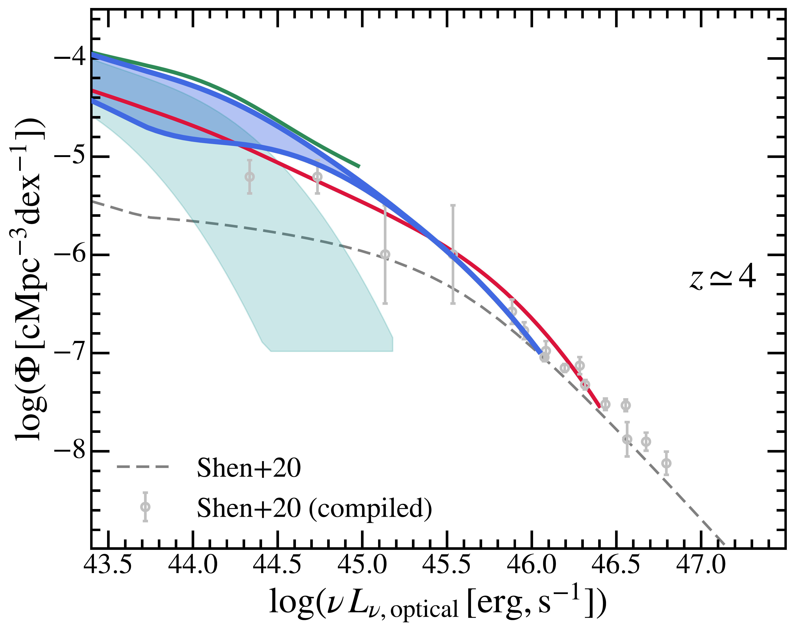
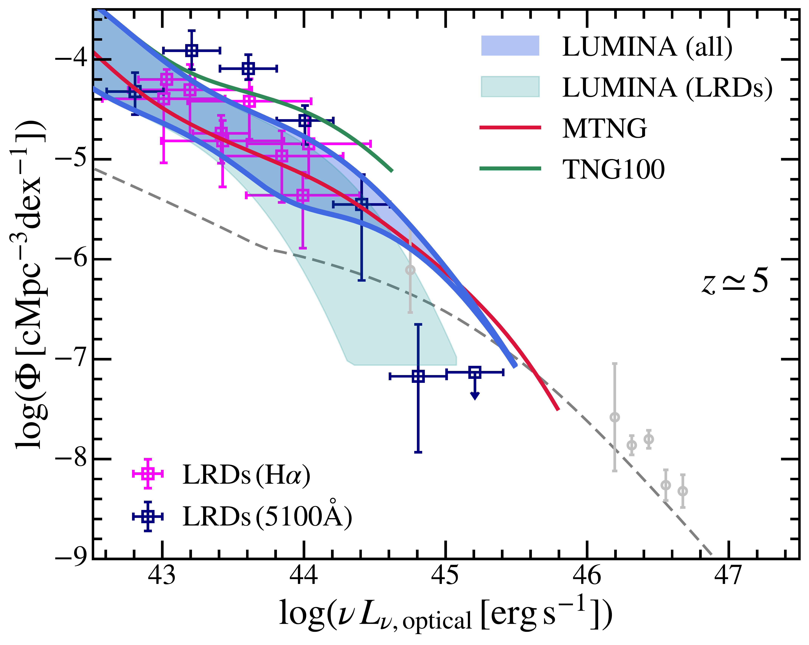

$\newcommand{\ensuremath}{}$
$\newcommand{\xspace}{}$
$\newcommand{\object}[1]{\texttt{#1}}$
$\newcommand{\farcs}{{.}''}$
$\newcommand{\farcm}{{.}'}$
$\newcommand{\arcsec}{''}$
$\newcommand{\arcmin}{'}$
$\newcommand{\ion}[2]{#1#2}$
$\newcommand{\textsc}[1]{\textrm{#1}}$
$\newcommand{\hl}[1]{\textrm{#1}}$
$\newcommand{\footnote}[1]{}$
$\newcommand{\dint}{ {\rm d}}$
$\newcommand{\msun}{{ \rm M_\odot}}$
$\newcommand{\Lsun}{{ \rm L_\odot}}$
$\newcommand{\kms}{ {\rm km} {\rm s}^{-1}}$
$\newcommand{\cm}{ {\rm cm}}$
$\newcommand{\erg}{ {\rm erg}}$
$\newcommand{\Gyr}{ {\rm Gyr}}$
$\newcommand{\K}{ {\rm K}}$
$\newcommand{\Myr}{ {\rm Myr}}$
$\newcommand{\pc}{ {\rm pc}}$
$\newcommand{\kpc}{ {\rm kpc}}$
$\newcommand{\pkpc}{ {\rm pkpc}}$
$\newcommand{\Mpc}{ {\rm Mpc}}$
$\newcommand{\Gpc}{ {\rm Gpc}}$
$\newcommand{\hkpc}{ h^{-1} {\rm kpc}}$
$\newcommand{\hmpc}{ h^{-1} {\rm Mpc}}$
$\newcommand{\cpm}{ {\rm cm}^2 {\rm g}^{-1}}$
$\newcommand{\gcm}{  {\rm g} {\rm cm}^{-3}}$
$\newcommand{\mum}{ \mu{\rm m}}$
$\newcommand{\mmag}{ {\rm mag}}$
$\newcommand{\kev}{ {\rm keV}}$
$\newcommand{\keV}{ {\rm keV}}$
$\newcommand{\msunpc}{ {\rm M}_\odot{\rm pc}^{-2}}$
$\newcommand{\msunkpc}{ {\rm M}_\odot{\rm kpc}^{-2}}$
$\newcommand{\Hz}{ {\rm Hz}}$
$\newcommand{\luminasim}{\textsc{Lumina}\xspace}$
$\newcommand{\thesan}{\textsc{Thesan}\xspace}$
$\newcommand{\thesanzoom}{\textsc{Thesan-Zoom}\xspace}$
$\newcommand{\thesanandhr}{\textsc{thesan(-hr)}\xspace}$
$\newcommand{\thesanhr}{\textsc{thesan-hr}\xspace}$
$\newcommand{\thesanone}{\textsc{Thesan-1}\xspace}$
$\newcommand{\thesantwo}{\textsc{Thesan-2}\xspace}$
$\newcommand{\arepo}{\textsc{Arepo}\xspace}$
$\newcommand{\areport}{\textsc{Arepo-rt}\xspace}$
$\newcommand{\illustrisTNG}{IllustrisTNG\xspace}$
$\newcommand{\tng}{\textsc{TNG100}\xspace}$
$\newcommand{\mtng}{\textsc{Mtng}\xspace}$
$\newcommand{\HM}{\ion{H}{_2}\xspace}$
$\newcommand{\HI}{\ion{H}{I}\xspace}$
$\newcommand{\HII}{\ion{H}{II}\xspace}$
$\newcommand{\HeI}{\ion{He}{I}\xspace}$
$\newcommand{\HeII}{\ion{He}{II}\xspace}$
$\newcommand{\HeIII}{\ion{He}{III}\xspace}$
$\newcommand\orcid[1]{\href{https://orcid.org/#1}{\adjustbox{trim={-.15\width} 0 {-.15\width} 0,clip}{\includegraphics[height=9pt]{orcid.pdf}}}}$
$\newcommand{\thebibliography}{\DeclareRobustCommand{\VAN}[3]{##3}\VANthebibliography}$
$\newcommand{\PRL}{Phys. Rev. Lett.}$
$\newcommand{\JCAP}{J. Cosmol.  Astropart. Phys.}$
$\newcommand{\jcap}{J. Cosmol.  Astropart. Phys.}$
$\newcommand{\aap}{A\&A}$
$\newcommand{\apj}{ApJ}$
$\newcommand{\aapr}{A\&A Rev.}$
$\newcommand{\apjl}{ApJ}$
$\newcommand{\mnras}{MNRAS}$
$\newcommand{\araa}{ARA\&A}$
$\newcommand{\aj}{AJ}$
$\newcommand{\NAR}{New Astron. Rev.}$
$\newcommand{\na}{New Astronomy}$
$\newcommand{\qjras}{QJRAS}$
$\newcommand{\physrep}{Phys. Rep.}$
$\newcommand{\nat}{Nature}$
$\newcommand{\natastro}{Nature Astronomy}$
$\newcommand{\aaps}{A\&A Supp.}$
$\newcommand{\apss}{Ap\&SS}$
$\newcommand{\apjs}{ApJS}$
$\newcommand{\prd}{Phys. Rev. D}$

# The $\luminasim$ Project: The Demographics of Active Galactic Nuclei from Quasars to Little Red Dots at $z\geq 3$

<mark>Appeared on: 2026-05-26</mark> -  _30 pages, 21 figures. To be submitted. Comments are welcomed!_

X. Shen, et al. -- incl., <mark>A. d. Graaff</mark>

**Abstract:** High-redshift active galactic nuclei (AGN) serve as powerful probes of early black-hole growth, galaxy formation, and the evolving intergalactic medium (IGM). In this work, we use $\luminasim$ , a cosmological radiation-hydrodynamic simulation spanning the epochs of hydrogen and helium reionization, which combines a large $(500 {\rm cMpc})^3$ volume with $2\times 6000^3$ resolution elements, to explore high-redshift AGN. The simulation self-consistently follows hundreds of millions of galaxies and supermassive black holes (SMBHs), together with their impact on the ionization and thermal state of the IGM. We exploit this uniquely large dynamic range to predict multi-band AGN luminosity functions (LFs) at $z \geq 3$ , from hard X-rays to the mid-infrared. These predictions encompass both moderately luminous quasars and the faint "Little Red Dots" (LRDs) uncovered by _JWST_ . We develop an empirical model that maps simulated SMBHs onto observed AGN using bolometric and extinction/absorption corrections for canonical AGN and LRDs, and in which SMBHs with $M_{\rm BH}\leq 10 M_{\rm seed} \sim 10^{7}\msun$ stay in the LRD phase with a duty cycle of $30\%$ . This simple framework reproduces the observed LFs and clustering of LRDs. Meanwhile, the pre- _JWST_ quasar LF constraints are recovered, although we find that a $\sim 0.3$ dex log-normal scatter in bolometric luminosity is required to reproduce the bright end. We place the simulated AGN population in the cosmological context by quantifying the redshift evolution of AGN and LRD number densities, and their contributions to the integrated BH mass densities. The same AGN population is the dominant driver for the $\HeII$ reionization modelled self-consistently in $\luminasim$ . This empirical AGN model paves the way for general population-synthesis models of high-redshift AGN, including LRDs, in a unified cosmological framework.

**Figure 11. -** Comparison of AGN bolometric LFs at $z\simeq 4$ and $6$ between $\luminasim$ and ASTRID  ([Ni, et. al 2022](https://ui.adsabs.harvard.edu/abs/2022MNRAS.513..670N), [Ni, et. al 2025](https://ui.adsabs.harvard.edu/abs/2025ApJ...990..120N)) , FLAMINGO  ([Schaye, et. al 2023](https://ui.adsabs.harvard.edu/abs/2023MNRAS.526.4978S), [Ding, et. al 2026](https://ui.adsabs.harvard.edu/abs/2026MNRAS.547ag308D)) , BRAHMA  ([Bhowmick, et. al 2024](https://ui.adsabs.harvard.edu/abs/2024MNRAS.534.1907B)) , and FIRE-2 (a "passive" BH model;  ([Marszewski, et. al 2026](https://ui.adsabs.harvard.edu/abs/2026ApJ..1002L..13M)) ). We include the observational data compiled in Section \ref{subsec:bol} for comparison. (*fig:sim-comparison*)

**Figure 1. -** SMBH mass function at $z\simeq 5$ in $\luminasim$, $\tng$, and $\mtng$. We compare the results with observational constraints of BLAGN from [Wu, et. al (2022)](https://ui.adsabs.harvard.edu/abs/2022MNRAS.517.2659W) for quasars and [Matthee, et. al (2024)](https://ui.adsabs.harvard.edu/abs/2024ApJ...963..129M), [Taylor, et. al (2025)](https://ui.adsabs.harvard.edu/abs/2025ApJ...986..165T) for LRDs. The latter should be considered as upper limits due to the large uncertainties in single-epoch BH mass estimates using local scaling relations. Specifically, we highlight the upper mass threshold ($M^{\rm crit}_{\rm BH}=10 M_{\rm seed}$) we set for the LRD population with the orange dashed line. (*fig:bhmf*)

**Figure 2. -** Rest-frame optical (B band, $\sim 4400$Å) LFs of AGN at $z\simeq 3-5$ from $\luminasim$, $\tng$, and $\mtng$. The shaded region represents the lower and upper limits of the LFs given uncertainties in bolometric corrections of the LRDs. We compare the results to optical observations compiled in [Shen, et. al (2020)](https://ui.adsabs.harvard.edu/abs/2020MNRAS.495.3252S) and LRD constraints from [Kokorev, et. al (2024)](https://ui.adsabs.harvard.edu/abs/2024ApJ...968...38K), [Ma, et. al (2025)](https://ui.adsabs.harvard.edu/abs/2025arXiv250902662M)(at $5100$Å) and [Matthee, et. al (2024)](https://ui.adsabs.harvard.edu/abs/2024ApJ...963..129M), [Lin, et. al (2024)](https://ui.adsabs.harvard.edu/abs/2024ApJ...974..147L), [Lin, et. al (2026)](https://ui.adsabs.harvard.edu/abs/2026ApJ...996...93L) based on H$\alpha$ at $z\sim 5-6$ and the ones from [Ma, et. al (2026)](https://ui.adsabs.harvard.edu/abs/2026ApJ..1000...59M)(at $5500$Å) at $z\sim 3$. The LRD constraints are all corrected to the B band luminosity using the SED model in Section \ref{subsec:lrdsed} and the scaling relation in Equation \ref{eq:5100-halpha}. (*fig:optlf*)

