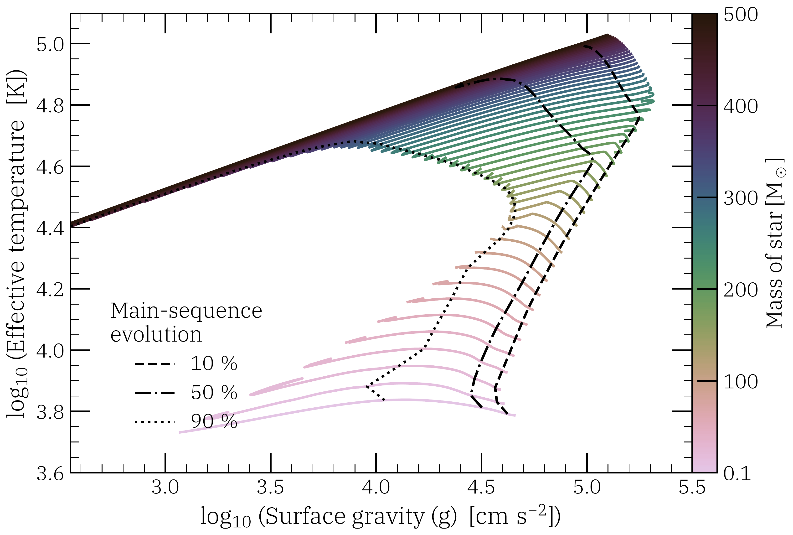
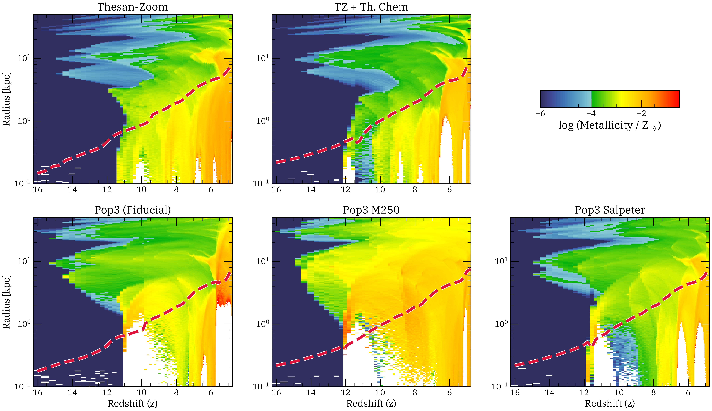
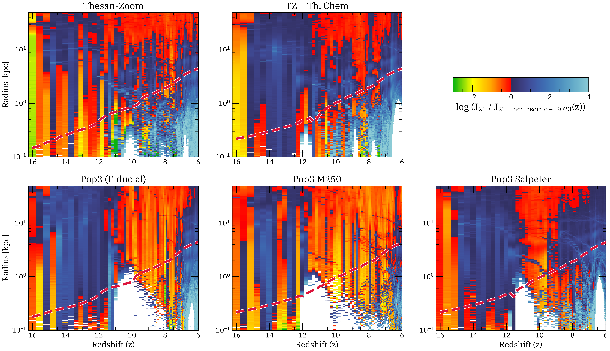

$\newcommand{\ensuremath}{}$
$\newcommand{\xspace}{}$
$\newcommand{\object}[1]{\texttt{#1}}$
$\newcommand{\farcs}{{.}''}$
$\newcommand{\farcm}{{.}'}$
$\newcommand{\arcsec}{''}$
$\newcommand{\arcmin}{'}$
$\newcommand{\ion}[2]{#1#2}$
$\newcommand{\textsc}[1]{\textrm{#1}}$
$\newcommand{\hl}[1]{\textrm{#1}}$
$\newcommand{\footnote}[1]{}$
$\newcommand{\M}{{\rm{M_\odot}}}$
$\newcommand{\hp}{\rm{H_2^+}}$
$\newcommand{\hmn}{\rm{H^-}}$
$\newcommand{\pt}{{Pop~III~}}$
$\newcommand{\warn}[1]{$
$  \begin{swarning}#1$
$\end{swarning}}$
$\newcommand{\mynote}[1]{$
$  \begin{note}#1$
$\end{note}}$
$\newcommand{\update}[1]{$
$  \begin{highlight}#1$
$\end{highlight}}$
$\newcommand{\rk}[1]{{\color{magenta}#1}}$
$\newcommand{\bs}[1]{{\color{red}#1}}$
$\newcommand{\pcc}{\rm{cm}^{-3}}$
$\newcommand{\arraystretch}{1.2}$
$\newcommand{\arraystretch}{1.3}$
$\newcommand{\arraystretch}{1.3}$
$\newcommand{\arraystretch}{1.5}$
$\newcommand{\thebibliography}{\DeclareRobustCommand{\VAN}[3]{##3}\VANthebibliography}$

# A framework for modelling Population III stars in cosmological simulations

<mark>Appeared on: 2026-05-27</mark> -  _28 pages, 24 figures. Submitted to MNRAS. Comments are welcomed_

<mark>B. Saha</mark>, R. Kannan, G. M. Mirouh

**Abstract:** Population III (Pop III) stars are the first generation of stars to form in the universe, emerging from primordial gas composed mainly of hydrogen and helium. They play a crucial role in ending the cosmic dark ages and initiating reionization. In this work, we present a comprehensive framework for modelling Pop III stars in cosmological simulations. This includes three key components: (1) an enhanced thermochemical network that tracks the equilibrium abundances of key catalytic species such as $\rm{H_2^+}$ and $\rm{H^-}$ , which are crucial for forming molecular hydrogen in primordial gas; (2) detailed stellar spectra of Pop III stars computed from ${\tt MESA}$ evolutionary tracks and ${\tt TLUSTY}$ atmosphere models; and (3) comprehensive supernova feedback, including both Core-Collapse and Pair-Instability supernovae, with detailed elemental yields. We implement these improvements in ${\tt AREPO-RT}$ and test them using cosmological zoom-in simulations of a $1.95 \times 10^9 \M$ halo at $z=3$ . Our results show that Pop III stars form at $z > 13$ and continue forming until $z \sim 5$ , significantly affecting early galaxy evolution through radiation and energetic supernova feedback. The enhanced thermochemistry enables more efficient gas cooling, while Pop III feedback creates photo-heated diffuse gas and drives distinct metal enrichment patterns at $10 < z < 6$ . The choice of IMF for Pop III stars critically determines the balance between radiative and mechanical feedback, with top-heavy choices producing stronger feedback and more metals but retaining less metal-enriched gas within the halo. Finally, we show that high-energy radiation from Pop III stars is necessary to explain the recent high-equivalent-width observations of the $\ion{He}{ii}$ line from a galaxy at $z\sim11$ .

**Figure 1. -** MESA stellar evolutionary tracks plotted in the effective temperature ($T_{\rm{eff}}$) - surface gravity (log(g)) phase space for $\pt$ stars as a function of $\rm M_\star \in [0.8, 500] $\M$$, with $10, 50, 90\%$ lifetimes of the stars indicated by dashed, dot-dashed and dotted black lines. (*fig:MESA_tracks*)

**Figure 22. -** Mass-weighted metallicity in spherical shells centred on the primary halo across the simulation variations. The red dashed line indicates the evolving virial radius ($R_{\rm 200m}$). For visual clarity, the lower bound of the colour scale is capped at $Z=10^{-6} Z_\odot$, capturing the initial star formation from pristine gas near the simulation floor of the metallicity; $Z=10^{-7} Z_\odot$(dark blue). The maps illustrate early, widespread intergalactic medium (IGM) enrichment by massive Pop III stars—most aggressively in the {\tt Pop3 M250} run—and the subsequent evacuation of inner-halo gas by intense supernova feedback (white gaps). (*fig:metallicity_shells*)

**Figure 23. -** Radial and redshift evolution of the volume-weighted LW flux ($J_{21}$), normalized to the \citet{Incatasciato_2023} cosmological background, across the six simulation variations. The red dashed line tracks the virial radius ($R_{\rm 200m}$) of the central halo. The panels highlight how early, intense Pop III radiation strongly suppresses cooling in the IGM at high redshifts ($z > 10$), followed by a highly localized surge in flux at $z < 7$ driven by vigorous, metal-enriched Pop II star formation deep within the assembling halo. (*fig:J21_shells*)

