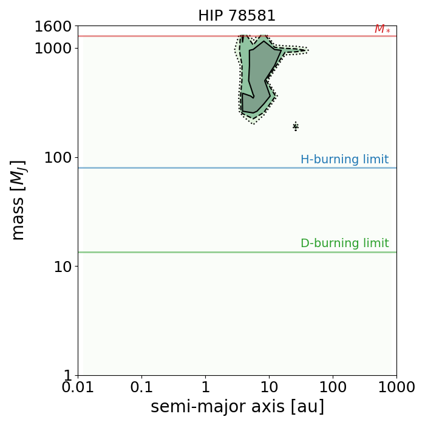
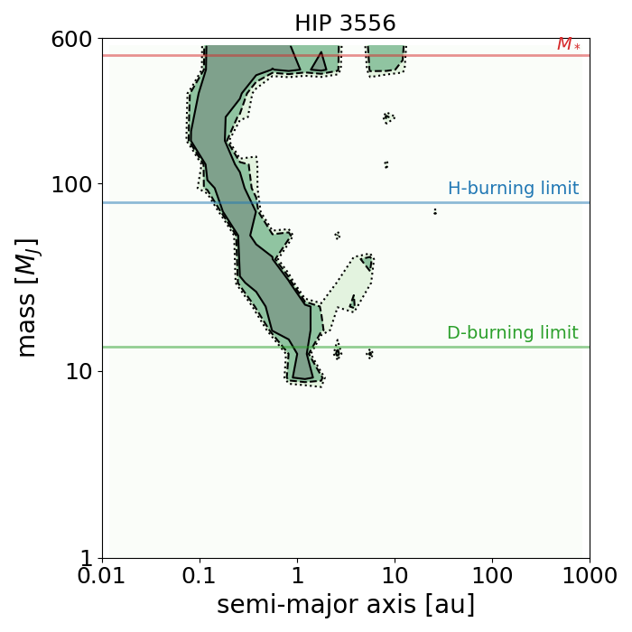
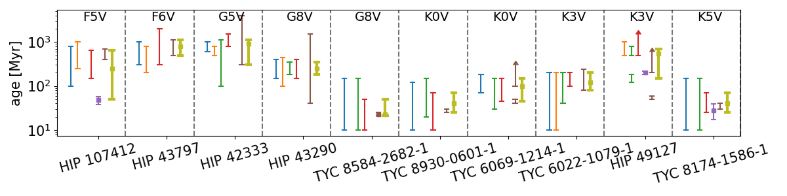
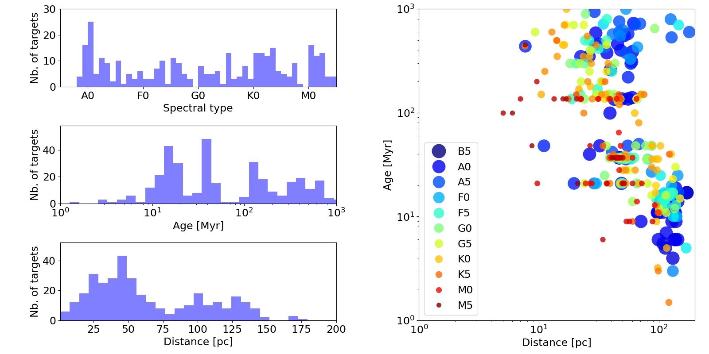

$\newcommand{\ensuremath}{}$
$\newcommand{\xspace}{}$
$\newcommand{\object}[1]{\texttt{#1}}$
$\newcommand{\farcs}{{.}''}$
$\newcommand{\farcm}{{.}'}$
$\newcommand{\arcsec}{''}$
$\newcommand{\arcmin}{'}$
$\newcommand{\ion}[2]{#1#2}$
$\newcommand{\textsc}[1]{\textrm{#1}}$
$\newcommand{\hl}[1]{\textrm{#1}}$
$\newcommand{\footnote}[1]{}$
$\newcommand\ms{ m s^{-1}}$
$\newcommand\cms{ cm s^{-1}}$
$\newcommand\m{2s2}$
$\newcommand\kms{ km s^{-1}}$
$\newcommand\vsini{v\sin{i}}$
$\newcommand\msini{m\sin{i}}$
$\newcommand\Msol{M_\odot}$
$\newcommand\Msun{M_\odot}$
$\newcommand\Mjup{M_{\text{Jup}}}$
$\newcommand\Rjup{R_{\text{Jup}}}$
$\newcommand\banyan{{\tt BANYAN} \Sigma}$
$\newcommand\teff{T_{\text{eff}}}$
$\newcommand\snr{\text{S/N}}$
$\newcommand\ruwe{\text{RUWE}}$
$\newcommand\pma{\text{PMa}}$
$\newcommand\prot{P_{\text{rot}}}$
$\newcommand\snrruwe{(\snr)_\ruwe}$
$\newcommand\snrpma{(\snr)_\pma}$
$\newcommand{\rnaas}{RNAAS}$
$\newcommand\snr{\text{S/N}}$
$\newcommand\ruwe{\text{RUWE}}$
$\newcommand\pma{\text{PMa}}$
$\newcommand\Msol{M_\odot}$

# The SPHERE infrared survey for exoplanets (SHINE): V. Full sample characterization

<mark>Appeared on: 2026-05-27</mark> -  _70 pages, 5 figures, 8 tables. Accepted for publication in A&A_

V. Squicciarini, et al. -- incl., <mark>G. Chauvin</mark>, <mark>W. Brandner</mark>, <mark>M. Feldt</mark>, <mark>T. Henning</mark>, <mark>A. Müller</mark>, <mark>M. Samland</mark>, <mark>A. Pavlov</mark>

**Abstract:** Unbiased surveys of large stellar samples are the prime means through which the prevalence of exoplanets can be derived, and crucial constraints to planet formation models can be set. Direct imaging (DI) is  ideally positioned to probe the outer regions (5--300 au) of planetary systems, providing complementary information to techniques such as transits and radial velocities. We present the full sample of the SpHere INfrared survey for Exoplanets (SHINE), the second largest DI campaign to date. SHINE observed 460 stars between 2015 and 2023 thanks to the Guaranteed Time Observations (GTO) allocated by ESO to the SPHERE consortium at VLT. The goal of this paper is to homogeneously derive the stellar properties of the targets and to define a subsample of young single hosts to be used as a starting point for the final statistical analysis of the survey. Stellar ages were determined based on kinematic indicators (such as the membership to young moving groups), age diagnostics (lithium abundance, rotation, activity), and isochrone fitting. A thorough vetting for binarity was undertaken combining astrometric, spectroscopic, and imaging data. A subsample of 333 stars, covering a large extent of stellar ages and masses, was constructed. Selection criteria, global features, as well as the properties of individual stars are reported and discussed.

**Figure 1. -** Constraints from {\tt GaiaPMEX} on the mass and semi-major axis of the companions responsible for the RUWE and PMa signal measured for HIP 78581 (top) and HIP 3556 (bottom). The colored regions, delimited by contours, correspond to 68.3\%, 95.4\%, and 99.73\% confidence intervals.  (*fig:gaiapmex_example*)

**Figure 2. -** Age estimates for ten representative stars with no clear YMG membership. The ages obtained via different methods are shown as ranges or lower limits: X-ray activity (blue), chromospheric activity (orange), rotation (green), lithium (red), YMG (lilac), isochrones (brown). The rightmost values represent the final adopted ages. (*fig:age_examples*)

**Figure 3. -** Left panel: distribution of age, spectral type and distance for the 333 stars belonging to the statistical sample. Right panel: relation among the three variables. (*fig:spt_age_distance*)

