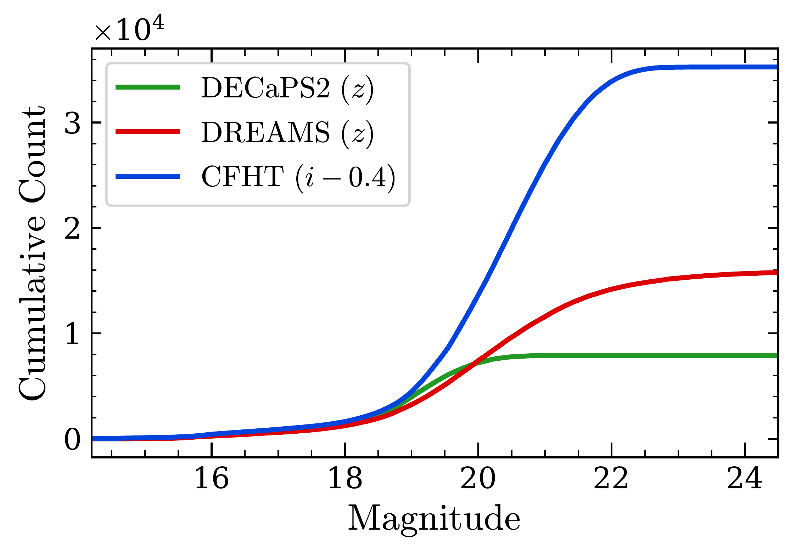
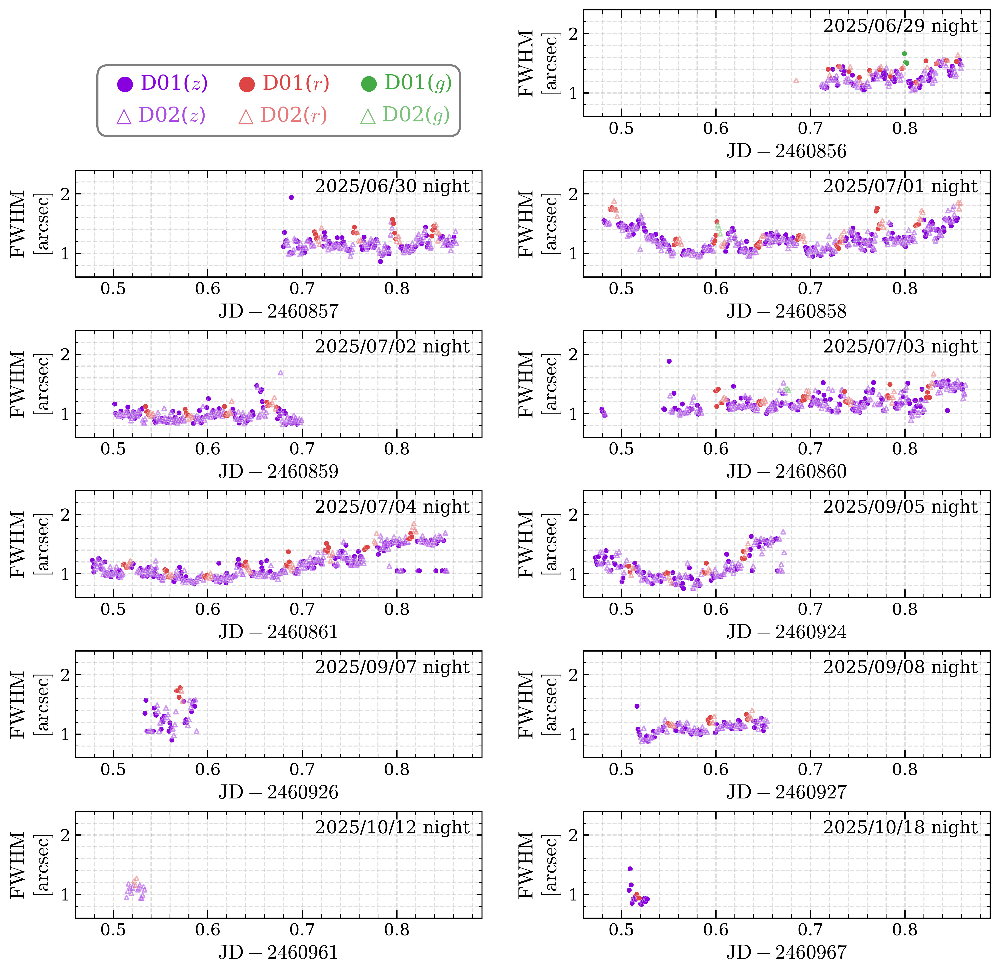
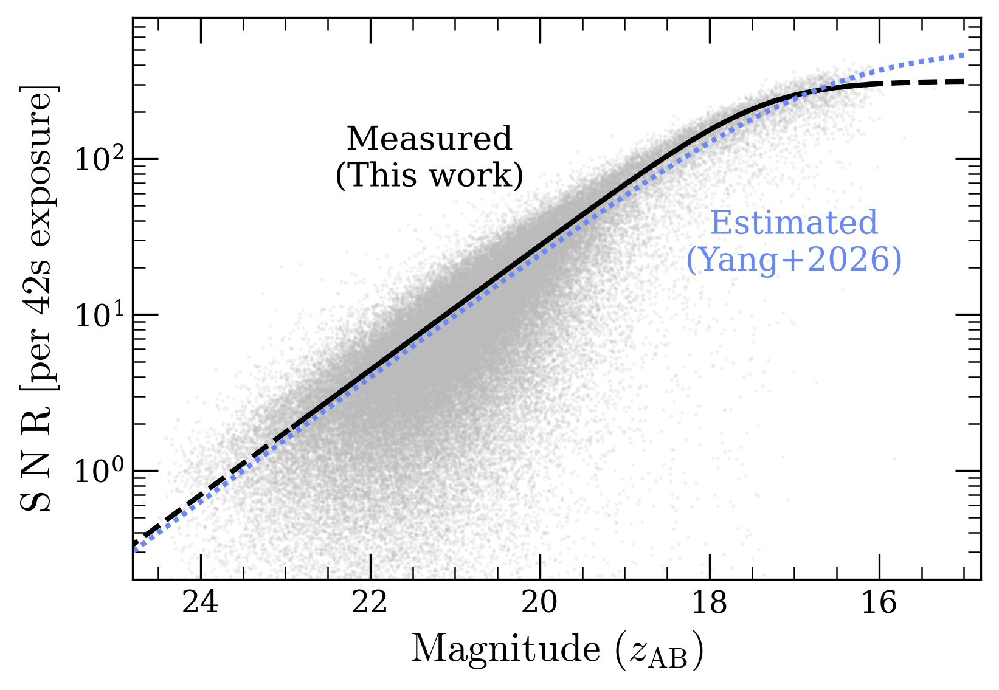

$\newcommand{\ensuremath}{}$
$\newcommand{\xspace}{}$
$\newcommand{\object}[1]{\texttt{#1}}$
$\newcommand{\farcs}{{.}''}$
$\newcommand{\farcm}{{.}'}$
$\newcommand{\arcsec}{''}$
$\newcommand{\arcmin}{'}$
$\newcommand{\ion}[2]{#1#2}$
$\newcommand{\textsc}[1]{\textrm{#1}}$
$\newcommand{\hl}[1]{\textrm{#1}}$
$\newcommand{\footnote}[1]{}$
$\newcommand{\HL}[1]{\textcolor{red}{#1}}$
$\newcommand{\HLb}[1]{\textbf{#1}}$
$\newcommand{\KMT}[2]{KMT-20{#1}-BLG-{#2}}$
$\newcommand{\OGLE}[2]{OGLE-20{#1}-BLG-{#2}}$
$\newcommand{\MOA}[2]{MOA-20{#1}-BLG-{#2}}$
$\newcommand{\tE}{t_{\rm E}}$
$\newcommand{\thetaE}{\theta_{\rm E}}$
$\newcommand{\thetas}{\theta_{*}}$
$\newcommand{\piE}{\pi_{\rm E}}$
$\newcommand{\bpiE}{\vec{\pi}_{\rm E}}$
$\newcommand{\piEE}{\pi_{\rm E,E}}$
$\newcommand{\piEN}{\pi_{\rm E,N}}$
$\newcommand{\xiE}{\xi_{\rm E}}$
$\newcommand{\bxiE}{\vec{\xi}_{\rm E}}$
$\newcommand{\xiEE}{\xi_{\rm E,E}}$
$\newcommand{\xiEN}{\xi_{\rm E,N}}$
$\newcommand{\Ds}{D_{\rm S}}$
$\newcommand{\Dl}{D_{\rm L}}$
$\newcommand{\Ml}{M_{\rm L}}$
$\newcommand{\Msun}{M_{\odot}}$
$\newcommand{\Mearth}{M_{\oplus}}$
$\newcommand{\Mjup}{M_{\rm J}}$
$\newcommand{\Vbar}{\overline{V}}$
$\newcommand{\tEi}{t_{{\rm E},i}}$
$\newcommand{\murel}{\mu_{\rm rel}}$
$\newcommand{\pirel}{\pi_{\rm rel}}$
$\newcommand{\pis}{\pi_{\rm S}}$
$\newcommand{\rE}{R_{\rm E}}$
$\newcommand{\nl}{n_{\rm L}}$
$\newcommand{\Rd}{R_{\rm d}}$
$\newcommand{\zd}{z_{\rm d}}$
$\newcommand{\sigsubt}{\sigma_{\rm sub}}$
$\newcommand{\sigresd}{\sigma_{\rm res}}$
$\newcommand{\Qirr}{Q_{\rm Irr}}$
$\newcommand{\e}{\varepsilon}$
$\newcommand{\eanom}{\varepsilon_{\rm anom}}$
$\newcommand{\edeg}{\HL{\varepsilon_{\rm uniq}}}$
$\newcommand{\textsc}[1]{#1}$

# ${\large A Minute-Cadence Deep Bulge Survey: First Data Release of DREAMS}$

<mark>Appeared on: 2026-05-27</mark> -  _18 pages, 11 figures, 2 tables. Data release portal: this https URL_

H. Yang (杨弘靖), et al.

**Abstract:** The DECam Rogue Earths and Mars Survey (DREAMS), a NOIRLab survey program, has been conducting a three-year survey covering a 5 deg $^2$ area in the Galactic bulge since 2025 June. Its primary science goal is to detect low-mass free-floating planets through microlensing, while its minute-level cadence also enables the detection and characterization of rapid phenomena on timescales of minutes to hours such as stellar flares and pulsating stars. Here, we present the data reduction and calibration of the DREAMS observations obtained in 2025 and introduce the first DREAMS data release (DR1). DR1 includes 1,856 $z$ -band observations and 325 $r$ -band observations for 59,372,789 stars. The DREAMS DR1 catalog contains at least twice as many stars as any previous catalog covering the same 5 deg $^2$ area. We present DREAMS light curves for a known blue large-amplitude pulsator and a known transiting system to demonstrate the survey's capabilities. We also perform a pilot search for short-duration variables over about 0.4 \% of the DR1 sample, identifying one new short microlensing event, two stellar flares, and 24 new short variables. This suggests that DREAMS DR1 may contain hundreds of stellar flares and thousands of previously unknown short variables.

**Figure 7. -** Cumulative number of catalog stars as a function of magnitude for DREAMS DR1 (red), DECaPS2 (green), and CFHT (blue), measured in a $2.53' \times 2.40'$ region centered at $(\alpha, \delta)_{\rm J2000}$ = (17:54:47.80, $-$29:32:50.27). The CFHT $i$-band magnitude are approximately converted to the $z$ band using a constant offset of 0.4 mag. (*fig:cat*)

**Figure 9. -** Full-width half-maximum (FWHM) of the point spread function (PSF) of the images as a function of time for each observation night in 2025. The $z$-, $r$-, and $g$-band observations are colored in magenta, red, and green, respectively. D01 and D02 observations are marked in circles and triangles, respectively. (*fig:obs2025*)

**Figure 1. -** Signal-to-noise ratio as a function of $z$-band magnitude for individual 42 s exposures. Gray points show a random subset of $10^6$ stars. The black line is the median SNR curve. For comparison, the blue dotted line shows the SNR estimate by [Yang, et. al (2026)](https://ui.adsabs.harvard.edu/abs/2026AJ....171..151Y). (*fig:snr*)

