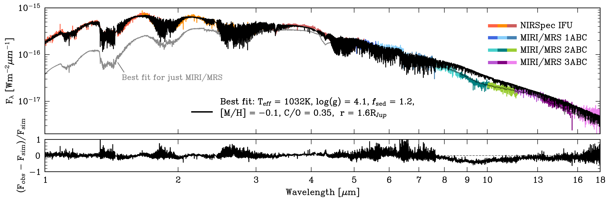
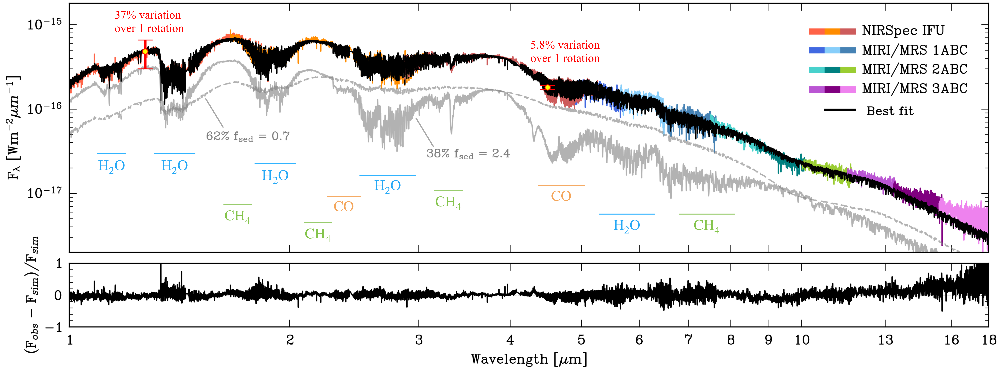
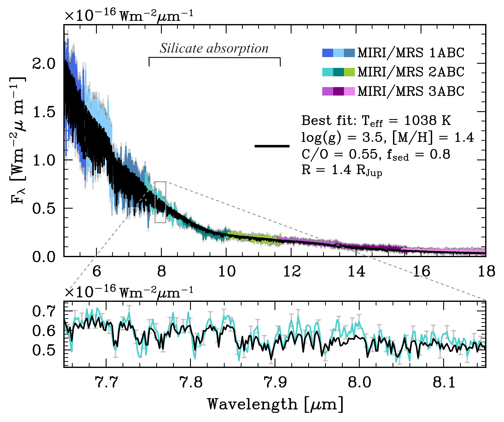

$\newcommand{\ensuremath}{}$
$\newcommand{\xspace}{}$
$\newcommand{\object}[1]{\texttt{#1}}$
$\newcommand{\farcs}{{.}''}$
$\newcommand{\farcm}{{.}'}$
$\newcommand{\arcsec}{''}$
$\newcommand{\arcmin}{'}$
$\newcommand{\ion}[2]{#1#2}$
$\newcommand{\textsc}[1]{\textrm{#1}}$
$\newcommand{\hl}[1]{\textrm{#1}}$
$\newcommand{\footnote}[1]{}$
$\newcommand{\tightsection}{\vspace{-0.5em}}$
$\newcommand{\logg}{\ensuremath{\log g}\xspace}$
$\newcommand{\met}{\ensuremath{\mathrm{[Fe/H]}}\xspace}$
$\newcommand{\co}{\ensuremath{\mathrm{C/O}}\xspace}$
$\newcommand{\vsini}{\hbox{v \sin i}\xspace}$
$\newcommand{\Kzz}{\ensuremath{K_{\textrm{zz}}}\xspace}$
$\newcommand{\vsed}{\ensuremath{v_{\textrm{sed}}}\xspace}$
$\newcommand{\fsed}{\ensuremath{f_{\textrm{sed}}}\xspace}$
$\newcommand{\Teff}{\ensuremath{T_{\textrm{eff}}}\xspace}$
$\newcommand{\taunuage}{\ensuremath{\tau_{\textrm{cloud}}}\xspace}$
$\newcommand{\fsedun}{\ensuremath{f_{\textrm{sed}, 1}}\xspace}$
$\newcommand{\fseddeux}{\ensuremath{f_{\textrm{sed}, 2}}\xspace}$
$\newcommand{\chisqreduced}{\ensuremath{\chi^2_{\rm red}}\xspace}$
$\newcommand{\loD}{\hbox{\lambda/D}\xspace}$
$\newcommand{\Nspec}{\ensuremath{N_{\textrm{spec}}}\xspace}$
$\newcommand{\kapext}{\ensuremath{\kappa_{\textrm{ext}}}\xspace}$
$\newcommand{\kapCIA}{\ensuremath{\kappa_{\textrm{CIA}}}\xspace}$
$\newcommand{\kapRayl}{\ensuremath{\kappa_{\textrm{Rayleigh}}}\xspace}$
$\newcommand{\kapline}{\ensuremath{\kappa_{\textrm{line}}}\xspace}$
$\newcommand{\kapaero}{\ensuremath{\kappa_{\textrm{aerosols}}}\xspace}$
$\newcommand{\Fold}{\ensuremath{F_{\textrm{old}}}\xspace}$
$\newcommand{\Fnew}{\ensuremath{F_{\textrm{new}}}\xspace}$
$\newcommand{\FUL}{\ensuremath{F_{\textrm{UL}}}\xspace}$
$\newcommand{\mubruit}{\ensuremath{\mu_{\textrm{noise}}}\xspace}$
$\newcommand{\sigUL}{\ensuremath{\sigma_{\textrm{UL}}}\xspace}$
$\newcommand{\Fcomb}{\ensuremath{F_{\textrm{comb}}}\xspace}$
$\newcommand{\Ffsedun}{\ensuremath{F_{f\textrm{sed}, 1}}\xspace}$
$\newcommand{\Ffseddeux}{\ensuremath{F_{f\textrm{sed}, 2}}\xspace}$
$\newcommand{\taucoal}{\ensuremath{\tau_{\textrm{coal}}}\xspace}$
$\newcommand{\taucond}{\ensuremath{\tau_{\textrm{cond}}}\xspace}$
$\newcommand{\taused}{\ensuremath{\tau_{\textrm{sed}}}\xspace}$
$\newcommand{\taumix}{\ensuremath{\tau_{\textrm{mix}}}\xspace}$
$\newcommand{\tauadv}{\ensuremath{\tau_{\textrm{adv}}}\xspace}$
$\newcommand{\taurad}{\ensuremath{\tau_{\textrm{rad}}}\xspace}$
$\newcommand{\Aobs}{\ensuremath{A_{\textrm{obs}}}\xspace}$
$\newcommand{\LSun}{\ensuremath{L_{\odot}}\xspace}$
$\newcommand{\MSun}{\ensuremath{M_{\odot}}\xspace}$
$\newcommand{\MJup}{\ensuremath{M_{\mathrm{Jup}}}\xspace}$
$\newcommand{\RJup}{\ensuremath{R_{\mathrm{Jup}}}\xspace}$
$\newcommand{\kms}{\ensuremath{\mathrm{km} \mathrm{s}^{-1}}\xspace}$
$\newcommand{\ms}{\ensuremath{\mathrm{m} \mathrm{s}^{-1}}\xspace}$
$\newcommand{\mic}{\ensuremath{\upmu\mathrm{m}}\xspace}$
$\newcommand{\exo}{\texttt{Exo-REM}\xspace}$
$\newcommand{\exoII}{{\small\textls[-50]{\texttt{Exo-REM~k26}}}\xspace}$
$\newcommand{\exok}{\texttt{Exo\_k}\xspace}$
$\newcommand{\formosa}{\texttt{ForMoSA}\xspace}$
$\newcommand{\petit}{\texttt{petitRADTRANS}\xspace}$
$\newcommand{\crires}{CRIRES\xspace}$
$\newcommand{\jwst}{JWST\xspace}$
$\newcommand{\hirise}{HiRISE\xspace}$
$\newcommand{\vhs}{VHS~1256~b\xspace}$
$\newcommand{\rev}[1]{\textcolor{magenta}{\textbf{#1}}\xspace}$
$\newcommand{\nouv}[1]{{\leavevmode{\boldmath\bfseries#1}}}$
$\newcommand{\arraystretch}{1.45}$
$\newcommand{\arraystretch}{1.3}$
$\newcommand{\arraystretch}{1.2}$
$\newcommand{\jcp}{J.~Chem.~Phys\@}$
$\newcommand{\largimgunecol}{0.47\textwidth}$
$\newcommand{\largimgdeuxcols}{0.97\textwidth}$

# Next-generation Exo-REM atmospheric models: Application to $\vhs$ to emulate patchy clouds

<mark>Appeared on: 2026-05-29</mark> -  _21 pages, 20 figures, and 4 tables_

A. Radcliffe, et al. -- incl., <mark>M. Ravet</mark>

**Abstract:** Condensate clouds are a defining feature of brown dwarf and exoplanet atmospheres, producing a broad range of colours on the colour–magnitude diagram (CMD) and giving rise to spectral features such as the distinct $\sim$ 10 $\mic$ spectral imprint, a prominent diagnostic for silicate clouds. Cloud cover is likely to be heterogeneous in many objects, with observed rotational variability providing key evidence for the presence of thick and thin cloud regions rotating in and out of view. Yet current one-dimensional (1D) atmosphere models, often lacking any parameter to tune cloud optical thickness, typically fail to reproduce the spectra of highly cloudy substellar objects, especially those with complex cloud structures. Our goal is to address these limitations by upgrading the $\exo$ atmosphere model, and by devising a more nuanced approach to better describe heterogeneous cloud cover with pre-computed 1D grids. Here, we present new self-consistent low- ( $R = 500$ ) and medium-resolution ( $R = \textrm{10,000}$ ) $\exo$ grids, hereafter $\exoII$ , featuring critical updates: (1) the incorporation of a cloud sedimentation parameter, $\fsed$ , to govern cloud opacity, thereby enabling even the reddest of objects to be accessed on a CMD, revealing a trend of decreasing $\fsed$ along the L--T transition (2) the substantial update of molecular opacities and abundances used, including new experimentally validated alkali line lists, and (3) the implementation of strict convergence criteria that entirely avoid unstable model solutions.Correcting an erroneous $\text{CH}_3\text{D}$ abundance leads to marked spectral changes for low- $\Teff$ (methane-rich) objects. As a consequence, applying $\exoII$ to the cool GJ 504 b leads to a revision of its parameters ( $\Teff = 473^{+14}_{-12}$ K, $\logg = 4.0\pm 0.1$ dex). For the notoriously variable $\vhs$ , a two-column $\exoII$ framework that emulates cloud heterogeneities achieves a significantly improved global fit over a single 1D model. Here, a $\sim$ 60-40 \% split of thick and thin clouds best describes its atmosphere, further confirming the presence of patchy clouds. In particular, this reproduces the strong $10 \mic$ silicate absorption in the MIRI/MRS ( $\jwst$ ) data of $\vhs$ , where 1D grids had previously failed, owing to the formerly unexplored low- $\fsed$ regime in the new model. The addition of the $\fsed$ dimension, as well as the two-column approach for heterogeneous cloud distributions, prove vital for accurately characterizing cloudy sub-stellar objects.

**Figure 14. -** _Top panel_: same as Fig. \ref{fig: vhs best fit MIRI} but with the MIRI + NIRSpec $\vhs$ observations (\citealp{Gauza2015}). The best fit for the MIRI/MRS spectrum only from Fig. \ref{fig: vhs best fit MIRI} is shown in grey, with reduced resolution for visibility. _Bottom panel_: the residual flux divided by the simulated flux. (*fig: vhs best fit 1column*)

**Figure 15. -** Final best fit for VHS 1256 b. _Top panel_: same as Fig. \ref{fig: vhs best fit 1column}, but using the two-column approach. Best fit parameters are $\Teff = 1153$ K, $\logg = 4.0$ dex, [M/H] = 0.08 dex, C/O = 0.60, $R = 1.2 $\RJup$$, with an $\alpha = 0.62$ so a linear combination of $\fsed = 0.7$(62\%) in grey dashed and $\fsed = 2.4$(38\%) in grey solid line. Both grey $\fsed$ components have been scaled by their proportion and multiplied by a factor of 0.6 for visibility. The two $\fsed$ component spectra are shown with reduced resolution for visibility. _Bottom panel_: same as Fig. \ref{fig: vhs best fit 1column}. (*fig: vhs best fit*)

**Figure 6. -** _Top panel_: 1 column best fit in black for only the $\vhs$ MIRI/MRS data (\citealp{Gauza2015}) from forward modelling with the medium resolution $\exo$II grid. Observation data are coloured according to MIRI channels. _Bottom panel_: a zoom of the best fit. The $1\sigma$ uncertainty is shown in grey in the top panel, and, in the bottom panel, as grey error bars for one out of four points. (*fig: vhs best fit MIRI*)

