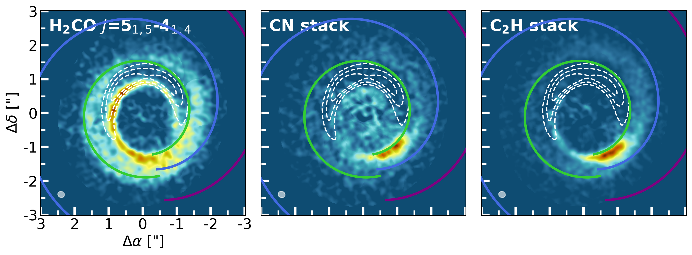

$\newcommand{\ensuremath}{}$
$\newcommand{\xspace}{}$
$\newcommand{\object}[1]{\texttt{#1}}$
$\newcommand{\farcs}{{.}''}$
$\newcommand{\farcm}{{.}'}$
$\newcommand{\arcsec}{''}$
$\newcommand{\arcmin}{'}$
$\newcommand{\ion}[2]{#1#2}$
$\newcommand{\textsc}[1]{\textrm{#1}}$
$\newcommand{\hl}[1]{\textrm{#1}}$
$\newcommand{\footnote}[1]{}$

# The asymmetric carbon-rich chemistry of the planet-forming disk of HD 142527 triggered by late infall

<mark>Appeared on: 2026-05-29</mark> -  _Accepted for publication in Astronomy & Astrophysics; 19 pages, 14 figures, 7 tables_

M. Temmink, et al. -- incl., <mark>M. Benisty</mark>

**Abstract:** The planet-forming disk of HD 142527 is known for its azimuthally asymmetric dust trap, shadows, and spiral arms. In this work, we use new observations of the Atacama Large Millimeter/submillimeter Array to investigate the molecular composition and to determine the ongoing chemical processes and the origin of its asymmetric molecular emission, and to infer possible effects of dust continuum obscuration. The observations cover a wide variety of molecular species over a large frequency range, enlarging the known molecular inventory of this system. Strikingly, the emission of $\ce{H_2CO}$ , $\ce{CN}$ , and $\ce{C_2H}$ is dominated by spiral-like features peaking in the southern region of the disk, opposite to the large dust trap, while no relation is found between the observed asymmetries and the shadows seen in the scattered light due to the misaligned inner disk. We attribute these features to low-density, late infalling, atomic carbon-rich material that locally enhances the C/O-ratio and, subsequently, facilitates the gas-phase formation of these species. Azimuthal offsets between the peak emission of $\ce{H_2CO}$ and that of $\ce{CN}$ and $\ce{C_2H}$ are possibly due to a delay of a few hundred years in the gas-phase formation of $\ce{H_2CO}$ . As opposed to the emission of $\ce{H_2CO}$ , $\ce{CN}$ , and $\ce{C_2H}$ , the emission of $\ce{C^{17}O}$ and the $\ce{HCO^+}$ $J$ =1-0 transition is aligned with the large dust trap, likely due to an azimuthal enhancement in the surface density. Differences between the two observed $\ce{C^{17}O}$ transitions may be due to dust obscuration effects. The latter effect is not expected to affect molecular emission at 3 millimetres, given the lower optical depth of the dust trap. The four observed transitions of $\ce{CS}$ display different azimuthal extents and strengths, with the lines with lower upper level energies appearing more ring-like. An analysis of the $\ce{^{13}CO}$ brightness temperature yields no significant temperature variations across the disk's azimuth. Therefore, we propose that the observed $\ce{CS}$ transitions trace two different reservoirs: a cold reservoir that resides on a Keplerian orbit and a second, hotter reservoir of $\ce{CS}$ that is facilitated by the infalling material and resides in a higher atmospheric layer of the disk. A single weak transition of $\ce{SO}$ is observed, which may be explained by weak shocks induced by the spirals observed in the scattered light that liberate sulphur. Future higher-resolution, multi-line observations of species such as $\ce{H_2CO}$ , $\ce{CS}$ , $\ce{CN}$ , and $\ce{C_2H}$ are needed to investigate the role and importance of late infalling material in setting the chemical composition of planet-forming disks.

**Figure 10. -** Integrated intensity maps of the dust continuum at 1.3 mm and the strongest detected molecular species in the disk of HD 142527. To increase the $S/N$-ratio of the respective integrated intensity maps, the images of the \ce{C^{17}O}$J$=1-0, \ce{C_2H} and \ce{CN} were created by stacking the detected transitions (two, four, and three transitions, respectively). The image of \ce{^{12}CO}$J$=2-1 was created with a different colour scaling to better highlight the weak extended emission. For the \ce{HCO^+}$J$=4-3 transition, we focused on imaging the Keplerian ring instead of the bright central spot. Subsequently, the integrated flux of the central spot may be lower than shown in [Temmink, et. al (2023)](https://ui.adsabs.harvard.edu/abs/2023A&A...675A.131T). Additionally, the displayed images of \ce{C^{17}O}$J$=1-0, \ce{^{13}C^{18}O}$J$=3-2, \ce{CS}$J$=2-1 and $J$=3-2, and \ce{H_2CO}$J$=2$_{0,2}$-1$_{0,1}$ were created using a robust value of 2.0. The resolving beams are shown in the lower-left corner of each image. (*fig:Gallery*)

**Figure 8. -** Integrated intensity maps of the \ce{H_2CO}$J$=5$_{1,5}$-4$_{1,4}$ transition and the stacked \ce{CN} and \ce{C_2H} transitions. Overlaid are the traced spiral features from the \ce{^{12}CO} brightness temperature channel maps (see Appendix \ref{sec:Spirals}). The white, dashed contours indicate the continuum emission at flux levels of 25\%, 50\%, and 75\%. (*fig:SpiralMolecules*)

**Figure 11. -** Selected channels of the weakly detected \ce{C^{34}S}$J$=7-6, \ce{H_2CS}$J$=10$_{1,10}$-9$_{1,9}$, and stacked \ce{c-C3H_2} transitions. The black contours indicate the 3$\sigma$ and 5$\sigma$ noise levels. (*fig:CM-WT*)

