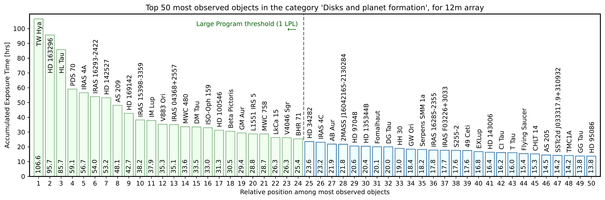
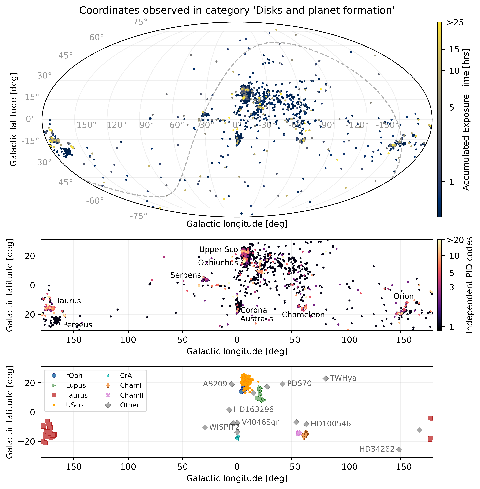

$\newcommand{\ensuremath}{}$
$\newcommand{\xspace}{}$
$\newcommand{\object}[1]{\texttt{#1}}$
$\newcommand{\farcs}{{.}''}$
$\newcommand{\farcm}{{.}'}$
$\newcommand{\arcsec}{''}$
$\newcommand{\arcmin}{'}$
$\newcommand{\ion}[2]{#1#2}$
$\newcommand{\textsc}[1]{\textrm{#1}}$
$\newcommand{\hl}[1]{\textrm{#1}}$
$\newcommand{\footnote}[1]{}$
$\newcommand{\nk}[1]{\textcolor{teal}{\textbf{Nico}: #1}}$
$\newcommand{\floatpagefraction}{0.8}$
$\newcommand{\textfraction}{0.05}$

# An archival summary: 15 years of ALMA observations on \\disks and planet formation

<mark>Appeared on: 2026-05-29</mark> -  _The data of this draft is also shown in this https URL and this https URL . The tables are available at this https URL . Article to be submitted to OJAp_

N. T. Kurtovic, et al. -- incl., <mark>M. Benisty</mark>, <mark>K. Doi</mark>, <mark>H. Jiang</mark>, <mark>L. Stapper</mark>

**Abstract:** The Atacama Large (sub-)millimeter Array (ALMA) has been in scientific operations for almost 15 years. We celebrate this achievement by providing a summary of the "Disks and planet formation" scientific category, with an emphasis on the disks located in the nearby star-forming regions. As of the beginning of February 2026, ALMA had observed 3933 independent coordinates, which we analyzed by their location in the sky, frequency coverage, exposure time, spectral line coverage, and angular resolution.We encourage the community to explore new scientific questions that are made possible through the archival datasets.

**Figure 6. -** Sources with the longest accumulated exposure time in the ALMA Archive, considering all observations taken with the 12 m array since ALMA Cycle 0. While the sources were selected among those in the "Disks and planet formation" science category, here we integrate the exposure time across observations from any science category (e.g., from "ISM and star formation" if available). In green, we show the sources with more exposure time than the shortest Large Program \citep[2016.1.00484.L,][]{andrews2018b, huang2018b}. (*fig:hist-timesource*)

**Figure 24. -**  Collection of disks with substructures in dust continuum emission, available in the literature. Each panel is 400 au in size, and the disks are scaled based on the Gaia DR3 parallax, ranging from largest to smallest continuum disk from top to bottom. Further details and references in Sect. \ref{sec:app:galleries}.  (*fig:disks_rings*)

**Figure 3. -** Distribution of coordinates observed as part of the scientific category "Disks and planet formation". In the top panel, the color scaling shows the accumulated exposure time per coordinate, including all ALMA Bands and time on source from other categories. The dashed line shows the coordinates where the Declination is 0, separating northern from southern sky. In the central panel there is a cut out of the galactic plane, with the color scale showing the number of independent project codes that have observed each coordinate. In the bottom panel, we show the matching  region from the extended PPVII table. (*fig:sky-comb-coordinates*)

