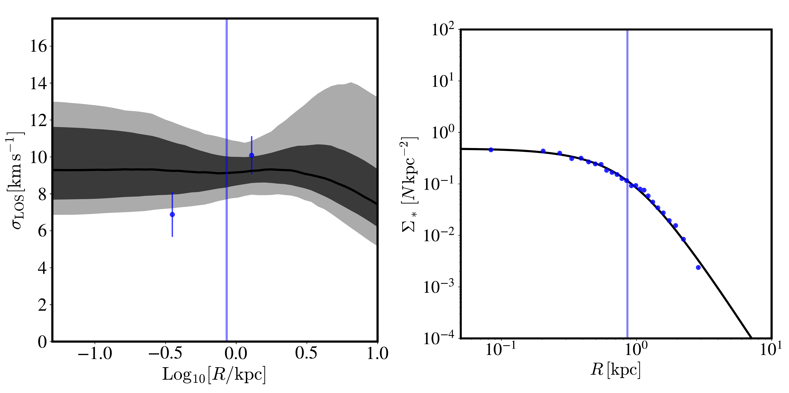
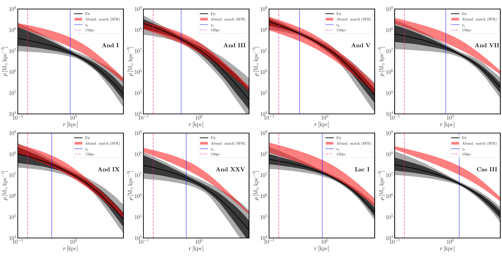
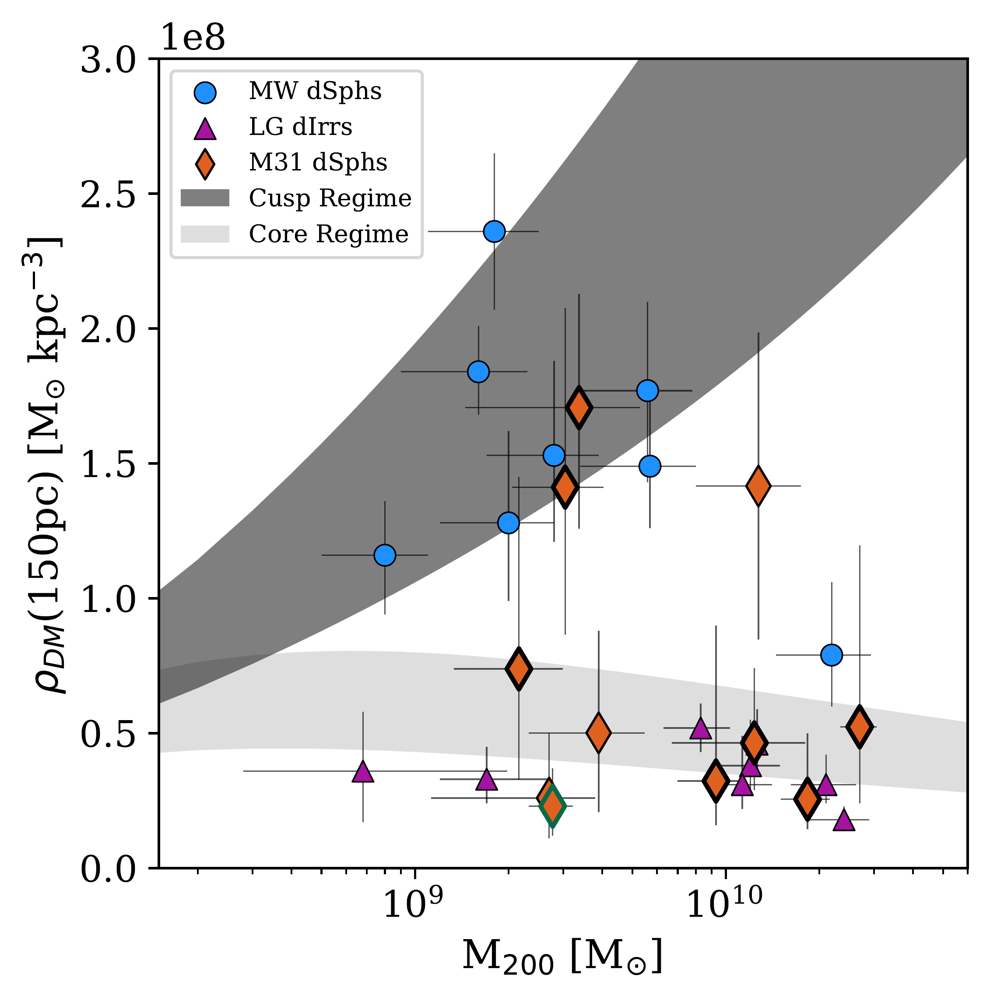

$\newcommand{\ensuremath}{}$
$\newcommand{\xspace}{}$
$\newcommand{\object}[1]{\texttt{#1}}$
$\newcommand{\farcs}{{.}''}$
$\newcommand{\farcm}{{.}'}$
$\newcommand{\arcsec}{''}$
$\newcommand{\arcmin}{'}$
$\newcommand{\ion}[2]{#1#2}$
$\newcommand{\textsc}[1]{\textrm{#1}}$
$\newcommand{\hl}[1]{\textrm{#1}}$
$\newcommand{\footnote}[1]{}$
$\newcommand{\vdag}{(v)^\dagger}$
$\newcommand\aastex{AAS\TeX}$
$\newcommand\latex{La\TeX}$
$\newcommand{\LCDM}{\LambdaCDM}$
$\newcommand{\gravsphere}{\texttt{GravSphere}}$
$\newcommand{\kms}{kms^{-1}}$
$\newcommand{\GSunit}{\times 10^{8} M_{\odot} kpc^{-3}}$
$\newcommand{\radden}{\rho_{\rm{150}}}$
$\newcommand{\vI}{-374.3 \pm 1.7}$
$\newcommand{\vIII}{-343.4 \pm 1.9}$
$\newcommand{\vV}{-396.3 \pm 1.5}$
$\newcommand{\vVII}{-306.8 \pm 1.7}$
$\newcommand{\vIX}{211.5 \pm 2.6}$
$\newcommand{\vXXXI}{-198.1 \pm 1.2}$
$\newcommand{\vXXXII}{-369.8 \pm 0.7}$
$\newcommand{\vdI}{10.2 \substack{+1.5 \ -1.2}}$
$\newcommand{\vdIII}{10.7 \substack{+1.7 \ -1.4}}$
$\newcommand{\vdV}{10.7 \substack{+1.3 \ -1.1}}$
$\newcommand{\vdVII}{12.2 \substack{+1.4 \ -1.2}}$
$\newcommand{\vdIX}{10.2 \substack{+2.5 \ -1.9}}$
$\newcommand{\vdXXXI}{12.1 \substack{+1.0 \ -0.9}}$
$\newcommand{\vdXXXII}{9.2 \substack{+0.6 \ -0.5}}$
$\newcommand{\DMI}{0.3 \substack{+0.6 \ -0.2} }$
$\newcommand{\DMIII}{1.4 \substack{+0.7 \ -0.6}}$
$\newcommand{\DMV}{1.7 \substack{+0.4 \ -0.5}}$
$\newcommand{\DMVI}{1.4 \pm 0.6}$
$\newcommand{\DMVII}{0.5 \substack{+0.6 \ -0.3}}$
$\newcommand{\DMIX}{0.8 \substack{+0.6 \ -0.4}}$
$\newcommand{\DMXXV}{0.2 \substack{+0.3 \ -0.1}}$
$\newcommand{\DMXXXI}{0.5 \substack{+0.3 \ -0.2}}$
$\newcommand{\DMXXXII}{0.3 \substack{+0.2 \ -0.1}}$
$\newcommand{\rhVI}{r_{\rm{h,VI}} = (489\pm{22}) pc}$
$\newcommand{\rhXXIII}{r_{\rm{h,XXIII}} = 1170 \substack{+95 \ -94} pc}$
$\newcommand{\MLVI}{(27.1 \pm 8.2) M_{\odot}/L_{\odot}}$
$\newcommand{\MLXXIII}{(90.2 \pm 53.9) M_{\odot}/L_{\odot}}$
$\newcommand{\arraystretch}{1.1}$
$\newcommand{\arraystretch}{1.8}$
$\newcommand{\arraystretch}{1.8}$
$\newcommand{\arraystretch}{1.25}$
$\newcommand{\arraystretch}{1.4}$
$\newcommand{\arraystretch}{1.4}$
$\newcommand{\arraystretch}{1.4}$
$\newcommand{\arraystretch}{1.7}$
$\newcommand{\arraystretch}{1.75}$
$\newcommand{\thebibliography}{\DeclareRobustCommand{\VAN}[3]{##3}\VANthebibliography}$

# It's Not Just Star Formation: A trend of low dark matter densities in the Andromeda dwarf galaxy system

<mark>Appeared on: 2026-06-02</mark> -  _21 pages, 14 Figures; Submitted to MNRAS_

C. S. Pickett, et al. -- incl., <mark>N. Martin</mark>

**Abstract:** Dynamical mass modeling of Andromeda (M31) dwarf spheroidal (dSph) galaxies has revealed a growing trend of lower central dark matter (DM) densities than predicted by pure DM structure formation in Lambda Cold Dark Matter ( $\LCDM$ ) cosmology simulations and lower than most Milky Way (MW) satellites. So far, however, only four of the 35 confirmed M31 dSphs have been successfully mass modeled. In this second paper of a series, we aim to better understand growing Local Group (LG) dSph patterns by mass modeling seven more M31 dSphs: Andromeda I, III, V, VII, IX, XXXI, and XXXII. We update the kinematics of each dwarf and estimate their central dark matter densities at 150 pc using the dynamical Jeans modeling tool, $\gravsphere$ . We also update their DM halo mass, $M_{\rm{200}}$ , via abundance matching. We find Andromeda III and V to have central DM densities in line with $\LCDM$ expectations, resembling dSphs around the Milky Way. The remaining five dwarfs have anomalously low central densities, continuing a growing trend seen for M31 satellites. We investigate each dwarf's star formation history and find that star formation-induced `DM heating' is disfavored as the sole explanation of these lower central densities. We consider the effect of tides and halo concentration scatter on these systems and predict that they should be on more plunging orbits than their denser counterparts. If this prediction is misaligned with the data, it could necessitate new physics beyond the Standard Cosmological Model.

**Figure 7. -** $\gravsphere$ diagnostic plots for Andromeda I. **Left**: Projected line-of-sight velocity dispersion ($\sigma_{\rm{LOS}}$). The dots are binned stellar velocity tracers, as estimated by \texttt{Binulator}, with each bin being shown with an associated error bar. The dark gray contour represents a 68\% confidence interval, while the light gray represents a 95\% confidence interval. **Right**: The tracer surface density profile ($\Sigma_{*}$). The dots in this plot are the binned stellar photometric tracers, shown with their associated error bars. **Both**: The solid vertical line represents the half-light radius of the dwarf as calculated by $\gravsphere$. How these plots are created within $\gravsphere$ is explained in \citet{Read_2017}. (*fig:And1_GSDiag*)

**Figure 3. -** Andromeda dwarf spheroidal dark matter density, $\rho(r)$, profile estimated by $\gravsphere$ (solid black line), with $1\sigma$ and $2\sigma$ uncertainties being denoted by the dark and light grey shaded regions, respectively. The red shaded region is the density profile estimated by $\langle{\rm{SFR}}\rangle$ abundance matching, assuming that each dwarf has a median $M_{\rm{200}}-c_{\rm{200}}$ value \citep{ReadErkal_2019}. The solid vertical line is the measured $r_{\rm{h}}$ of each dwarf The dashed vertical line shows 150 pc, the point at which DM density is measured. And I, And VII, And XXV, Lac I, and Cas III all show lower central DM densities at 150 pc and at their respective half-light radii. This is likely caused by a combination of star formation and tidal interactions with M31, which we discuss further in $\S$\ref{subsec:tides}. We note that this this trend could also be explained by scatter in $c_{\rm{200}}$. (*fig:And_Dwarf_DM_all*)

**Figure 1. -** Central dark matter density as a function of pre-infall halo mass, $M_{\rm{200}}$. The dark grey region represents a fully cusped profile, while the light grey region represents a fully cored profile (\texttt{CoreNFW} from \citet{Read_2016}). Both bands of a width corresponding to a 1$\sigma$ scatter in the DM halo concentration \citep{Dutton_2014}. Milky Way dwarf spheroidals are shown as circles, while Local Group dwarf irregulars are shown as triangles. Andromeda dwarf spheroidals are represented by diamonds. Diamonds with a thick border indicate the systems analyzed in this publication. Andromeda XXV is shown with a dark green border, with the only change from \citet{Charles_2022} being an updated $M_{\rm{200}}$ estimate due to new SFH data from \citet{Savino_2023}. Error bars on all points are 1$\sigma$ uncertainties, with the width of And XXV representing its $M_{\rm{200}}$ error. Data for these points were obtained via \citet{Read_2019}. Previous mass-modeled density data for Andromeda dwarfs were taken from C21, C23, and Paper I. (*fig:DM_summaryplot*)

