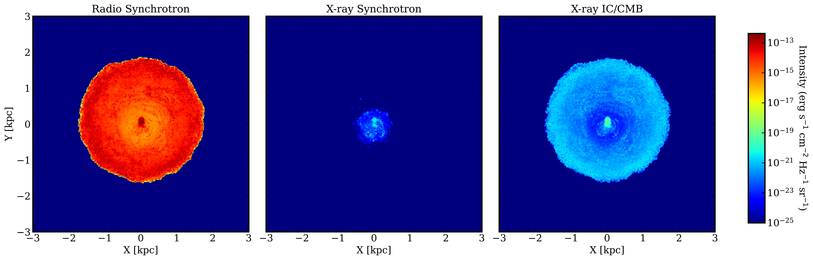
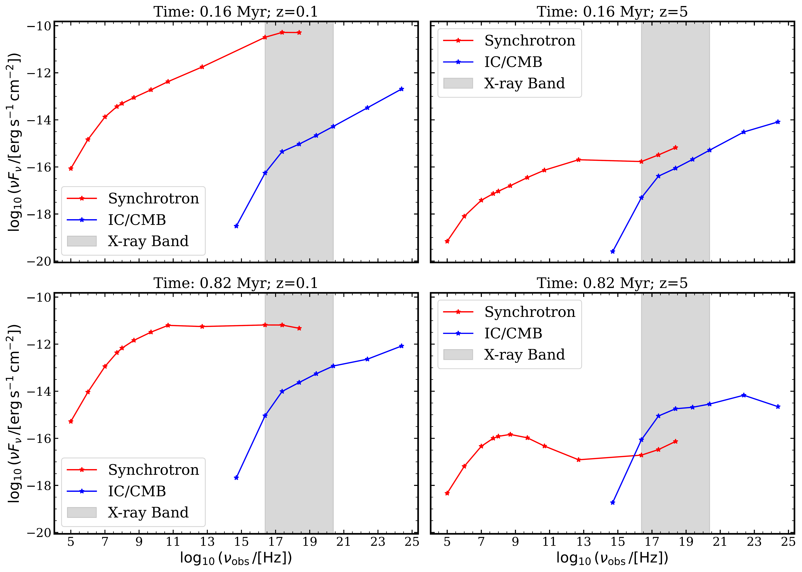
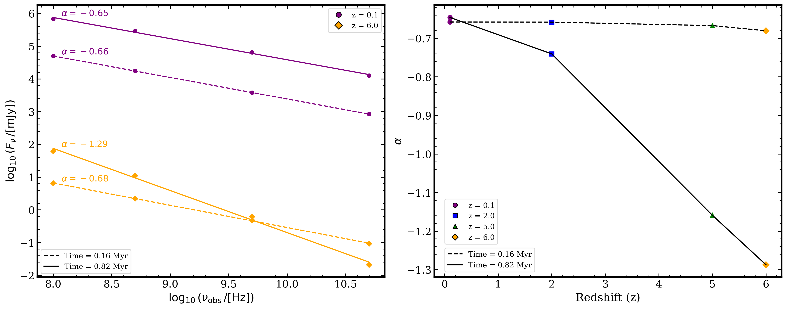

$\newcommand{\ensuremath}{}$
$\newcommand{\xspace}{}$
$\newcommand{\object}[1]{\texttt{#1}}$
$\newcommand{\farcs}{{.}''}$
$\newcommand{\farcm}{{.}'}$
$\newcommand{\arcsec}{''}$
$\newcommand{\arcmin}{'}$
$\newcommand{\ion}[2]{#1#2}$
$\newcommand{\textsc}[1]{\textrm{#1}}$
$\newcommand{\hl}[1]{\textrm{#1}}$
$\newcommand{\footnote}[1]{}$
$\newcommand{\vdag}{(v)^\dagger}$
$\newcommand\aastex{AAS\TeX}$
$\newcommand\latex{La\TeX}$

# The Radio--X-ray Correlation of High-Redshift AGN: A Numerical Study of Inverse-Compton Scattering of the CMB Photons in Relativistic Jets

<mark>Appeared on: 2026-06-02</mark> - 

A. Sharma, et al. -- incl., <mark>S. Belladitta</mark>, <mark>C. Fendt</mark>, <mark>E. Bañados</mark>

**Abstract:** Relativistic jets from active galactic nuclei are expected to exhibit strong redshift evolution in their radiative output due to the increasing energy density of the cosmic microwave background (CMB).We investigate the role of inverse Compton (IC) scattering of CMB photons in regulating the radio and X-ray emission from large-scale jets using three-dimensional relativistic magnetohydrodynamicsimulations coupled with a hybrid Eulerian–Lagrangian particle framework.By keeping the jet dynamics and ambient medium properties fixed across redshifts, we are able to isolate the impact of the cosmological evolution of the CMB on thejet radiation.From our simulations, we construct synthetic spectral energy distributions and intensity maps considering synchrotron and IC/CMB losses along with particle acceleration from shocks.We are able to reproduce the weak redshift dependence of radio luminosity and the strong enhancement of X-ray emission toward high redshift that is observed in radio-loud quasars.At high redshift, the X-ray luminosity follows the expected $(1+z)^4$ scaling, confirming IC/CMB as the dominant mechanism driving the X-ray enhancement.The resulting X-ray-to-radio flux ratio increases systematically with redshift and is consistent with observational constraints.Finally, we show that slower jets exhibit a stronger redshift evolution of the X-ray enhancement than faster jets, highlighting the critical role of jet propagation length scales and particle energy evolution.The simulations also naturally reproduce the steepening of the radio spectral index with redshift - the $\alpha$ – $z$ relation - thus providing a unified framework that allowsto interpret the multiwavelength properties of high-redshift radio sources.

**Figure 9. -** Intensity maps for Rg5z5 simulation at time 0.82 Myr for a viewing angle of $1^\circ$.
    **Left:** Radio synchrotron emission at observed frequency 500 MHz showing contributions from both the jet axis and cocoon.
    **Center:** X-ray synchrotron emission at 1 keV, confined to regions with very high-energy electrons along the jet axis.
    **Right:** X-ray IC/CMB emission at 1 keV, tracing the full jet due to interactions with the cosmic microwave background. (*Radiative Intensity*)

**Figure 10. -** SEDs of the Rg5 simulation at two time steps (rows) and two redshifts (columns).
    Each panel displays the synchrotron (red) and IC/CMB (blue) components as functions of frequency. The top and bottom rows correspond to simulation times of $t = 0.16$ Myr and $t = 0.82$ Myr, respectively, while the left and right columns represent redshifts $z = 0.1$ and $z = 5$. The gray shaded region denotes the X-ray band ($0.1-1000$ keV). (*fig:SED_time_z_grid*)

**Figure 11. -** Left: Log-log radio spectra used to compute the spectral index $\alpha$ for the Rg5 simulations at two evolutionary times, $t = 0.16$ Myr (dashed lines) and $t = 0.82$ Myr (solid lines). Filled circles and diamonds show the simulated flux densities at observing frequencies of 0.1, 0.5, 5.0, and 50 GHz for $z = 0.1$ and $z = 6.0$ respectively. Lines indicate the best-fitting linear relations of the form $\log(F_\nu) = \alpha \log(\nu) + \mathrm{constant}$, with the fitted slopes ($\alpha$) annotated. The spectra steepen with time for the $z > 0.1$.
Right: Spectral index $\alpha$ as a function of redshift for the same Rg5 simulations at $t = 0.16$ Myr (dashed line) and $t = 0.82$ Myr (solid line), derived from the fits shown in the left panel.
At early times, $\alpha$ shows only a weak dependence on redshift, whereas at later times the spectra steepen rapidly with increasing $z$, illustrating the emergence of a pronounced $\alpha$-$z$ relation in the simulations. (*fig:alpha_flux*)

