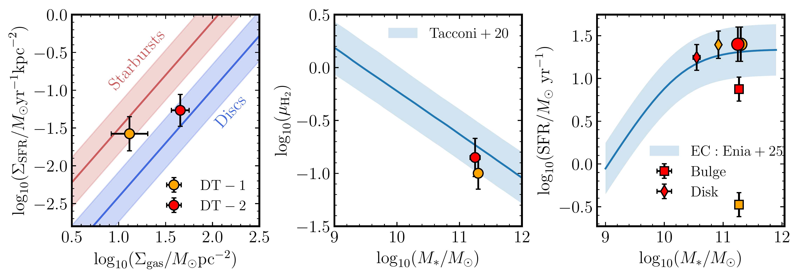
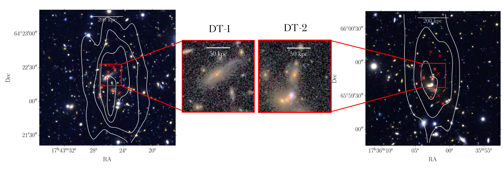
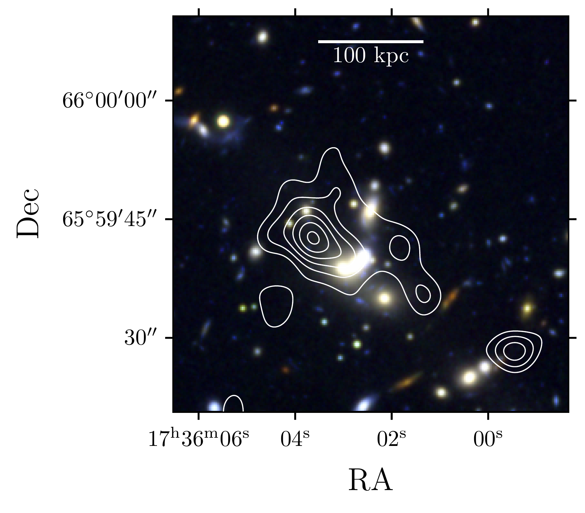

$\newcommand{\ensuremath}{}$
$\newcommand{\xspace}{}$
$\newcommand{\object}[1]{\texttt{#1}}$
$\newcommand{\farcs}{{.}''}$
$\newcommand{\farcm}{{.}'}$
$\newcommand{\arcsec}{''}$
$\newcommand{\arcmin}{'}$
$\newcommand{\ion}[2]{#1#2}$
$\newcommand{\textsc}[1]{\textrm{#1}}$
$\newcommand{\hl}[1]{\textrm{#1}}$
$\newcommand{\footnote}[1]{}$
$\newcommand{\linenumbers}[0]\usepackage$
$\newcommand{\orcid}[1]\bibliographystyle$
$\newcommand{\rev}{\bf \color{red}}$
$\newcommand{\linenumbers}[0]\usepackage$
$\newcommand{\Fig}{\mbox{Figure~}}$
$\newcommand{\Figs}{\mbox{Figures~}}$
$\newcommand{\Tab}{\mbox{Table~}}$
$\newcommand{\Tabs}{\mbox{Tables~}}$
$\newcommand{\Sec}{\mbox{Section~}}$
$\newcommand{\Secs}{\mbox{Sections~}}$
$\newcommand{\Eq}{\mbox{Equation~}}$
$\newcommand{\Eqs}{\mbox{Equations~}}$
$\newcommand{\App}{\mbox{Appendix~}}$
$\newcommand{\Apps}{\mbox{Appendices~}}$

# $\Euclid$: Disky titans -- surprisingly high star formation efficiency in two brightest group galaxies at z$\sim$0.75$\thanks{This paper is published on behalf of the Euclid Consortium.}$

<mark>Appeared on: 2026-06-03</mark> -  _Submitted to A&A, 14 pages, 7 figures, 2 tables_

F. Gentile, et al. -- incl., <mark>K. Jahnke</mark>

**Abstract:** We present the discovery of two disky titans ${in the first data release of the \Euclid satellite}$ . These sources are massive ( $M_\ast>10^{11}   M_\odot $ ) star-forming ( ${\rm SFR}\sim 20   M_\odot{\rm yr}^{-1}$ ) discs located in strong over-densities at intermediate redshift ( $z\sim0.75$ ). They represent an small fraction of the massive galaxies in over-dense regions (just four candidates in more than $20 \mathrm{deg}^2$ ${analysed in this study}$ ), and their existence is puzzling considering the abundance of passive and bulge-dominated sources commonly found at the centre of groups and clusters at low redshift. Firstly, our analysis shows that these objects are located in massive groups ( $M_{\rm h}\sim10^{13.8}   M_\odot$ ), where rapid accretion of cold gas should be prevented from the formation of a static hot halo. Despite this, a millimetre follow-up with NOEMA shows significant cold gas reservoirs ( $M_{\rm H_2}\sim10^{10.3}   M_\odot$ ) within these sources. Secondly, our morphological analysis shows the presence of a massive and passive bulge in these galaxies, which is expected to stabilise the disc against fragmentation thereby suppressing further star formation. However, these sources lie on the Schmidt--Kennicutt relation or even slightly above. Building on these observations, we propose a scenario where these disky titans are the product of a merger-induced rejuvenation episode, in which the most massive galaxy of a group accretes cold gas from another member and briefly restarts star-formation. Such scenario is supported by a comparison with the TNG300 simulation and easily explains the surviving of star-formation activity in massive galaxies in over-dense environments as temporary stages in a more complex evolution. More in general, our study showcases the ability of $\Euclid$ to find rare objects thanks to the unprecedented statistics offered by its surveys and the scientific potential residing in the synergy between $\Euclid$ and other facilities observing at longer wavelengths.

**Figure 5. -** Two disky titans compared with the Schmidt--Kennicutt relation ( (Schmidt_59, Kennicutt_98) ; _left panel_), with the main sequence of star-forming galaxies (as parametrised by  (Q1-SP031) ; _right panel_), and with the molecular gas fraction expected for MS galaxies at $z\sim0.75$( (Tacconi_20) ; _central panel_). In the _left panel_, we report the sequence of discs and star-bursting galaxies following Daddi_10a. In the _right panel_, we report the masses and SFR integrated over the whole galaxies, and of their bulges and disks separately (squares and diamonds, respectively) {derived following the procedure described in Sect. \ref{sec:morph}--\ref{sec:sed_fitting}.} (*fig:comparison*)

**Figure 4. -** Colour-composite images of the two targets analysed in this paper and the surrounding environments. Each large image covers one square arcminute, with a side roughly corresponding to $441$ proper $\mathrm{kpc}$ at $z\sim0.7$ and it is obtained through the Lupton_01 algorithm by combining the \IE, \YE, and \HE images. The white curves are the galaxy density field in units of $\sigma$ above the median starting from $3\sigma$. The candidate members (i.e., with a redshift compatible with the over-density and with a density contrast higher than $3\sigma$) are marked with red crosses. The inner panels report a zoom on the two disky titans, with sides of $20$\arcsec$ \times 20$\arcsec$$. These images are generated with \texttt{Jafar}$\footnote$mark to highlight low surface brightness features by combining the four \Euclid bands. (*fig:groups*)

**Figure 2. -** Diffuse X-ray emission of the massive group hosting DT-2 as observed by XMM-Newton. The contours show the X-ray emission in the soft band ($0.5\mbox{--}2 \mathrm{keV}$) in units of $\sigma$ above the median, starting from $5\sigma$ and with steps of $2\sigma$. The X-ray spectrum is consistent with thermal Bremsstrahlung with $T\sim4\times10^6 {\rm K}$ and a total $L_{\rm X}\sim2\times10^{43} {\rm erg s^{-1}}$. (*fig:xrays*)

