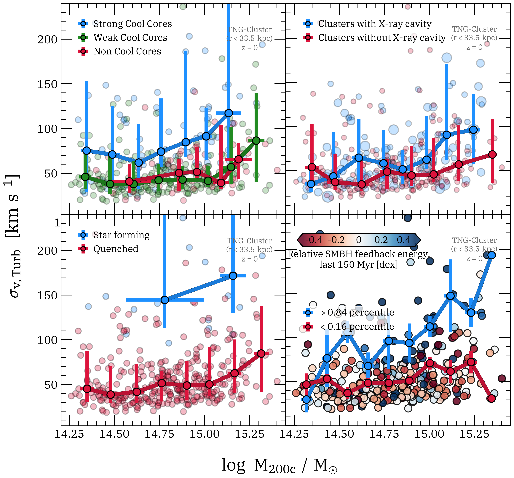

$\newcommand{\ensuremath}{}$
$\newcommand{\xspace}{}$
$\newcommand{\object}[1]{\texttt{#1}}$
$\newcommand{\farcs}{{.}''}$
$\newcommand{\farcm}{{.}'}$
$\newcommand{\arcsec}{''}$
$\newcommand{\arcmin}{'}$
$\newcommand{\ion}[2]{#1#2}$
$\newcommand{\textsc}[1]{\textrm{#1}}$
$\newcommand{\hl}[1]{\textrm{#1}}$
$\newcommand{\footnote}[1]{}$
$\newcommand{\warn}[1]{$
$  \begin{swarning}#1$
$\end{swarning}}$
$\newcommand{\mynote}[1]{$
$  \begin{note}#1$
$\end{note}}$
$\newcommand{\update}[1]{$
$  \begin{highlight}#1$
$\end{highlight}}$
$\newcommand{\ap}[1]{{\color{magenta}#1}}$
$\newcommand{\bs}[1]{{\color{BrickRed}#1}}$
$\newcommand{\change}[2]{{\st{#1}} {\hl{#2}}}$
$\newcommand{\MSUN}{\rm M_{\odot}}$
$\newcommand{\RVIR}{R_{\rm vir}}$
$\newcommand{\MTWOC}{M_{\rm 200c}}$
$\newcommand{\RTWOC}{R_{\rm 200c}}$
$\newcommand{\MVIR}{M_{\rm vir}}$
$\newcommand{\MFC}{M_{\rm 500c}}$
$\newcommand{\RFC}{R_{\rm 500c}}$
$\newcommand{\svt}{\sigma_{v,\rm{Turb}}}$
$\newcommand{\svb}{\sigma_{v,\rm{Bulk}}}$
$\newcommand{\svtot}{\sigma_{v,\rm{Total}}}$
$\newcommand{\thefigure}{\thesection.\arabic{figure}}$
$\newcommand{\thebibliography}{\DeclareRobustCommand{\VAN}[3]{##3}\VANthebibliography}$

# Bulk vs. turbulent motions at the centres of galaxy clusters:\ AGN-driven turbulence according to TNG-Cluster

<mark>Appeared on: 2026-06-05</mark> -  _24 Pages, 17 figures. Comments welcomed. Submitted to MNRAS_

<mark>B. Saha</mark>, et al. -- incl., <mark>A. Pillepich</mark>, <mark>J. Braspenning</mark>, <mark>D. Chatzigiannakis</mark>

**Abstract:** The highly dynamic intracluster medium (ICM) influences cluster thermodynamic evolution and probes key physical processes. Quantifying the non-thermal motions is therefore essential for understanding cluster physics and interpreting high spectral-resolution X-ray observations from telescopes like $_ XRISM_$ .    We quantify bulk and turbulent gas motions in 352 galaxy clusters at $z=0$ ( ${\rm M_{200c}=10^{14.3-15.4}  M_\odot}$ ) from the TNG-Cluster suite of magneto-hydrodynamical galaxy simulations. We use a multi-scale filtering Reynolds decomposition to separate total gas velocities into bulk (coherent) and turbulent (small-scale fluctuations) components.  We primarily focus on the hot X-ray emitting gas in the central core regions.    According to TNG-Cluster, majority of the ICM has subsonic turbulence but with broad velocity distributions reaching $\mathcal{M}_{\rm Turb}\sim 10$ and large cluster-to-cluster variations. In cluster centres, turbulence contributes less than half of the total velocity dispersion $(\sigma_{v\rm,Turb } \sim 0.5  \sigma_{v,\rm Total})$ for most clusters, with typical turbulent velocity dispersions of $50-75$ km s $^{-1}$ across the mass range, and with sub per cent levels of turbulent pressure support. Clusters that are strong cool cores, or have X-ray cavities, or experienced recent SMBH feedback energy injections exhibit systematically larger turbulent velocity dispersions and more prominent turbulent velocity tails. On average, the turbulent velocity dispersion peaks in cluster centres, decreases slightly to a minimum at $0.1-0.2   R_{\rm500c}$ , then rises again.    Our analysis shows that SMBH feedback is a key driver of turbulence in cluster cores, generating strong but short-lived motion alongside high-velocity outflows. It also calls for caution for interpreting $_ XRISM_$ observations.

**Figure 11. -** ** The dependence of the turbulent velocity dispersion on cluster properties related to SMBH feedback, according to TNG-Cluster.** In each panel we plot $\svt$ as a function of cluster mass ($M_{200c}$) in the cluster centres (central $33.5$ kpc sphere), with one marker representing one simulated cluster colour-coded by a cluster property and with solid curves representing median trends of specific clusters subsets (error bars for the 16th-84th percentile ranges). We focus on the hot X-ray-emitting gas ($T > 10^{5.5}$ K). Panels show properties primarily influenced by SMBH feedback: cool-core classification (SCCs=blue, WCCs=crimson, NCCs=green); presence of X-ray cavities (with cavities=blue, without=crimson; marker size indicates number of cavities); specific star formation rate of central galaxy (quenched vs. star-forming); and kinetic energy released as feedback by the SMBH at the center in the last 150 million years ({above and below the 84th and 16th percentiles for a given mass}). Strong cool-core clusters, clusters with X-ray cavities, clusters with star-forming BCGs and those with enhanced SMBH feedback at recent times show systematically higher turbulent velocity dispersions. (*fig:m-sigma_turb_SMBHProps*)

**Figure 7. -** ** Spatially-resolved turbulent and bulk motions in the cluster centres for a subset of representative TNG-Cluster systems.**
    Each row shows a different cluster projected along the $z$ axis of the simulation box. The columns represent gas quantities, from ** left $ \to $  right**: projected density, projected line-of-sight (LoS) velocities, projected radial turbulent velocities, and projected radial bulk velocities. These are all within a central region of length $2\times33.5$ kpc, to mimic the extent of the FoV of a single _ XRISM_ pointing at the redshift of the Perseus cluster. White contours indicate, qualitatively, regions of rapid subsonic flow with local Mach numbers in the range 0.25 – 0.9. We plot these contours to visually highlight the expanding gas shells where radially-outward shocks and accompanying X-ray cavities are located \citep[see][for a detailed analysis of shocks and cavities in TNG-Cluster]{Prunier_2025c}. Bulk radial velocities de facto represent outflows, while turbulent radial velocities reveal downstream turbulence, which is strongest near shocks. One cluster (4th row) exhibits bipolar outflows with associated turbulence ($\sim 100$ km s$^{-1}$). The velocity field morphologies vary significantly from cluster to cluster, but turbulent velocities are consistently a small fraction of the total velocities -- a trend seen throughout the TNG-Cluster sample.
   (*fig:RD_collection*)

**Figure 8. -** ** Velocity distributions of bulk and turbulent motions of the hot X-ray-emitting gas ($T > 10^{5.5**$ K) in the centres of clusters of the TNG-Cluster simulation.}{In all cases, we quantify the distributions by providing the amount of ICM gas in each velocity bin. From \bf Left} to ** right**, we show the distributions of line-of-sight (LoS), radial, and 3D velocities, all within the central $33.5$ kpc sphere of each cluster. The ** top** row shows the bulk velocity distributions and the ** bottom** row shows the turbulent velocity distributions. Thin curves denote individual clusters; bold curves represent the median velocity distribution in each cluster mass bin. Bulk velocity distributions are broad and strongly mass dependent, with bulk velocities reaching values of $\mathcal{O}(\pm 1000)$ km s$^{-1}$. On the other hand, turbulent velocity distributions are much narrower ($\mathcal{O}(\pm 100)$ km s$^{-1}$) and symmetric: {they exhibit somewhat weaker cluster-mass dependence than bulk motions but still more massive clusters clearly show }  broader and more extended high-velocity tails.
   (*fig:vel-distribution*)

