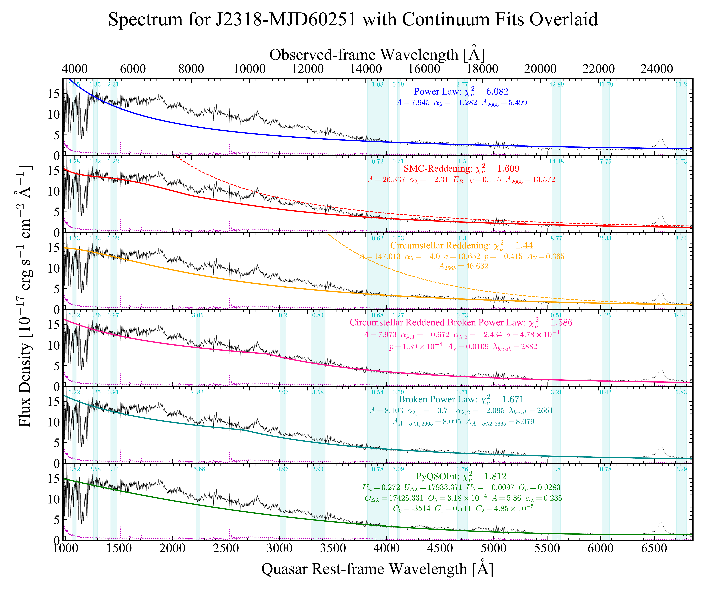
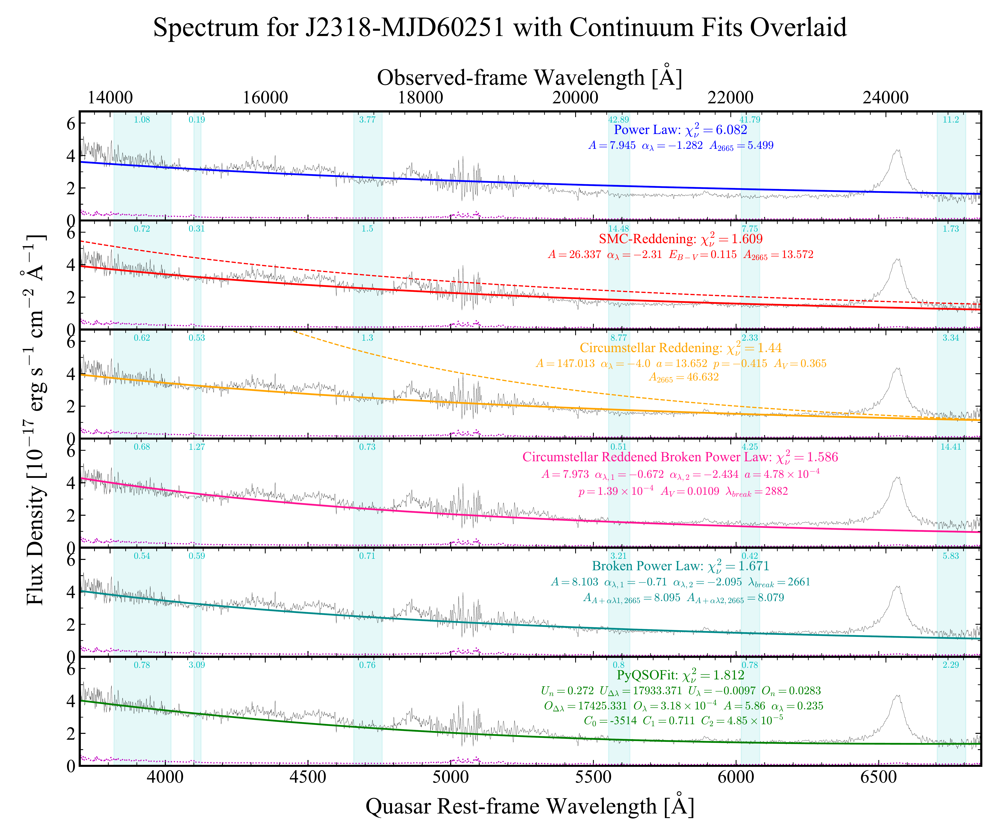
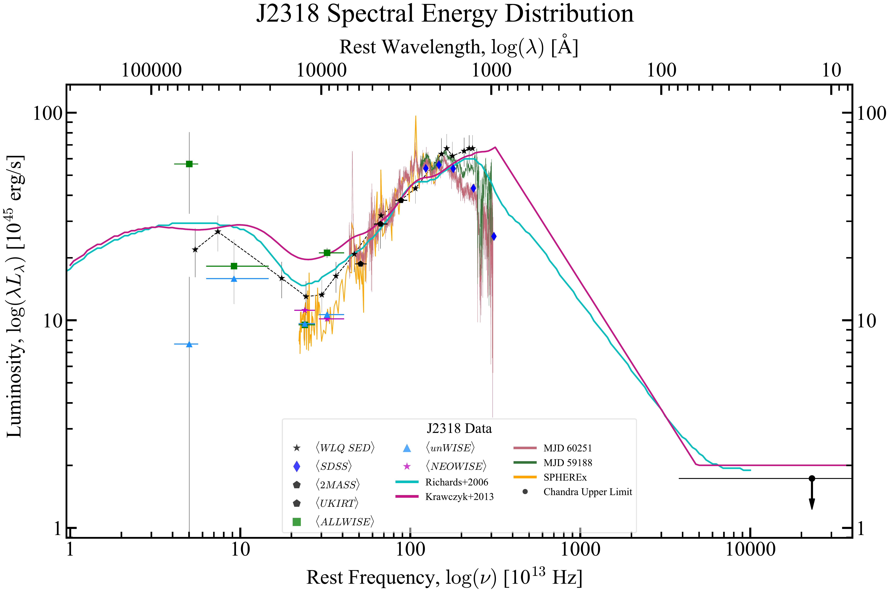

$\newcommand{\ensuremath}{}$
$\newcommand{\xspace}{}$
$\newcommand{\object}[1]{\texttt{#1}}$
$\newcommand{\farcs}{{.}''}$
$\newcommand{\farcm}{{.}'}$
$\newcommand{\arcsec}{''}$
$\newcommand{\arcmin}{'}$
$\newcommand{\ion}[2]{#1#2}$
$\newcommand{\textsc}[1]{\textrm{#1}}$
$\newcommand{\hl}[1]{\textrm{#1}}$
$\newcommand{\footnote}[1]{}$
$\newcommand{\n}{\\}$
$\newcommand{\tsub}{\textsubscript}$
$\newcommand{\tsup}{\textsuperscript}$
$\newcommand{\vdag}{(v)^\dagger}$
$\newcommand\aastex{AAS\TeX}$
$\newcommand\latex{La\TeX}$
$\newcommand{\A}[1]{\qty{#1}{\angstrom}}$
$\newcommand{\kms}[1]{\qty{#1}{\km\per\s}}$
$\newcommand{\um}[1]{\qty{#1}{\um}}$
$\newcommand{\td}[1]{$
$\begin{tabular}{@{\hspace{-16pt}}c}#1\end{tabular}}$
$\newcommand{\tdd}[2]{$
$\begin{tabular}{@{\hspace{-20pt}}r}#1\n\textpm#2\n\end{tabular}}$
$\newcommand{\uFluxLam}[1]{\qty[separate-uncertainty-units=bracket]{#1e-17}{\erg\per\s\per\cm\squared\per\angstrom}}$
$\newcommand{\arraystretch}{1.5}$

# A New Member of the Fast and Furious Family: \ A Relativistic and Time-Variable UV Outflow in a Luminous Quasar

<mark>Appeared on: 2026-06-05</mark> -  _40 pages, 12 figures, 10 tables, published in the Astrophysical Journal_

L. M. Seaton, et al. -- incl., <mark>S. Anderson</mark>

**Abstract:** We report the fastest quasar outflow first detected in the ultraviolet, via variable $\ion{C}{4}$ and $\ion{Si}{4}$ absorption at outflow velocities $-77,000$ $\kms$ to at least $-90,000$ $\kms$ , in the radio-quiet quasar SDSS J231854.31+243954.2 (J2318).	J2318 is a weak-lined quasar in the rest-frame ultraviolet, but Gemini GNIRS spectroscopy reveals an H $\alpha$ redshift of $z=2.6781 \pm 0.0004$ .    A twenty-year photometric time series shows peak-to-peak variability of 0.5 mag in the $g$ band.	The $\ion{C}{4}$ outflow strengthened monotonically over three epochs spanning $\sim$ 2.2 rest-frame years.    The existence of such a high-velocity outflow implies that models of quasar outflows must be able to either accelerate gas to $0.3c$ while still preserving $\ion{C}{4}$ and $\ion{Si}{4}$ ions, or enable the formation of $\ion{C}{4}$ and $\ion{Si}{4}$ ions in gas which has been accelerated to $0.3c$ .    Virial estimates reveal a black-hole mass of $1.65\times10^9M_\odot$ , which leads to an Eddington luminosity and Eddington ratio of $2.4\times10^{47}$ erg s $^{-1}$ and $0.45$ , respectively.    Using very conservative assumptions, the UV-absorbing outflow alone has an estimated mass loss of $>0.82 M_\odot {\rm yr}^{-1}$ and a kinetic luminosity ratio $L_{kin}/L_{bol}\geq0.75$ \% .    The lower limit is just above the threshold usually cited for significant feedback on the host galaxy.    Comparison to PDS 456, the only other known quasar with a UV-absorbing outflow at $0.3c$ , suggests that the true $\dot{M}$ and $L_{kin}/L_{bol}$ could be up to two orders of magnitude larger.

**Figure 6. -** MJD 60251+60291 Continuum Fitting. The raw continuum (black) has been fit to various models (colored).
The flux errors are plotted in magenta, the RLF regions used for the fitting are shown in vertical cyan bands (with their $\chi_$\n$u^2$ values listed), and the $\chi_$\n$u^2$ and best-fit parameter values for each model are displayed in their respective colors.
Dashed curves represent the power law before reddening, and comparison to the CSb $A$ parameter in other models should be done using $A_{2665}=A(2665/2000)^{\alpha_\lambda}$.
        Top panel: a simple power law.
		Second panel: a power law reddened with the SMC extinction curve of \cite{pei92}.
		Third panel: a power law reddened with the three-parameter power-law extinction curve of \cite{2008ApJ...686L.103G}.
		Fourth panel: a broken power law reddened with the three-parameter power-law extinction curve of \cite{2008ApJ...686L.103G}.
        Fifth panel: a broken power law with no reddening.
		Sixth panel: the continuum estimate generated by PyQSOFit.
        Due to the lower $\chi_$\n$u^2$ values, the SMC and CS reddening models are used for analysis.
	 (*fig:J2318_DV2_SpecFit*)

**Figure 8. -** J2318 MJD 60251+60291 where $\lambda>3700$ Å. The dereddened quasar flux density (black) of J2318 where the continuum is estimated by the RLF regions (vertical cyan bands) such that it is fit to various models (colored).
The flux errors are indicated in magenta, and the $\chi_$\n$u^2$ and best-fit parameter values for each model are displayed in their respective colors.
Dashed curves represent the power law before reddening, and comparison to the CSb $A$ parameter in other models should be done using $A_{2665}=A(2665/2000)^{\alpha_\lambda}$. Only wavelengths greater than $3700$ Å  are displayed.
        Top panel: a simple power law.
		Second panel: a power law reddened with the SMC extinction curve of \cite{pei92}.
		Third panel: a power law reddened with the three-parameter power-law extinction curve of \cite{2008ApJ...686L.103G}.
		Fourth panel: a broken power law reddened with the three-parameter power-law extinction curve of \cite{2008ApJ...686L.103G}.
        Fifth panel: a broken power law with no reddening.
		Sixth panel: the continuum estimate generated by PyQSOFit.
        Due to the lower $\chi_$\n$u^2$ values, the SMC and CS reddening models are used for analysis.
	 (*fig:J2318_DV2_RedZoom_Fit*)

**Figure 10. -** J2318 Average Photometric, Spectroscopic, and SED Luminosity versus Frequency.
    J2318's log-scaled rest-frame luminosity for the mean WISE photometry data points (colored squares, stars, and triangles), mean SDSS photometry (blue diamonds), 2MASS and UKIRT photometry (black pentagons), Chandra X-ray luminosity (black circle), SEDs and UV/optical+NIR spectrum (colored curves) as a function of rest-frame frequency.
    All photometric data points lie at their effective rest wavelength, with colored horizontal lines indicating the band's wavelength interval.
    The downward pointing arrow indicates that the Chandra X-ray luminosity is an upper limit.
    The MJD 60291 NIR spectrum is matched with the optical spectrum of MJD 60251 (red curve), while only an optical spectrum is available for MJD 59188 (green curve), and the NIR spectrum from SPHEREx (orange curve) is smoothed for $\lambda_{r}\geq12,000$\A  and scaled by 0.7 at all wavelengths.
    The comparison SEDs are from \citet{gtr06}(cyan), \citet{2013ApJS..206....4K}(violet), and \citet{2011ApJ...743..163L}(black), and have been scaled to lie at the $\langle UKIRT-J\rangle$ band's luminosity for visual comparison.
 (*fig:Photo+SED_Luminosity*)

