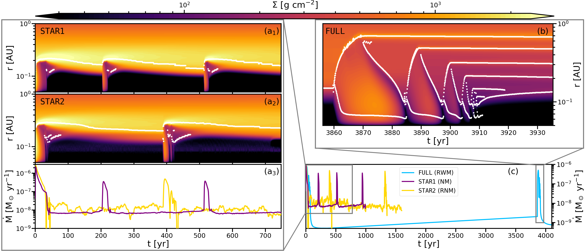
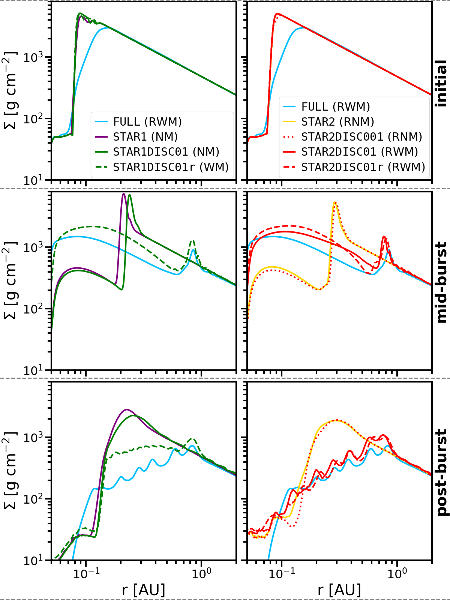
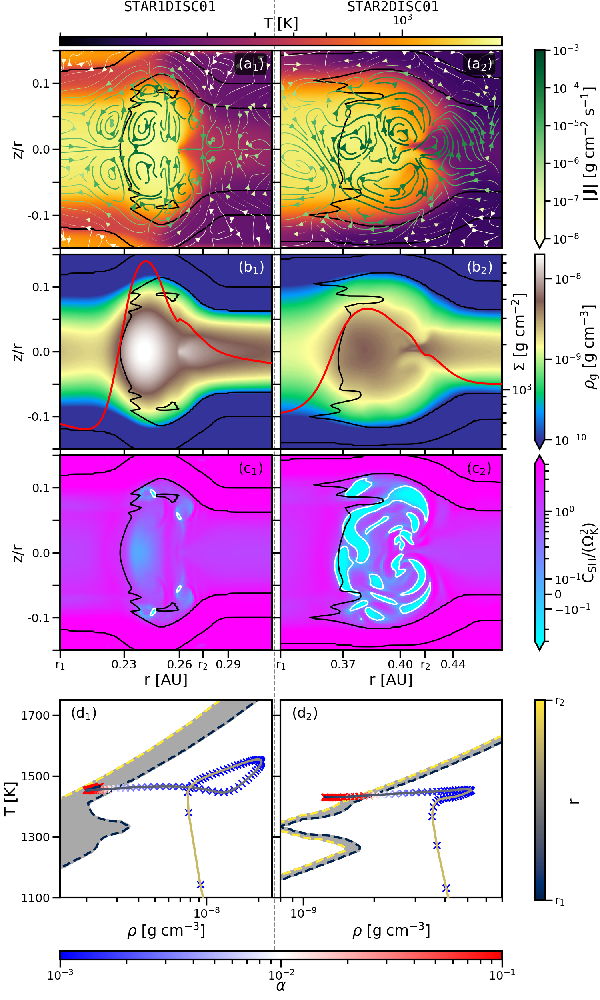

$\newcommand{\ensuremath}{}$
$\newcommand{\xspace}{}$
$\newcommand{\object}[1]{\texttt{#1}}$
$\newcommand{\farcs}{{.}''}$
$\newcommand{\farcm}{{.}'}$
$\newcommand{\arcsec}{''}$
$\newcommand{\arcmin}{'}$
$\newcommand{\ion}[2]{#1#2}$
$\newcommand{\textsc}[1]{\textrm{#1}}$
$\newcommand{\hl}[1]{\textrm{#1}}$
$\newcommand{\footnote}[1]{}$
$\newcommand{\vect}[1]{\mathbf{#1}}$
$\newcommand{\rot}[1]{\vect{\nabla}\times{#1}}$
$\newcommand\id{\ensuremath{\mathbbm{1}}}$
$\newcommand{\sref}[1]{Sec.~\ref{#1}}$
$\newcommand{\tab}[1]{Table~\ref{#1}}$
$\newcommand{\fig}[1]{Fig.~\ref{#1}}$
$\newcommand{\equ}[1]{Eq.~(\ref{#1})}$
$\newcommand{\equo}[1]{Eq.~\ref{#1}}$
$\newcommand{\equs}[2]{Eqs.~(\ref{#1})~-~(\ref{#2})}$
$\newcommand{\equos}[2]{Eqs.~\ref{#1}~-~\ref{#2}}$
$\newcommand{\Msunpyr}{\mathrm{M_\odot/yr}}$
$\newcommand{\colout}[1]{\bgroup\markoverwith{\textcolor{#1}{\rule[.5ex]{2pt}{0.4pt}}}\ULon}$
$\newcommand{\pder}[2][]{\frac{\partial#1}{\partial#2}}$
$\newcommand{\grad}[1]{\nabla{#1}}$
$\newcommand{\div}[1]{\nabla\cdot\mathchoice{#1}}$
$\newcommand{\arraystretch}{1.5}$
$\newcommand{\arraystretch}{1.1}$
$\newcommand{\arraystretch}{1.35}$
$\newcommand{\arraystretch}{1.2}$
$\newcommand{\arraystretch}{1.0}$
$\newcommand{\cs}{c_{\sf s}}$
$\newcommand{\Teff}{T_{\sf eff}}$

# MRI-triggered instability at the inner dead zone edge: \ disc evolution and burst modes tied to magnetic field strengths 

<mark>Appeared on: 2026-06-09</mark> -  _17 pages, 9 figures, accepted for publication in A&A_

<mark>M. Cecil</mark>, <mark>M. Flock</mark>, D. Steiner

**Abstract:** The inner edge of the dead zone (DZIE) in protoplanetary discs is prone to periodic instability caused by the activation of the magneto-rotational instability (MRI) within the weakly turbulent regions. Capturing the triggering and evolution of the instability mechanism, along with the resulting accretion burst signatures, requires coupling MRI activation to the local magnetic field via non-ideal magnetohydrodynamic (MHD) effects. Our study shows how different large-scale magnetic field configurations set the structure of the inner disc and regulate the resulting evolution and morphologies of periodic instability cycles. We performed 2D and 3D radiation hydrodynamic simulations of the regions around the DZIE of a Class II disc over timescales of $10^3$ \; yr. We significantly extended previous studies by implementing MRI activation criteria based on ambipolar and Ohmic diffusion and by prescribing magnetic field strength profiles comprising stellar and disc components. The frequency, shapes and consequences of the episodic accretion events are highly sensitive to the magnetic field strength in the inner disc. We recover previously reported dynamic behaviour by considering relatively strongly magnetised discs. A new burst mode is revealed, in which the MRI active region cannot expand far into the disc in the presence of weak magnetic fields. In this narrow burst mode, the pressure maximum at the inner dead zone edge does not remain static even during quiescence. A distinct dichotomy between the wide and narrow burst modes is established by the hydrodynamic (in)stability of the ionisation front. Both modes are additionally separated into a reflaring and a non-reflaring version, mostly determined by the stellar magnetic field strength. Our setup does not lead to the emergence of classical thermal instability by hydrogen ionisation. The structure of the MRI active region in quiescence changes from a simple radial MRI transition to a layered structure that converges towards the midplane near the star. Our 3D model reveals the breaking of the density features produced in the narrow burst mode, leading to strong vortices at radii smaller than 0.5 AU. Coupling MRI activity directly to different magnetic field strengths via non-ideal MHD effects, rather than using simple temperature thresholds, enables a variety of burst modes. Each mode exhibits characteristic accretion burst signatures and produces vastly different consequences for the evolution of the inner disc structure and the conditions of planet formation and migration.

**Figure 6. -** Comparison of the accretion rates and surface density evolutions of the \texttt{FULL} model (with the $T_\mathrm{MRI}$ MRI activity criterion) and the two models including only the stellar magnetic field component, \texttt{STAR1} and \texttt{STAR2}. Panel c shows the accretion rates of all three models. Panel ($\mathrm{a}_3$) depicts a zoom-in to the time-frame that captures the bursting-timescale of the \texttt{STAR1} and \texttt{STAR2} models, while panels ($\mathrm{a}_1$) and ($\mathrm{a}_2$) display their respective surface density evolution. The space-time diagram of the outburst occurring in the \texttt{FULL} model is provided in panel b. The white indicators in panels ($\mathrm{a}_1$), ($\mathrm{a}_2$) and b mark the positions of local pressure maxima.   (*fig:radius_time*)

**Figure 1. -** Surface density profiles of all models listed in Table \ref{tab:models}. The first, second and third rows show the hydrostatic initial models, the state at which the MRI active burst region has reached its largest extent, and the state at the beginning of the quiescent phase after the initial burst, respectively. Models including a 1\;kG stellar magnetic field are shown in the left column, while the right column depicts the models that employ a 2\;kG stellar field. As a reference, the \texttt{FULL} model is included in each panel. (*fig:sigma_profiles*)

**Figure 3. -** Structure and behaviour of the region around the ionisation front in the case of a narrow (left column, model \texttt{STAR1DISC01}) and wide burst (right column, model \texttt{STAR2DISC01}). The first row shows the temperature structure and the mass flux density field. The arrows are colour-coded according to the local magnitude of the flux density $|\vec{\mathrm{J}}|$. The second row depicts the density maps and the surface density profile (red line). In the third row, the distributions of the normalised values of the Solberg--H{\o}iland condition are illustrated. The transitions from positive to negative values are marked as white contour lines. The black contours in the first three rows correspond to transitions from MRI active to inactive. The bottom row displays the MRI transition region for radii between $r_1$ and $r_2$(marked on the x-axis of the third-row panels) in the $\rho-T$ plane, shaded in grey. The transitions at $r_1$ and $r_2$ are specifically marked with blue and yellow dashed lines, respectively. The panels $\mathrm{d_1}$ and $\mathrm{d_2}$ also include the radial distribution of midplane density and temperature values for the respective model between $r_1$ and $r_2$. While the colour of the line corresponds to the radius $r$, the crosses along the line are colour-coded according to the midplane value of $\alpha$.   (*fig:SH*)

