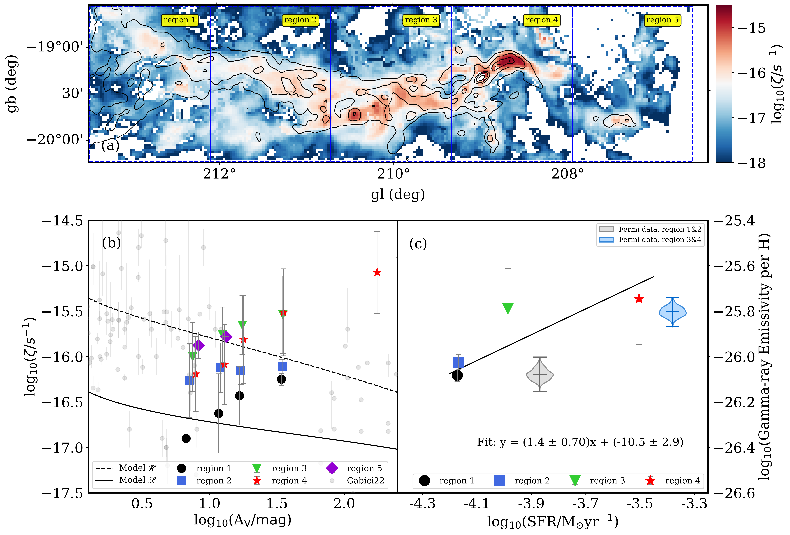
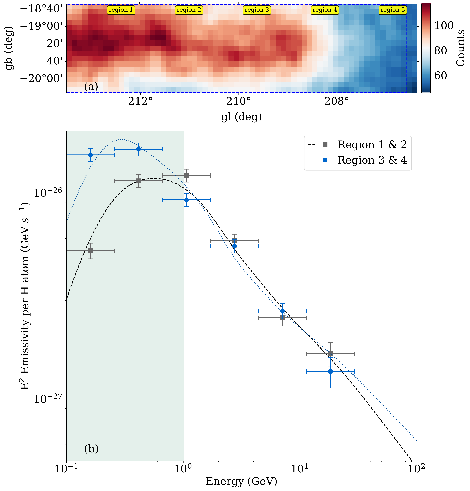
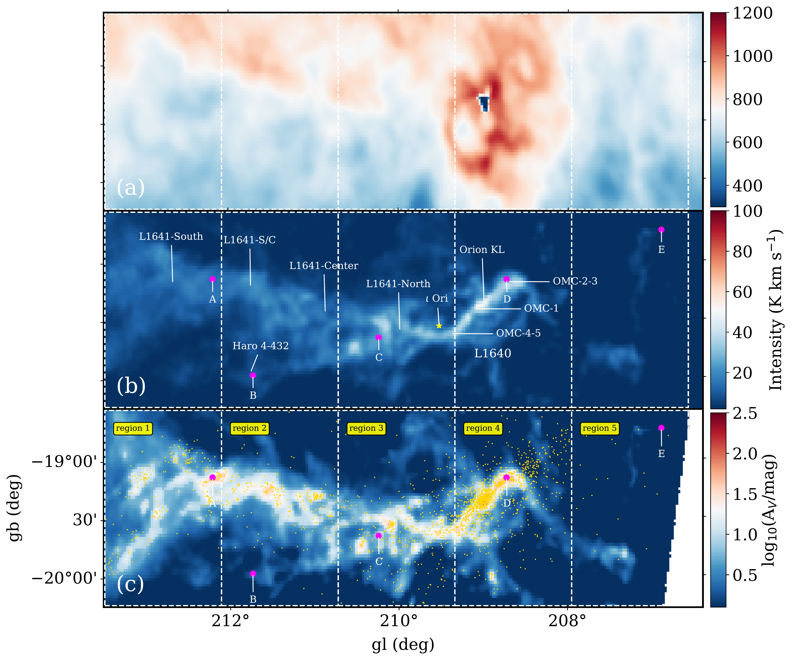

$\newcommand{\ensuremath}{}$
$\newcommand{\xspace}{}$
$\newcommand{\object}[1]{\texttt{#1}}$
$\newcommand{\farcs}{{.}''}$
$\newcommand{\farcm}{{.}'}$
$\newcommand{\arcsec}{''}$
$\newcommand{\arcmin}{'}$
$\newcommand{\ion}[2]{#1#2}$
$\newcommand{\textsc}[1]{\textrm{#1}}$
$\newcommand{\hl}[1]{\textrm{#1}}$
$\newcommand{\footnote}[1]{}$
$\newcommand{\vdag}{(v)^\dagger}$
$\newcommand\aastex{AAS\TeX}$
$\newcommand\latex{La\TeX}$
$\newcommand{\chg}[1]{\textbf{\color{green}#1}}$
$\newcommand{\chb}[1]{\textbf{\color{blue}#1}}$
$\newcommand{\chr}[1]{\textbf{\color{red}#1}}$
$\newcommand{\del}[1]{\textbf{\color{red}\sout{#1}}}$
$\newcommand{\hi}{H{\sc i}}$
$\newcommand{\hhh}{H_3^+}$
$\newcommand{\arcsec}{\hbox{^{\prime\prime}}}$
$\newcommand{\arcmin}{\hbox{^{\prime}}}$
$\newcommand{\deg}{^\circ}$
$\newcommand{\cm2}{cm^{-2}}$
$\newcommand{ç}{cm^{-3}}$
$\newcommand{\kms}{km s^{-1}}$
$\newcommand{\s}{s^{-1}}$
$\newcommand{\nh3}{NH_3}$
$\newcommand{\n2h}{N_2H^+}$
$\newcommand{\co}{^{12}CO}$
$\newcommand{\13co}{^{13}CO}$
$\newcommand{\c18o}{C^{18}O}$
$\newcommand{\hc3n}{HC_3N}$
$\newcommand{\h2}{H_2}$
$\newcommand{\nh}{n(H_2)}$
$\newcommand{\c2}{[C {\sc ii}]}$
$\newcommand{\cp}{C^+}$
$\newcommand{\lp}{\>\> .}$
$\newcommand{\lc}{\>\> ,}$
$\newcommand{\Ms}{M_{\odot}}$
$\newcommand{\mic}{\mum}$
$\newcommand{\av}{A\rm_V}$
$\newcommand{\xco}{X_{co}}$
$\newcommand{\zcr}{\zeta_{CR}^{H_2}}$

# Star Formation Drives Production of Low Energy Cosmic Rays

<mark>Appeared on: 2026-06-09</mark> -  _17 pages, 8 figures, ApJL under review_

N. Tang, et al. -- incl., <mark>S. Jiao</mark>

**Abstract:** For over a century, the origin of low-energy cosmic rays (LECRs), the dominant heaters and ionizers of dense interstellar gas, remains elusive owing to solar modulation and uncertain transport processes.In this study, we introduce a new astrophysical approach based on $\hi$ Narrow Self-Absorption (HINSA) to obtain spatially resolved measurements of LECR ionization rates using high-fidelity $\hi$ observations toward the Orion region from the FAST telescope. The LECR ionization rate is found to scale with local star formation rate (SFR) as $log_{10}\zeta = (1.4\pm 0.70)log_{10}\mathrm{SFR} + (-10.5\pm 2.9)$ . Moreover, it increases with visual extinction, and is found to exceed, toward active star-forming regions, the value predicted for diffuse regions based on _Voyager_ measurements and an external propagation model. These findings demonstrate that LECRs are generated in situ by star-forming activities rather than penetrating from the broader Galactic cosmic-ray population. This is further supported by _Fermi_ -LAT gamma-ray observations toward the Orion region. Together, these results resolve a key uncertainty in cosmic-ray origin and establish a new avenue for quantifying the energetic feedback that regulates the interstellar medium.

**Figure 4. -** (a) Spatial distribution of the low-energy cosmic ray ionization rate (LECRIR); (b)  Median LECRIR values within five visual-extinction ranges ([5–10], [10–15], [15–20], [20–50], and [50–300] mag) across the five subregions of the Orion molecular complex. The representative $A_{\rm V}$ values for these ranges are 7.5, 12.5, 17.5, 35, and 175 mag, respectively. Small offsets have been applied to the $A_{\rm V}$ values of each subregion for clarity. Also shown are the $Voyager$-based $\mathcal{L}$ model (solid black line) and the reproduced diffuse-region $\mathcal{H}$ model (dashed black line) $\c$itep{2018A&A...619A.144P, 2024A&A...682A.131P}, along with previous LECRIR measurements (gray dots) derived from ion tracers such as $H_3^+$, OH$^+$, and HCO$^+$ ([ and Gabici 2022](https://ui.adsabs.harvard.edu/abs/2022A&ARv..30....4G), [ and Indriolo 2023](https://ui.adsabs.harvard.edu/abs/2023ApJ...950...64I)) .;  (c) Relationship between LECRIR and star formation rate for 4 subregions. The LECRIR for each subregion is estimated using the median value derived from areas with $A_{\rm V} \geq 15$ mag. The linear fit between LECRIR and star formation rate is shown with black solid line. The Gamma-ray emissivities per hydrogen from the $Fermi$ survey for the two groups (Regions 1 \& 2 and Regions 3 \& 4) are shown as violin plots  for comparison, with their scale on the right hand axis. (*fig:lecrir_map*)

**Figure 5. -** (a) Gamma-ray counts map across the energy range of 0.1 to 1 GeV; (b) The derived gamma-ray emissivity per hydrogen atom from different regions of Orion molecular cloud. The light green region represents the energy range from 0.1 to 1 GeV.  (*fig:fermiemi*)

**Figure 1. -**  Integrated intensity of $\hi$(Panel a) and \13co(1-0) (Panel b) toward the Orion region.  The velocity range is from 0 to 15 $\kms$ and a correction for the main beam efficiency has been adopted. The positions of well known clouds and stars are shown in Panel b. The distribution of young stellar objects overlaid on the $Herschel$ extinction map is displayed in Panel c. The boundaries of the five subregions are delineated by white dashed lines,  and the five positions A–-E covering regions with different environments are indicated by magenta dots. Yellow dots indicate the positions of young stellar objects. (*fig:data_map*)

