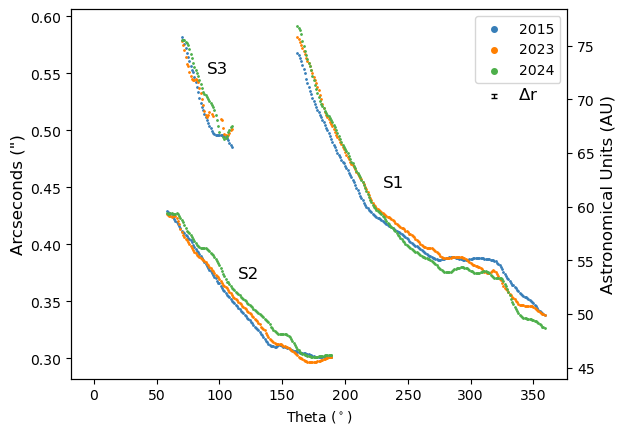
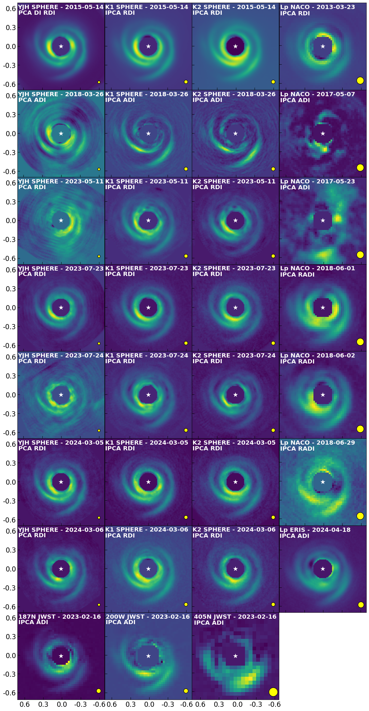
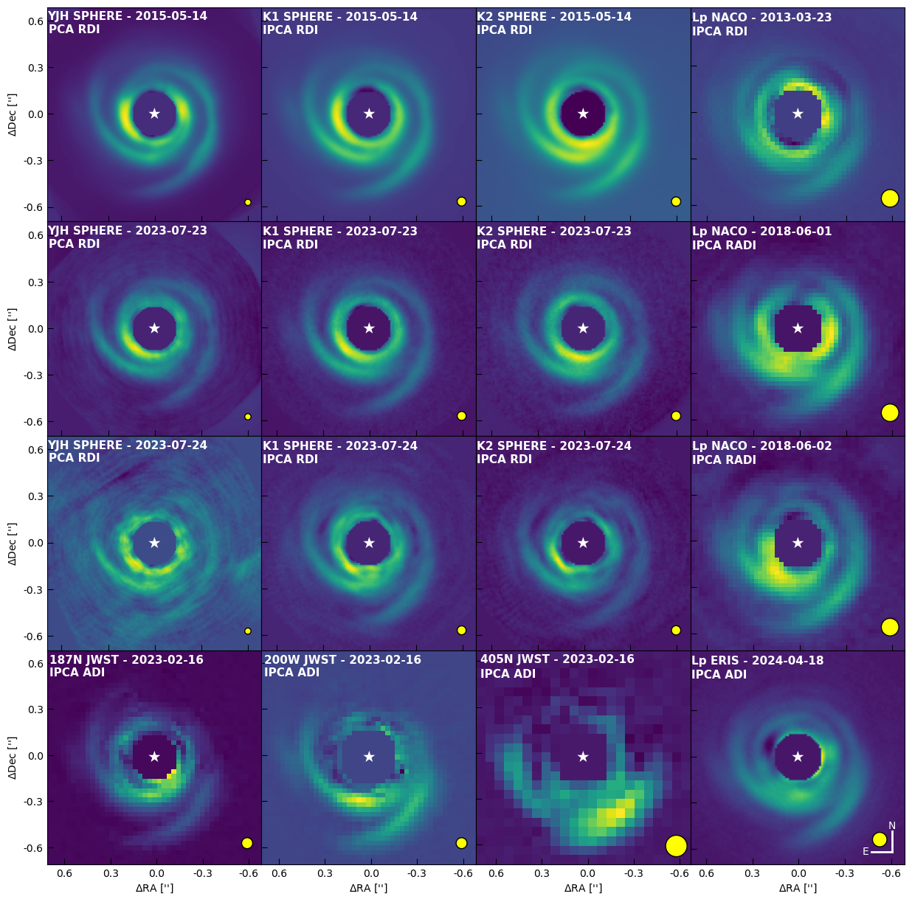

$\newcommand{\ensuremath}{}$
$\newcommand{\xspace}{}$
$\newcommand{\object}[1]{\texttt{#1}}$
$\newcommand{\farcs}{{.}''}$
$\newcommand{\farcm}{{.}'}$
$\newcommand{\arcsec}{''}$
$\newcommand{\arcmin}{'}$
$\newcommand{\ion}[2]{#1#2}$
$\newcommand{\textsc}[1]{\textrm{#1}}$
$\newcommand{\hl}[1]{\textrm{#1}}$
$\newcommand{\footnote}[1]{}$
$\newcommand{\ikc}[1]{\textcolor{blue}{\textsf{IK: #1 }}}$
$\newcommand{\vc}[1]{#1}$
$\newcommand{\gp}[1]{\textcolor{teal}{\textbf{GP:} #1}}$
$\newcommand{\new}[1]{{#1}}$
$\newcommand{\newbis}[1]{{#1}}$
$\newcommand{\newthree}[1]{{#1}}$

# Multi-epoch scattered-light analysis of HD 135344B: \ new evidence for a spiral-driving protoplanet

<mark>Appeared on: 2026-06-10</mark> -  _10 pages + 3 pages of appendix 8 figures + 5 figures in the appendix A&A accepted_

J. Latour, et al. -- incl., <mark>I. Hammond</mark>

**Abstract:** The HD 135344B (SAO 206462) disk exhibits strong signposts of planet formation both in scattered light and sub-mm continuum images. ALMA images in the sub-mm revealed a gap-crossing dust filament whose position coincides with a twist detected in the scattered-light spiral structure. Analysis of the spiral dynamics in polarized light also hints at a spiral-driving protoplanet in the sub-mm gap. We aim to study the overall dynamics of the three spirals in the disk, as well as the motion of the twist over a 10-year baseline, at different IR wavelengths. We also seek to assess the authenticity of a candidate protoplanet recently claimed in the disk. We use high-fidelity post-processing algorithms such as iterative principal component analysis to minimize the biases induced by angular differential imaging on extended sources and conduct a thorough analysis of archival VLT/NACO, VLT/SPHERE, $\new{and}$ VLT/ERIS datasets in order to obtain the spiral traces and measure their orbital motion in multiple wavelength bands in scattered light. $\new{We also reprocess archival JWST/NIRCam datasets with these algorithms.}$ We measure an average spiral orbital motion of $\newbis{0$\fdg$81 $\pm$ 0$\fdg$05 yr$^{-1}$}$ , in agreement with the literature value of about 0 $\fdg$ 85 yr $^{-1}$ at all wavelengths. With simple modeling of the twist morphology, we confirm that it is indeed co-moving with the spiral in which it is embedded. While the position angle of the twist coincides with the dust filament, it is located at a smaller angular separation from the star, which we attribute to the fact that the spiral trace moves away from the central star with increasing wavelength. We find that a previously claimed protoplanet candidate in the disk can be adequately explained as a post-processing artifact. $\new{Our confirmation that the motion of the scattered light twist is consistent with the orbital velocity of a planet at \newbis{$69\pm 4$} au over a 10-year baseline suggests}$ that the spirals, the gap and the dust filament in the sub-mm continuum, as well as the twist in scattered light, $\new{could}$ indeed all be attributed to the same hypothetical protoplanet deeply embedded within the spiral. A perplexing trend for a wavelength-dependence of the angular distance of the spiral traces to the central star still remains to be explained.

**Figure 1. -** Spiral traces in polar coordinates in the K1 filter in the deprojected images. Theta is the angle measured counterclockwise from North of the central star. $\new${In black, labeled $\Delta$r, the typical trace uncertainty, not shown on each data point to improve readability.} (*fig:SpiralTracesPolar*)

**Figure 8. -** Gallery of the best disk images obtained for all datasets at all wavelengths bands available. $\new${The white star marks the center of the images and the yellow circles illustrate the resolution of each image.} (*fig:FullImageGallery*)

**Figure 11. -** Image gallery of the HD 135344B protoplanetary disk at different wavelengths for multiple datasets. The central star is masked and marked by a white star marker. All of the images were processed using IPCA, except for the images in the YJH bands. North is up, East is left. $\new${The yellow circles indicate the spatial resolution of each image.} (*fig:DiskGallery*)

