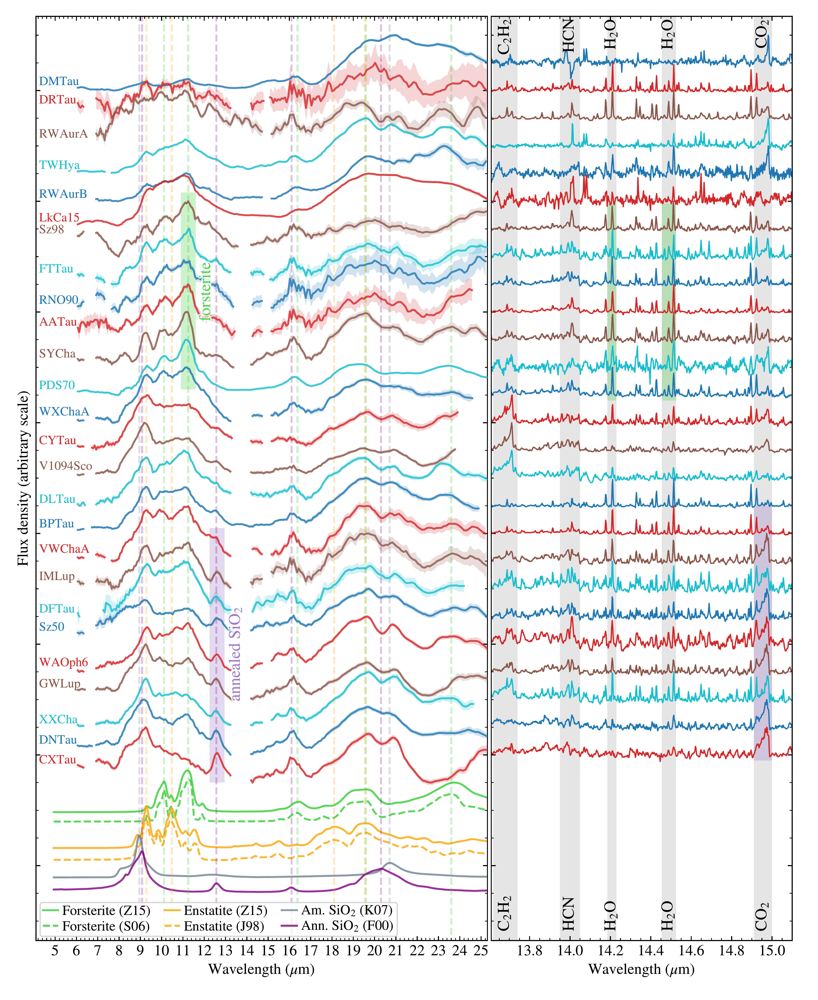
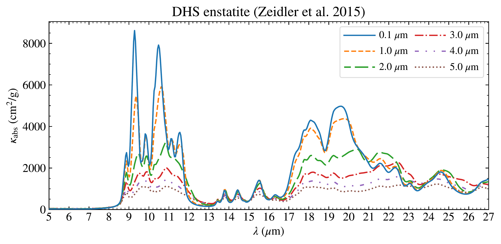
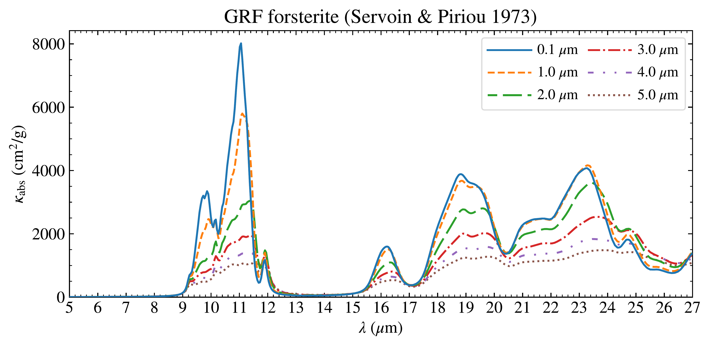
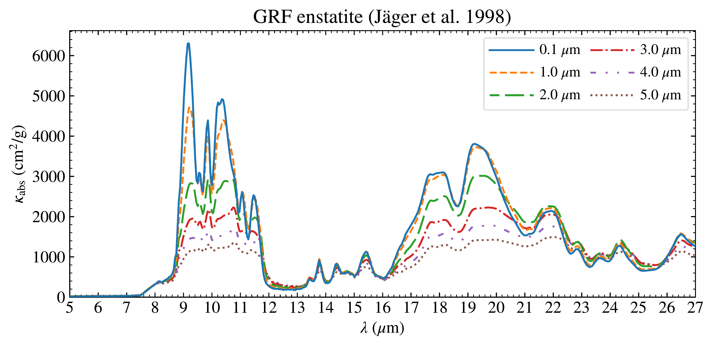
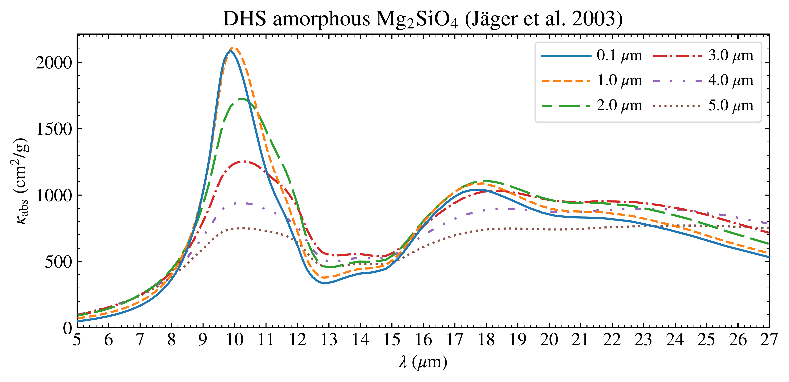
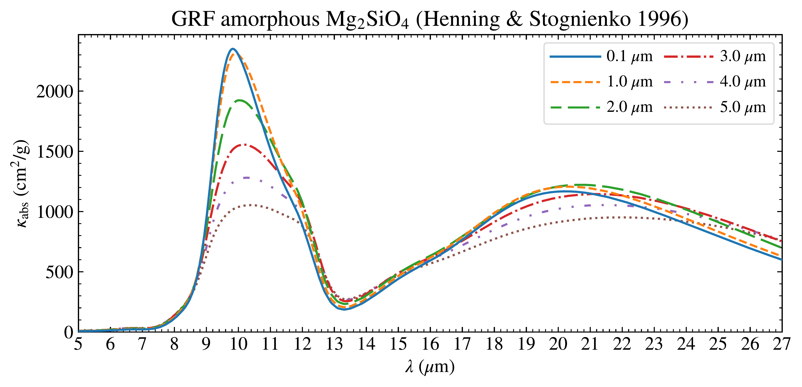
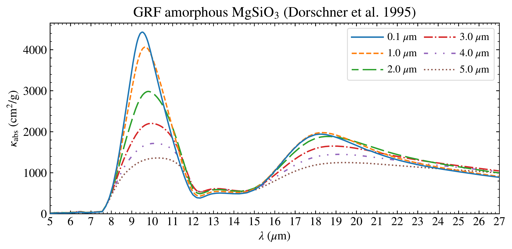

$\newcommand{\ensuremath}{}$
$\newcommand{\xspace}{}$
$\newcommand{\object}[1]{\texttt{#1}}$
$\newcommand{\farcs}{{.}''}$
$\newcommand{\farcm}{{.}'}$
$\newcommand{\arcsec}{''}$
$\newcommand{\arcmin}{'}$
$\newcommand{\ion}[2]{#1#2}$
$\newcommand{\textsc}[1]{\textrm{#1}}$
$\newcommand{\hl}[1]{\textrm{#1}}$
$\newcommand{\footnote}[1]{}$
$\newcommand{\arraystretch}{1.1}$
$\newcommand{\arraystretch}{1.0}$
$\newcommand{\arraystretch}{1.1}$

# MINDS survey of silicates in T Tauri disks: Correlation between dust and gas

<mark>Appeared on: 2026-06-10</mark> -  _28 pages, 16 figures_

J. Varga, et al. -- incl., <mark>T. Henning</mark>, <mark>D. Gasman</mark>, <mark>G. Perotti</mark>, <mark>A. Somigliana</mark>

**Abstract:** Silicates are key constituents of planet-forming disks and are among the most important building blocks of rocky planets. Mid-infrared spectral features of micron-sized silicate grains are powerful tracers of grain growth, mineralogy, and disk chemistry. We characterized the dust mineralogy in T Tauri disks using James Webb Space Telescope (JWST)/Mid-Infrared Instrument (MIRI) observations. A further aim of ours was to investigate the connections between the dust and molecular gas compositions. We analyzed JWST/MIRI spectra of 26 disks as part of the MIRI mid-Infrared Disk Survey (MINDS). We employed spectral decomposition with our new \texttt{DustComp} tool to derive the mass fractions of individual dust species. We included in our fits $Mg_2$ $SiO_4$ (forsterite), $MgSiO_3$ (enstatite), and $SiO_2$ (silica) together with amorphous silicates of corresponding stoichiometry. We find that Mg-rich (and Fe-poor) silicates represent our data well. Fit residuals are typically within $\pm 3\%$ . Grain size distributions are skewed toward larger sizes ( $>\!2 \mu$ m), indicating significant growth. Large ( $\sim\!5 \mu$ m-sized) amorphous Mg-silicates were robustly detected, whereas the presence of large crystalline grains could not be firmly established. The average dust composition is dominated by grains of $Mg_2$ $SiO_4$ stoichiometry ( $\sim\!60\%$ , including amorphous and crystalline state), followed by $MgSiO_3$ ( $\sim\!30\%$ ) and $SiO_2$ ( $\sim\!10\%$ ). The mass fractions of crystalline grains are typically in the $5$ -- $24\%$ range, with a mean of $14\%$ . We robustly detected annealed silica in nine objects, with cristobalite as the main polymorph. We found a correlation between dust and molecular gas composition: disks with strong annealed silica features show relatively strong $CO_2$ emission, while forsterite-rich disks display stronger $H_2$ O emission. Disks with annealed silica features may also have elevated gas-phase C/O ratios, suggesting a process, such as dust sublimation and recondensation, that establishes thermo-chemical equilibrium between solids and gas. The correlation between dust and gas may provide the first indication that the molecular gas composition regulates the availability of dust species in the inner disk.

**Figure 13. -** Left: Residual dust spectra after subtracting the modeled contributions of the amorphous Mg-silicates and featureless components. Each residual spectrum has been normalized to its maximum value. The residuals show features of crystalline Mg-silicates and of $SiO_2$(both amorphous and annealed). For comparison, at the bottom of the plot, we have plotted the opacity curves of $0.1 \mu$m-sized forsterite, enstatite, amorphous silica, and annealed silica. The positions of major feature peaks are indicated by vertical dashed lines. The green and purple rectangles highlight spectra with prominent features from forsterite and from annealed silica, respectively. Right: Continuum-subtracted spectra at full spectral resolution, showing molecular emission lines. The spectra have been normalized to their maximum value within the plotted wavelength range. Most objects showing strong annealed silica features in their dust spectra have relatively strong $CO_2$ lines, while those with prominent forsterite features tend to be water-rich.  (*fig:dust_and_gas_lines*)

**Figure 16. -** Opacity curves used in our modeling. (*fig:opac*)

**Figure 10. -** Fits to the spectrum of XX Cha with the $\left[0.1, 2, 5 \mathrm{am.}\right]$ grain size set. The panels in the top, middle, and bottom rows show the fits with the DHS$\_$nat, DHS$\_$synth, and GRF sets of opacity curves, respectively. In the left (right) column, fits with (without) annealed $SiO_2$ are shown. Spectral regions excluded from our fits are not shown. (*fig:fit_example*)

