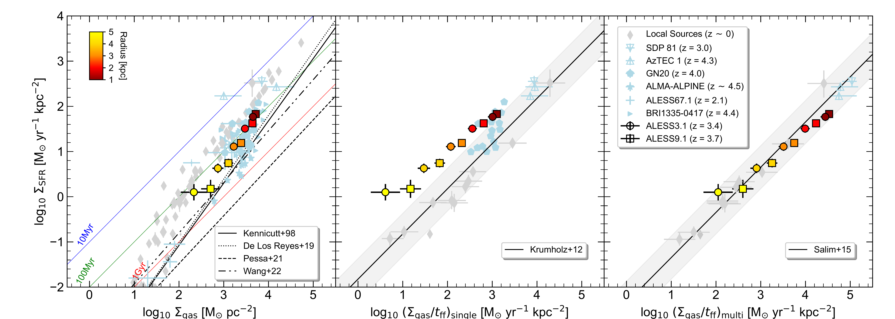
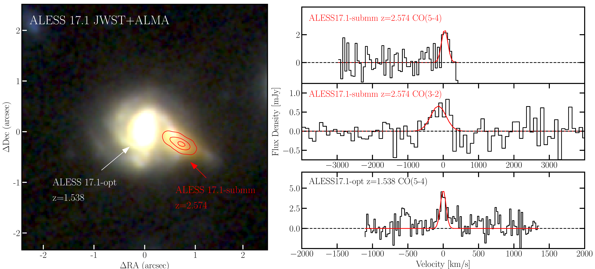

$\newcommand{\ensuremath}{}$
$\newcommand{\xspace}{}$
$\newcommand{\object}[1]{\texttt{#1}}$
$\newcommand{\farcs}{{.}''}$
$\newcommand{\farcm}{{.}'}$
$\newcommand{\arcsec}{''}$
$\newcommand{\arcmin}{'}$
$\newcommand{\ion}[2]{#1#2}$
$\newcommand{\textsc}[1]{\textrm{#1}}$
$\newcommand{\hl}[1]{\textrm{#1}}$
$\newcommand{\footnote}[1]{}$
$\newcommand\orcidicon[1]{\href{https://orcid.org/#1}{\mbox{\scalerel*{$
$\begin{tikzpicture}[yscale=-1,transform shape]$
$\pic{orcidlogo};$
$\end{tikzpicture}$
$}{|}}}}$
$\newcommand{\thebibliography}{\DeclareRobustCommand{\VAN}[3]{##3}\VANthebibliography}$

# Investigating the role of turbulence in the interstellar medium in $z\sim3$ dusty star-forming galaxies using kpc-resolution ALMA dust and gas maps

<mark>Appeared on: 2026-06-11</mark> - 

B. A. Westoby, et al. -- incl., <mark>J. Li</mark>, <mark>E. Schinnerer</mark>, <mark>F. Walter</mark>

**Abstract:** We present ALMA high-resolution ( $\sim 0.25\arcsec /2 \rm{kpc}$ ) CO(5--4) and CO(4--3) observations of three $z\sim 3$ submillimetre-selected dusty galaxies from the ALESS survey.These data complement existing [ sub ] -kpc scale ALMA 870 $\mu$ m continuum imaging and JWST NIRCam and MIRI imaging from the ALESS-JWST program, allowing us to trace the molecular gas, dust-obscured star formation, and stellar populations on similar spatial scales. We spectroscopically confirm that two of the sources lie at the same redshift and are likely interacting.We find that the molecular-gas distribution broadly follows the dusty star-forming structures seen in the 870 $\mu$ m dust continuum imaging, but that the gas reservoirs are significantly more extended than the dust emission with a spatial extent comparable to the rest-frame near-infrared stellar emission.By modeling the kinematics for the two highest signal-to-noise sources,we find that the galaxies are well-fit by rotating disc models with high ratios of ordered to random motion ( $V_{\rm{max}} / \overline{\sigma}=5\pm1$ and $6\pm1$ ),although smaller-scale kinematic deviations cannot be ruled out at the current sensitivity and spatial resolution.Finally, utilizing the high-resolution 870 $\mu$ m dust continuum and CO data, we investigate star-formation scaling relations on kpc-scales in these high-redshift galaxies.Assuming a constant CO-to-H $_{2}$ conversion factor and excitation ratio, we find that the data are offset from theoretical star-formation relation predictions that do not take turbulence into account, but consistent with gravo-turbulent models, thereby suggesting that turbulence plays a central role in regulating star formation at high redshift.

**Figure 7. -** Star formation relation comparison showing annular regions for ALESS3.1 (circle) and ALESS9.1 (square) along with both resolved and unresolved literature values from SFGs and SMGs. Also plotted are the \protect\cite{kennicutt_global_1998}, \protect\cite{de_los_reyes_revisiting_2019}, \protect\cite{pessa_star_2021}, \protect\cite{wang_3_2022} relations (general Kennicutt-Schmidt relation, left panel), \protect\cite{krumholz_universal_2012} relation (incorporating free-fall timescale, centre panel) and \protect\cite{salim_universal_2015} relation (incorporating turbulence, right panel) with agreement between models and observations increasing from left to right. Local star forming regions are in grey (\protect\citealt{kennicutt_global_1998}, \protect\citealt{heiderman_star_2010}, \protect\citealt{lada_star_2010}, \protect\citealt{wu_properties_2010}, \protect\citealt{gutermuth_correlation_2011}, \protect\citealt{jameson_relationship_2016}, \protect\citealt{federrath_link_2016}) and high-redshift star forming regions are in blue (SDP81,  \protect\citealt{sharda_testing_2018}; AZTEC1,  \protect\citealt{sharda_testing_2019}; GN20,  \protect\citealt{hodge_kiloparsec-scale_2015}; ALMA-ALPINE, \protect\citealt{bethermin_alma-alpine_2023}; ALESS67.1, \protect\citealt{chen_spatially_2017} and BRI1335-0417, \protect\citealt{tsukui_spatially_2023}). For ALESS3.1 and ALESS9.1, the more inner radial regions are red whilst the more outer regions are yellow. The shaded regions show deviations by a factor of three from $\epsilon_{\rm{ff}}=0.015$\protect\citep{krumholz_erratum_2013}. (*fig:KS*)

**Figure 8. -** Left: NIRCam RGB image from \protect\cite{hodge_aless-jwst_2025} with positions of both ALESS17.1-submm indicated and 870$\mu$m contours from \protect\cite{hodge_alma_2019} at 5, 20 and 35 $\sigma_{\rm{rms}}$ Right-top/middle: Proposed archival ALMA CO line detections of redshifted CO(3--2) and CO(5--4) at $z=2.574\pm0.002$ for  ALESS17.1-submm (see also \protect\citealt{mckay_deep_2026}). This  is consistent with a JWST-based photometric redshift of $z\sim 2.57$ from \protect\cite{li_aless--jwst_2026}. Bottom: CO(5--4) emission line spectrum for ALESS17.1-opt. (*fig:ALESS17.1CO*)

**Figure 9. -** Multi-tracer imaging consisting of the CO moment zero maps (1st column), 870$\mu$m continuum (2nd column), continuum underlying the CO observations used in this work (3rd column: ALESS3.1 and ALESS3.1-comp 2170$\mu$m, ALESS9.1 3260$\mu$m) and the NIRCam RGB(F444W/F356W/F200W) image (4th column). The contours start at 2$\sigma_{\rm{rms}}$ and increase in powers of $\sqrt{2}$. The 5th column presents an overlay of all maps, with contours corresponding to the mid-$J$ CO cyan, 870$\mu$m continuum red and $\sim$2-3mm continuum green. (*fig:COcont*)

