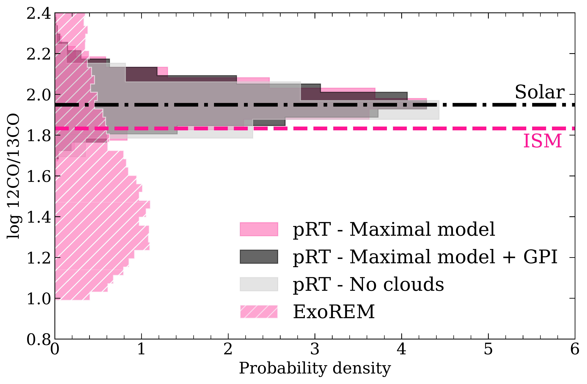
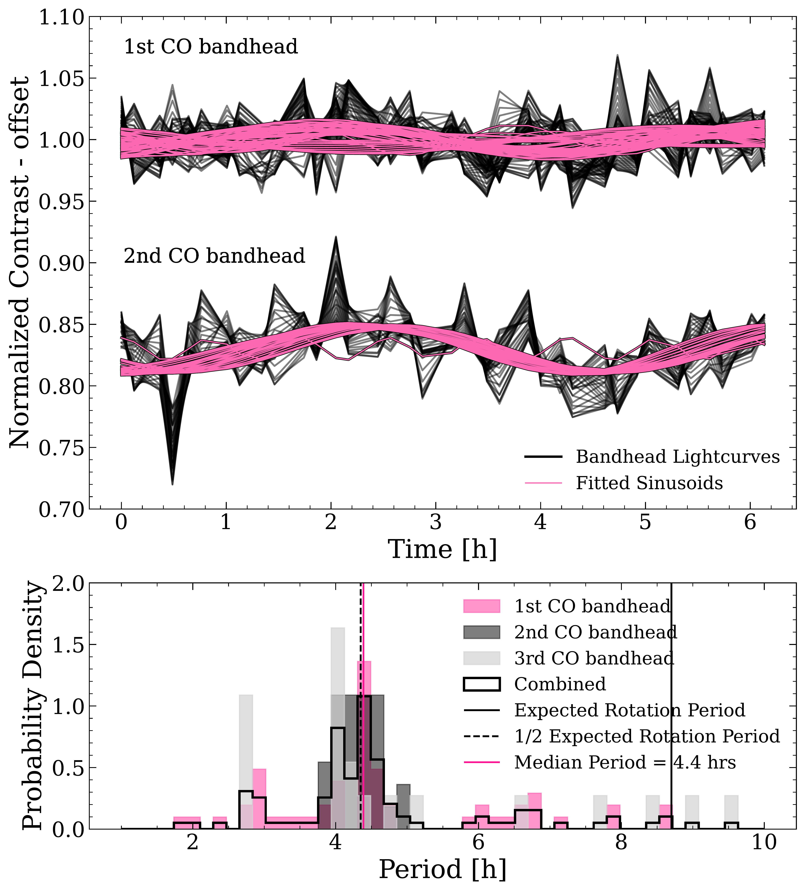
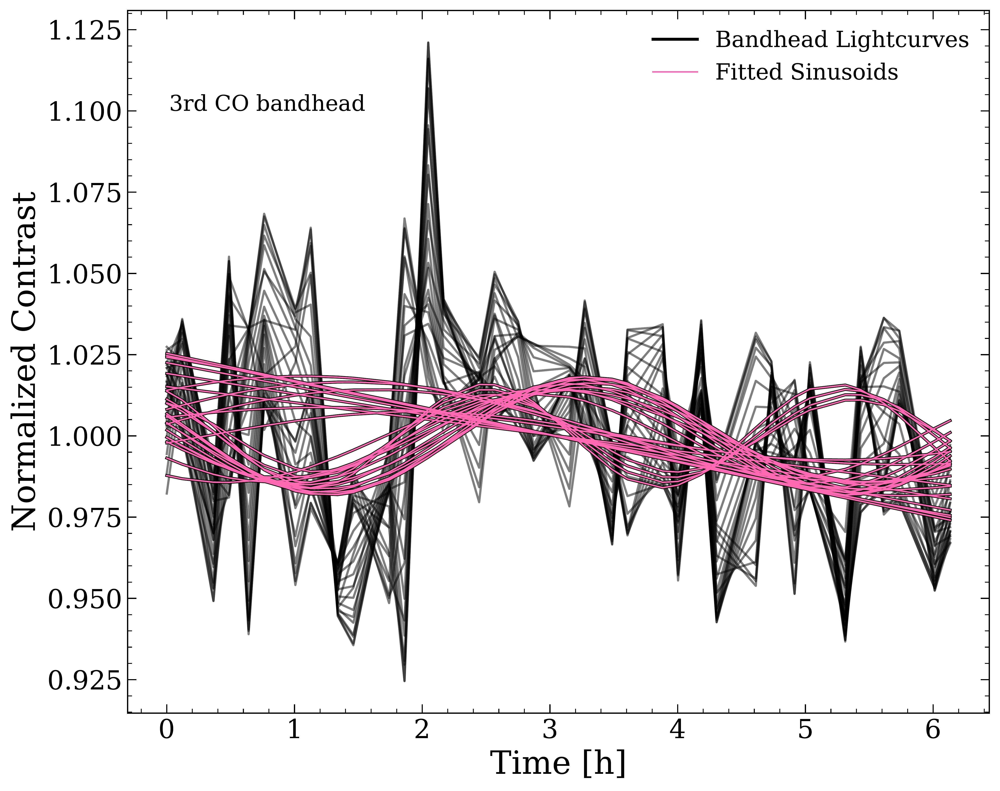

$\newcommand{\ensuremath}{}$
$\newcommand{\xspace}{}$
$\newcommand{\object}[1]{\texttt{#1}}$
$\newcommand{\farcs}{{.}''}$
$\newcommand{\farcm}{{.}'}$
$\newcommand{\arcsec}{''}$
$\newcommand{\arcmin}{'}$
$\newcommand{\ion}[2]{#1#2}$
$\newcommand{\textsc}[1]{\textrm{#1}}$
$\newcommand{\hl}[1]{\textrm{#1}}$
$\newcommand{\footnote}[1]{}$
$\newcommand{\topline}{$
$    \hline\hline$
$    \noalign{\smallskip}$
$}$
$\newcommand{\midline}{$
$      \noalign{\smallskip}$
$      \hline$
$      \noalign{\smallskip}$
$}$
$\newcommand{\bottomline}{$
$    \noalign{\smallskip}$
$    \hline$
$}$
$\newcommand{\autoref}\newcommand$
$\newcommand{\figureautorefname}{Fig.}$
$\newcommand{\sectionautorefname}{Sect.}$
$\newcommand{\subsectionautorefname}{Sect.}$
$\newcommand{\subsubsectionautorefname}{Sect.}$
$\newcommand{\fdeg}{\hbox{.\!\!\hspace{.3pt}^\circ}}$

# $^{13}$CO and potential variability in $\beta$ Pictoris b with GRAVITY+

<mark>Appeared on: 2026-06-11</mark> -  _Accepted for publication in A&A (26th of May 2026), data products and models are available at this https URL_

<mark>A. v. Stauffenberg</mark>, et al. -- incl., <mark>J. Sauter</mark>, <mark>P. Mollière</mark>, <mark>M. Ravet</mark>, <mark>D. Trevascus</mark>, <mark>W. Brandner</mark>, <mark>G. Chauvin</mark>, <mark>L. Kreidberg</mark>, <mark>E. Matthews</mark>

**Abstract:** The $^{12}$ CO/ $^{13}$ CO ratio was introduced as an indicator for where in the disk a planet has formed. Previously a lower value compared to the host star's was suggested to show that a planet accreted CO ice beyond the disk’s CO ice line. In this letter we aim to determine the $^{12}$ CO/ $^{13}$ CO value of the directly imaged planet $\beta$ Pictoris b, and whether we can link it to its formation. Its apparent brightness results in an exceptional S/N of up to $\sim$ 60 per wavelength point. We present the first science observations with the upgraded GRAVITY+ instrument at a spectral resolution of R $\approx$ 4000, which we analyse with ${\tt petitRADTRANS}$ . Our retrievals robustly indicate the presence of $^{13}$ CO with a $^{12}$ CO/ $^{13}$ CO ratio of 91 $^{+24}_{-17}$ , consistent with both a solar to ISM-like value. Our $^{12}$ CO/ $^{13}$ CO value corroborates recent interpretations that $^{13}$ CO may be a less useful tracer of formation location in the disk than previously thought; nonetheless, we discuss theories with which this value is consistent. As our observations span $\approx$ 7 hours, this enabled us to search for atmospheric variability in $\beta$ Pictoris b; we report a tentative constraint on the variability amplitude of about 1.4 $^{+0.6}_{-0.7}$ \% .

**Figure 1. -** Posterior distributions of $\log ^{12}\mathrm{CO}/^{13}\mathrm{CO}$ for each model, obtained with pRT (solid) and {\tt ExoREM}(hatched). The distributions are clipped at $\pm 3\sigma$. It shows agreement with ISM and solar values for all three retrieval models and a lower ratio obtained by {\tt ExoREM}, which we disregard due to a decreased fit quality of this self-consistent (less flexible) model. (*fig:ratios*)

**Figure 2. -** _Top panel:_ shows contrast lightcurves of 1st and 2nd CO bandhead wavelengths with kernel smoothing applied. The pink lines show the fitted sinusoids to each bandhead. The 3rd bandhead is shown in $\autoref${fig:third_bandhead}._Bottom panel:_ shows a histogram of the distribution of fitted periods between 0 and 10 hrs. The probability density for each bandhead is shown, as well as the total distribution of all bandheads. The expected rotation period and its two smaller harmonics are denoted by black vertical lines. The median period is shown in pink and coincides with P/2. (*fig:variability*)

**Figure 4. -** Contrast lightcurves of third CO bandhead wavelengths with kernel smoothing applied. The pink lines show the fitted sinusoids to the lightcurves. The 1st and 2nd Bandhead are shown in $\autoref${fig:variability}. (*fig:third_bandhead*)

