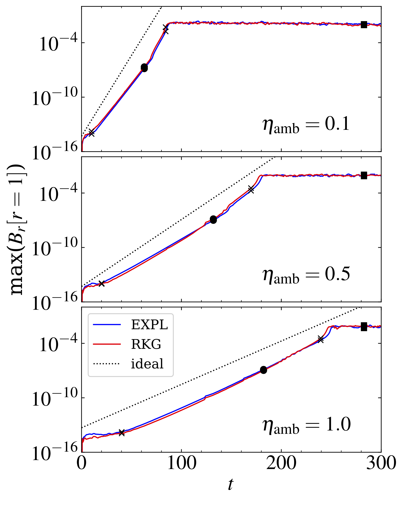
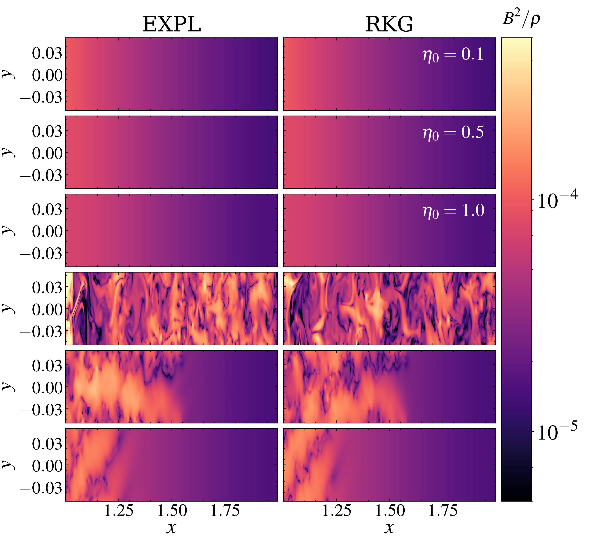
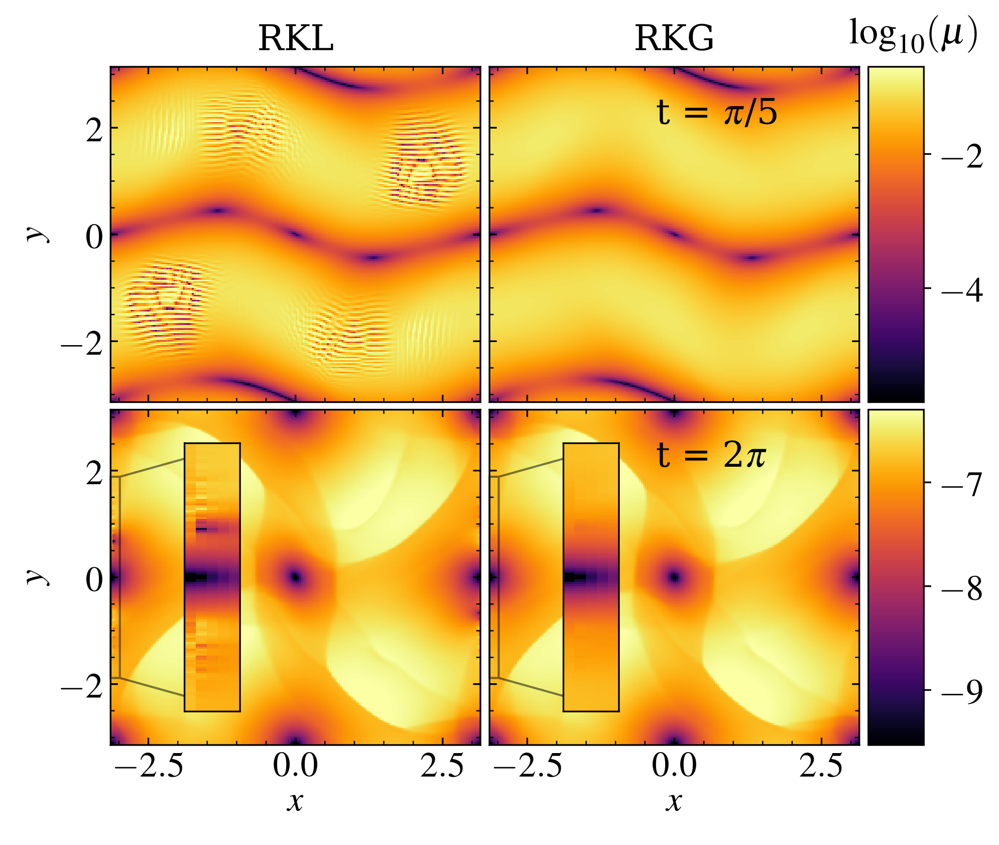

$\newcommand{\ensuremath}{}$
$\newcommand{\xspace}{}$
$\newcommand{\object}[1]{\texttt{#1}}$
$\newcommand{\farcs}{{.}''}$
$\newcommand{\farcm}{{.}'}$
$\newcommand{\arcsec}{''}$
$\newcommand{\arcmin}{'}$
$\newcommand{\ion}[2]{#1#2}$
$\newcommand{\textsc}[1]{\textrm{#1}}$
$\newcommand{\hl}[1]{\textrm{#1}}$
$\newcommand{\footnote}[1]{}$
$\newcommand{\fpath}{./Figures/}$
$\newcommand{\vect}[1]{\mathbf{#1}}$
$\newcommand{\hvec}[1]{\hat{\boldsymbol{#1}}}$
$\newcommand{\pd}[2]{\frac{\partial #1}{\partial #2} }$
$\newcommand{\der}[2]{\frac{\mathrm{d} #1}{\mathrm{d} #2} }$
$\newcommand{\HALF}{\frac{1}{2}}$
$\newcommand{\THREEHALF}{\frac{3}{2}}$
$\newcommand{\av}[1]{\left<{#1} \right>}$
$\newcommand{\quotes}[1]{"#1"}$
$\newcommand{\DS}{\displaystyle}$
$\newcommand{\tJ}{\tilde{\vect{J}}}$
$\newcommand{\cE}{\altmathcal{E}}$
$\newcommand{\cF}{\altmathcal{F}}$
$\newcommand{\cH}{\altmathcal{H}}$
$\newcommand{\cL}{\altmathcal{L}}$
$\newcommand{\cP}{\altmathcal{P}}$
$\newcommand{\cQ}{\altmathcal{Q}}$
$\newcommand{\cR}{\altmathcal{R}}$
$\newcommand{\cS}{\altmathcal{S}}$
$\newcommand{\cT}{\altmathcal{T}}$
$\newcommand{\cU}{\altmathcal{U}}$
$\newcommand{\cV}{\altmathcal{V}}$
$\newcommand{\cW}{\altmathcal{W}}$
$\newcommand{\Y}{\ding{51}}$
$\newcommand{\N}{\ding{55}}$
$\newcommand{\ad}{{\mathrm ad}}$
$\newcommand{ç}{ {\boldsymbol{c}} }$
$\newcommand{\cf}{ f }$
$\newcommand{\xf}{ {\boldsymbol{x}_f} }$
$\newcommand{\yf}{ {\boldsymbol{y}_f} }$
$\newcommand{\zf}{ {\boldsymbol{z}_f} }$
$\newcommand{\xe}{ {\boldsymbol{x}_e} }$
$\newcommand{\ye}{ {\boldsymbol{y}_e} }$
$\newcommand{\ze}{ {\boldsymbol{z}_e} }$
$\newcommand{\RED}{\color{red}}$
$\newcommand{\BLACK}{\color{black}}$
$\newcommand{\BLUE}{\color{blue}}$
$\newcommand{\BROWN}{\color{brown}}$
$\newcommand{\GREEN}{\color{green}}$
$\newcommand{\CYAN}{\color{cyan}}$
$\newcommand{\figfile}[1]{Figures_arxiv/#1.png}$
$\newcommand{\change}[1]{{#1}}$
$\newcommand{\vec}[1]{\mathbf{#1}}$
$\newcommand{\tens}[1]{\mathsf{#1}}$

# A robust super-time-stepping scheme for Ohmic and ambipolar diffusion

<mark>Appeared on: 2026-06-12</mark> -  _14 pages, 15 figures (+ appendix, 5 pages, 5 figures), under revision for A&A_

<mark>G. Mattia</mark>, et al. -- incl., <mark>M. Flock</mark>, <mark>D. M. Fuksman</mark>, <mark>A. Tzouvanou</mark>

**Abstract:** Non-ideal magnetohydrodynamics (MHD) is a key tool for modeling magnetic flux transport in astrophysical systems such as molecular clouds, protostellar cores, and protoplanetary disks. Conventional explicit methods for non-ideal MHD diffusion are severely limited by timestep constraints, while substepping approaches can be unstable due to truncation errors near boundaries and strong magnetic-field gradients. Our main goal is to address these limitations by developing robust super-time-stepping methods for Ohmic and ambipolar diffusion. We present a super-time-stepping method based on the stability of the Gegenbauer polynomials. The method is designed to enhance robustness in the presence of strongly anisotropic resistivity and to reduce sensitivity to truncation errors near boundaries. We implement the scheme in the PLUTO code and assess its performance through dedicated Ohmic and ambipolar diffusion tests. We also compare this novel numerical scheme against two common astrophysical problems, namely magnetic reconnection and the magnetorotational instability. The novel Runge-Kutta-Gegenbauer scheme retains computational efficiency beyond purely explicit schemes while providing excellent stability compared with other traditional substepping methods. It remains stable in the presence of strongly anisotropic diffusion, enabling accurate magnetic-field evolution in regimes characteristic of protoplanetary disks and collapsing dense cores. Benchmark tests, including magnetic reconnection and magnetorotational-instability setups, confirm the method's accuracy, efficiency, and suitability for large-scale non-ideal MHD simulations.

**Figure 10. -** Temporal evolution of $\max(B_r[r = 1])$ for $\eta_$\ad$=0.1$, $0.5$, and $1.0$(top to bottom), comparing the EXPL (blue) and RKG (red) schemes for ambipolar MRI. The dotted line indicates the theoretical growth rate. Black crosses mark the time interval used to fit the linear growth rate; filled circles and squares denote the time corresponding to Fig. \ref{Fig::mri_display1} and Fig. \ref{Fig::mri_display2}, respectively. (*Fig::mri_gr*)

**Figure 11. -** Spatial distribution of the local Alfvén speed squared, $B^2/\rho$, for ambipolar MRI, shown for $\eta_0 = 0.1$, $0.5$, and $1.0$. The left and right columns compare the EXPL and RKG schemes, respectively. Top and bottom panels correspond to the times marked by the filled circles and filled squares in Fig. \ref{Fig::mri_gr}, respectively. (*Fig::mri_display1*)

**Figure 3. -** Plasma magnetization for the case $A_\Omega$ of the Orszag-Tang vortex test at times $t = \pi/2$(top panels) and $t = 2\pi$(bottom panels) for the RKL (left panel) and RKG (right panels) methods. (*Fig::ot_res_han*)

