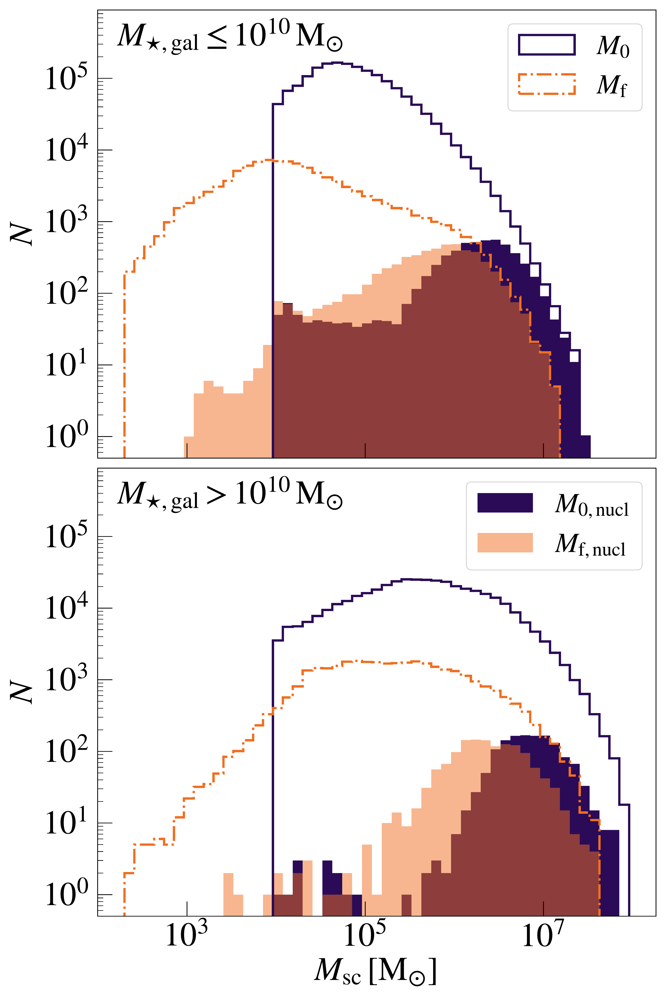
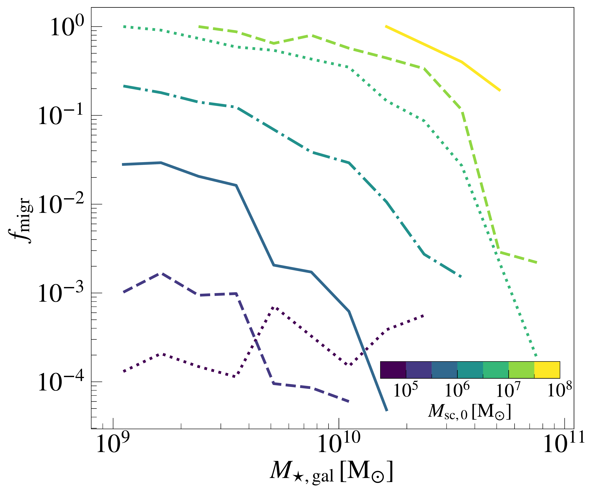

$\newcommand{\ensuremath}{}$
$\newcommand{\xspace}{}$
$\newcommand{\object}[1]{\texttt{#1}}$
$\newcommand{\farcs}{{.}''}$
$\newcommand{\farcm}{{.}'}$
$\newcommand{\arcsec}{''}$
$\newcommand{\arcmin}{'}$
$\newcommand{\ion}[2]{#1#2}$
$\newcommand{\textsc}[1]{\textrm{#1}}$
$\newcommand{\hl}[1]{\textrm{#1}}$
$\newcommand{\footnote}[1]{}$
$\newcommand{\orcidicon}[1]{\href{https://orcid.org/#1}{\includegraphics[width=11pt]{Plot/ORCIDiD_icon128x128.png}}}$
$\newcommand{\orcid}[1]{\href{https://orcid.org/#1}{\protect\orcidicon{#1}}}$
$\newcommand{\msun}{{\rm M}_\odot}$
$\newcommand{\ST}[1]{\textcolor{steelblue!100}{#1_{\mathrm{ST}}}}$
$\newcommand{\fastcluster}{\textsc{fastcluster}}$
$\newcommand{\clusterbh}{{\sc clusterBH}}$

# Intermediate-mass black hole seeding in \ galactic nuclei from star cluster migration

<mark>Appeared on: 2026-06-16</mark> -  _18 pages, 12 figures. Comments welcome_

<mark>S. Torniamenti</mark>, et al. -- incl., <mark>N. Neumayer</mark>

**Abstract:** Nuclear star clusters are one of the most favorable sites to host hierarchical black hole (BH) mergers, potentially bridging the gap from stellar-mass to massive BHs.However, their assembly and the evolution of their BH populations remain poorly constrained.We investigate the process of intermediate-mass BH (IMBH) seeding in galactic nuclei from star cluster migration. We introduce \texttt{inSpyral} , a new semi-analytic model that draws star cluster populations from a galaxy formation model ( _L-Galaxies 2020_ ), and integrates their evolution across a wide range of spatial scales, from BH core dynamics to the orbital motion in the host galaxy.We find that dynamical friction drives the inspiral of the most massive clusters in galaxies with $M_{\mathrm{\star, gal}} \lesssim 5 \times 10^{10}  \mathrm{M_\odot}$ , seeding their nuclei with IMBHs as early as $z \sim 6$ .The BH mass distribution from BH mergers in migrating clusters extends to $\sim 300   \mathrm{M_\odot}$ , a factor of five above the upper limit from in-situ formation. If clusters form with sub-parsec scale radii ( $\lesssim 0.5   \mathrm{pc}$ ), hierarchical mergers significantly enhance BH mass growth before migration, and seed galactic nuclei with IMBHs above $10^4   \msun$ .The most massive and highly spinning gravitational-wave events are well reproduced by BH mergers involving second-generation remnants that experienced relatively small relativistic kicks ( $\lesssim 100   \mathrm{km   s^{-1}}$ ). GW231123 is consistent with BH mergers between a third-generation primary and a second-generation secondary, which occur in star clusters with mass $> 2 \times 10^{6}   \msun$ .

**Figure 1. -** Initial (purple) and final (orange) star cluster mass distributions, for galaxies with stellar mass $M_{\mathrm{\star, gal}} \leq 10^{10}   $\msun$$(upper panel) and $M_{\mathrm{\star, gal}} > 10^{10}   $\msun$$(lower panel). The filled diagrams represent the same distributions for the star clusters that migrate to the galactic center. (*fig:m0_mf_hist*)

**Figure 2. -** Fraction of migrating star clusters ($f_{\mathrm{migr}}$) in galaxies with different stellar mass. $f_{\mathrm{migr}}$ approaches unity for the most massive clusters that form in a galaxy and decreases with increasing galaxy mass.
     (*fig:migr_efficiency*)

**Figure 6. -** 
    Hierarchical BH assembly in migrating clusters. Upper panel: fraction of BBH mergers that produce a merger at the successive generation ($f_{\mathrm{next   gen}}$), for different initial radii. The color encodes the median GW-induced kick. Middle panel: median primary (red, circle) and secondary (blue, diamond) BH spin for each BH merger generation. Lower panel: median primary (red, circle) and secondary (blue, diamond) BH mass. The errorbars encompass the $25^{\mathrm{th}}$ and the $75^{\mathrm{th}}$ percentiles. (*fig:f_gen*)

