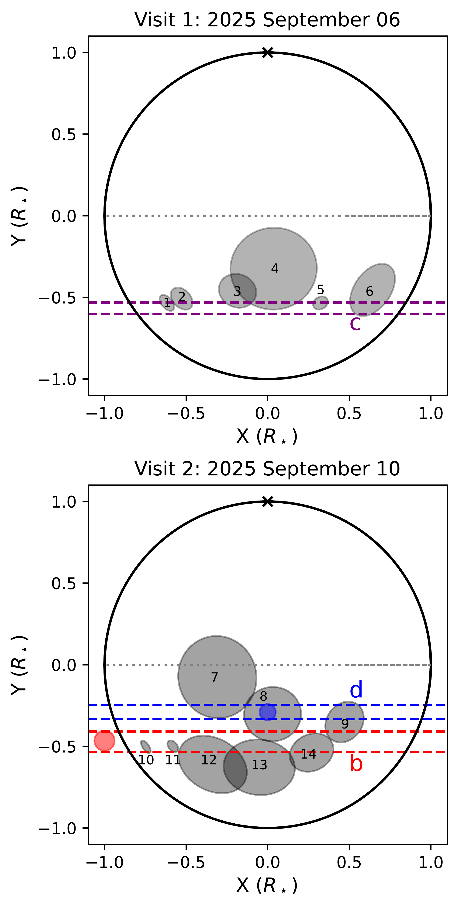
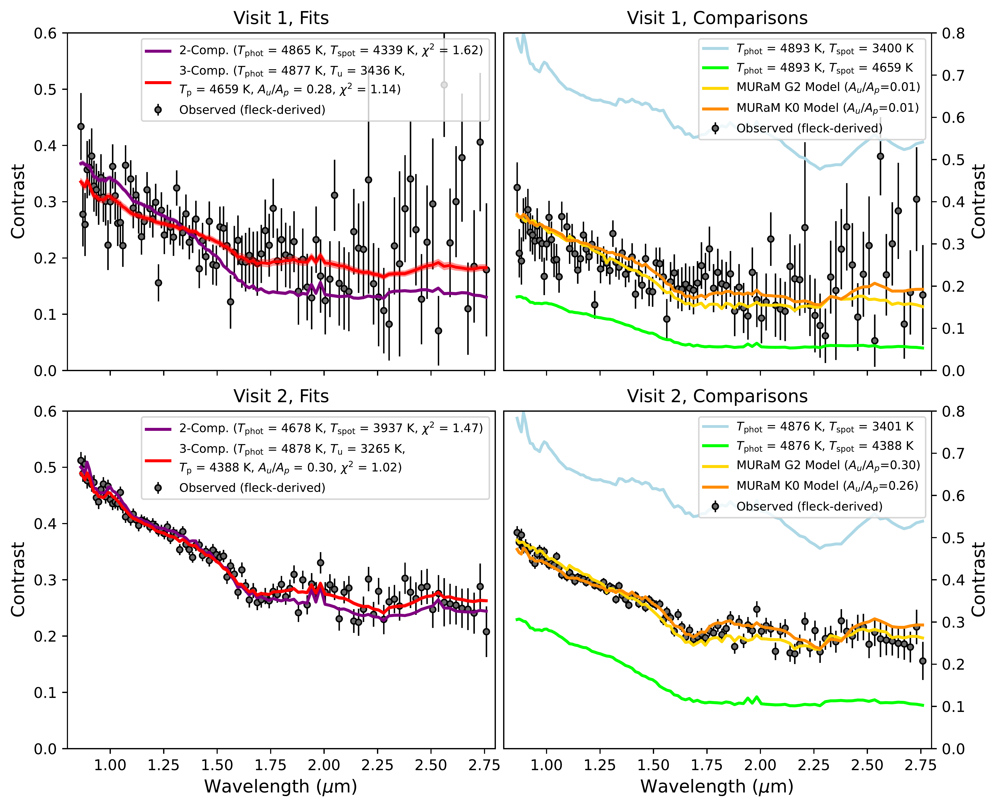
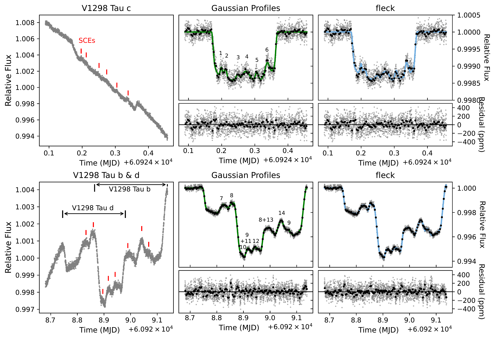

$\newcommand{\ensuremath}{}$
$\newcommand{\xspace}{}$
$\newcommand{\object}[1]{\texttt{#1}}$
$\newcommand{\farcs}{{.}''}$
$\newcommand{\farcm}{{.}'}$
$\newcommand{\arcsec}{''}$
$\newcommand{\arcmin}{'}$
$\newcommand{\ion}[2]{#1#2}$
$\newcommand{\textsc}[1]{\textrm{#1}}$
$\newcommand{\hl}[1]{\textrm{#1}}$
$\newcommand{\footnote}[1]{}$
$\newcommand{\vdag}{(v)^\dagger}$
$\newcommand\aastex{AAS\TeX}$
$\newcommand\latex{La\TeX}$
$\newcommand{\github}[1]{\href{https://github.com/#1}{\textcolor{black}{\faGithub} \tt \textcolor{black}{#1}}}$
$\newcommand{\githubicon}{{\color{black}\faGithub}}$
$\newcommand{\prot}{P_{\mathrm{rot}}}$
$\newcommand{\tpen}{T_\mathrm{pen}}$
$\newcommand{\tumb}{T_\mathrm{umb}}$

# KRONOS II: Solar-like Umbra and Penumbra Properties on the Young Sun V1298 Tau

<mark>Appeared on: 2026-06-16</mark> -  _Submitted to the Astrophysical Journal. Comments are welcome. 24 pages, 12 figures_

M. M. Murphy, et al. -- incl., <mark>E.-M. Ahrer</mark>

**Abstract:** Transiting exoplanets provide a unique laboratory for studying stellar surface heterogeneities via starspot or facular occultations. When observed at multiple wavelengths, this configuration enables spectroscopic characterization of spot thermal contrasts, distributions, and morphology. In this work, we leverage JWST NIRISS/SOSS transit observations of the 20--30 Myr planets V1298 Tau bcd to study the surface properties of their solar analog host star V1298 Tau. We identify 14 starspot crossing events across two visits. We derive $0.8-2.8\mu$ m starspot contrast spectra and demonstrate the contrasts can only be explained when accounting for the umbral and penumbral components of the starspots, robust to which stellar model grid is assumed. The spot temperatures are broadly consistent between visits, suggesting that V1298 Tau ( $T_\mathrm{phot}=4880\pm20$ K) has starspots with $T_{\mathrm{umbra}}$ = 3265--3436 K umbrae and $T_{\mathrm{penumbra}}$ = 4388--4659 K penumbrae, and are $\sim$ 30 \% umbrae by area. The differences between these spot components and the stellar photosphere are consistent with sunspots. Additionally, the relation between the spot contrast and the ratio of umbral to penumbral area is similar to that of the Sun. Combining these JWST observations with long baseline multi-band photometry from the Las Cumbres Observatory, we also estimated the global unocculted spot distribution, revealing at least 5 additional large unocculted active regions. All together, these measurements suggest that while the total spot coverage evolves in time, the relative temperatures of surface heterogeneities on Sun-like stars may be consistent throughout their lifetimes. Furthermore, these results demonstrate that JWST exoplanet transit observations can be useful for starspot substructure characterization.

**Figure 2. -** Occulted starspot distributions of V1298 Tau during the transit of planet c in Visit 1 (top) and transits of d and b in Visit 2 (bottom) derived from our broadband light curve fits with \texttt{fleck}, presented in Figure \ref{fig:bbfits}. The purple, blue, and red dashed regions represent the transit chords of V1298 Tau c, d, and b, respectively. All planets are assumed to transit from left to right, which is consistent with obliquity measurements for planets c and b \citep{feinstein2021_v1298tauGemini, johnson2022}. For Visit 2, we denote the relative transiting timing of planets d and b as colored circles. In both panels, the cross near the top represents the stellar pole assuming $i_\star=90^\circ$. Starspots are labeled by the adopted numbering scheme of this work. \href{https://github.com/kronos-jwst/KRONOS-II-V1298-Tau-Starspots/blob/main/Figure3.ipynb}{$\github$icon} (*fig:fleckspotmap*)

**Figure 11. -** Multi-component fits (left) and model comparisons (right) to the \texttt{fleck}-derived starspot contrasts from Visit 1 (top) and 2 (bottom). The observed contrasts from both JWST visits are best-fit by 3-component models which include umbral and penumbral components that are 3265--3436 K and 4388--4659 K, respectively (red). The photospheric temperature is consistent within $\Delta T = 2$ K between both visits. The 2-component fits (purple) cannot reproduce the slope at $\lambda < 1.7\mu$m nor the shape at $\lambda > 1.7\mu$m (purple), and have inconsistent temperatures. We additionally compare our observations to models based on the out-of-transit spectral fits (blue, green) and the 3D MURaM stellar models (orange/yellow). Our observations agree particularly well with the MURaM model for a K0 star \citep{Smitha2024_MURaMspotmodels}.  \href{https://github.com/kronos-jwst/KRONOS-II-V1298-Tau-Starspots/blob/main/Figure6.ipynb}{$\github$icon} (*fig:contrast_fits*)

**Figure 10. -** Broadband NIRISS/SOSS Order 1 ($\sim$0.8--2.83 $\mu$m) light curves of V1298 Tau. The top row shows a transit of V1298 Tau c during our first visit on 2025 September 06, and the bottom row shows a simultaneous transit of V1298 Tau d and b during our second visit on 2025 September 10. The left-hand columns show the observed light curve, with starspot crossing events (SCEs) indicated in red. The middle and right-hand columns show the detrended light curves and best-fit models using two methods: modeling the SCEs as Gaussian Profiles, and modeling them using \texttt{fleck}\citep{fleck}. We identify crossings of at least 14 distinct starspots by these three planets, labeled in the middle columns. \href{https://github.com/kronos-jwst/KRONOS-II-V1298-Tau-Starspots/blob/main/Figure2.ipynb}{$\github$icon} (*fig:bbfits*)

