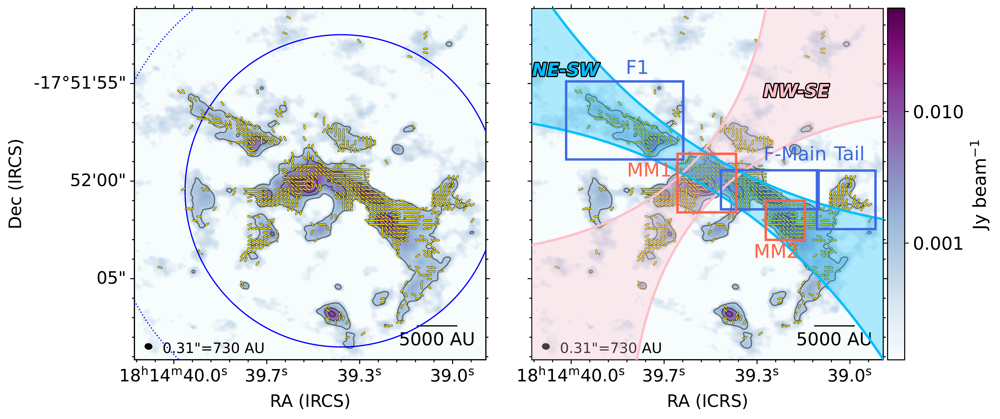
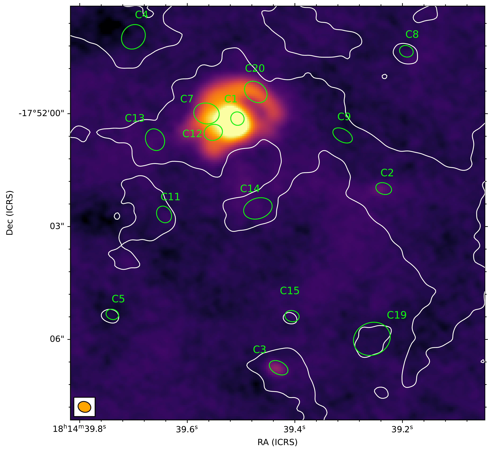
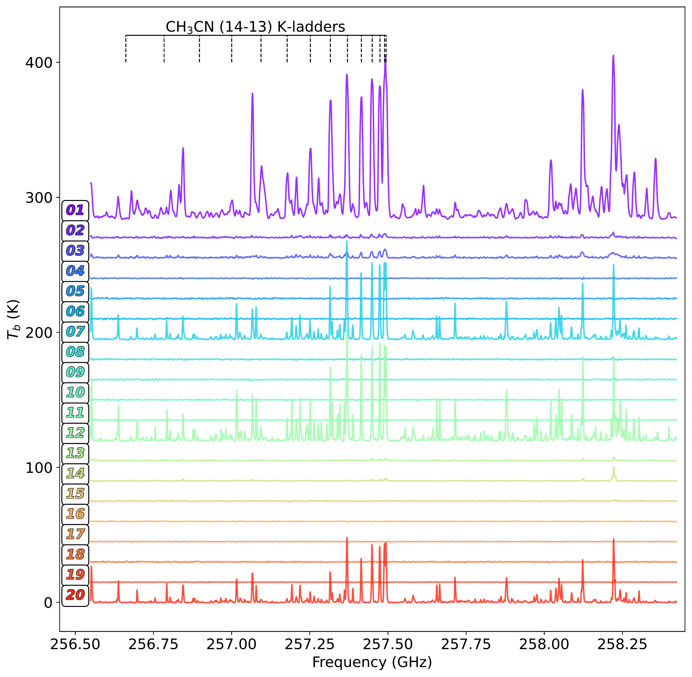
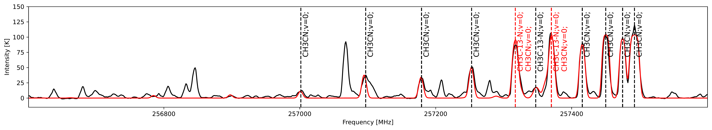
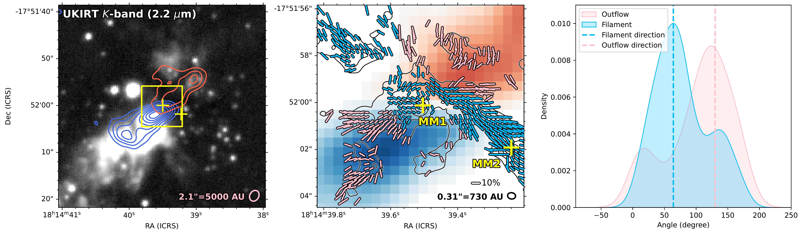

$\newcommand{\ensuremath}{}$
$\newcommand{\xspace}{}$
$\newcommand{\object}[1]{\texttt{#1}}$
$\newcommand{\farcs}{{.}''}$
$\newcommand{\farcm}{{.}'}$
$\newcommand{\arcsec}{''}$
$\newcommand{\arcmin}{'}$
$\newcommand{\ion}[2]{#1#2}$
$\newcommand{\textsc}[1]{\textrm{#1}}$
$\newcommand{\hl}[1]{\textrm{#1}}$
$\newcommand{\footnote}[1]{}$
$\newcommand{\gpcc}{g~cm^{-2}}$
$\newcommand{\massrate}{M_{\odot} yr^{-1}}$
$\newcommand{\hi}{H\textsc{i}}$
$\newcommand{\hii}{H\textsc{ii}}$
$\newcommand{\msun}{\mbox{M_\odot}}$
$\newcommand{\lsun}{\mbox{L_\odot}}$
$\newcommand{\lmsun}{\mbox{L_\odot/ M_\odot}}$
$\newcommand{\kms}{\mbox{km~s^{-1}}}$
$\newcommand{\jybeam}{\mbox{Jy~beam^{-1}}}$
$\newcommand{\mjybeam}{\mbox{mJy~beam^{-1}}}$
$\newcommand{\ujybeam}{\mbox{\muJy~beam^{-1}}}$
$\newcommand{\hmole}{H_2}$
$\newcommand{◦ee}{\mbox{^{\circ}}}$
$\newcommand{\parcsec}{\mbox{.\!\arcsec}}$
$\newcommand{\parcmin}{\mbox{.\!\arcmin}}$
$\newcommand{\parcdeg}{\mbox{.\!^{\circ}}}$
$\newcommand{\sqc}{\mbox{cm^{-2}}}$
$\newcommand{ç}{\mbox{cm^{-3}}}$
$\newcommand{\vlsr}{\mbox{V_\text{lsr}}}$
$\newcommand{\meth}{\mbox{CH_3OH}}$
$\newcommand{\clt}{\mbox{class {\sc ii}}}$
$\newcommand{\co}{\mbox{^{12}CO}}$
$\newcommand{\coto}{\mbox{^{12}CO 2--1}}$
$\newcommand{\tco}{\mbox{^{13}CO}}$
$\newcommand{\ceo}{\mbox{C^{18}O}}$
$\newcommand{\fmh}{\mbox{H_2CO}}$
$\newcommand{\httco}{\mbox{H_2^{13}CO}}$
$\newcommand{\mthc}{\mbox{CH_3CN}}$
$\newcommand{\cyacet}{\mbox{HC_3N}}$
$\newcommand{çtht}{\mbox{c-C_3H_2}}$
$\newcommand{\water}{\mbox{H_2O}}$
$\newcommand{\amm}{\mbox{NH_3}}$
$\newcommand{\ammone}{\mbox{\amm  (1, 1)}}$
$\newcommand{\ammtwo}{\mbox{\amm  (2, 2)}}$
$\newcommand{\ammthree}{\mbox{\amm  (3, 3)}}$
$\newcommand{\nthp}{\mbox{N_2H^+}}$
$\newcommand{\ntdp}{\mbox{N_2D^+}}$
$\newcommand{\htcop}{\mbox{H^{13}CO^+}}$
$\newcommand{\hcop}{\mbox{HCO^+}}$
$\newcommand{\hta}{\mbox{H30\alpha}}$
$\newcommand{\ssstyle}{\scriptscriptstyle}$
$\newcommand{\fengwei}[1]{{\color{teal}[Fengwei: #1]}}$
$\newcommand{\revise}[1]{{\color{black}[\textit{\color{red}Revise}: \textbf{#1}]}}$
$\newcommand{\arraystretch}{1.2}$

# Magnetic Fields in Massive Star-forming Regions (MagMaR). VII.: On the dynamical importance of B-fields in massive protocluster W33 A

<mark>Appeared on: 2026-06-16</mark> -  _Main text: 15 pages, 8 figures. Appendix: 3 pages. Accepted for publication in Astronomy & Astrophysics_

<mark>F. Xu</mark>, et al. -- incl., <mark>H. Beuther</mark>, <mark>S. Jiao</mark>

**Abstract:** Our understanding of magnetic fields (B-fields) in massive star formation remains incomplete. Linear polarized emission from magnetically aligned dust grains provides a good way to map the morphology of B-field on the plane of the sky. Here, we present the 1.2 mm full polarization observation of W33 A, a massive star-forming region at 2.4 kpc, obtained with the Atacama Large Millimeter/Submillimeter Array (ALMA) to achieve an angular resolution of $\sim$ 0 $\farcs$ 3 ( $\sim$ 730 au). W33 A is resolved into 20 dense cores and 9 filaments. It reveals various B-field structures, including two perpendicular large-scale components oriented northwest–southeast (NW-SE) and northeast-southwest (NE-SW) directions, as well as two local distinct features towards the millimeter peaks MM1 and MM2. The NW-SE component could be shaped by a molecular outflow. The NE-SW one is remarkably coherent along the main filamentary structures (F1, F-Main, Tail), all showing trans-Alfv ${é}$ nic turbulence. In F-Main, the line mass exceeds the turbulent critical limits, so magnetic support is likely required to prevent radial collapse and suppress local fragmentation. In F1 and Tail, turbulence itself is sufficient to support gravity, although B-fields can potentially provide additional support. Toward MM1, the fields follow a spiral-like, infalling streamer traced by $CH_3$ CN; the inferred trans-Alfv ${é}$ nic turbulence in the accreting material suggest efficient magnetic damping of turbulence and a magnetically regulated, laminar accretion flow that continues to feed the core. Toward MM2, the field exhibits a hourglass geometry described by parabolic curves. Two independent methods yield a consistently strong field strength of $\sim\!8.1\pm1.9$ mG. The virial analysis shows that B-field can add 25 \% (75 \% from turbulence) support against gravity but is not by itself sufficient to halt collapse. Our study shows that within one protocluster, B-fields can both help stabilize gas filament against local fragmentation to facilitate mass accretion and delay gravitational collapse. The distinct evolutionary stages of MM1 and MM2 highlights the dynamic importance of B-field in high-mass star formation.

**Figure 6. -** The ALMA 1.2 mm Stokes I continuum emission (color map and contours) is overlaid with B-field directions (yellow segments) every half beam, rotated by $90^{\circ}$ from the dust polarization directions. The segments are shown only when both debiased polarization intensity $\mathrm{S/N}(P_I)>2$ and Stokes I signal-to-noise ratio $\mathrm{S/N}(I))>3$. _ Left_: One third and FWHM of primary beam are indicated by blue solid and dashed circles. _ Right_: Two global directions northwest-southeast (NW-SE) and northeast-southwest (NE-SW) are marked in pink and blue shades. At the NE-SW direction, F1, F-Main, and Tail subregions are outlined. Two local features are highlighted towards MM1 and MM2. The contour levels are 0.52, 2.9, 8.7, 19.4, and $36.3 $\mjybeam$$. The synthesized beam of 730 au ($0$\farcs$3$) and the 5000-au scale bar are shown on the bottom. (*fig:bfield*)

**Figure 12. -** _Top left_: The integrated intensity map of $CH_3$CN 14(3)-13(3). The overlaid white contour shows the ALMA 1.2 mm continuum emission at $0.52 $\mjybeam$$. The green ellipses with labels respectively show the identified cores and their IDs. _Top right_: The spectral window 256.55--258.42 GHz for the 20 dense cores, labeled by color scale. _Bottom_: The observed (black) and modeled (red) spectra of core C1. $CH_3$CN and its isotope $CH_3\!^{13}$CN are shown in a 1-GHz spectral window. The gas excitation temperature is 274 K in this case. The red specie marker indicates substantial line blending.
 (*fig:ch3cn*)

**Figure 7. -** _Left_: The UKIRT $K$-band (2.2 $\mu$m) image is overlaid with the moment-0 contours of the high-velocity wings of HCO$^+$ (1-0). The integration is from -2 to -18 $\kms$ for blue and from 58 to 78 $\kms$ for red wings, respectively. The contour levels are 0.5, 0.7, 0.9, 1.1, 1.3, and 1.5 $\jybeam$ $\cdot$ $\kms$ for blue and 0.3, 0.5, and 0.7 $\jybeam$ $\cdot$ $\kms$ for red wings, respectively. The yellow box indicates the zoomed-in field of the middle panel while the yellow crosses mark the positions of MM1 and MM2.
_Middle_: The background shows the HCO$^+$ (1-0) high-velocity wings but are color-coded for integrated intensity. The pink and blue segments are the 1.2 mm B-field segment groups that are associated with the outflow and the main gas filament, respectively. The polarization fraction $\hat{f}_P$ scaled by square-root is indicated by the length of segments, with a 10\% scale bar shown on the bottom right. Black contours of Stokes I map are the same as Fig. \ref{fig:bfield}.
_Right_: The kernel density estimation (KDE) of B-field angle distribution for the outflow (pink) and the filament (blue) groups. The dashed vertical lines indicate the directions of outflow and filament.
 (*fig:outflow*)

