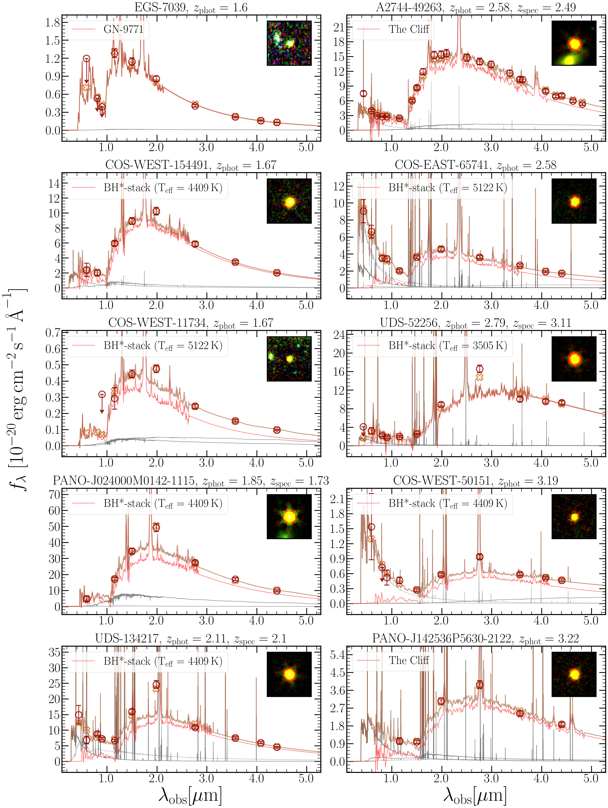
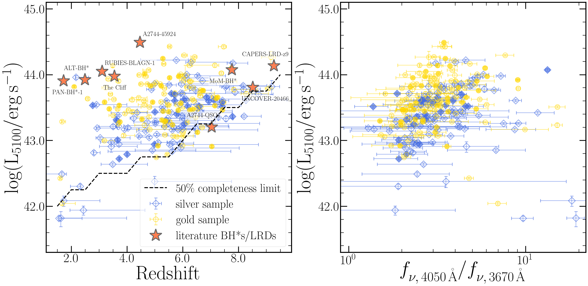
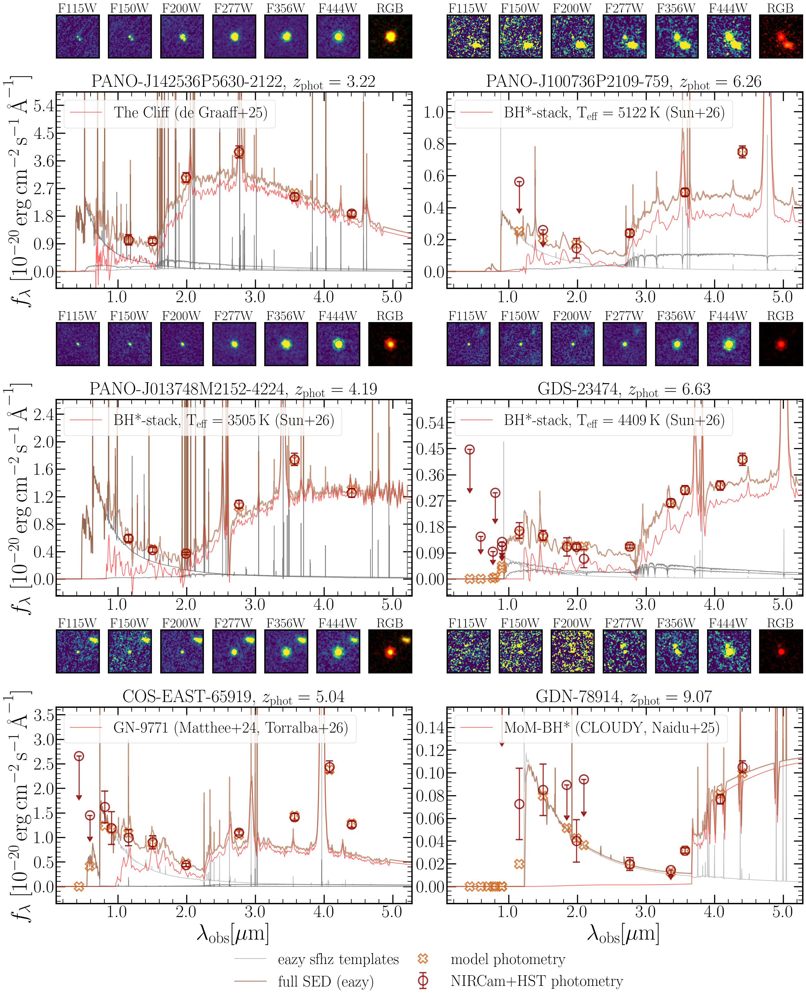

$\newcommand{\ensuremath}{}$
$\newcommand{\xspace}{}$
$\newcommand{\object}[1]{\texttt{#1}}$
$\newcommand{\farcs}{{.}''}$
$\newcommand{\farcm}{{.}'}$
$\newcommand{\arcsec}{''}$
$\newcommand{\arcmin}{'}$
$\newcommand{\ion}[2]{#1#2}$
$\newcommand{\textsc}[1]{\textrm{#1}}$
$\newcommand{\hl}[1]{\textrm{#1}}$
$\newcommand{\footnote}[1]{}$
$\newcommand{\xiion}{\xi_{\rm{ion}}}$
$\newcommand{\halpha}{H\ensuremath{\alpha}}$
$\newcommand{\hbeta}{H\ensuremath{\beta}}$
$\newcommand{\mstar}{\ensuremath{\log(M_{\rm{\star}}/ {\rm M}_{\rm{\odot}})}}$
$\newcommand{\orcidauthor}[3]{\author{\href{http://orcid.org/#1}{#2^{#3}}}}$
$\newcommand{\nion}[2]{#1 \textsc{#2}}$

# $\vspace{-1cm}$ Black Hole Stars Across the Universe:\\Identifying Central Engine Dominated Little Red Dots at $\MakeLowercase{z} \sim1.5-9.5$ $\vspace{-1.75cm}$

<mark>Appeared on: 2026-06-17</mark> -  _37 pages, 27 figures, to be submitted to OJAp, catalog of BH*-dominated LRDs available at this https URL, we encourage community follow-up_

A. Weibel, et al. -- incl., <mark>A. d. Graaff</mark>, <mark>R. E. Hviding</mark>

**Abstract:** Photometric selections of Little Red Dots (LRDs) largely rely on identifying their "V-shaped" spectral energy distribution (SED). Recent work suggests this V-shape stems from a combination of a central engine -- also referred to as a Black Hole Star (BH*) -- and a star-forming host galaxy. We present a new and highly complementary photometric selection that is based on incorporating BH* templates in the \texttt{eazy} redshift fitting code. Selecting compact sources where a BH* template contributes $>80$ \% to the best fitting SED in the rest-optical, we compile a sample of 241 BH*-dominated candidates from $\sim1000 {\rm arcmin}^2$ of legacy and pure parallel JWST imaging. Our selection does not require a blue UV-component, and it successfully identifies objects that resemble the paradigmatic sources "MoM-BH*-1" and "The Cliff". We find that BH*-dominated sources exist across a wide range of redshifts ( $z\sim1.7-9.3$ ) and optical luminosities (log $(L_{5100}/{\rm erg} {\rm s}^{-1})\sim42-44.5$ ), and we measure a median Balmer break strength of $\sim3$ , with some breaks reaching values $>10$ . We estimate bolometric luminosities in the range log $(L_{\rm bol}/{\rm erg} {\rm s}^{-1})\sim42-45$ , which, assuming accretion at the Eddington-limit, would translate to black hole masses of $M_{\rm BH}\sim10^4-10^7{\rm M_\odot}$ , spanning the intermediate mass black hole to the quasar regime. The number density of BH*-dominated candidates peaks at $z\sim5-6$ ( $\sim10^{-5} {\rm Mpc}^{-3}$ ) and it declines by an order of magnitude down to $z\sim2$ . Tentatively, comparing to V-shaped LRD samples suggests that the fraction of BH*-dominated sources among the broader LRD population does not decrease towards lower redshift. Crucially, our work demonstrates that BH*-dominated sources are not merely an early-Universe phenomenon but rather persist at least until cosmic noon. $\footnote{A machine-readable catalog of our sample is available at: \url{https://doi.org/10.5281/zenodo.20611334}}$

**Figure 8. -** Gallery of BH*-dominated candidates that are part of our gold sample ($B(\texttt{sfhz})>100$ and $B({\rm stars})>100$), in analogy to Figure \ref{fig:overview}. The RGB stamp shown for each source is constructed from F444W (red), F277W (green) and F115W (blue). Gray lines show the contribution of different \texttt{eazy} templates to the best-fitting SED (brown line). The contribution of the respective BH* template that dominates the fit is shown in red. (*fig:gallery_appendix_1*)

**Figure 26. -** Monochromatic optical luminosity $L_{5100}$ against redshift ($z_{\rm phot}$, replaced by $z_{\rm spec}$ where available) on the left and against Balmer break strength ($f_{\nu, 4050\mathrm{\mathring{A}}}/f_{\nu, 3670\mathrm{\mathring{A}}}$) on the right. The gold and silver sample are displayed with different markers and colors, and sources with spectroscopic redshifts are plotted as filled markers. In the left panel, we further plot the rough $50\%$ completeness limit of our sample selection based on The Cliff template at the median depth across all fields, illustrating that the lower right edge of the distribution in the $z$-$L_{5100}$ diagram reflects a selection effect. These plots show that we identify BH*-dominated candidates across a wide range of redshifts ($z\sim1.5-9.5$) and luminosities $L_{5100}\sim10^{42}-10^{44.5} {\rm erg} {\rm s}^{-1}$, with the bulk of the sample being concentrated around $z\sim3-7$ and $L_{5100}\sim10^{43}-10^{44} {\rm erg} {\rm s}^{-1}$. The sample displays a broad range of Balmer break strengths of $\sim1.9-8.7$(5th and 95th percentiles) with a high median of $3.05$, and some of the strongest Balmer breaks measured in the Universe to date. There is a weak apparent correlation between Balmer break strength and $L_{5100}$, consistent with the trend seen for LRDs in degraaff25pop. (*fig:Lopt_zphot_BB*)

**Figure 23. -** Overview of the sample selection. We show one BH*-dominated candidate selected by each of the six BH* templates used in this work (Section \ref{sec:sample_sel_templates}). The displayed candidates span a wide range in redshift ($z\sim3-9$), and they highlight various levels of rest-frame UV emission, as well as different photometric constraints depending on redshift and wavelength coverage. The RGB stamp shown for each source is constructed from F444W (red), F277W (green) and F115W (blue). Gray lines show the contribution of different \texttt{eazy} templates to the best-fitting SED (brown line). The contribution of the respective BH* template that dominates the fit is shown in red. (*fig:overview*)

