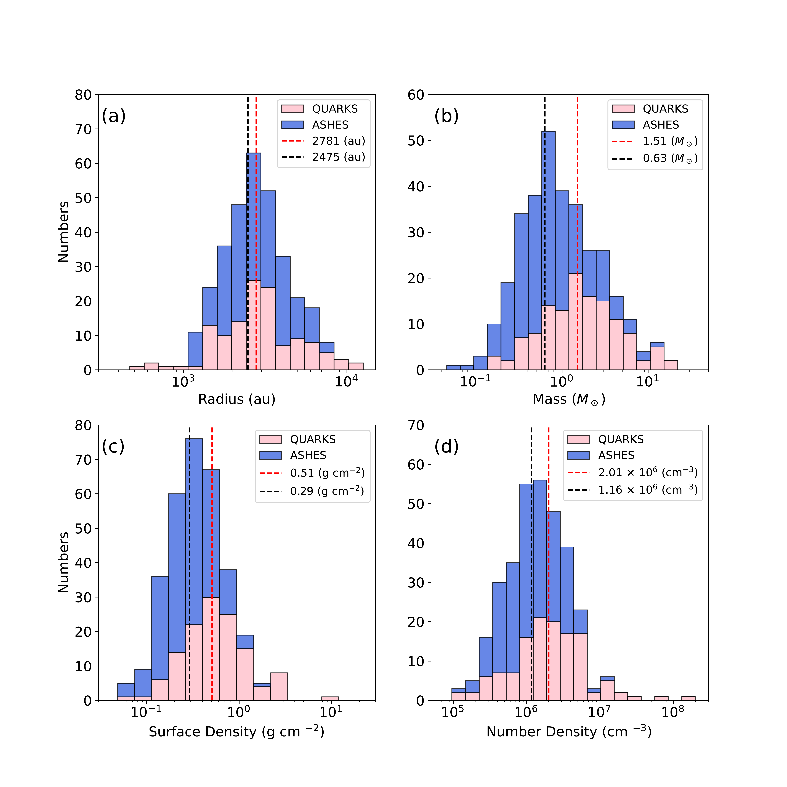
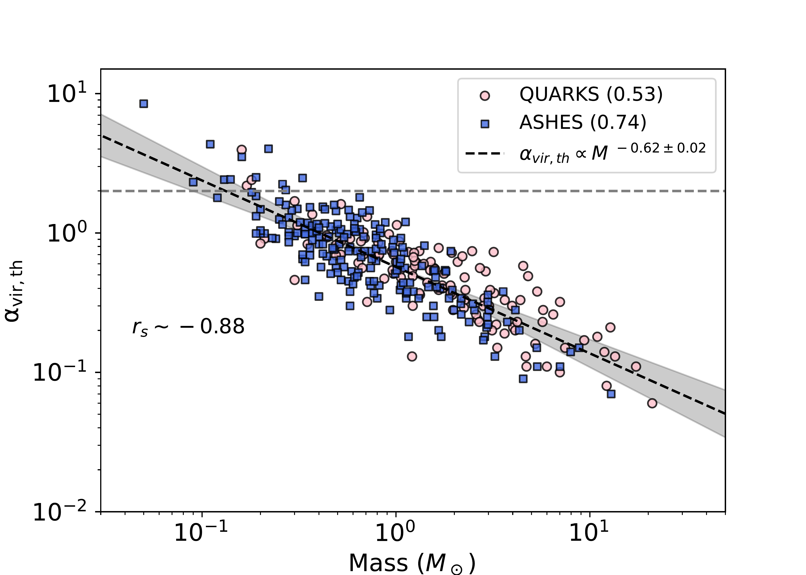
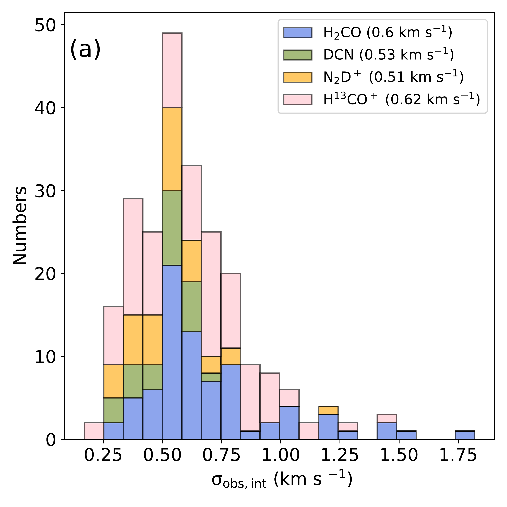
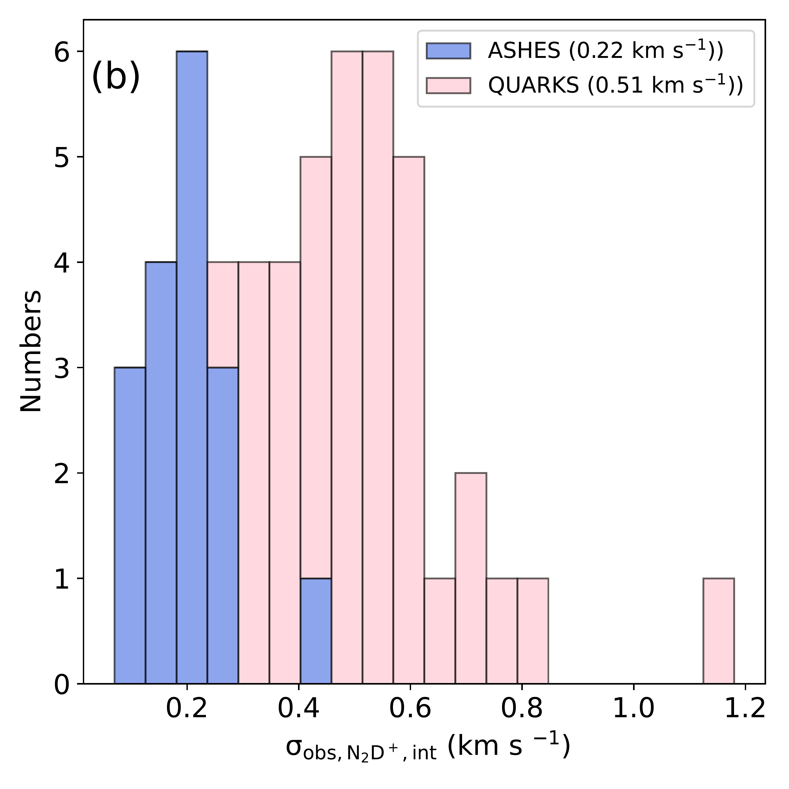

$\newcommand{\ensuremath}{}$
$\newcommand{\xspace}{}$
$\newcommand{\object}[1]{\texttt{#1}}$
$\newcommand{\farcs}{{.}''}$
$\newcommand{\farcm}{{.}'}$
$\newcommand{\arcsec}{''}$
$\newcommand{\arcmin}{'}$
$\newcommand{\ion}[2]{#1#2}$
$\newcommand{\textsc}[1]{\textrm{#1}}$
$\newcommand{\hl}[1]{\textrm{#1}}$
$\newcommand{\footnote}[1]{}$
$\newcommand{\vdag}{(v)^\dagger}$
$\newcommand\aastex{AAS\TeX}$
$\newcommand\latex{La\TeX}$
$\newcommand{\arcm}{\hbox{^\prime}}$
$\newcommand{\etal}{{\rm et al.}\thinspace}$
$\newcommand{\eg}{{\it e.g. }}$
$\newcommand{\etc}{{\it etc. }}$
$\newcommand{\ie}{{\it i.e. }}$
$\newcommand{\cf}{{\it c.f. }}$
$\newcommand{◦ee}{\hbox{^\circ}}$
$\newcommand{\NHH}{\ensuremath{N_{\mathrm{H_{2}}}}}$
$\newcommand{\s}{\ensuremath{\mbox{~s}}}$
$\newcommand{\ps}{\ensuremath{\s^{-1}}}$
$\newcommand{\cm}{\ensuremath{\mbox{~cm}}}$
$\newcommand{\pcmsq}{\ensuremath{\cm^{-2}}}$
$\newcommand{\pcmcu}{\ensuremath{\cm^{-3}}}$
$\newcommand{\km}{\ensuremath{\mbox{~km}}}$
$\newcommand{\erg}{\ensuremath{\mbox{~erg}}}$
$\newcommand{\ergps}{\ensuremath{\erg \ps}}$
$\newcommand{\mJy}{\ensuremath{\mbox{~mJy}}}$
$\newcommand{\ML}{\ensuremath{\mbox{\Msol/\LBsol}}}$
$\newcommand{\Hi}{H\textsc{i}}$
$\newcommand{\Hii}{H\textsc{ii}}$
$\newcommand{\Ha}{\ensuremath{\mathrm{H\alpha}}}$
$\newcommand{\nh}{\ensuremath{\mathrm{n}_\mathrm{H}}}$
$\newcommand{\Mdot}{\ensuremath{\dot{\mathrm{M}}}}$
$\newcommand{\thco}{^{13}CO}$
$\newcommand{\twco}{^{12}CO}$
$\newcommand{\etco}{C^{18}O}$
$\newcommand{\vel}{km s^{-1}}$
$\newcommand{\filAname}{G350.5-N}$
$\newcommand{\filBname}{G350.5-S}$
$\newcommand{\imcoor}{\alpha_{2000}=17^{\mathrm{h}}18^{\mathrm{m}}13\fs84, \delta_{2000}=-36◦28\arcmin21\farcs5}$
$\newcommand{\her}{Herschel}$
$\newcommand{\mline}{M_{\rm line}}$
$\newcommand{\msun}{M_{\odot}}$
$\newcommand{\lsun}{L_{\odot}}$
$\newcommand{\um}{\mum}$
$\newcommand{\cmcm}{cm^{-2}}$
$\newcommand{\egcite}{\citep[e.g.,][]}$
$\newcommand{\lmsun}{M_{\odot}~pc^{-1}}$
$\newcommand{\chiiioh}{CH_3OH}$
$\newcommand{\hciiin}{HC_3N}$
$\newcommand{\hcop}{HCO^{+}}$
$\newcommand{\htcop}{H^{13}CO^{+}}$
$\newcommand{\halpha}{H40_{\alpha}}$
$\newcommand{\chthocho}{CH_3OCHO}$
$\newcommand{\chthcho}{CH_3CHO}$
$\newcommand{\chthoh}{CH_3OH}$
$\newcommand{\chii}{H/UC-H\textsc{ii}}$
$\newcommand{\uchii}{UC-H\textsc{ii}}$
$\newcommand{\hchii}{HC-H\textsc{ii}}$
$\newcommand{\hii}{H\textsc{ii}}$
$\newcommand{\CHMC}{s-cHMC}$
$\newcommand{\PCHMC}{w-cHMC}$
$\newcommand{\filname}{G34}$
$\newcommand{\mdotyr}{M_{\odot}~yr^{-1}}$
$\newcommand{\tred}{\textcolor{red}}$
$\newcommand{\tblue}{\textcolor{blue}}$
$\newcommand{\torange}{\textcolor{orange}}$
$\newcommand{\orcidauthorHL}{0000-0003-3343-9645}$
$\newcommand{\mgt}{\color{magenta}}$
$\newcommand{\thetable}{D\arabic{table}}$
$\newcommand{\arraystretch}{1.8}$
$\newcommand{\arraystretch}{1.8}$
$\newcommand\aj{{\rm{AJ}}}$
$\newcommand\araa{{\rm{ARA\&A}}}$
$\newcommand\apj{{\rm{ApJ}}}$
$\newcommand\icarus{{\rm{Icarus}}}$
$\newcommand\apjs{{\rm{ApJS}}}$
$\newcommand\apjl{{\rm{ApJL}}}$
$\newcommand\apss{{\rm{Ap\&SS}}}$
$\newcommand\aap{{\rm{A\&A}}}$
$\newcommand\aapr{{\rm{A\&AR}}}$
$\newcommand\aaps{{\rm{A\&AS}}}$
$\newcommand\baas{{\rm{BAAS}}}$
$\newcommand\memras{{\rm{MmRAS}}}$
$\newcommand\mnras{{\rm{MNRAS}}}$
$\newcommand\pasp{{\rm{PASP}}}$
$\newcommand\prl{{\rm{Phys. Rev. Lett.}}}$
$\newcommand\jqsrt{{\rm{Journal of Quantitative Spectroscopy and Radiative$
$Transfer}}}$
$\newcommand\actaa{{\rm{Acta Astronomica}}}$

# $\bf$Evolution of starless cores in massive clumps seen by the ALMA ASHES and QUARKS surveys

<mark>Appeared on: 2026-06-22</mark> -  _22 pages, 12 figures, accepted by ApJ_

D. Yang, et al. -- incl., <mark>F. Xu</mark>

**Abstract:** We present a systematic comparative analysis of 324 starless cores in early-phase infrared-dark clouds (IRDCs; ASHES survey) and evolved-phase infrared-bright clouds (IRBCs; QUARKS survey) using 1.3 mm continuum and line data by the Atacama Large Millimeter/submillimeter Array (ALMA). Despite having comparable sizes ( $\(\sim 2500\)$ au), starless cores in IRBCs exhibit systematically higher median mass ( $\(1.5 M_{\odot}\)$ vs. $\(0.6 M_{\odot}\)$ ), number density, and surface density—enhancements of approximately a factor of two relative to starless cores in IRDCs. Starless cores in IRBCs also display relatively stronger non-thermal motions ( $\(\sigma \sim 0.5\)$ km s $\(^{-1}\)$ vs. $\(0.3\)$ km s $\(^{-1}\)$ ), higher total virial parameters (median $\(\alpha_{\mathrm{vir,tot}} \sim 2.3\)$ vs. $\(1.0\)$ ), and steeper density profiles, indicating more centrally concentrated structures in feedback-driven, turbulence-enhanced environments. These findings support a dual evolutionary origin: (i) new core formation in evolved IRBCs under altered initial conditions, and (ii) subsequent dynamical mass growth via accretion from extended reservoirs. The prevalence of low-mass starless cores—even in late-stage IRBC environments—challenges models requiring massive prestellar cores and instead favors competitive-like dynamical mass accretion scenarios for high-mass star formation.

**Figure 5. -** Distribution of the physical parameters of starless cores from the ASHES and QUARKS surveys, including  the radius (panel a), mass (panel b), surface density (panel c), and number density (panel d). The black and red dashed lines in each panel represent the median values for the ASHES and QUARKS samples, respectively. (*fig:pro*)

**Figure 1. -** Relation of $\alpha_{\rm vir,th}$ with  mass for starless cores from the ASHES (filled circles) and QURKS (filled squares) surveys.  The values in parentheses within the top-right legend correspond to the median values of $\alpha_{\rm vir,th}$. A linear regression fit to all sample points (black dashed line) yields a slope of $-0.62\pm0.02$. The Spearman’s rank test returns a coefficient of $r_s=-0.88$. The horizontal dashed line marks the critical value of the virial parameter equals 2.
     (*fig:alpha:m*)

**Figure 7. -** Panel (a): distribution of the intrinsic observed velocity dispersions (corrected by the velocity resolution, see Sect. \ref{subs:3.3}) in the QUARKS starless cores. The color-coding corresponds to different molecular tracers. Panel (b): distribution of the intrinsic observed velocity dispersion from the $\rm N_2D^+$ molecule between the ASHES (17) and QUARKS (36) starless core samples.
    The median value with the standard deviation for each group is provided in parentheses.
     (*fig:line:vd*)

